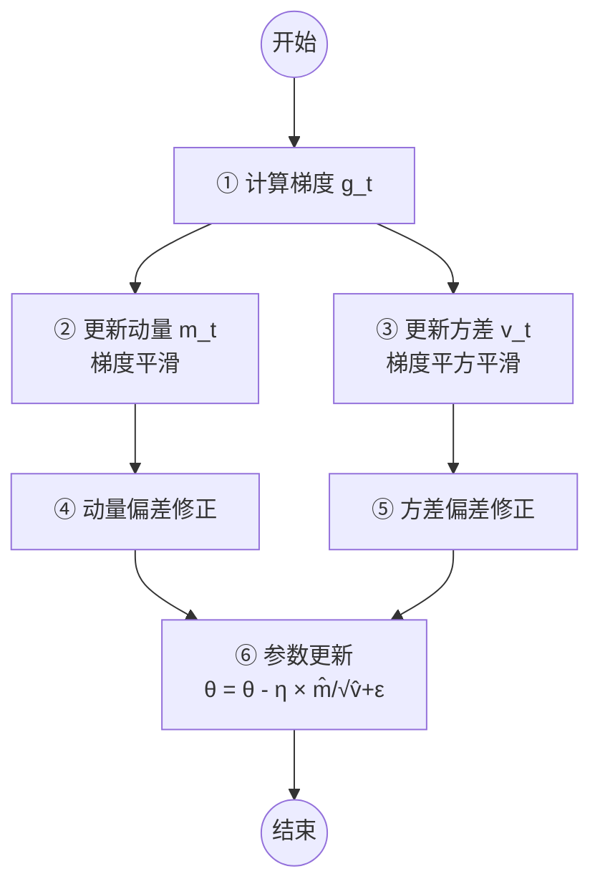

# SGD

$$
\theta_{t+1} = \theta_t - \eta \cdot \nabla_\theta J(\theta_t; x^{(i)}, y^{(i)})
$$

# Adam

Adam 是目前深度学习中**最常用**的优化算法之一，它结合了 **Momentum（动量）** 和 **RMSProp（自适应学习率）** 两者的优点。

Adam 的完整更新步骤分为 **8 个公式**，我们按顺序一步步拆解：

---

### 第 1 步：计算当前梯度
首先，计算损失函数 \( J \) 对参数 \( \theta \) 在当前小批量数据上的梯度：

$$
g_t = \nabla_\theta J(\theta_{t-1})
$$

---

### 第 2 步：更新一阶矩估计（动量项）
计算梯度的一阶矩（即梯度的指数加权移动平均值），相当于动量：

$$
m_t = \beta_1 \cdot m_{t-1} + (1 - \beta_1) \cdot g_t
$$

- $m_t$ = 当前时刻的动量（带偏置的）。
- $\beta_1$ = 一阶矩的衰减率，通常取 **0.9**。
- 这相当于给梯度做了一个平滑，让更新方向更稳定。

---

### 第 3 步：更新二阶矩估计（自适应学习率项）
计算梯度的二阶矩（即梯度平方的指数加权移动平均值），用于自适应调整每个参数的学习率：

$$
v_t = \beta_2 \cdot v_{t-1} + (1 - \beta_2) \cdot g_t^2
$$

- $ v_t$ = 当前时刻的梯度平方加权平均（带偏置的）。
- $\beta_2$= 二阶矩的衰减率，通常取 **0.999**。
- $g_t^2$  = 梯度各元素的平方（逐元素相乘）。
- 这个值越大，说明该参数方向的梯度越剧烈，学习率就会被调得越小。

---

### 第 4 步：偏差修正（一阶矩）
由于 \( m_t \) 和 \( v_t \) 初始化为 0，在早期迭代中会偏向 0，需要进行修正：

$$
\hat{m}_t = \frac{m_t}{1 - \beta_1^t}
$$

- $\beta_1^t$  表示 $\beta_1$ 的$t$次方$t$是当前迭代步数）。
- 随着 $t$增大，分母趋近于 1，修正效果逐渐消失。

---

### 第 5 步：偏差修正（二阶矩）
同理，对二阶矩进行偏差修正：

$$
\hat{v}_t = \frac{v_t}{1 - \beta_2^t}
$$

---

### 第 6 步：参数更新（核心公式）
最后，用修正后的值来更新参数：

$$
\theta_t = \theta_{t-1} - \eta \cdot \frac{\hat{m}_t}{\sqrt{\hat{v}_t} + \epsilon}
$$

- $\eta$ = 学习率，通常取 **0.001**。
- $\epsilon$ = 一个极小正数（通常取 $10^{-8}$），防止分母为 0。
- 这个公式的含义是：
  - 分子 $\hat{m}_t$  决定更新的**方向**（带动量）。
  - 分母$\sqrt{\hat{v}_t} + \epsilon$  决定更新的**步长缩放**（梯度大的方向步长小，梯度小的方向步长大）。

核心思想：用估计梯度除以估计方差进行归一化

# 连续批处理

连续批处理是一项用于大语言模型（LLM）推理服务的关键优化技术，它通过在每个解码步骤动态调整批次，让 GPU 始终保持忙碌，从而显著提升吞吐量并降低延迟。

为了更好地理解它，我们可以把传统的静态批处理和连续批处理做个对比：

### 🐌 静态批处理的困境：效率低下的“等餐模式”

传统的静态批处理，就像一家餐厅等凑齐 8 个客人（达到固定批次大小）才让厨师（GPU）开始做菜。

*   **短板一：必须等待**。如果客人不够，先来的客人就得饿着肚子干等，直到凑够人数，这无疑增加了延迟。
*   **短板二：被拖累**。即使同时开火，只要有一道佛跳墙（生成长文本的请求）没做完，其他已经吃完的客人（已完成短文本的请求）也不能离席，只能一起等待，导致 GPU 空闲。
*   **致命伤：GPU 严重“吃不饱”**。这种模式会导致 GPU 的算力被严重浪费，利用率有时只有 **30-45%**。

### 🚀 连续批处理的智慧：灵活的“流水线模式”

连续批处理的思路完全不同，它把调度的单位从“请求”细化为“词元（Token）生成步”，实现了动态、灵活的批次管理。

*   **随到随“上”**：每当一个请求完成生成并退出（返回结果）后，它在批次中的位置会立刻被等待队列中的一个新请求占据，加入下一轮的计算。
*   **动态调整**：批次的大小不再固定，而是随着请求的完成和加入实时变化，确保 GPU 的每一个“核心”都在持续工作。
*   **结果立等可取**：每个请求一旦生成结束，就会立刻返回结果，不再需要等待批次中其他慢的请求，显著降低了平均延迟。

# 大模型推理指标

## TTFT

Time to First Token：首字延迟

-   **定义**：从用户输入 Prompt（提示词）并点击“发送”，到模型吐出**第一个可见字符**所花费的总时间。
-   **决定性因素**：这个阶段主要消耗在 **Prefill（预填充）阶段**。模型需要并行处理用户输入的几百甚至几千个 Token（词元）的注意力机制，计算量极大，属于**计算密集型（Compute-Bound）**任务。
-   **用户体验**：TTFT 决定了“响应感”。如果 TTFT 过长（例如超过 2-3 秒），用户会感觉系统卡顿或无响应。
-   **优化手段**：主要依赖算力（GPU 浮点运算能力）、KV Cache（键值缓存）的快速写入，以及高效的 Flash Attention（闪存注意力）算法。

## TPOT

Time Per Output Token：每输出 Token 耗时

-   **定义**：在生成阶段，模型**生成每个新 Token** 所需要的平均时间（通常以毫秒计，如 20 ms/Token）。
-   **决定性因素**：这个阶段属于 **Decoding（解码/自回归生成）阶段**。模型每次只能生成一个 Token，且严重依赖内存带宽（将庞大的模型权重从显存搬运到计算单元），属于**内存带宽密集型（Memory-Bound）**任务。
-   **用户体验**：TPOT 决定了输出的“流畅度”。TPOT 越小，文字吐出的速度越快。通常建议 TPOT 小于 50 ms，否则用户会感觉文字在“蹦字”或卡顿。
-   **直观换算**：TPOT 的倒数乘以 1000，就是大家常说的 **生成速度（Tokens/秒）**。例如 TPOT 为 20 ms，则生成速度为 50 Tokens/秒。

## Walllock time

Time to Completion:端到端延迟）

> **总延迟 = TTFT + (总输出 Token 数 × TPOT)**

这意味着，对于**短文本**场景（如翻译、问答），**TTFT** 是主要瓶颈；对于**长文本**场景（如代码生成、长文总结），**TPOT** 的累积效果决定了整体耗时。

## Throughput

吞吐量

除了用户感知的延迟，服务端还必须关注 **吞吐量**，即单位时间内系统能处理的 Token 总数（如 1000 Tokens/s）。

# AdamW

在 Adam 中，所谓的 “权重衰减”实际是通过在损失函数中增加 L2 正则化项来实现的。

- 目标函数变为 $L_{total}=L_{origin}+{\lambda\over2}\|w\|^2$
- 求导后，梯度变为：$g_t=\nabla L_{original}(w_t)+\lambda w_t$

然后 Adam 用这个修改后的梯度去更新一阶矩和二阶矩：

$$
m_t=\beta_1 m_{t-1}+(1-\beta_1)g_t\\
$$
$$
v_t = \beta_2 v_{t-1}+ (1-\beta_2)g_t^2\\
$$
$$
\hat{m}_t={m_t\over 1-\beta_1^t}, \hat{v}_t={v_t\over 1-\beta_2^t}
$$

最终参数更新为：

$$
w_{t+1}=w_t -\eta \cdot {\hat{m}_t \over \sqrt{\hat{v}_t} +\varepsilon}
$$
关键问题：因为 $g_t$ 包含了 $\lambda w_t$，会同时影响 $m_t$ 和 $v_t$ 的计算。权重衰减项。

AdamW 的做法及其简单：把权重衰减项从梯度中彻底踢出去：

$$
g_t=\nabla L_{original}(w_t)
$$
然后是最后一步：
$$
w_{t+1}=w_t -\eta \cdot {\hat{m}_t\over \sqrt{\hat{v}_t}+\varepsilon}-\eta\cdot \lambda w_t
$$

最后一步是因为：L2 正则化中将估计解耦了。

# Muon 算法

对于一个矩阵形式的参数 $W\in \mathbb{R}^{m\times n}$，Muon 的每一步更新如下：

步骤一：计算原始梯度

$$
G_t=\nabla L(W_t)
$$

步骤二：动量更新

$$
M_t=\mu\cdot M_{t-1}+G_t
$$

$M_t$ 是累积的动量矩阵。

步骤三：正交化

$$
M_t=O_t\cdot S_t
$$
这个正交化是通过极分解进行的。什么是极分解？

对于任意一个复数域上的 $n\times n$ 矩阵 A，都可以分解为两种等价形式
- 右极分解：$A=UP$
- 左极分解：$A=P'U$

其中：
- $U$ 是一个酉矩阵。负责“旋转”或者“反射”的动作，满足 $U^*U=I$。
- P 或者 $P'$ 是半正定矩阵（在实数域中就是对称正定矩阵），负责拉伸或者缩放，特征值非负。
核心思想：任何复杂的线性变换，都可以拆解为先拉伸/压缩再旋转，或者先旋转再拉伸。

步骤四：参数更新

$W_{t+1}=W_t-\eta \cdot O_t$

# AdaFactor

# LAMB