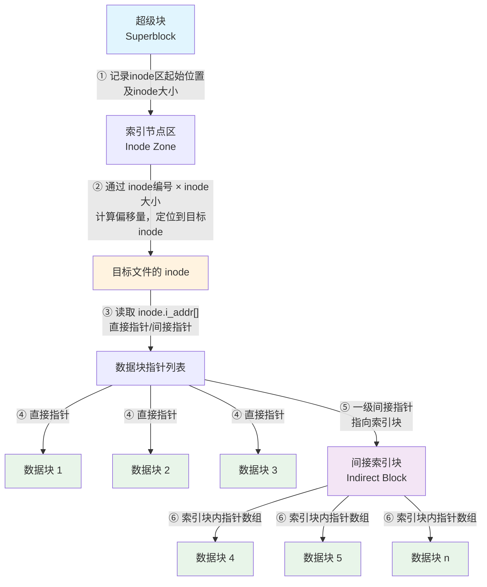
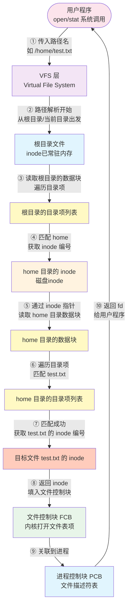

## 概念

### 首次适应算法

空闲分区按**地址递增**的顺序排列。分配时，从表头开始查找，找到**第一个**大小能满足要求的空闲分区。

### 循环首次适应算法

是首次适应的变种。不每次从表头开始，而是**从上一次分配停止的位置**继续向下查找（循环链表）。

### 最佳适应算法

空闲分区按**容量从小到大**排序。分配时，查找**第一个（即最小的）** 能满足要求的分区。

###  最坏适应算法

空闲分区按**容量从大到小**排序。分配时，查找**最大的**空闲分区，从中切割所需大小。

### 实模式

直接访问物理内存，任何程序可以随便修改任何内存地址。

### 保护模式

引入 MMU （内存管理单元）和虚拟内存。程序不再直接访问物理内存，而是通过“页表”映射。同时引入了**特权级（Ring 0 ~ Ring 3）**，操作系统内核在 Ring 0，普通软件在 Ring 3，这样普通软件崩溃不会导致整个电脑蓝屏（保护了系统）。

### 虚拟 8086 模式

**保护模式下的一个子模式**。当你在 32 位 Windows 上打开一个古老的 DOS 命令行窗口（运行 16 位程序）时，CPU 就会从保护模式切到这个子模式。它模拟出一个“实模式”的环境给那个老程序跑，但同时利用保护模式的 MMU（分页机制）把这个老程序隔离起来，防止它破坏真正的系统内存。

### 长模式

它在保护模式的基础上，将通用寄存器从 32 位扩展到了 64 位。目前实际物理硬件通常只用到 48 位或 52 位

### OPT算法

选择未来最长时间不再被访问的页面，无法实现。

### FIFO 算法

选择在内存中驻留时间最长的页面换出。

## LRU 算法

选择最长时间未被访问的页面换出。

### Clock 算法

将页面排成环形，通过一个**访问位**和一个**指针**。指针扫描，遇到访问位为 0 的就换出，为 1 的则清 0 并继续扫描。

### 文件系统

按名存取文件
## Q&A

1. 同样是基址+偏移量，分段与分页的区别在哪里？

分页的基址是页框号左移 12 位得到的，页大小是固定 4 KB，基址末 12 位永远位 0。分段的基址可以是任意物理地址。

分段的基址是物理地址的一部分，计算出来走内存总线，去访问物理内存。分页的基址是页号，需要先去查页表，将页号映射为物理页框号，再加上偏移量计算物理地址。

2. 图片的分辨率 1920 x 1080 P 是什么意思？

横向有 1920 个像素点，纵向有 1080 个像素点。

3. 空闲块的管理方式有哪些？

空闲表法：维护一张表，按顺序计算每个连续空闲区的其实块号和块数。
空闲链表法：将所有空闲块链接成一个链表，用一个指针指向链头。
位示图法：用一个二进制位来映射一个物理块。
成组链接法：将所有的空闲块分组，每组只记录下一组的起始块号和该组空闲块数量。使用一个超级块作为索引，超级块中存储第一组的信息。

4. 解释一下分区？

操作系统将内存空间中划分为若干个分区，供进程使用。

5. 分块与分页的区别？

分页是逻辑地址的划分。
分页是物理空间的划分。
操作系统中：一页=一块。

6. 空闲区分配算法有哪些？

首次适应算法、循环首次适应算法、最佳适应算法、最坏适应算法。

7. CPU 的地址模式

实模式、保护模式、虚拟 8086 模式、长模式

8. 页面调度算法有哪些？

OPT 算法、FIFO、LRU、Clock 算法

9. 操作系统的职能有哪些？
进程管理、存储管理、文件管理、设备管理、用户接口。

10. I/O 分类?

| 层级       | 分类         | 代表技术                                       | 核心特征                     |
| :------- | :--------- | :----------------------------------------- | :----------------------- |
| **软件模型** | 同步阻塞       | `read`/`write`                             | 线程挂起等待                   |
|          | 同步非阻塞      | `O_NONBLOCK`                               | 立即返回，需轮询                 |
|          | **同步多路复用** | **`select` / `poll` / `epoll` / `kqueue`** | **内核通知就绪，用户自行读写（拷贝时阻塞）** |
|          | 异步I/O      | `libaio` / **`io_uring`**                  | 内核完成全部工作，用户只等通知          |
| **硬件通路** | CPU搬运      | PIO / MMIO                                 | 消耗 CPU 指令                |
|          | 硬件搬运       | DMA / RDMA                                 | 硬件直接搬，解放 CPU             |
| **优化技巧** | 减少拷贝       | `mmap` / `sendfile`                        | 绕过用户态缓冲区                 |

11. 内部碎片和外部碎片的区别

内部碎片：已经被分配出去给某个进程，但进程实际用不上。存在于进程内部。
外部碎片：还没有分配给任何进程，但由于过于零散、不连续，无法被分配新的进程使用的内存空间，在进程之外。

12. 静态优先算法与动态优先算法的区别

静态优先性算法：进程创建时确定优先级，且生命周期中确保不变。
动态优先性算法：优先级会随时间或运行状况发生改变。

13. 硬链接和符号链接的区别。

| 比较维度         | 硬链接 (Hard Link)                             | 符号链接 (Symlink / Soft Link)                               |
| ------------ | ------------------------------------------- | -------------------------------------------------------- |
| **本质**       | 文件系统中的一个**目录项**，指向磁盘上的**同一份数据块**（Inode 相同）。 | 一个**独立的特殊文件**，内容存储的是**目标文件的路径字符串**（Inode 不同）。            |
| **跨文件系统**    | **不可以**（必须在同一磁盘分区/卷内）。                      | **可以**（可以跨分区，甚至可以指向网络路径或不存在的路径）。                         |
| **指向目录**     | **不可以**（为了防止目录循环，大多数系统禁止）。                  | **可以**（可以指向目录）。                                          |
| **删除原文件**    | **不受影响**。数据依然存在，只有所有硬链接都被删除后，数据才被真正抹除。      | **失效（悬空）**。原文件删除后，符号链接会变红或报错“No such file or directory”。 |
| **Inode 编号** | **相同**（`ls -li` 查看，编号一致）。                   | **不同**（符号链接有自己的 Inode）。                                  |
| **文件大小**     | 大小等于原文件数据大小（因为就是同一份数据）。                     | 大小很小，仅等于**路径字符串的长度**（例如指向 `/etc/passwd`，大小约为 10 字节）。     |
| **相对路径**     | 不支持相对路径逻辑（直接绑定 Inode）。                      | 支持相对路径（建议尽量使用相对路径，便于目录整体移动）。                             |
14. 磁盘索引节点、inode、超级块、文件控制表、目录项之间的关系

| 概念              | 英文缩写                              | 存储介质                 | 生命周期                         | 核心数据结构（关键字段）                                                                 | 一句话本质                                  | 类比（图书馆）                          |
| --------------- | --------------------------------- | -------------------- | ---------------------------- | ---------------------------------------------------------------------------- | -------------------------------------- | -------------------------------- |
| **超级块**         | Superblock                        | **磁盘**（固定分区开头）       | 永久（格式化时创建）                   | `s_blocksize`（块大小）, `s_inodes_count`（总 inode 数）, `s_free_blocks_list`（空闲块链表） | **文件系统的“房产证”**，记录整个分区的总容量、使用情况、起点终点。   | 图书馆总平面图 + 总信息台（共有几层楼、多少个空书架）。    |
| **目录项（Dentry）** | Dentry                            | **内存**（由 Dcache 缓存）  | 动态（路径解析时创建，LRU 淘汰）           | `d_name`（文件名）, `d_inode`（指向 inode 指针）, `d_parent`（父目录指针）                     | **文件名 ↔ inode 号** 的**内存映射表**，用于加速路径查找。 | 图书馆大厅的**书名索引柜**（按书名查图书编号）。       |
| **磁盘索引节点**      | Disk inode                        | **磁盘**（inode 表区）     | 永久（直到文件删除）                   | `i_mode`（权限）, `i_size`（大小）, `i_blocks`（占用块数）, `i_block[15]`（数据块直接/间接指针）      | 文件的**静态身份证**（存属性 + 数据地址），**不存文件名**。    | 书库深处的**原始图书登记卡**（永远保留）。          |
| **内存索引节点**      | Inode（VFS inode）                  | **内存**（RAM）          | 动态（文件被打开或缓存时存在）              | 包含磁盘 inode 所有字段 + `i_count`（引用计数）, `i_state`（是否脏）, `i_mapping`（关联页缓存）        | 磁盘 inode 的**运行时副本**，增加动态状态，多个进程可共享。    | 你借书时柜台取出的**登记卡复印件**（多人借阅，复印件共用）。 |
| **文件控制表**       | FCB / File Object / `struct file` | **内存**（进程的 fd 数组指向它） | 动态（`open()` 创建，`close()` 销毁） | `f_pos`（当前读写偏移量）, `f_mode`（读/写/追加模式）, `f_inode`（指向内存 inode）, `f_ops`（操作函数指针） | **进程打开文件的“会话凭证”**，记录本次打开的状态（如读到哪里了）。   | 你手里的**借阅证**（记录今天第几次借、当前看到第几页）。   |

这是 Linux 内核（以 VFS 虚拟文件系统为例）的逐步骤解剖。括号内附带了关键内核函数名，方便你后续查源码。

#### 阶段一：路径解析（Path Walk）—— 从根目录找到目标文件

1. **系统调用入口**：进程调用 `open()`，陷入内核态（`sys_open` -> `do_sys_open`）。
2. **获取根目录 Dentry**：从当前进程的 `fs_struct` 中取出根目录 `/` 的 Dentry（已在内存缓存中）。
3. **分割路径**：将字符串 `"/home/user/test.txt"` 拆解为 `home` -> `user` -> `test.txt`。
4. **查找 `home` **：
   - 调用 `lookup_fast()` 在 Dcache（目录项缓存）中查找 `"/home"` 的 Dentry。
   - 如果**命中缓存**：直接获得指向 `home` 的 Dentry 指针（极快，无磁盘 I/O）。
   - 如果**未命中**：调用 `lookup_slow()`，从根目录的 inode 中读取磁盘目录文件内容，扫描找到 `home` 对应的 inode 号，**新建 Dentry 对象**放入缓存。
1. **反复迭代**：同理查找 `user` 和 `test.txt`。最终拿到 `test.txt` 对应的 **Dentry**（此时 Dentry 里已有指向磁盘 inode 号的指针）。

#### 阶段二：加载 inode（将静态属性搬入内存）

6. **获取磁盘 inode 号**：从 Dentry 中提取 `test.txt` 的 inode 编号（例如 `inode 1024`）。
7. **检查内存 inode 缓存（icache）**：内核在内存的 inode 哈希表中查找 `inode 1024` 是否已存在。
   - **若存在**：直接复用，将其 `i_count`（引用计数）+1。
   - **若不存在**：调用 `iget_locked()`，从磁盘的 inode 表区（由超级块指明位置）读取该 inode 的原始磁盘数据，填充到内存中新建的 `struct inode` 结构体里，并加入哈希表。
6. **检查文件类型**：确认该 inode 对应的是**普通文件**（而非目录或设备文件）。

#### 阶段三：创建文件控制表（FCB）—— 绑定进程与文件

9. **分配空闲文件描述符（fd）**：在当前进程的 `files_struct` 结构体中找到一个最小的空闲下标（如 3）。
10. **创建 `struct file` 对象（FCB）**：
    - 内核分配一个 `struct file` 内存对象。
    - 设置 `f_inode` 指向步骤 7 中的内存 inode。
    - 设置 `f_pos` = 0（默认从文件头开始）。
    - 设置 `f_mode` = `O_RDWR`（可读可写）。
    - 设置 `f_ops` 指向该文件系统对应的操作函数表（如 `ext4_file_operations`）。
11. **建立关联**：将进程的 `fd` 数组下标 3 指向这个新的 `struct file` 对象。

#### 阶段四：权限检查与最终收尾

12. **权限校验**：调用 `inode_permission()`，用内存 inode 中的 `i_mode` 和当前进程的 uid/gid 比对，检查是否有读写权限。无权限则返回错误。
13. **更新元数据**：修改内存 inode 中的 `i_atime`（最近访问时间）标记为脏（延迟写回磁盘）。
14. **返回给用户态**：将文件描述符 `3` 返回给用户进程。

无文件名流程

从文件名到 inode

