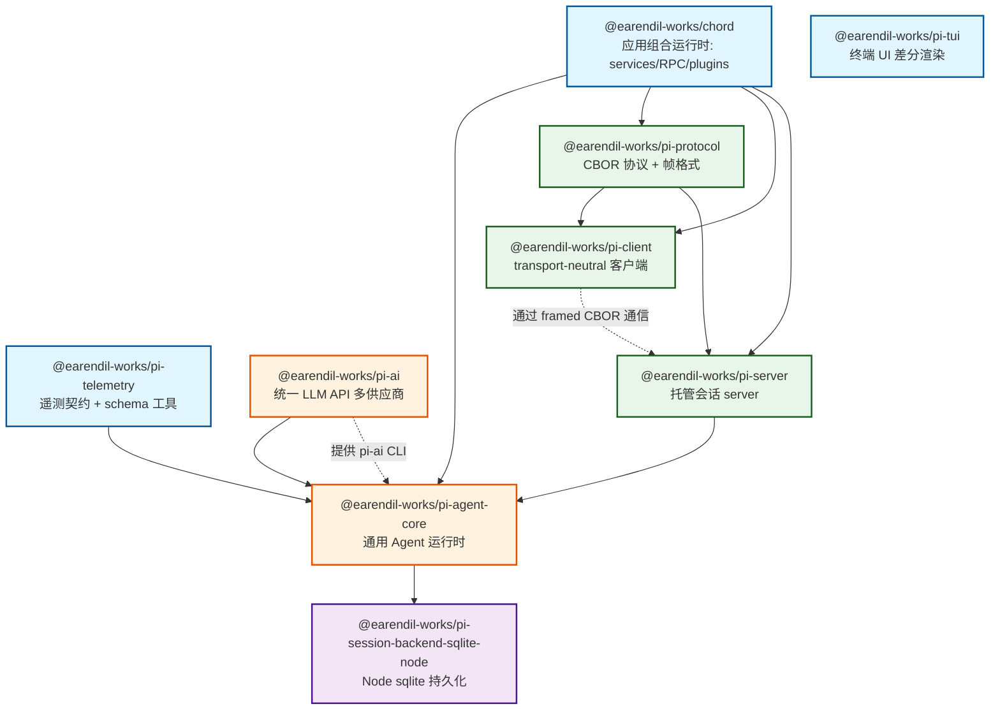

# 一级目录结构

- package.json / package-lock.json: workspace 根； scriptions 串联 build → check → test → release；lockfile 是依赖“ground truth”，提交受 pre-commit 保护。
- tsconfig.json：全仓库类型检查入口：extends base，用 paths 把各包映射到 src/ （源码直连、无 dist 依赖），include 所有包 src/test。
- tsconfig.base.jon：各包共享的编译选项基座。
- biome.json：lint + format（biome）配置，npm run check 用它
- vitest.base.ts：各包 vitest 配置共享基座
- README.md：项目说明
- CONTRIBUTING.md：贡献守则（含 contributor gate）
- SECURITY.md：安全
- LICENSE：许可
- AGENTS.md：给人和 agent 的仓库规则
- test.sh： 跑全部测试：隔离 HOME/env（临时目录、禁 git 交互、无 API key 环境），env -i npm test
- mini-test.sh：单独跑 coding-agent/src/experimental/mini/ 的 mini 实验版（tsx 直跑源码，--dist/--fresh/--stop 控制 session server）
- pi-test.sh / pi-test.ps 1 / pi-test.bat：直接从源码启动完整 pi（可任意目录运行）
- tui-plan.md：TUI 开发计划文档
- .npmrc：save-exact=true、min-release-age=2（npm 解析防当日依赖）
- .gitattributes：忽略规则与属性
- packages：monorepo 结构

# package 结构

- chord/ — @earendil-works/chord。应用组合运行时：services、replicated state、RPC、plugins。是全部基础设施的底座，唯一外部依赖是 esbuild。导出 context / delta / bundler / node 子路径，pi 的项目引用走 chord/context 等。

- telemetry/ — @earendil-works/pi-telemetry。供应商无关的遥测契约（tracing/observability 关键字）+ 类型化 schema 工具，含 /testing 一致性测试出口。
- tui/ — @earendil-works/pi-tui。终端 UI 库：差分渲染（differential rendering），供高效文本界面。带 native/（darwin/win32 C 原生构件，预编译 .node），依赖 only get-east-asian-width + marked。
- ai/ — @earendil-works/pi-ai。统一 LLM API：多供应商（OpenAI/Anthropic/Google…）+ 自动模型发现与 provider 配置，含 OAuth、bedrock、图像；有 pi-ai CLI；bin/scripts 里带模型目录生成逻辑。
- agent/ — @earendil-works/pi-agent-core。通用 Agent 运行时：transport 抽象、状态管理、attachment 支持（描述原文）。依赖 chord + pi-ai + pi-telemetry。harness/ 子模块承载 session runtime / reducer / context。
- session-backends/ — 后端实现的分组目录，当前一个包：sqlite-node/ — @earendil-works/pi-session-backend-sqlite-node。agent-core session 的 Node sqlite 持久化后端（build 时拷贝 migrations）。
- protocol/ — @earendil-works/pi-protocol。transport-neutral 的 CBOR 协议 + 帧格式，定义远程 pi 会话线上字节。依赖 chord + typebox。
- client/ — @earendil-works/pi-client。transport-neutral 客户端，通过 framed CBOR 字节连远程会话（/unix 子路径）。依赖 chord + protocol。
- server/ — @earendil-works/pi-server。包描述自标 experimental：托管会话的 server 包（/testing、/unix transport 出口）。依赖 chord + agent-core + protocol。与 client/protocol 构成"TUI 在前台、session server 分离常驻"的架构（mini-test.sh 注释即印证：session server detached 运行、协议不匹配需重启）。
- coding-agent/ — @earendil-works/pi-coding-agent。对外发布的主产品：pi CLI（bin → dist/bundle/cli.js），交互式编码 agent，内置 read/bash/edit/write 工具与会话管理。含 examples/extensions/（自定义 provider、sandbox、gondolin 等）、npm-shrinkwrap.json（npm 用户锁传递依赖）、rpc-entry 打包出口。configDir 指向 .pi。
- evals/ — @earendil-works/pi-evals。private: true 不发布：基于 vitest-evals 的评测工作台（npm run eval），devDeps 挂 coding-agent + ai，用来跑真实 agent 评测。

