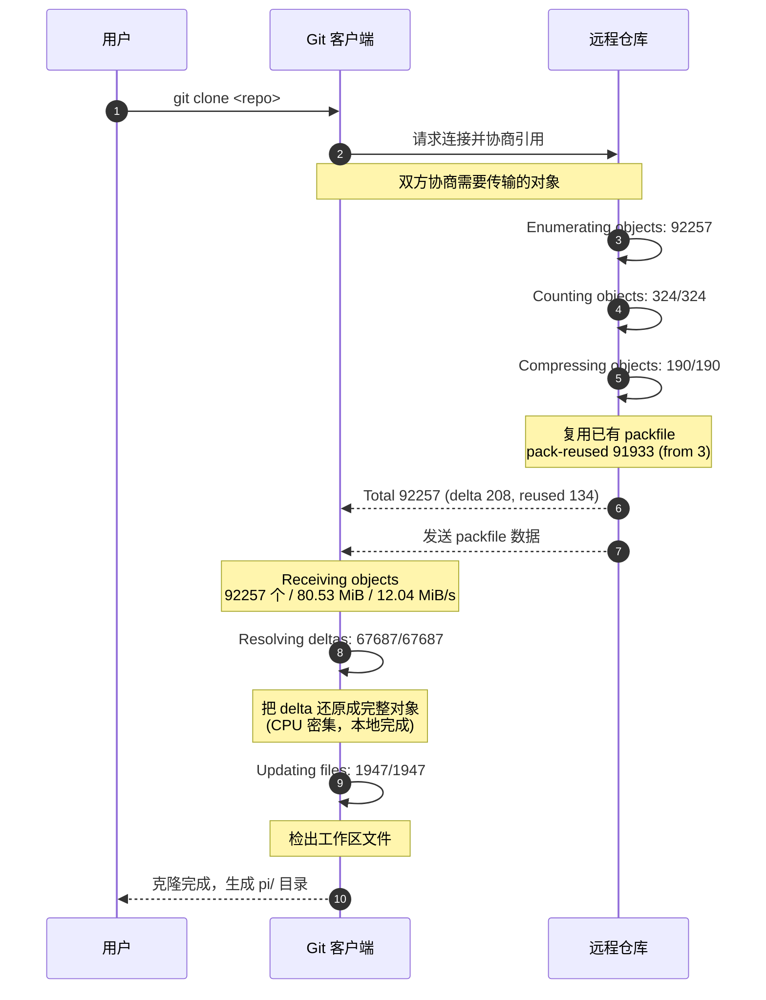

# 流程

### 1. `Cloning into 'pi'...`

Git 开始克隆，目标目录名为 `pi`（默认取仓库名）。

---

### 2. `remote: Enumerating objects: 92257, done.`

**远程仓库端**在枚举它拥有的所有对象（commit、tree、blob、tag），共 **92257** 个。

- `remote:` 前缀表示这行是**服务器端**输出的，不是你本机。
- 这一步是服务器在统计"我有哪些东西可以给你"。

---

### 3. `remote: Counting objects: 100% (324/324), done.`

服务器在**计数需要发送的对象**。

- 这里只数了 **324** 个，而不是 92257 个。
- 原因：Git 会做**协商（negotiation）**。如果你本地已有部分对象（比如之前克隆过、或有共同历史），服务器只需发送你缺失的部分。
- 但这次是全新克隆，为什么只有 324？因为这一步只是**计数阶段**统计的"待发送对象"，后面还有 `pack-reused` 复用打包数据，实际发送的远不止这些。

---

### 4. `remote: Compressing objects: 100% (190/190), done.`

服务器对需要**新压缩**的对象进行压缩。

- 190 个对象需要重新压缩。
- 其余的对象会通过"复用已有 packfile"的方式直接发送（见下一行），不需要重新压缩，节省服务器 CPU。

---

### 5. `remote: Total 92257 (delta 208), reused 134 (delta 134), pack-reused 91933 (from 3)`

这是服务器给出的**总结**：

| 字段                | 含义                                          |
| ------------------- | --------------------------------------------- |
| `Total 92257`       | 总共要传输 92257 个对象                       |
| `delta 208`         | 其中 208 个是以 delta（增量）形式存储的       |
| `reused 134`        | 复用了 134 个已有对象                         |
| `(delta 134)`       | 复用对象中有 134 个是 delta                   |
| `pack-reused 91933` | **直接复用现成的 packfile 中的 91933 个对象** |
| `(from 3)`          | 这些 packfile 来自 3 个包                     |

> 关键点：`pack-reused` 是性能优化的核心。服务器不需要重新计算压缩，直接把已有的打包文件切片发给你。

---

### 6. `Receiving objects: 100% (92257/92257), 80.53 MiB | 12.04 MiB/s, done.`

**你本机**接收对象数据：

- 共接收 **92257** 个对象
- 数据量 **80.53 MiB**
- 传输速度 **12.04 MiB/s**
- 完成

这一步是网络传输的主要耗时阶段。

---

### 7. `Resolving deltas: 100% (67687/67687), done.`

**解析增量（delta）**：

- Git 存储对象时，很多对象不是完整存储，而是存成"相对于另一个对象的差异"（delta）。
- 收到数据后，需要把这些 delta **还原成完整对象**。
- 这里解析了 **67687** 个 delta。
- 这一步是 **CPU 密集型**，在本地完成，不占网络。

---

### 8. `Updating files: 100% (1947/1947), done.`

**检出工作区**：

- 把仓库中的文件实际写入你的工作目录（working tree）。
- 共更新 **1947** 个文件。
- 完成后你就能在 `pi/` 目录里看到实际文件了。

# 总结

核心思想是传输增量，因为要传输增量，所以要协商哪些是增量。传输前要压缩，传输后要解压。解压后将增量更新到本地工作区。