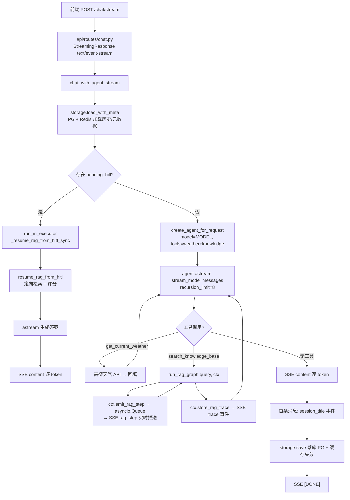
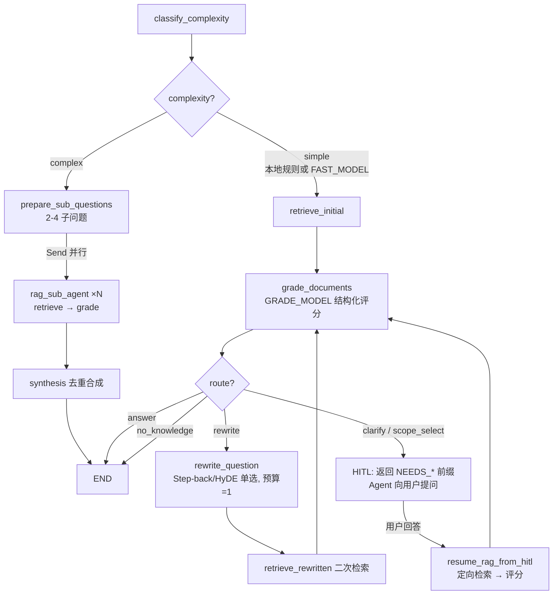
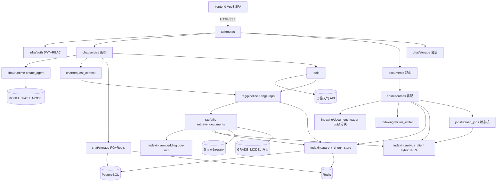
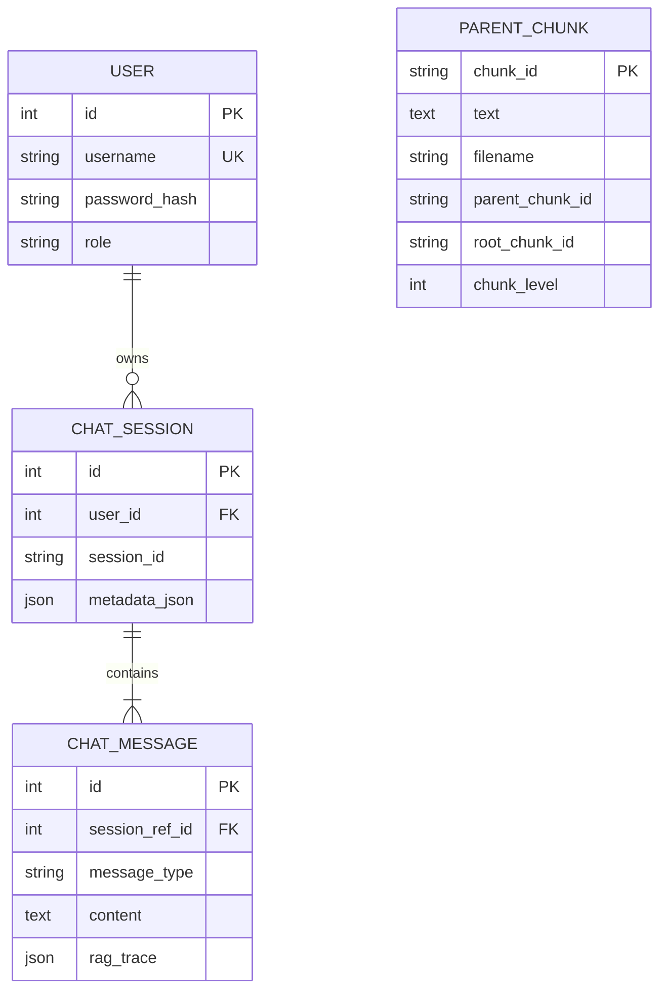

# 项目简介

## 定位

一个"可爱猫娘（Cute Cat Bot）"形象的 Agent 项目记录，本质是生产导向的 **LangChain Agent + LangGraph RAG 知识库问答系统**——不止"传文档、问问题"，而是完整支持**用户体系与 RBAC、文档三级分块入库、Milvus 混合检索、证据评分路由、查询重写、人工介入（HITL）、SSE 流式问答与全链路可观测**，并配有现代工程化前端（Vite + Vue 3 + TypeScript）。

## 核心特性（来自 README + 代码验证）

- LangChain Agent + 自定义工具（`get_current_weather` 天气、`search_knowledge_base` 知识库检索）
- **混合检索落地**：稠密向量（本地 bge-m 3）+ BM 25 稀疏向量，Milvus Hybrid Search + RRF 排序，兼顾语义与词匹配
- **三级分块 + Auto-merging**：L 1/L 2/L 3 三层滑窗切分；检索优先召回 L 3 叶子，满足阈值自动合并到父块（L 3→L 2→L 1）
- **Leaf-only 向量化**：仅叶子分块写入 Milvus，父块写入 PostgreSQL（DocStore），减少向量冗余
- **Milvus 2.5+ 服务端原生 BM 25**：schema 绑定 `FunctionType.BM25` 计算函数，服务端提取稀疏特征，与稠密检索统计完美对齐
- **复杂度规划 + 并行 Sub-Agent**：单事实问题本地规则直接走标准流程；其余由 FAST_MODEL 一次完成 simple/complex 判断并给出 2-4 个子问题；复杂问题经 LangGraph `Send` 并行检索，Synthesis 节点去重合成
- **纠错型 RAG（Corrective RAG）**：GRADE_MODEL 结构化判断证据相关性/可回答性/歧义，路由到回答/重写/澄清/范围选择/无知识
- **Step-back / HyDE 单选查询重写**：证据不足时 FAST_MODEL 一次结构化调用单选一种方式，只执行一次二次检索（重写预算 = 1）
- **人工介入（HITL）**：证据不足需澄清或需用户选择检索范围时暂停流程，向用户提问，恢复时跳过主图做定向检索
- **Jina Rerank 接入**：Hybrid/Dense 召回后 API 级精排，返回 `rerank_score` 并前端可视化；失败自动降级 RRF 排序
- **双向降级**：稀疏生成或 Hybrid 调用失败自动降级纯稠密检索
- **流式输出**：`agent.astream(stream_mode="messages")` 逐 token 推送，前端 SSE + ReadableStream 打字机效果，支持 AbortController 中断
- **实时 RAG 过程可视化**：检索/评分/重写步骤在模型"思考中"阶段实时推送（`asyncio.Queue` + `run_in_executor` 事件循环穿透）
- **会话摘要记忆**：自动摘要旧消息为 `persistent_note` 注入系统提示，控制 token
- 用户注册/登录、JWT 鉴权、PBKDF 2-SHA 256 密码（兼容历史 bcrypt）、RBAC（admin/user）、管理员邀请码

## 规模与技术栈

**规模**：后端 41 个 Python 文件 ~5300 行；前端 30 个 TS/Vue 文件 ~3800 行；测试 6 个文件 ~1350 行。

| 层          | 技术                                                                             |
| ---------- | ------------------------------------------------------------------------------ |
| API        | FastAPI（同步 SQLAlchemy 2.0）                                                     |
| 编排         | LangChain Agent（`create_agent`）+ LangGraph（StateGraph + Send API）              |
| LLM        | OpenAI-compatible 三模型分工：`MODEL`（生成）/ `FAST_MODEL`（复杂度+重写）/ `GRADE_MODEL`（证据评分） |
| Embeddings | langchain-huggingface，本地 BAAI/bge-m 3（dense, 1024 维）                           |
| 向量库        | Milvus 2.5+（服务端 BM 25 FunctionType + Hybrid Search + RRF）                      |
| Rerank     | Jina 兼容 `/v1/rerank` API（可选，不配自动降级）                                            |
| DB / 缓存    | PostgreSQL 15（业务+父块 DocStore）、Redis 7（热点会话+父块缓存）                               |
| 文档解析       | pypdf, docx 2 txt, unstructured/Excel, beautifulsoup 4(HTML), msoffcrypto-tool |
| 认证         | python-jose JWT (HS 256) + passlib PBKDF 2-SHA 256                             |
| 前端         | Vite + Vue 3 + TypeScript + Pinia + Axios + Sass                               |
| 开发/运行      | uv, Docker Compose（postgres/redis/etcd/minio/milvus/attu）                      |

## Demo 页面

前端为单页应用（`frontend/dist` 由 FastAPI 静态托管，`/` 访问）：

- 登录/注册面板（`AuthPanel.vue`，支持 admin 邀请码）
- 聊天主界面（`ChatArea.vue` / `ChatInput.vue`，SSE 流式 + 中止按钮）
- RAG 思考链路可视化（`ThinkingTrace.vue` + `RetrievalTraceDetails.vue`：Searching → Grading → Rewriting 步骤实时展示，含子问题并行、合并与召回详情）
- 知识来源引用（`References.vue`：折叠卡片，含 RRF Rank / Rerank 得分 / 合并叶子块数 / 层级 / 页码）
- 文档管理（`UploadSection.vue` 多阶段上传进度轮询 + `DocumentSettings.vue` + `DocumentItem.vue`）
- 会话历史侧栏（`HistorySidebar.vue` 列表/切换/删除）

## 为什么存在（设计动机）

README 声明为"Agent 的项目记录，方便后续持续更新与展示"。技术动机上，大多数 RAG demo 止步于"上传文本、问问题"；本项目进一步落地：

- 语义 + 词面双路混合检索（Milvus 服务端 BM 25 + RRF），并在候选池上做精排
- 三级分块 + Auto-merging，平衡检索精度与上下文完整性
- 证据评分驱动的纠错路由（Corrective RAG）与单选查询重写，控制模型调用数与最坏延迟
- 复杂问题并行子问题检索，简单问题零模型开销快速路径
- 人工介入与恢复机制（HITL），处理模糊/多义问题
- 全链路过程可观测与流式体验，把 RAG 从"黑盒"变成"看得见每一步"

# 快速开始

# SuperMew — 快速开始

## 前置要求

- Python `3.12+`
- 包管理建议 `uv`（也支持 `pip`）
- Docker 与 Docker Compose（启动 PostgreSQL / Redis / Milvus 全家桶）
- Node.js + npm（编译前端）
- 所需 provider 的 API 凭据（ARK 兼容 OpenAI endpoint：`ARK_API_KEY`、`MODEL`、`FAST_MODEL`、`GRADE_MODEL`）

## 环境配置

```bash
cp .env.example .env
```

至少检查：

- 模型设置：`MODEL`（主模型）、`FAST_MODEL`（复杂度/重写）、`GRADE_MODEL`（证据评分）、`BASE_URL`
- 本地向量：`EMBEDDING_MODEL`（默认 BAAI/bge-m 3）、`HF_ENDPOINT`（国内镜像，默认 hf-mirror.com）
- 检索参数：`RETRIEVAL_TOP_K` / `RETRIEVAL_CANDIDATE_K` / `AUTO_MERGE_*` / `RERANK_*`（不配 rerank 自动降级）
- 数据库：`DATABASE_URL`（PostgreSQL）、`REDIS_URL`、`MILVUS_HOST/PORT`
- 认证：`JWT_SECRET_KEY`（务必替换）、`ADMIN_INVITE_CODE`

## 方式 A：Docker 启动依赖（最快）

```bash
docker compose up -d
```

一次拉起全部依赖（业务 + 向量）：

- PostgreSQL：`5432`
- Redis：`6379`
- Milvus standalone：`19530`（健康检查 `9091`）
- etcd / MinIO（Milvus 内部依赖，`9000` / `9001`）
- Attu（Milvus Web 管理台）：`8080`

## 方式 B：本地运行

```bash
uv sync                          # 安装后端依赖
cd frontend && npm install && npm run build && cd ..   # 编译前端（生成 frontend/dist）
uv run uvicorn backend.app:app --host 0.0.0.0 --port 8000 --reload
```

服务地址：

- 前端 SPA：`http://127.0.0.1:8000/`（后端静态托管 `frontend/dist`）
- Swagger UI：`http://127.0.0.1:8000/docs`

前端开发模式（可选）：`cd frontend && npm run dev`，运行于 `http://localhost:3000`，内置反向代理至 8000。

## 典型工作流

### 1. 注册并登录（admin 可上传文档）

```bash
# 注册（管理员需带 admin_code）
curl -X POST http://localhost:8000/auth/register \
  -H "Content-Type: application/json" \
  -d '{"username":"admin","password":"secret","role":"admin","admin_code":"supermew-admin-2026"}'

# 登录获取 token
curl -X POST http://localhost:8000/auth/login \
  -H "Content-Type: application/json" \
  -d '{"username":"admin","password":"secret"}'
```

### 2. 上传文档（admin，同步或异步）

```bash
curl -X POST http://localhost:8000/documents/upload \
  -H "Authorization: Bearer <token>" \
  -F "file=@policy.pdf"
```

异步版本返回 `job_id`，前端/调用方轮询 `GET /documents/upload/jobs/{job_id}` 查看五阶段进度（upload → cleanup → parse → parent_store → vector_store）。

支持格式：`.pdf` / `.docx` / `.doc` / `.xlsx` / `.xls` / `.html` / `.htm`。

### 3. 流式提问

```bash
curl -N -X POST http://localhost:8000/chat/stream \
  -H "Authorization: Bearer <token>" \
  -H "Content-Type: application/json" \
  -d '{"message":"What does the policy define as an Account?","session_id":"s1"}'
```

SSE 事件流：

- `rag_step` — 实时 RAG 过程步骤（Searching → Grading → Rewriting → …）
- `content` — 逐 token 答案
- `trace` — 完整 `rag_trace`（检索/评分/重写/合并/精排详情）
- `hitl_request` — 人工介入：需澄清/需选择范围时暂停提问
- `session_title` — 首条消息自动生成会话标题
- `error` / `[DONE]`

### 4. 会话管理

```bash
GET    /sessions                       # 会话列表
GET    /sessions/{session_id}          # 会话消息（含 rag_trace）
DELETE /sessions/{session_id}          # 删除会话（user 仅可删自己的）
```

## API 概览（核心端点）

| 方法     | 路径                                           | 说明                        | 权限     |
| ------ | -------------------------------------------- | ------------------------- | ------ |
| POST   | `/auth/register`                             | 注册（可带 admin_code 升 admin） | 公开     |
| POST   | `/auth/login`                                | 登录 → JWT                  | 公开     |
| GET    | `/auth/me`                                   | 当前用户信息                    | 登录     |
| POST   | `/chat`                                      | 同步聊天                      | 登录     |
| POST   | `/chat/stream`                               | 流式聊天（SSE）                 | 登录     |
| GET    | `/sessions`                                  | 会话列表                      | 登录（本人） |
| GET    | `/sessions/{session_id}`                     | 会话消息                      | 登录（本人） |
| DELETE | `/sessions/{session_id}`                     | 删除会话                      | 登录（本人） |
| GET    | `/documents`                                 | 文档列表                      | admin  |
| POST   | `/documents/upload`                          | 同步上传                      | admin  |
| POST   | `/documents/upload/async`                    | 异步上传                      | admin  |
| GET    | `/documents/upload/jobs` / `…/jobs/{job_id}` | 上传任务轮询                    | admin  |
| DELETE | `/documents/{filename}`                      | 同步删除                      | admin  |
| DELETE | `/documents/delete/async/{filename}`         | 异步删除                      | admin  |
| GET    | `/documents/delete/jobs/{job_id}`            | 删除任务轮询                    | admin  |
| GET    | `/`                                          | 前端 SPA                    | 公开     |
| GET    | `/docs`                                      | Swagger UI                | 公开     |

## 三模型分工

| 模型            | 用途                                                  | 特点                  |
| ------------- | --------------------------------------------------- | ------------------- |
| `MODEL`       | Agent 主对话生成（含最终答案）                                  | temperature 0.3     |
| `FAST_MODEL`  | 复杂度规划（simple/complex + 2-4 子问题）、Step-back/HyDE 单选重写 | 低延迟、temperature 0.2 |
| `GRADE_MODEL` | 证据评分（相关性/可回答性/歧义/置信度）与路由                            | 独立高能力模型，结构化输出       |

复杂度规划对明显的单事实问题走本地规则快速路径，不调用模型。

# 功能结构

按能力域划分，6 个功能块：

| 功能域           | 入口                             | 核心服务                                          | 说明                                        |
| ------------- | ------------------------------ | --------------------------------------------- | ----------------------------------------- |
| **认证与权限**     | `/auth/*`                      | `infra/auth.py` (JWT + PBKDF 2 + RBAC)        | 注册/登录/me，admin/user 角色，admin 邀请码          |
| **聊天**        | `/chat`, `/chat/stream`        | `chat/service.py` → `chat/runtime.py` (Agent) | 同步/SSE 流式，流式 token + 中止，会话标题，持久笔记         |
| **文档管理**      | `/documents*`                  | `api/resources.py` + `jobs/upload_jobs.py`    | admin 上传/删除（同步+异步任务）、列表、支持 6 种格式          |
| **知识检索（RAG）** | 聊天内 `search_knowledge_base` 工具 | `rag/pipeline.py` + `rag/utils.py`            | 复杂度规划→混合检索→Auto-merge→Rerank→评分路由→重写/HITL |
| **会话记忆**      | `/sessions*`                   | `chat/storage.py` (ConversationStorage)       | PG 持久化 + Redis 热点缓存，摘要注入，HITL 断点持久化       |
| **工具**        | Agent 工具调用                     | `tools/weather.py`, `tools/knowledge.py`      | 天气查询、知识库检索（每轮 1 次预算）                      |

## 各功能域明细

### 认证与权限（infra/auth）
- `POST /auth/register`：注册，`resolve_role` 校验 admin 邀请码（`ADMIN_INVITE_CODE`）决定角色
- `POST /auth/login`：`authenticate_user`（兼容 PBKDF 2-SHA 256 新哈希与历史 bcrypt 哈希）→ `create_access_token`（HS 256 JWT，`JWT_EXPIRE_MINUTES` 时效）
- `GET /auth/me`：当前用户（username/role）
- RBAC：`get_current_user`（Bearer token）→ `require_admin` 守卫文档全部操作；会话按用户隔离
- 密码：PBKDF 2-SHA 256，轮数 `PASSWORD_PBKDF2_ROUNDS`（默认 310000），服务端全局清洗不可见字符

### 聊天（chat/service + runtime）
- `POST /chat` 同步：`chat_with_agent` 单次调用返回完整回答
- `POST /chat/stream` SSE：`chat_with_agent_stream`
  - 首条消息自动 `generate_session_title`
  - 加载历史 + `persistent_note` 摘要注入 `_build_context_messages`
  - `create_agent_for_request`：LangChain `create_agent(model=MODEL, tools=[weather, knowledge], system_prompt=…)`
  - `agent.astream(stream_mode="messages")` 逐 token 推送；`asyncio.Queue` + 后台任务解耦 RAG 同步工具的事件推送
  - 每轮结束 `storage.save` 落库（PG + Redis 缓存失效）
- 中止：前端 AbortController → StreamingResponse 断开 → `GeneratorExit` 取消 agent 任务
- HITL：`pending_hitl` 存于会话 metadata；下次提问检测到后走 `_resume_rag_from_hitl_sync`（executor 线程）恢复，不重进主图

### 文档管理（api/resources + jobs）
- 支持格式：`.pdf` `.docx` `.doc` `.xlsx` `.xls` `.html` `.htm`（`is_supported_document`）
- 同步上传：`POST /documents/upload` → `_process_upload_job` 全链路（清理旧版→解析分块→父块入库→向量入库）
- 异步上传：`POST /documents/upload/async` → 内存任务状态机五步（upload → cleanup → parse → parent_store → vector_store），前端轮询进度
- 删除：同步 `DELETE /documents/{filename}`；异步 `DELETE /documents/delete/async/{filename}`（prepare → bm 25 → milvus → parent_store），`delete_document_transactionally` 保证 Milvus 向量 + PG 父块 + Redis 缓存一致性清理
- 同名重传：先清旧数据再入库，杜绝残留
- 任务状态：`UploadJobManager`（进程内存 + 线程锁），含每步 percent/status/message

### 知识检索（rag，重点）
- 入口：Agent 调用 `search_knowledge_base(query)` 工具 → `run_rag_graph(query, ctx)`
- 复杂度规划：`classify_complexity`（本地规则快速路径或 FAST_MODEL 结构化输出）→ simple 走标准检索 / complex 拆 2-4 子问题并行
- 检索：`retrieve_documents`（详见数据流）— 候选池 → Auto-merging → Jina Rerank → min_score 门控
- 证据评分与路由：`grade_documents_node`（GRADE_MODEL）→ answer / rewrite / clarify / scope_select / no_knowledge
- 查询重写：`rewrite_question_node` — FAST_MODEL 单选 Step-back 或 HyDE，只执行一次二次检索（`rewrite_count ≥ 1` 则终止为 no_knowledge）
- HITL：`clarify`（证据不足需补充细节）/ `scope_select`（多个检索方向需用户选择）→ 工具返回 `NEEDS_CLARIFICATION` / `NEEDS_SCOPE_SELECTION` → Agent 原样转述提问；恢复走 `resume_rag_from_hitl` 定向检索
- 可观测：`rag_trace` 全字段（评分、路由、重写内容、初次/二次检索、合并与精排统计、子问题追踪），前端 `RetrievalTraceDetails.vue` 展开查看

### 会话记忆（chat/storage）
- `ConversationStorage`：PostgreSQL（`chat_messages` / `chat_sessions`）+ Redis 双读缓存
- 缓存键：`chat_messages:{user}:{session}`、`chat_sessions:{user}`；写入/删除后失效
- 会话元数据 `metadata_json`：标题、`persistent_note`（摘要）、`pending_hitl`（HITL 断点）
- `update_persistent_note`：自动摘要旧消息注入系统提示，控制 token 且维持上下文

### 工具（tools）
- `get_current_weather`：高德天气 API（`AMAP_WEATHER_API` + `AMAP_API_KEY`），可插拔扩展
- `search_knowledge_base`：按请求闭包绑定 `ChatRequestContext`；`acquire_knowledge_tool_slot` 每轮限 1 次（超限返回 `TOOL_CALL_LIMIT_REACHED`）；结果按 `[i] filename (Page n)` 格式化，HITL/无知识返回特殊前缀文案
- system prompt 约束：基于检索块作答并内联引用 `[1][2]`，禁止无来源事实，禁止重复调用工具

## 前端层（frontend/src）

SPA 直接消费 API，Pinia 状态 + 组件分层：

| 功能 | Store / 组件 | 说明 |
|---|---|---|
| 登录/注册 | `stores/auth.ts` + `AuthPanel.vue` | JWT Bearer 请求、admin 邀请码 |
| 会话 | `stores/sessions.ts` + `HistorySidebar.vue` | 列表/切换/删除 |
| 聊天流 | `stores/chat.ts` + `ChatArea/ChatInput/MessageItem` | SSE 流式、打字机、中止按钮、HITL 渲染 |
| RAG 可视化 | `ThinkingTrace.vue` / `RetrievalTraceDetails.vue` / `KnowledgeContextPanel.vue` | 思考步骤、子 Agent 追踪、检索漏斗、评分/重写详情 |
| 引用 | `References.vue` | RRF Rank / rerank_score / 合并块数 / 层级 / 页码 |
| 文档管理 | `stores/documents.ts` + `UploadSection/DocumentSettings/DocumentItem` | 上传任务多阶段进度轮询、设置、列表删除 |

# 目录结构

```
SuperMew/
├── README.md                 # 项目记录：部署、架构、核心流程、未来迭代
├── pyproject.toml / uv.lock  # Python 3.12+，依赖含 langchain/langgraph/milvus/sqlalchemy
├── .env.example              # 全部环境变量模板（模型/向量/检索/Milvus/DB/认证/工具）
├── docker-compose.yml        # postgres + redis + etcd + minio + milvus standalone + attu
├── docker-compose.prod.yml
├── frontend/                 # Vite + Vue 3 + TS + Pinia SPA（构建产物 backend 静态托管）
├── tests/                    # 6 个测试文件（RAG 短路/延迟门控/追踪 schema/HITL 恢复等）
├── langsmith_eval.py / test_embedding.py
├── project_visualization.html / presentation.html
├── data/                     # 运行时生成：documents/ 上传原文件（.gitignore）
└── backend/                  # FastAPI 后端（41 个 Python 文件）
    ├── app.py                # 入口: create_app + CORS + no-cache 中间件 + 静态挂载 / 
    ├── env.py                # PROJECT_ROOT + load_env（.env 加载）
    ├── api/                  # HTTP 层
    │   ├── router.py         # 路由聚合（auth/sessions/chat/documents）
    │   ├── resources.py      # 共享资源（loader/writer/milvus）+ 事务性文档删除
    │   └── routes/           # auth.py / sessions.py / chat.py / documents.py
    ├── chat/                 # 对话域
    │   ├── service.py        # 流式/非流式编排、HITL 恢复、会话标题、持久笔记
    │   ├── runtime.py        # MODEL/FAST_MODEL 客户端 + 每请求 create_agent
    │   ├── request_context.py# 每请求 RAG step/trace/工具预算上下文（事件循环穿透）
    │   └── storage.py        # ConversationStorage（PostgreSQL + Redis）
    ├── rag/                  # RAG 域
    │   ├── pipeline.py       # LangGraph 状态图（8 节点 + Send 并行 + HITL 恢复）
    │   └── utils.py          # retrieve_documents：混合召回→Auto-merge→Rerank→门控
    ├── indexing/             # 文档入库与向量
    │   ├── embedding.py      # bge-m3 本地稠密向量（全进程单例）
    │   ├── document_loader.py# PDF/Word/Excel 加载 + 三级滑窗分块 + 文本清洗
    │   ├── html_processor.py # HTML 解析
    │   ├── milvus_client.py  # Milvus 读写（集合初始化/插入/混合检索/分页查询）
    │   ├── milvus_writer.py  # 叶子块向量化写入编排
    │   └── parent_chunk_store.py  # 父级分块 DocStore（PostgreSQL + Redis）
    ├── tools/                # LangChain @tool
    │   ├── knowledge.py      # search_knowledge_base（跑 RAG 图，HITL 文案）
    │   └── weather.py        # get_current_weather（高德天气 API）
    ├── infra/                # 基础设施
    │   ├── auth.py           # JWT 签发/校验、PBKDF2-SHA256、RBAC（require_admin）
    │   ├── cache.py          # RedisCache（JSON 序列化、前缀、TTL）
    │   └── database.py       # SQLAlchemy engine + NUL/不可见字符清洗监听器
    ├── db/
    │   └── models.py         # ORM：User / ChatSession / ChatMessage / ParentChunk
    ├── schemas/              # Pydantic：auth.py / chat.py / documents.py
    └── jobs/
        └── upload_jobs.py    # 上传/删除任务状态机（进程内存 + 线程锁）
```

## 分层规则

`api → chat/rag → indexing → infra → db`

- `api/routes` 只做 HTTP 翻译与鉴权；业务编排在 `chat/service.py` 与 `rag/pipeline.py`。
- `rag/` 依赖 `indexing/`（检索/入库实现），`indexing/` 依赖 `infra/` 与 `db/`；依赖单向向下。
- `chat/request_context.py` 是**请求级显式上下文**（RAG step 队列、rag_trace、知识工具预算），经工具闭包传入 RAG 图，不采用全局单例。
- `api/resources.py` 是文档链路的共享装配点（loader / milvus_writer / parent_chunk_store / 事务性删除）。
- 模型客户端（`chat/runtime.py`）进程级单例；Agent 每请求创建（携带 request context）。
- 无 Alembic：建表用 `Base.metadata.create_all`（启动时 `init_db`），字段演进直接改 `db/models.py`。

## 完整源文件清单（41 个 Python 文件）

```
backend/__init__.py
backend/app.py
backend/env.py
backend/api/__init__.py
backend/api/router.py
backend/api/resources.py
backend/api/routes/__init__.py
backend/api/routes/auth.py
backend/api/routes/chat.py
backend/api/routes/documents.py
backend/api/routes/sessions.py
backend/chat/__init__.py
backend/chat/request_context.py
backend/chat/runtime.py
backend/chat/service.py
backend/chat/storage.py
backend/db/__init__.py
backend/db/models.py
backend/indexing/__init__.py
backend/indexing/document_loader.py
backend/indexing/embedding.py
backend/indexing/html_processor.py
backend/indexing/milvus_client.py
backend/indexing/milvus_writer.py
backend/indexing/parent_chunk_store.py
backend/infra/__init__.py
backend/infra/auth.py
backend/infra/cache.py
backend/infra/database.py
backend/jobs/__init__.py
backend/jobs/upload_jobs.py
backend/rag/__init__.py
backend/rag/pipeline.py
backend/rag/utils.py
backend/schemas/__init__.py
backend/schemas/auth.py
backend/schemas/chat.py
backend/schemas/documents.py
backend/tools/__init__.py
backend/tools/knowledge.py
backend/tools/weather.py
```

## 前端组件清单（frontend/src，30 个文件）

```
main.ts / App.vue / vite-env.d.ts
assets/styles/                          # Sass 样式
utils/api.ts                            # fetch ReadableStream SSE 流式解包 + AbortController
utils/markdown.ts
types/chat.ts / types/document.ts / types/user.ts
stores/auth.ts                          # JWT 注册登录状态
stores/sessions.ts                      # 会话创建/载入/删除/切换
stores/chat.ts (+ chat.spec.ts)         # 消息流缓存 + RAG 步骤响应式更新
stores/documents.ts (+ documents.spec.ts)  # 文档列表 + 上传任务轮询
components/AuthPanel.vue                # 登录/注册（admin 邀请码）
components/Sidebar.vue / HistorySidebar.vue / ThemeToggle.vue
components/Chat/
    ChatArea.vue / ChatInput.vue / WelcomeScreen.vue
    MessageItem.vue / MessageContent.vue
    ThinkingTrace.vue / RetrievalTraceDetails.vue   # RAG 思考链路 + 追踪详情（子 Agent/合并/召回）
    References.vue / KnowledgeContextPanel.vue      # 来源引用 + 检索漏斗面板
components/Documents/
    UploadSection.vue / DocumentSettings.vue / DocumentItem.vue
```

# 数据流结构

# SuperMew — 数据流结构

入口：`backend/app.py` 创建 FastAPI，`api/router.py` 聚合 4 个 router（auth/sessions/chat/documents）；聊天与文档链路经 `api/resources.py` 与 `chat/request_context.py` 装配共享资源与请求级上下文。

## 1. 提问流（主链路，SSE 流式）



**输入**：`ChatRequest {message, session_id?}` + Bearer token

**输出（SSE 事件流）**：`rag_step`（过程步骤）→ `content`（token）→ `trace`（`rag_trace`）→ 可选 `hitl_request` → `[DONE]`；首条消息额外 `session_title`

**关键约束**：

- **工具预算**：每轮最多 1 次 `search_knowledge_base`（`acquire_knowledge_tool_slot`），超限返回 `TOOL_CALL_LIMIT_REACHED`
- **HITL 持久化**：`pending_hitl` 存在会话 `metadata_json`，中断状态（rewrite_count/complexity/sub_questions）随 `HitlResumeState` 保存；恢复时不重进主图
- **同步工具穿透**：RAG 是同步调用，通过 `run_in_executor` + `asyncio.Queue` 双队列把步骤实时推到 SSE，避免"静默思考"
- 中断：前端 AbortController → 连接断开 → `GeneratorExit` 取消 agent 任务
- 全链路 `rag_trace` 随消息持久化（`chat_messages.rag_trace` JSON），历史回放可重看追踪

### RAG 图细节（run_rag_graph）



- 主路径：`classify_complexity → retrieve_initial → grade_documents →(rewrite)→ rewrite_question → retrieve_rewritten → grade_documents`（rewrite_count ≥ 1 再不足则 no_knowledge）
- 复杂路径：`prepare_sub_questions → Send(rag_sub_agent) → synthesis`；子 agent 各跑"检索→评分"，synthesis 去重合并
- HITL 恢复：`_state_from_resume` 重建状态（保留 rewrite_count/complexity/sub_questions）→ `_retrieve_resume_query` 定向检索 → 再评分，若仍不满足则再次 HITL
- 评分失败（GRADE_MODEL 缺失/异常）显式抛错，不静默降级

## 2. 检索流（retrieve_documents → utils.py）

```text
retrieve_documents(query, top_k=RETRIEVAL_TOP_K)
  → resolve_candidate_k: RETRIEVAL_CANDIDATE_K 优先（且 ≥ top_k），否则 top_k × RETRIEVAL_CANDIDATE_MULTIPLIER
  → bge-m3 本地稠密向量 embed_query          # embedding 失败 → retrieval_mode=failed, 空结果
  → Milvus hybrid_retrieve(
        dense_embedding, query, top_k=candidate_k,
        filter_expr="chunk_level == LEAF_RETRIEVE_LEVEL(3)")   # Dense + 服务端 BM25 Sparse + RRF
  → Hybrid 异常 → dense_retrieve 降级         # 双向降级
  → _finalize_retrieval:
      _auto_merge_candidates          # L3→L2→L1, 同父叶子 ≥ AUTO_MERGE_THRESHOLD(2) 才合并,
                                      #   父块文本从 ParentChunkStore(PG+Redis) 读取, 得分取 max
      → _rerank_documents             # Jina /v1/rerank, top_n=top_k, 写 rerank_score
                                      #   失败/超时 → 按 RRF 排序兜底, rerank_error 记录
      → _meets_rerank_min_score       # 精排分(或召回分) ≥ RERANK_MIN_SCORE 过滤
  → {docs, meta}  # meta: retrieval_mode/pipeline/candidate_k/recall_count/
                  # auto_merge_*/rerank_*/post_threshold_count/retrieval_empty
```

**流水线名**：`recall_merge_rerank`（召回 → Auto-merge → 精排）。

## 3. 摄取流（文档入库）

```text
POST /documents/upload (同步) 或 /documents/upload/async (异步 → 轮询 job)
  → save_upload_file 落盘 data/documents/{filename}
  → 同名存在? delete_document_transactionally 清旧 (Milvus + PG 父块 + Redis)
  → DocumentLoader.load_document(file_path, filename)   # 按扩展名选加载器
      pdf → PyPDFLoader / docx → Docx2txtLoader / xlsx → UnstructuredExcelLoader / html → html_processor
  → sanitize_text: NFC 归一化 → 擦零宽/BOM/控制符/PUA → utf-8 ignore 去代理项
  → RecursiveCharacterTextSplitter 三级滑窗:
      L1(chunk_size×3) / L2(chunk_size×2) / L3(chunk_size=800, overlap=100)
      chunk_id = "{filename}::p{page}::l{level}::{index}"
  → 父级 L1/L2 → ParentChunkStore.upsert_documents (PostgreSQL + Redis)
  → 叶子 L3 → MilvusWriter: embed_documents(bge-m3 dense) → Milvus insert
      (BM25 稀疏特征由 Milvus 服务端 FunctionType 自动生成, 无需客户端序列化)
  → 任务状态机步进: upload→cleanup→parse→parent_store→vector_store (各带 percent/status)
```

## 4. 删除流

```text
DELETE /documents/{filename} 或 /documents/delete/async/{filename}
  → delete_document_transactionally(filename, job_manager)
  → 1. milvus init_collection → delete('filename == "{filename}"')   # 物理删向量
  → 2. ParentChunkStore.delete_by_filename                            # 删 PG 父块 + Redis 缓存
  → 异步版任务步进: prepare→bm25(占位, 服务端自动维护)→milvus→parent_store
```

## 5. CRUD 导出（全部数据操作）

| 实体                  | Create                            | Read                                           | Update                                      | Delete                  |
| ------------------- | --------------------------------- | ---------------------------------------------- | ------------------------------------------- | ----------------------- |
| **User**            | `POST /auth/register`             | `GET /auth/me`                                 | —                                           | —                       |
| **ChatSession**     | 首条消息隐式建                           | `GET /sessions`, `GET /sessions/{id}`          | `metadata_json`（标题/持久笔记/pending_hitl 随对话更新） | `DELETE /sessions/{id}` |
| **ChatMessage**     | 每轮对话落库                            | `GET /sessions/{id}`（含 rag_trace）              | —                                           | 随 session 级联            |
| **ParentChunk**     | 上传时写入（L 1/L 2）                    | `get_documents_by_ids`（Auto-merge 取父块）         | 重传覆盖（upsert）                                | `delete_by_filename`    |
| **Milvus 向量 chunk** | 上传时写入（L 3 叶子）                     | `hybrid_retrieve` / `dense_retrieve` / `query` | —                                           | `delete`（filename 过滤）   |
| **上传/删除任务**         | `POST /documents/{upload,delete}` | `GET /documents/{upload,delete}/jobs[/{id}]`   | 状态机步进更新                                     | —（内存态，重启丢失）             |

## 6. 端到端时序（典型场景）

```text
用户 → 前端输入问题 → POST /chat/stream (SSE)
  → 鉴权（Bearer JWT）→ chat_with_agent_stream
  → 加载历史 + persistent_note 摘要 → create_agent(model=MODEL)
  → Agent 判定知识问题 → 调用 search_knowledge_base(query) [预算-1]
  → run_rag_graph:
      复杂度规划(simple/complex) → [complex: Send 并行子问题]
      混合检索(候选 30 → Auto-merge → Rerank → top 8) [rag_step 实时推送]
      证据评分(GRADE_MODEL) → 路由:
        answer → 结束
        rewrite → Step-back/HyDE 二次检索 → 再评分
        clarify/scope_select → HITL: 前端暂停提问 → 用户回答 → 恢复定向检索
  → 结果格式化回填工具消息 → Agent 流式生成答案（内联 [1][2] 引用）
  → 消息 + rag_trace 持久化 PG，Redis 缓存失效
  → SSE: content 事件流 + trace 事件 + [DONE]
```

# 模块结构（按业务切面 + 依赖图）

## 依赖图



## 依赖方向

`api`（HTTP 层）→ `chat`（编排，唯一认识 Agent/上下文）→ `rag`（RAG 工作流）→ `indexing`（检索/入库实现）→ `infra`（JWT/缓存/DB）→ `db`（ORM 模型）。`schemas` 与 `db/models` 被各层共用，无反向依赖。

## 模块清单（按业务切面）

### 1. api — 表现层/装配层
| 模块                    | 职责                                                                                       |
| --------------------- | ---------------------------------------------------------------------------------------- |
| `router.py`           | 聚合 auth/sessions/chat/documents 4 个 router                                               |
| `routes/auth.py`      | 注册/登录/me（JWT 签发，RBAC 角色解析）                                                               |
| `routes/chat.py`      | `/chat` 同步 + `/chat/stream` SSE（429/401/403/5 xx 错误翻译）                                   |
| `routes/sessions.py`  | 会话列表/消息/删除（用户隔离）                                                                         |
| `routes/documents.py` | 上传/删除（同步+异步）、job 轮询、文档列表（全部 admin 守卫）                                                    |
| `resources.py`        | 共享装配：loader / milvus_writer / parent_chunk_store；`delete_document_transactionally` 一致性删除 |

### 2. chat — 对话编排层
| 模块 | 职责 |
|---|---|
| `service.py` | 流式/非流式入口、HITL 恢复（executor 线程）、会话标题生成、持久笔记更新、消息持久化 |
| `runtime.py` | `MODEL` / `FAST_MODEL` 进程级单例客户端 + `SYSTEM_PROMPT` + 每请求 `create_agent_for_request` |
| `request_context.py` | 请求级显式上下文：RAG step 事件队列（线程安全）、rag_trace 存取、知识工具预算 |
| `storage.py` | `ConversationStorage`：PG 读写 + Redis 双读缓存 + 缓存失效 |

### 3. rag — RAG 工作流层
| 模块 | 职责 |
|---|---|
| `pipeline.py` | LangGraph 状态图：8 节点（classify_complexity / prepare_sub_questions / retrieve_initial / grade_documents / rewrite_question / retrieve_rewritten / rag_sub_agent / synthesis）+ Send 并行 + HITL 恢复（`resume_rag_from_hitl`） |
| `utils.py` | `retrieve_documents`：候选池解析 → Milvus hybrid/dense → `_finalize_retrieval`（Auto-merge → Rerank → min_score 门控）；RewritePlan / EvidenceGrade 结构化模型 |

### 4. indexing — 入库与检索实现
| 模块 | 职责 |
|---|---|
| `embedding.py` | bge-m 3 本地稠密向量（HuggingFaceEmbeddings，全进程单例） |
| `document_loader.py` | 6 格式加载 + `sanitize_text` 清洗 + 三级滑窗分块（chunk_id 层级元数据） |
| `html_processor.py` | HTML 解析入库 |
| `milvus_client.py` | MilvusStore：集合初始化（含 BM 25 FunctionType schema）/insert/query/分页/hybrid_retrieve/dense_retrieve；连接按请求创建不缓存 channel |
| `milvus_writer.py` | 叶子块稠密向量化 + 批量写入 |
| `parent_chunk_store.py` | 父级分块 DocStore：PG upsert/按 id 批量读（Redis 缓存）/按文件名删 |

### 5. tools — 工具层
- `knowledge.py`：`search_knowledge_base`（闭包绑定 ctx，限 1 次/轮，HITL/无知识特殊前缀，结果 `[i] source (Page n)` 格式化）
- `weather.py`：`get_current_weather`（高德 API）

### 6. infra — 基础设施
| 模块 | 职责 |
|---|---|
| `auth.py` | JWT 签发/校验（HS 256）、PBKDF 2-SHA 256 哈希（兼容 bcrypt）、`get_current_user` / `require_admin` |
| `cache.py` | `RedisCache`：JSON 序列化、`supermew:` 前缀、TTL、pattern 删除 |
| `database.py` | SQLAlchemy engine（pool_pre_ping）+ `before_cursor_execute` 全局清洗 NUL/不可见字符 + `init_db` 建表 |

### 7. db / schemas / jobs — 数据与任务
| 模块 | 职责 |
|---|---|
| `db/models.py` | ORM：User / ChatSession / ChatMessage / ParentChunk（4 张表） |
| `schemas/` | Pydantic 请求/响应：auth / chat（含 RagTrace 全字段）/ documents（含任务 step 模型） |
| `jobs/upload_jobs.py` | 上传/删除任务状态机（进程内存 + 线程锁，5 步/4 步，可迁移 Redis） |

### 8. frontend — 前端
- Vite + Vue 3 + TS + Pinia：4 个 store（auth/sessions/chat/documents）+ 15 个组件（聊天区、RAG 追踪可视化、引用卡片、文档上传/设置）
- `utils/api.ts`：fetch ReadableStream SSE 解包 + AbortController 中止

## 关键架构决策

1. **三模型分工**：`MODEL` 生成 / `FAST_MODEL` 复杂度+重写（低延迟）/ `GRADE_MODEL` 证据评分（高能力、结构化输出）——延迟与质量分离，单事实问题本地规则零模型开销。
2. **LangGraph 显式状态图**：复杂度与评分路由为显式条件边；复杂问题用 `Send` API 并行分发子 agent，`synthesis` 去重合成——路由逻辑可读、可测（`tests/test_rag_short_circuit.py` 覆盖短路路径）。
3. **HITL 断点恢复**：暂停状态（rewrite_count/complexity/sub_questions）随 `HitlResumeState` 持久化在会话 metadata，恢复走 `resume_rag_from_hitl` 定向检索，不重进主图，保证预算与上下文连续。
4. **叶子层向量化 + 父块 DocStore**：只对 L 3 叶子做向量，L 1/L 2 存 PG——向量冗余最小化，Auto-merge 时按需取父块聚合上下文。
5. **Milvus 服务端 BM 25**：schema 绑定 `FunctionType.BM25`，稀疏特征由向量库原生提取，与稠密检索统计对齐；Hybrid 失败降级 Dense（双向降级）。
6. **每请求显式上下文**：`ChatRequestContext` 经工具闭包注入 RAG 图（非全局单例），事件队列线程安全，支撑同步工具实时推送 SSE（`run_in_executor` 事件循环穿透）。
7. **重写预算 = 1**：Step-back/HyDE 单选且只二次检索一次，超预算即 no_knowledge——控制最坏延迟与模型调用数。
8. **工具预算防失控**：每轮最多 1 次知识库检索，配合 system prompt 禁止重复调用，防 agent 死循环。
9. **一致性文档生命周期**：同名重传先清旧（Milvus + PG 父块 + Redis 事务性清理）；异步任务状态机供前端轮询展示，失败带步骤定位。
10. **DB 写入安全**：引擎级监听器全局清洗 NUL/不可见/代理项字符，业务层无需手写 replace，杜绝 PG 0 x 00 写入异常。

# 数据模型与数据结构

## 1. SQLAlchemy 持久化模型（PostgreSQL）

建表方式：`Base.metadata.create_all`（`infra/database.py` 启动时调用），无 Alembic。

### users

```
users
  ├─ id Int PK (index)
  ├─ username String(100) unique, index, not null
  ├─ password_hash String(255) not null      # PBKDF2-SHA256（兼容历史 bcrypt）
  ├─ role String(20) default "user"           # user | admin
  ├─ created_at DateTime default utcnow
  └─ 1:N chat_sessions (cascade all, delete-orphan)
```

### chat_sessions

```
chat_sessions
  ├─ id Int PK (index)
  ├─ user_id FK → users.id (ondelete CASCADE, index, not null)
  ├─ session_id String(120) index, not null
  ├─ metadata_json JSON default {}            # 会话标题 / persistent_note 摘要 / pending_hitl 断点
  ├─ updated_at DateTime default utcnow
  ├─ created_at DateTime default utcnow
  ├─ 唯一约束 (user_id, session_id) uq_user_session
  └─ 1:N chat_messages (cascade all, delete-orphan)
```

### chat_messages

```
chat_messages
  ├─ id Int PK (index)
  ├─ session_ref_id FK → chat_sessions.id (ondelete CASCADE, index, not null)
  ├─ message_type String(20) not null         # human | ai（历史兼容更多类型）
  ├─ content Text not null
  ├─ timestamp DateTime default utcnow
  ├─ rag_trace JSON nullable                  # 全链路 RAG 追踪（历史回放可重看）
  └─ 多对一 chat_sessions
```

### parent_chunks（父级分块 DocStore）

```
parent_chunks
  ├─ chunk_id String(512) PK                  # "{filename}::p{page}::l{level}::{index}"
  ├─ text Text not null
  ├─ filename String(255) index, not null
  ├─ file_type String(50) default ""
  ├─ file_path String(1024) default ""
  ├─ page_number Int default 0
  ├─ parent_chunk_id String(512) default ""   # 父块（Auto-merge 链）
  ├─ root_chunk_id String(512) default ""     # 根块
  ├─ chunk_level Int default 0                # 1=根 / 2=中 / 3=叶子（仅 L3 入 Milvus）
  ├─ chunk_idx Int default 0
  └─ updated_at DateTime default utcnow
```

## 2. 关系图



> 注：向量块无 ORM 模型——叶子块存于 Milvus 集合 `embeddings_collection`（含 `text` 字段绑定 BM 25 FunctionType），通过 `filename` / `chunk_level` 过滤表达式访问。

## 3. 运行时数据结构（非持久）

| 结构 | 位置 | 作用 |
|---|---|---|
| `ChatRequestContext` | `chat/request_context.py` | 请求级上下文（dataclass）：user_id/session_id/output_queue/loop；线程安全 `emit_rag_step`（SSE 实时步骤）、`store/take/peek_rag_trace`、`acquire_knowledge_tool_slot`（每轮 1 次预算） |
| `RAGState` | `rag/pipeline.py` | LangGraph 状态：question/query、docs、context、rag_trace、rewrite_count、complexity、complexity_reason、sub_questions、sub_results、request_context、hitl_resume_state |
| `RagTrace` / `RagSubTrace` / `RagTraceFields` | `schemas/chat.py` | 全链路追踪（~60 可空字段）：tool_used/query/rewrite_method/rewritten_query/retrieval_*/route/evidence_*（相关性/可回答性/歧义/置信度/理由）/hitl_*（prompt/options/resumed/answer/strategy/targeted_chunks）/rerank_*/auto_merge_*/candidate_*/complexity/sub_questions/sub_agent_count/synthesis_merged_count + 子追踪列表 |
| `RetrievedChunk` | `schemas/chat.py` | 检索块：filename, page_number, text, score, rrf_rank, rerank_score |
| `ChatRequest` / `ChatResponse` | `schemas/chat.py` | 聊天请求（message/session_id，`extra="forbid"`）/ 响应 |
| `HitlResumeState` / `PendingHitlState` | `schemas/chat.py` | HITL 断点：question/route/clarify\|scope_select/retrieval_status/rewrite_count/complexity/sub_questions(≤4)；待办态含 prompt/options/answers/created_at |
| `EvidenceGrade` | `rag/pipeline.py` | GRADE_MODEL 结构化输出：relevance/answerability/ambiguity/confidence/reason |
| `ComplexityResult` | `rag/pipeline.py` | FAST_MODEL 输出：complexity(simple\|complex)/reason/sub_questions(≤4) |
| `RewritePlan` | `rag/utils.py` | 重写输出：rewrite_method(step_back\|hyde)/step_back_question/hyde_document/rewritten_query |
| `UploadStepInfo` / `DocumentUploadJobResponse` / `DocumentDeleteJobResponse` | `schemas/documents.py` | 任务 step（key/label/percent/status/message）与任务响应（job_id/status/current_step/total|processed_chunks/steps） |
| 任务状态机 | `jobs/upload_jobs.py` | `StepStatus` / `JobStatus`；上传 5 步（upload→cleanup→parse→parent_store→vector_store）、删除 4 步（prepare→bm 25→milvus→parent_store）；进程内存 + 线程锁 |
| `MilvusSettings` | `indexing/milvus_client.py` | Milvus 连接配置（host/port/collection/uri/timeout），按请求创建会话不缓存 channel |
| `DocumentInfo` | `schemas/documents.py` | 文档列表项：filename/file_type/chunk_count/uploaded_at |

## 4. 配置模型（.env，非 pydantic-settings，直接 os.getenv 读取）

| 段 | 关键字段 |
|---|---|
| **Model** | `ARK_API_KEY`, `MODEL`（主生成）, `FAST_MODEL`（复杂度/重写）, `GRADE_MODEL`（证据评分）, `BASE_URL` |
| **Embedding** | `EMBEDDING_MODEL` (BAAI/bge-m 3), `EMBEDDING_DEVICE` (cpu), `DENSE_EMBEDDING_DIM` (1024), `HF_ENDPOINT` (hf-mirror.com) |
| **Rerank**（可选） | `RERANK_MODEL` / `RERANK_BINDING_HOST` / `RERANK_API_KEY` / `RERANK_TIMEOUT_SECONDS` (5)/ `RERANK_MIN_SCORE` (0.0)；三件套缺一即禁用 |
| **检索候选 & Auto-merge** | `RETRIEVAL_TOP_K` (8), `RETRIEVAL_CANDIDATE_K` (30), `RETRIEVAL_CANDIDATE_MULTIPLIER` (3), `AUTO_MERGE_ENABLED` (true), `AUTO_MERGE_THRESHOLD` (2), `LEAF_RETRIEVE_LEVEL` (3) |
| **Milvus** | `MILVUS_HOST` (127.0.0.1), `MILVUS_PORT` (19530), `MILVUS_COLLECTION` (embeddings_collection), `MILVUS_TIMEOUT` (30) |
| **Database / Cache** | `DATABASE_URL` (postgresql+psycopg 2), `REDIS_URL` (redis://127.0.0.1:6379/0), `REDIS_KEY_PREFIX` (supermew), `REDIS_CACHE_TTL_SECONDS` (300) |
| **Auth** | `JWT_SECRET_KEY`, `JWT_ALGORITHM` (HS 256), `JWT_EXPIRE_MINUTES` (1440), `ADMIN_INVITE_CODE`, `PASSWORD_PBKDF2_ROUNDS` (310000) |
| **Tools** | `AMAP_WEATHER_API`, `AMAP_API_KEY` |

## 5. 关键数据约束/不变量

1. **RBAC 强制**：文档上传/删除/列表仅 admin（`require_admin`）；会话与消息按 `username` 隔离——跨用户访问被架构阻断。
2. **工具预算**：每轮最多 1 次知识库检索（`_knowledge_tool_slots_used`），超限返回 `TOOL_CALL_LIMIT_REACHED` 不再检索。
3. **重写预算**：`rewrite_count ≥ 1` 即终止为 `no_knowledge`（rewrite_budget_exhausted）——最多一次二次检索。
4. **HITL 断点持久化**：`pending_hitl` + `HitlResumeState` 存于会话 `metadata_json`；恢复保留 rewrite_count/complexity/sub_questions，不重进主图。
5. **叶子层检索隔离**：Milvus 检索强制 `chunk_level == LEAF_RETRIEVE_LEVEL`（3），Auto-merge 仅在召回候选内按父块聚合。
6. **同名重传一致性**：上传前事务性清理旧数据（Milvus 向量 + PG 父块 + Redis 缓存），杜绝残留与双版本。
7. **精排门控**：`rerank_score`（或召回 score）< `RERANK_MIN_SCORE` 的片段不进入 Agent；Rerank 失败降级 RRF 排序，Hybrid 失败降级 Dense 检索。
8. **合并阈值**：同父叶子块数 ≥ `AUTO_MERGE_THRESHOLD` (2) 才合并到父块，得分取子块 max；L 3→L 2→L 1 至多两级合并。
9. **写入字符安全**：引擎级 `before_cursor_execute` 全局清洗 NUL/零宽/不可见/代理项字符——PG 拒绝 0 x 00 的异常在底层消除。
10. **引用必须来自检索块**：system prompt 强制内联 `[i]` 引用且只基于检索片段作答，禁止无来源事实与 chain-of-thought 泄露。
