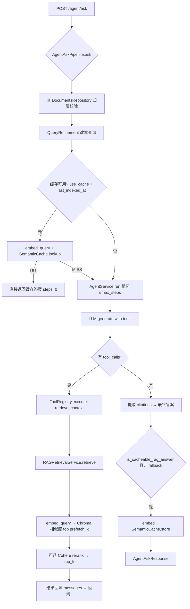
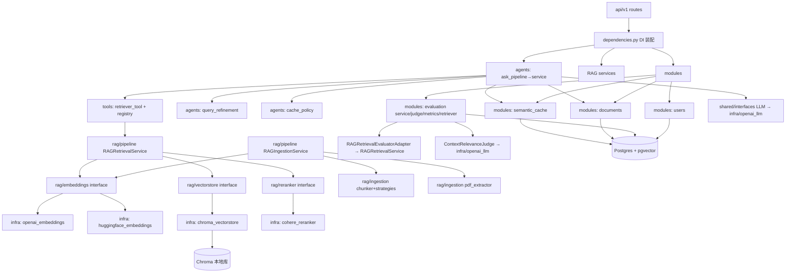
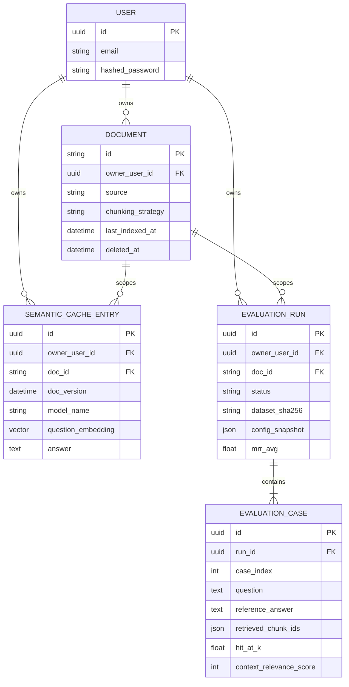

# 项目简介
## 定位

生产导向的 FastAPI RAG 系统 starter——不止"传文本、问问题"，而是完整支持**认证、文档归属、文档级检索隔离、语义缓存、评估管线、内置 UI**。

## 核心特性（来自 README + 代码验证）

- Agent 循环 + 工具调用（`retrieve_context` 检索工具）
- Chroma 向量库（本地持久化）
- OpenAI / HuggingFace 双 Embedding Provider（可插拔）
- 可选 Cohere Reranker（重排）
- 检索前 Query Refinement（查询改写）
- Postgres + pgvector 语义缓存
- 文本 + PDF 摄取（pdfplumber，页级元数据，表格识别）
- JWT access + refresh 认证（fastapi-users）
- 文档归属、列表、软删除
- 评估管线：检索指标（ Hit@k / Recall@k /MRR）+ LLM judge 答案指标（Accuracy/Completeness/Relevance/Groundedness），支持运行历史、失败用例重跑、数据集复用
- Jinja UI（登录、提问、评估、对比）
## 规模与技术栈

**规模**：87 个 Python 文件，~6900 行。

| 层 | 技术 |
|---|---|
| API | FastAPI |
| ORM / DB | SQLAlchemy, Alembic, PostgreSQL, pgvector |
| 向量库 | Chroma |
| LLM | OpenAI-compatible chat 后端 |
| Embeddings | OpenAI 或 Hugging Face |
| Reranking | Cohere |
| 认证 | FastAPI Users + 自定义 JWT login/refresh 流程 |
| PDF 提取 | pdfplumber, pandas, rapidfuzz |
| UI | Jinja 模板 + 共享浏览器端 auth client |
| 开发/运行 | Docker, Docker Compose, uv |

## Demo 页面

- `/login-ui` — JWT 浏览器登录
- `/ask-ui` — 单轮提问 UI（引用、缓存状态、改写查询）
- `/evaluation-ui` — 创建评估运行
- `/evaluation-history-ui` — 历史运行对比
- `/evaluations/{run_id}/ui` — 用例检查与失败重跑

## 为什么存在（设计动机）

大多数 RAG demo 止步于"上传文本、问问题"。本项目进一步支持：

- 认证用户与归属文档
- 文档级检索隔离，防止跨文档泄漏
- 文本与 PDF 摄取
- 可插拔 embeddings 与 reranking
- 语义答案缓存
- 带运行历史、用例检查、重跑支持的评估管线
- 开箱即用的提问与评估 UI

# 快速开始
## 前置要求

- Python `3.12+`
- `uv`
- Docker 与 Docker Compose
- 所需 provider 的 API 凭据（OpenAI / HuggingFace / Cohere）

## 环境配置

```bash
cp .env.example .env
```

至少检查：

- 数据库设置
- JWT secrets
- 模型与 provider 设置
- reranker 设置（如启用）
- 评估 judge model

## 方式 A：Docker 运行（全栈最快）

```bash
docker compose up --build
```

服务地址：

- API: `http://localhost:8000`
- Swagger UI: `http://localhost:8000/docs`
- pgAdmin: `http://localhost:5050`

应用容器启动时自动运行 Alembic 迁移，本地开发以 reload 模式运行 FastAPI。

## 方式 B：本地运行

```bash
uv sync --dev            # 安装依赖
uv run alembic upgrade head   # 跑迁移
uv run uvicorn main:app --reload   # 启动
```

## 典型工作流

### 1. 注册并登录

- 通过 Swagger 或认证流注册
- 从 `/login-ui` 登录，或 `POST /auth/jwt/login`

### 2. 摄取文档

文本：

```bash
curl -X POST http://localhost:8000/rag/ingest/text \
  -H "Authorization: Bearer <token>" \
  -H "Content-Type: application/json" \
  -d '{"text":"...","source":"inline-text"}'
```

PDF：`POST /rag/ingest/pdf`，multipart 上传，携带同一 bearer token。

### 3. 向 agent 提问

```bash
curl -X POST "http://localhost:8000/agent/ask?use_cache=true" \
  -H "Authorization: Bearer <token>" \
  -H "Content-Type: application/json" \
  -d '{"doc_id":"<doc_id>","question":"What does the policy define as an Account?"}'
```

响应包含：

- 最终答案
- `cache_status`
- `refined_query`
- `tools_used`
- `steps`
- 带 `doc_id`、`chunk_id`、可选 `page_number` 的引用

### 4. 运行评估

- 打开 `/evaluation-ui`
- 上传 JSONL 数据集
- 选择 `doc_id`
- 启动运行并监控进度
- 在运行详情页直接重跑失败用例
- 在 `/evaluation-history-ui` 对比历史运行

## API 概览（核心端点）

| 方法     | 路径                                   | 说明              |
| ------ | ------------------------------------ | --------------- |
| POST   | `/auth/jwt/login`                    | 登录              |
| POST   | `/auth/jwt/refresh`                  | 刷新 access token |
| POST   | `/auth/jwt/logout`                   | 登出              |
| GET    | `/users/me`                          | 当前用户            |
| POST   | `/rag/ingest/text`                   | 文本摄取            |
| POST   | `/rag/ingest/pdf`                    | PDF 摄取          |
| POST   | `/agent/ask`                         | agent 提问        |
| GET    | `/documents`                         | 文档列表            |
| GET    | `/documents/{doc_id}`                | 文档详情            |
| DELETE | `/documents/{doc_id}`                | 删除文档（软删除）       |
| POST   | `/evaluations/rag`                   | 创建评估运行          |
| GET    | `/evaluations`                       | 运行列表            |
| GET    | `/evaluations/{run_id}`              | 运行详情            |
| GET    | `/evaluations/{run_id}/cases`        | 用例列表            |
| POST   | `/evaluations/{run_id}/rerun-failed` | 重跑失败用例          |
| GET    | `/llm/health`                        | LLM 健康检查        |
| GET    | `/tools/health`                      | 工具健康检查          |

## 评估体系

检索指标：

- Hit@k
- Recall@k
- MRR

答案指标：

- Accuracy
- Completeness
- Relevance
- Groundedness

每次运行存储：聚合指标、逐用例结果、生成答案、引用、检索排名、配置快照（可复现）。

# 目录结构（物理结构）

```
agentic-rag/
├── main.py                  # FastAPI 入口: lifespan + 8 个 router 注册 + /static
├── pyproject.toml / uv.lock / pytest.ini
├── alembic/                 # 9 个迁移 (users, documents, cache, eval 表, 配置快照)
├── docker-compose.yml / Dockerfile
├── templates/               # Jinja UI: login/ask/documents/evaluation×5
├── static/                  # 浏览器端 JS/CSS
├── tests/                   # unit/ + integration/
├── output/                  # 样例评估输出 (jsonl + pdf)
└── src/
    ├── api/v1/              # 表现层: routes/(8 个) + schemas/ + dependencies.py(DI 装配)
    ├── agents/              # ask_pipeline(编排) / service(agent 循环) / query_refinement / cache_policy
    ├── rag/
    │   ├── pipeline/        # services.py: RAGIngestionService + RAGRetrievalService
    │   ├── ingestion/       # chunker + chunking/{fixed_window,recursive_semantic} + pdf_extractor
    │   ├── embeddings/      # EmbeddingProvider 接口
    │   ├── reranker/        # Reranker 接口
    │   ├── vectorstore/     # VectorStore 接口
    │   └── models.py        # RetrievedChunk / RAGChunk
    ├── modules/             # 业务领域模块 (users/documents/semantic_cache/evaluation)
    ├── infrastructure/      # 适配器: database/ llm/{openai,hf} reranker/cohere vector_db/chroma
    ├── tools/               # retriever_tool + registry + ping_tool
    ├── settings/            # pydantic-settings: app/auth/ai/rag/database/evaluation/agent
    └── shared/              # tracing(全链路 trace) + interfaces/{llm,tool}
```

## 分层规则

`api → agents/rag → modules/infrastructure → 外部服务`

- `rag/` 内是**接口层**（embeddings/reranker/vectorstore 目录只有协议），实现全部在 `infrastructure/` ——刻意设计的依赖倒置。
- `api/v1/dependencies.py` 是唯一的 DI 装配点，用 `@lru_cache` 单例装配 provider 与 service。
- `alembic/versions/` 9 个迁移：users → documents → semantic_cache → evaluation 表 → config snapshot → keyword 字段 → 移除旧评估表 → chunking 配置。

## 完整源文件清单（87 个 Python 文件）

```
src/__init__.py
src/agents/__init__.py
src/agents/ask_pipeline.py
src/agents/cache_policy.py
src/agents/query_refinement.py
src/agents/service.py
src/api/v1/dependencies.py
src/api/v1/routes/__init__.py
src/api/v1/routes/agent.py
src/api/v1/routes/auth.py
src/api/v1/routes/documents.py
src/api/v1/routes/evaluations.py
src/api/v1/routes/health.py
src/api/v1/routes/rag.py
src/api/v1/routes/ui.py
src/api/v1/routes/users.py
src/api/v1/schemas/__init__.py
src/api/v1/schemas/agent.py
src/api/v1/schemas/documents.py
src/api/v1/schemas/evaluation.py
src/api/v1/schemas/health.py
src/api/v1/schemas/rag.py
src/infrastructure/database/__init__.py
src/infrastructure/database/database.py
src/infrastructure/llm/__init__.py
src/infrastructure/llm/huggingface_embeddings.py
src/infrastructure/llm/openai_embeddings.py
src/infrastructure/llm/openai_llm.py
src/infrastructure/reranker/__init__.py
src/infrastructure/reranker/cohere_reranker.py
src/infrastructure/vector_db/__init__.py
src/infrastructure/vector_db/chroma_vectorstore.py
src/modules/__init__.py
src/modules/documents/__init__.py
src/modules/documents/dependencies.py
src/modules/documents/models.py
src/modules/documents/repository.py
src/modules/evaluation/__init__.py
src/modules/evaluation/dataset.py
src/modules/evaluation/judge.py
src/modules/evaluation/matching.py
src/modules/evaluation/metrics.py
src/modules/evaluation/models.py
src/modules/evaluation/repository.py
src/modules/evaluation/retriever.py
src/modules/evaluation/service.py
src/modules/semantic_cache/__init__.py
src/modules/semantic_cache/models.py
src/modules/semantic_cache/repository.py
src/modules/semantic_cache/service.py
src/modules/users/__init__.py
src/modules/users/dependencies.py
src/modules/users/jwt.py
src/modules/users/models.py
src/modules/users/schemas.py
src/modules/users/security/__init__.py
src/modules/users/security/jwt.py
src/rag/embeddings/__init__.py
src/rag/embeddings/interface.py
src/rag/ingestion/__init__.py
src/rag/ingestion/chunker.py
src/rag/ingestion/chunking/__init__.py
src/rag/ingestion/chunking/base.py
src/rag/ingestion/chunking/fixed_window.py
src/rag/ingestion/chunking/recursive_semantic.py
src/rag/ingestion/chunking/registry.py
src/rag/ingestion/pdf_extractor.py
src/rag/models.py
src/rag/pipeline/__init__.py
src/rag/pipeline/services.py
src/rag/reranker/__init__.py
src/rag/reranker/interface.py
src/rag/vectorstore/__init__.py
src/rag/vectorstore/interface.py
src/settings/__init__.py
src/settings/agent.py
src/settings/ai.py
src/settings/app.py
src/settings/auth.py
src/settings/config.py
src/settings/database.py
src/settings/evaluation.py
src/settings/rag.py
src/shared/interfaces/llm.py
src/shared/interfaces/tool.py
src/shared/tracing.py
src/tools/__init__.py
src/tools/ping_tool.py
src/tools/registry.py
src/tools/retriever_tool.py
```

## 功能结构（逻辑结构）

按能力域划分，6 个功能块：

| 功能域 | 入口 | 核心服务 | 说明 |
|---|---|---|---|
| **认证** | `/auth/jwt/*`, `/users/*` | `modules/users/` (fastapi-users + 自定义 JWT/cookie) | access+refresh，Bearer + Cookie 双后端 |
| **摄取** | `POST /rag/ingest/{text,pdf}` | `RAGIngestionService` + chunker + PDFExtractor | 分块→embed→写入 Chroma，记录 `last_indexed_at` |
| **提问** | `POST /agent/ask` | `AgentAskPipeline` → `AgentService` → `RetrieverTool` → `RAGRetrievalService` | 改写→缓存查→agent 循环→缓存存 |
| **文档管理** | `/documents*` | `modules/documents/` (repository) | 归属校验、列表、软删除、chunk 查看 |
| **语义缓存** | 内嵌于 ask 流程 | `modules/semantic_cache/` | pgvector 相似度查/存，绑定 `doc_version`+`model_name` |
| **评估** | `/evaluations*`, `/evaluation-datasets*` | `modules/evaluation/` (service+judge+metrics+retriever) | JSONL 数据集→跑检索/问答→指标+judge→持久化→rerun |

## 各功能域明细

### 认证
- `src/modules/users/dependencies.py`：fastapi-users 装配，Bearer + Cookie 双 transport，JWTStrategy
- `src/modules/users/security/jwt.py`：自定义 JWT 签发/校验
- `src/api/v1/routes/auth.py`：login/refresh/logout，access + refresh 双 token，cookie 写入
- `src/api/v1/routes/users.py`：fastapi-users 标准 users router（UserRead/UserUpdate）

### 摄取（RAGIngestionService）
- 文本摄取：chunk → embed_documents → vector_store.upsert_chunks
- PDF 摄取：pdfplumber 提取页级分段（text/table）→ 逐段 chunk（页号元数据）→ embed → upsert
- 分块策略（`rag/ingestion/chunking/`）：`fixed_window`（固定窗口）与 `recursive_semantic`（语义递归），通过 `ChunkingStrategyRegistry` 按名解析
- 表格识别：PDF 页面内表格转 Markdown 文本段，正文词按 bbox 去重（rapidfuzz 相似度）

### 提问（AgentAskPipeline）

- 文档归属校验（不存在则抛 `DocumentNotFoundError`）
- Query Refinement（LLM 改写查询，可配置开关）
- 语义缓存查（embed 归一化问题 → pgvector 相似度），命中直接返回
- Agent 循环（≤max_steps）：LLM generate → 工具调用 → RetrieverTool 检索 → 回填 → 最终答案 + 引用提取
- 可缓存答案写回缓存（RAG-backed 且非 no-answer fallback）

### 文档管理（modules/documents）

- `Document` 模型：id（业务主键）、owner_user_id、source、chunking 配置、last_indexed_at、deleted_at
- `DocumentsRepository`：归属过滤查询（`get_owned_document`）、列表、软删除
- chunk 查看：从 Chroma 拉取文档下全部 chunk（documents 路由的 `_filter_chunks` 去重字段）

### 语义缓存（modules/semantic_cache）

- 命中键 = owner_user_id + doc_id + doc_version（last_indexed_at）+ model_name + 查询向量相似度
- `normalize_question`：规范化问题文本
- 缓存失败永不阻塞生成（try/except 吞掉并记录 trace）

### 评估（modules/evaluation）
- 数据集：JSONL 上传 → sha256 落盘去重 → `parse_retrieval_dataset_jsonl_bytes` 解析
- 检索评估：`RAGRetrievalEvaluatorAdapter` 复用生产 `RAGRetrievalService`
- 指标：hit@k / recall@k / precision@k / MRR / keyword_coverage，`metrics.py` 聚合与分组汇总
- LLM judge：`ContextRelevanceJudge` 对检索上下文相关性打分（0-3 + 解释）
- 运行管理：`POST /evaluations/retrieval`（202 异步）→ 逐 case 处理 → 聚合 → `rerun-failed` 重置失败用例
- 数据集管理：list / preview / download / delete

## UI 层（templates/）

Jinja 页面直接消费 API，无独立后端逻辑：

| 页面                | 路由                          | 模板                      |
| ----------------- | --------------------------- | ----------------------- |
| 登录                | `/login-ui`                 | login_ui.html           |
| 提问                | `/ask-ui`                   | ask_ui.html             |
| 文档列表              | `/documents-ui`             | documents_ui.html       |
| 文档 chunks         | `/documents/{id}/chunks-ui` | document_chunks_ui.html |
| 评估列表/创建/详情/对比/数据集 | `/evaluations*`             | evaluation_*.html ×5    |

# 功能结构（逻辑结构）

按能力域划分，6 个功能块：

| 功能域 | 入口 | 核心服务 | 说明 |
|---|---|---|---|
| **认证** | `/auth/jwt/*`, `/users/*` | `modules/users/` (fastapi-users + 自定义 JWT/cookie) | access+refresh，Bearer + Cookie 双后端 |
| **摄取** | `POST /rag/ingest/{text,pdf}` | `RAGIngestionService` + chunker + PDFExtractor | 分块→embed→写入 Chroma，记录 `last_indexed_at` |
| **提问** | `POST /agent/ask` | `AgentAskPipeline` → `AgentService` → `RetrieverTool` → `RAGRetrievalService` | 改写→缓存查→agent 循环→缓存存 |
| **文档管理** | `/documents*` | `modules/documents/` (repository) | 归属校验、列表、软删除、chunk 查看 |
| **语义缓存** | 内嵌于 ask 流程 | `modules/semantic_cache/` | pgvector 相似度查/存，绑定 `doc_version`+`model_name` |
| **评估** | `/evaluations*`, `/evaluation-datasets*` | `modules/evaluation/` (service+judge+metrics+retriever) | JSONL 数据集→跑检索/问答→指标+judge→持久化→rerun |

## 各功能域明细

### 认证
- `src/modules/users/dependencies.py`：fastapi-users 装配，Bearer + Cookie 双 transport，JWTStrategy
- `src/modules/users/security/jwt.py`：自定义 JWT 签发/校验
- `src/api/v1/routes/auth.py`：login/refresh/logout，access + refresh 双 token，cookie 写入
- `src/api/v1/routes/users.py`：fastapi-users 标准 users router（UserRead/UserUpdate）

### 摄取（RAGIngestionService）
- 文本摄取：chunk → embed_documents → vector_store.upsert_chunks
- PDF 摄取：pdfplumber 提取页级分段（text/table）→ 逐段 chunk（页号元数据）→ embed → upsert
- 分块策略（`rag/ingestion/chunking/`）：`fixed_window`（固定窗口）与 `recursive_semantic`（语义递归），通过 `ChunkingStrategyRegistry` 按名解析
- 表格识别：PDF 页面内表格转 Markdown 文本段，正文词按 bbox 去重（rapidfuzz 相似度）

### 提问（AgentAskPipeline）

- 文档归属校验（不存在则抛 `DocumentNotFoundError`）
- Query Refinement（LLM 改写查询，可配置开关）
- 语义缓存查（embed 归一化问题 → pgvector 相似度），命中直接返回
- Agent 循环（≤max_steps）：LLM generate → 工具调用 → RetrieverTool 检索 → 回填 → 最终答案 + 引用提取
- 可缓存答案写回缓存（RAG-backed 且非 no-answer fallback）

### 文档管理（modules/documents）

- `Document` 模型：id（业务主键）、owner_user_id、source、chunking 配置、last_indexed_at、deleted_at
- `DocumentsRepository`：归属过滤查询（`get_owned_document`）、列表、软删除
- chunk 查看：从 Chroma 拉取文档下全部 chunk（documents 路由的 `_filter_chunks` 去重字段）

### 语义缓存（modules/semantic_cache）

- 命中键 = owner_user_id + doc_id + doc_version（last_indexed_at）+ model_name + 查询向量相似度
- `normalize_question`：规范化问题文本
- 缓存失败永不阻塞生成（try/except 吞掉并记录 trace）

### 评估（modules/evaluation）
- 数据集：JSONL 上传 → sha256 落盘去重 → `parse_retrieval_dataset_jsonl_bytes` 解析
- 检索评估：`RAGRetrievalEvaluatorAdapter` 复用生产 `RAGRetrievalService`
- 指标：hit@k / recall@k / precision@k / MRR / keyword_coverage，`metrics.py` 聚合与分组汇总
- LLM judge：`ContextRelevanceJudge` 对检索上下文相关性打分（0-3 + 解释）
- 运行管理：`POST /evaluations/retrieval`（202 异步）→ 逐 case 处理 → 聚合 → `rerun-failed` 重置失败用例
- 数据集管理：list / preview / download / delete

## UI 层（templates/）

Jinja 页面直接消费 API，无独立后端逻辑：

| 页面 | 路由 | 模板 |
|---|---|---|
| 登录 | `/login-ui` | login_ui.html |
| 提问 | `/ask-ui` | ask_ui.html |
| 文档列表 | `/documents-ui` | documents_ui.html |
| 文档 chunks | `/documents/{id}/chunks-ui` | document_chunks_ui.html |
| 评估列表/创建/详情/对比/数据集 | `/evaluations*` | evaluation_*.html ×5 |

# 数据流结构

入口：`main.py` 注册 8 个 router（agent/rag/auth/users/documents/evaluations/health/ui），全部业务入口经 `api/v1/dependencies.py` 的 DI 装配。

## 1. 提问流（主链路）



**输入**：`AgentAskRequest {question, doc_id, session_id?}` + query 参数 `use_cache`

**输出**：`AgentAskResponse {status, cache_status(hit/miss), refined_query, answer, steps, tools_used, citations[{source, doc_id, chunk_id, snippet, page_number}]}`

**关键约束**：

- `doc_id` 是**硬性检索隔离**——RetrieverTool 强制从 `ToolContext.doc_id` 取文档范围；文档不存在抛 `DocumentNotFoundError`
- 缓存失败永不阻塞生成（异常吞掉，trace 记录 `ask.cache.lookup.failed`）
- no-answer fallback 不写缓存（`is_no_answer_fallback` 检查）
- 可缓存条件：`is_cacheable_rag_answer`（RAG-backed 且有引用）
- 全链路 tracing：`TraceContext(request_id, doc_id, owner_user_id, session_id)` 贯穿 ask→agent→retrieval 每跳

### AgentService 循环细节

- system prompt：严格 RAG 助手，只答检索内容，禁止推理/猜测/外部知识
- 每轮：LLM generate（带工具 schema）→ 有 tool_calls 则执行工具（注册表 `retrieve_context` + `ping`）→ 结果回填 → 直至无 tool_calls 或达 max_steps
- 引用提取：从最新一次 `retrieve_context` 输出的 `results[]` 中取 doc_id/chunk_id/text/page_number
- 无引用 → `NO_ANSWER_FALLBACK`；超步数 → `status: max_steps_reached`

## 2. 摄取流

```text
文本: POST /rag/ingest/text {text, source?}
PDF:  POST /rag/ingest/pdf (multipart bytes)
  → ChunkingStrategy.resolve(strategy_name)   # fixed_window | recursive_semantic
  → chunk(text, doc_id, chunk_size, chunk_overlap, page_number?)
  → embed_documents(chunks)
  → VectorStore.upsert_chunks
  → 返回 IngestionResult / PDFIngestionResult
```

PDF 特殊处理：

- pdfplumber 逐页提取，识别表格（bbox 重叠去重，rapidfuzz 相似度去重相邻重复段）
- 段级 chunk，携带 `page_number` → 引用可带页码
- chunk_id 重编号为 `chunk-{global_index}`
- `pages_ingested == 0` 或 `chunks == 0` 抛 ValueError

## 3. 检索流（RetrieverTool → RAGRetrievalService）

```text
retrieve(query, top_k, doc_id)
  → embed_query(query)
  → vector_store.similarity_search(query_embedding, top_k=prefetch_k, doc_id=doc_id)
  → 无候选 → []
  → 无 reranker → 截取 top_k
  → 有 reranker → rerank(candidates) → top_k（失败重试 1 次，仍失败抛 RERANK_EXHAUSTED_ERROR）
```

## 4. 评估流

```text
POST /evaluations/retrieval (202 异步)
  → 解析 JSONL 数据集（sha256 落盘去重）
  → EvaluationRetriever（RAGRetrievalEvaluatorAdapter 复用生产检索服务）
  → 逐 case: 检索 → matching(关键词/短语) → metrics(hit@k/recall/mrr/keyword_coverage)
  → 可选 ContextRelevanceJudge（LLM 打分 0-3 + 解释）
  → 聚合指标 + grouped_summary → EvaluationRepository 持久化
  → config_snapshot 记录配置保证可复现

POST /evaluations/{run_id}/rerun-failed
  → 重置失败用例为 queued → 重跑 → 更新聚合
```

评估输入（JSONL 数据集）：`{question, reference_answer, must_include_keywords?, must_include_phrases?, difficulty?, category?}`

评估输出：Run 聚合指标 + 每 case 的检索排名/命中/关键词覆盖率 + judge 评分与解释。

## 5. CRUD 导出（全部数据操作）

| 实体 | Create | Read | Update | Delete |
|---|---|---|---|---|
| **User** | 注册 `POST /auth/register` (fastapi-users) | `GET /users/me` | `PATCH /users/me` | — |
| **Document** | `POST /rag/ingest/{text,pdf}` (隐式建 doc) | `GET /documents`, `GET /documents/{id}`, `GET /documents/{id}/chunks` | — | `DELETE /documents/{id}`（软删除） |
| **SemanticCacheEntry** | `SemanticCache.store`（ask 命中后写） | `SemanticCache.lookup`（ask 前置查） | — | —（随 doc 级联删） |
| **EvaluationRun** | `POST /evaluations/retrieval` (202 异步) | `GET /evaluations`, `GET /evaluations/{id}`, `GET .../cases` | 运行中更新 processed/metrics；`POST .../rerun-failed` 重置失败用例 | `DELETE /evaluations/{id}` |
| **EvaluationDataset** | 随 run 上传 JSONL 隐式落盘 | `GET /evaluation-datasets`, `.../{sha256}` (preview/download) | — | `DELETE /evaluation-datasets/{sha256}` |
| **向量 chunk** | `upsert_chunks`（摄取时） | `similarity_search`（检索时） | — | —（软删后由 doc 隔离屏蔽，非物理删除） |

## 6. 端到端时序（典型场景）

```text
用户 → POST /agent/ask {question, doc_id}
  → 鉴权（Bearer/cookie JWT）
  → AgentAskPipeline:
      doc 归属校验 → 查询改写 → 缓存查(命中即返) → AgentService
  → AgentService 循环:
      LLM.generate(question, [retrieve_context, ping])
      → LLM 返回 tool_call: retrieve_context(query)
      → RetrieverTool.run → RAGRetrievalService.retrieve(doc_id 隔离)
      → Chroma 相似度 top prefetch_k → Cohere rerank → top_k chunks
      → 工具结果回填 messages
      → LLM 最终答案（每条事实带 [chunk_id] 引用）
  → 引用提取 → 缓存写回（可缓存时）→ AgentAskResponse
```

# 业务模块（业务切面）

## 依赖图



## 依赖方向

`api/v1`（装配层，唯一认识所有模块）→ `agents`（编排）→ `rag`（RAG 领域，只依赖自己目录内的接口）→ `modules/*`（领域实体，只依赖 infra 与 shared）→ `infrastructure`（适配器）→ `shared`（LLM/Tool 接口 + tracing）

## 模块清单（按业务切面）

### 1. api/v 1 — 表现层/装配层
- `routes/`：agent, rag, auth, users, documents, evaluations, health, ui（8 个 router）
- `schemas/`：agent, rag, documents, evaluation, health（Pydantic 请求/响应模型）
- `dependencies.py`：唯一 DI 装配点，`@lru_cache` 单例，组装全部 service/tool/provider

### 2. agents — 编排层
| 模块 | 职责 |
|---|---|
| `ask_pipeline.py` | 编排：归属校验 → 改写 → 缓存查 → agent 循环 → 缓存写 |
| `service.py` | AgentService 循环：LLM + 工具调用 + 引用提取 |
| `query_refinement.py` | 查询改写服务 |
| `cache_policy.py` | 缓存策略判定（is_cacheable_rag_answer / is_no_answer_fallback） |

### 3. rag — RAG 领域层（接口/实现分离）
| 模块 | 职责 |
|---|---|
| `pipeline/services.py` | RAGIngestionService + RAGRetrievalService（两个核心服务） |
| `ingestion/` | chunker 入口 + chunking/{base, fixed_window, recursive_semantic, registry} + pdf_extractor |
| `embeddings/` | EmbeddingProvider 接口 |
| `reranker/` | Reranker 接口 |
| `vectorstore/` | VectorStore 接口 |
| `models.py` | RetrievedChunk / RAGChunk |

### 4. modules — 业务领域实体
| 模块 | 职责 | 持久化 |
|---|---|---|
| `users/` | 用户模型 + fastapi-users 装配 + JWT | Postgres |
| `documents/` | 文档模型 + 归属 repository | Postgres |
| `semantic_cache/` | 语义缓存模型/repository/service | Postgres + pgvector |
| `evaluation/` | 评估全链路：dataset, judge, matching, metrics, models, repository, retriever, service | Postgres |

### 5. infrastructure — 适配器
| 模块                                | 实现                                     |
| --------------------------------- | -------------------------------------- |
| `database/`                       | SQLAlchemy async engine/session + Base |
| `llm/openai_llm.py`               | OpenAI-compatible chat LLM             |
| `llm/openai_embeddings.py`        | OpenAI embeddings                      |
| `llm/huggingface_embeddings.py`   | HuggingFace embeddings                 |
| `reranker/cohere_reranker.py`     | Cohere reranker                        |
| `vector_db/chroma_vectorstore.py` | Chroma vector store                    |

### 6. tools — 工具层
- `retriever_tool.py`：`retrieve_context` 工具（RAG 检索封装，doc_id 隔离）
- `ping_tool.py`：健康检查工具
- `registry.py`：ToolRegistry（注册/查询/OpenAI schema 导出/执行）

### 7. settings — 配置
`app` (DB/JWT) / `auth` / `ai` (LLM+embedding) / `rag` (chunk_size, overlap, top_k, prefetch_k, reranker) / `database` / `evaluation` (judge model, k) / `agent` (max_steps, temperature, timeout, system_prompt)—— `config.py` 聚合为单一 `settings` 单例。

### 8. shared — 共享
- `interfaces/llm.py`：LLM 抽象（ChatMessage / ToolCall / GenerationConfig）
- `interfaces/tool.py`：Tool 抽象（ToolContext / ToolExecutionResult）
- `tracing.py`：全链路 trace（TraceContext / trace_event）

## 关键架构决策

1. **接口/实现分离**：`rag/embeddings|reranker|vectorstore` 是纯 Protocol/ABC，实现全在 `infrastructure/`，由 DI 装配——切换 provider 只改装配点。
2. **评估复用生产检索**：`RAGRetrievalEvaluatorAdapter` 包装 `RAGRetrievalService`，评估不另起炉灶。
3. **全链路 tracing**：`shared/tracing.py` 的 `TraceContext` 贯穿 ask→agent→retrieval 每一跳（最近提交 `feat: add request tracing across agent and retrieval flow`）。
4. **DI 单例**：`api/v1/dependencies.py` 用 `@lru_cache` 缓存 provider/service 实例。
5. **缓存与版本绑定**：语义缓存键含 `doc_version`（doc.last_indexed_at），文档重新摄取后旧缓存自动失效。

# 数据模型与数据结构

# Agentic RAG — 数据模型与数据结构

## 1. SQLAlchemy 持久化模型（Postgres）

### user（fastapi_users SQLAlchemyBaseUserTableUUID）

```
user
  ├─ id UUID PK
  ├─ email, hashed_password
  ├─ is_active, is_superuser, is_verified
  ├─ 1:N documents.owner_user_id (CASCADE)
  ├─ 1:N semantic_cache_entries.owner_user_id (CASCADE)
  └─ 1:N evaluation_runs.owner_user_id (CASCADE)
```

### documents

```
documents
  ├─ id String(255) PK        # 业务主键，摄取时可指定
  ├─ owner_user_id FK → user.id (CASCADE, index)
  ├─ source String(512)?      # 来源标识（inline-text / uploaded-pdf / 自定义）
  ├─ chunking_strategy String(64)?   # fixed_window | recursive_semantic
  ├─ chunk_size Int? / chunk_overlap Int?
  ├─ created_at / updated_at (server_default now)
  ├─ last_indexed_at DateTime?       # 缓存失效的版本锚点 (doc_version)
  └─ deleted_at DateTime?            # 软删除
```

### semantic_cache_entries

```
semantic_cache_entries
  ├─ id UUID PK (uuid4)
  ├─ owner_user_id FK → user.id (CASCADE, index)
  ├─ doc_id String(255) FK → documents.id (CASCADE, index)
  ├─ doc_version DateTime         # 文档版本（last_indexed_at）
  ├─ model_name String(255)       # 生成答案的模型
  ├─ question_normalized Text     # 归一化问题
  ├─ question_embedding Vector    # pgvector；sqlite 变体 JSON
  ├─ answer Text
  ├─ citations JSONB (default [])
  ├─ created_at
  └─ 复合索引 (owner_user_id, doc_id, doc_version, model_name)
     # 命中键 = 用户+文档+版本+模型
```

### evaluation_runs

```
evaluation_runs
  ├─ id UUID PK (uuid4)
  ├─ owner_user_id FK → user.id (CASCADE, index)
  ├─ doc_id String(255) FK → documents.id (CASCADE, index)
  ├─ status String(32) (index)          # queued/running/completed/failed
  ├─ evaluation_type String(32) (default "retrieval")
  ├─ dataset_name String(512) / dataset_path String(1024) / dataset_sha256 String(64)
  ├─ total_cases Int / processed_cases Int (default 0)
  ├─ k Int                               # top-k
  ├─ config_snapshot JSONB               # 可复现性配置
  ├─ hit_at_k_avg / recall_at_k_avg / precision_at_k_avg / mrr_avg Float?
  ├─ keyword_coverage_avg Float? / context_relevance_score_avg Float?
  ├─ grouped_summary JSONB               # 按 difficulty/category 分组指标
  ├─ error_message Text?
  ├─ created_at / started_at? / finished_at?
  └─ 1:N evaluation_cases (cascade delete-orphan, order by case_index)
```

### evaluation_cases

```
evaluation_cases
  ├─ id UUID PK (uuid4)
  ├─ run_id UUID FK → evaluation_runs.id (CASCADE, index)
  ├─ case_index Int
  ├─ status String(32) (default "queued", index)   # queued/running/passed/failed
  ├─ 输入:
  │   ├─ question Text
  │   ├─ reference_answer Text
  │   ├─ must_include_keywords JSONB (default [])
  │   ├─ must_include_phrases JSONB (default [])
  │   ├─ difficulty String(64)? / category String(64)?
  ├─ 检索证据:
  │   ├─ retrieved_chunk_ids JSONB (default [])
  │   ├─ retrieved_chunk_texts JSONB (default [])
  │   ├─ matched_phrases JSONB / matched_keywords JSONB
  │   ├─ first_correct_rank Int? / useful_chunk_count Int?
  ├─ 指标:
  │   ├─ hit_at_k / recall_at_k / precision_at_k / mrr Float?
  │   ├─ keyword_coverage Float?
  │   ├─ context_relevance_score Int? / context_relevance_explanation Text?
  ├─ error_message Text?
  └─ created_at
```

## 2. 关系图



## 3. 运行时数据结构（非持久）

| 结构 | 位置 | 作用 |
|---|---|---|
| `RetrievedChunk` / `RAGChunk` | `rag/models.py` | 检索结果：doc_id, chunk_id, source, text, score, page_number |
| `AgentAskPipelineResult` | `agents/ask_pipeline.py` | 管道输出（dataclass, slots）：status, cache_status, refined_query, answer, steps, tools_used, citations |
| `AgentResult` / `AgentCitation` | `agents/service.py` | agent 循环产物 + 引用（page_number 可空） |
| `ChatMessage / ToolCall / GenerationConfig` | `shared/interfaces/llm.py` | LLM 抽象的消息/工具调用协议（SYSTEM/USER/ASSISTANT/TOOL 角色） |
| `ToolContext` | `shared/interfaces/tool.py` | 工具上下文：session_id, user_id, doc_id, request_id |
| `ToolExecutionResult` | 同上 | 工具输出 {success, output, error} |
| `IngestionResult` / `PDFIngestionResult` | `rag/pipeline/services.py` | 摄取摘要（chunks_ingested, pages, skipped_pages, warnings） |
| `TraceContext` | `shared/tracing.py` | 全链路追踪键：request_id, doc_id, owner_user_id, session_id |
| `PDFSegment / PDFExtractionResult` | `rag/ingestion/pdf_extractor.py` | PDF 段（text/table + 页号 + bbox），提取结果（pages_total/ingested/skipped/warnings） |
| `Chunk`（内部） | `rag/ingestion/chunking/base.py` | 分块结果，chunk_id 由摄取服务重编号 `chunk-{i}` |
| `RetrievalEvaluationRunConfig` | `modules/evaluation/service.py` | 评估配置快照：k, 匹配参数, judge 开关, rag 参数, embedding/reranker/judge 模型 |
| `SemanticCacheHit` | `modules/semantic_cache/service.py` | 缓存命中：answer + citations |
| `ContextRelevanceJudgeResult` | `modules/evaluation/judge.py` | judge 输出：score + explanation |

## 4. 配置模型（settings/，pydantic-settings 分段）

| 段 | 关键字段 |
|---|---|
| `app.py` | database url, jwt secrets, token 时效 |
| `auth.py` | cookie 名/域/secure/samesite, reset/verification secret |
| `ai.py` | LLM model/base_url/key, embedding provider/model |
| `rag.py` | chunk_size, chunk_overlap, 默认策略, top_k, prefetch_k, reranker 开关/模型 |
| `database.py` | 连接池、echo |
| `evaluation.py` | judge model, k 默认值 |
| `agent.py` | max_steps, temperature, max_tokens, timeout_s, system_prompt, query_refinement 开关 |

全部由 `config.py` 聚合为单一 `settings` 单例。

## 5. 关键数据约束/不变量

1. **归属强制**：所有查询（documents/cache/runs）都以 `owner_user_id` 过滤——跨用户访问不可能。
2. **检索隔离**：向量检索带 `doc_id` 过滤——跨文档泄漏被架构阻断。
3. **缓存版本化**：`doc_version = last_indexed_at` ——文档重摄取后旧缓存自动失效。
4. **软删除**：文档 `deleted_at` 置位，检索/查询排除 deleted；向量数据不物理删除，由隔离屏蔽。
5. **级联清理**：user → documents → cache/runs 全链路 CASCADE。
6. **可复现评估**：run 存储 `config_snapshot` + `dataset_sha256`。
