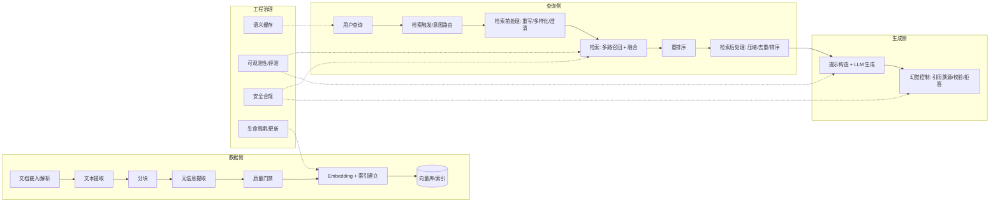

# 分层

1. 文本提取策略
2. 文本分块策略
3. 索引建立策略
4. 索引使用策略
5. 知识库元信息
6. 知识库更新
7. 检索触发策略
8. 检索前处理：查询重写、多样化、澄清
9. 检索策略
10. 检索后处理：上下文压缩、去重、排序
11. 生成与幻觉控制
12. RAG 评测策略
13. 工程加速：
	1. 语义缓存
	2. 可观测性
	3. 安全合规
	4. 生命周期

# 工业 RAG 全链路工程教程

> 基于联网调研整理的中文工业 RAG 教程，覆盖从数据接入、检索、生成到工程治理的 13 个核心环节。每个环节包含：核心目标、关键技术/方法、工业实践要点与常见坑、参考来源。
>
> 适用读者：正在构建或优化生产级 RAG 系统的工程师。建议按附录 B 的学习顺序阅读。

## 目录

- [0. 引言：工业 RAG 全景](#0-引言工业-rag-全景)
- [1. 文本提取策略](#1-文本提取策略)
- [2. 文本分块策略](#2-文本分块策略)
- [3. 索引建立策略](#3-索引建立策略)
- [4. 索引使用策略](#4-索引使用策略)
- [5. 知识库元信息策略](#5-知识库元信息策略)
- [6. 知识库更新策略](#6-知识库更新策略)
- [7. 检索触发策略](#7-检索触发策略)
- [8. 检索前处理：查询重写、多样化、澄清](#8-检索前处理查询重写多样化澄清)
- [9. 检索策略](#9-检索策略)
- [10. 检索后处理：上下文压缩、去重、排序](#10-检索后处理上下文压缩去重排序)
- [11. 生成与幻觉控制](#11-生成与幻觉控制)
- [12. RAG 评测策略](#12-rag-评测策略)
- [13. 工程加速](#13-工程加速)
  - [13.1 语义缓存](#131-语义缓存)
  - [13.2 可观测性](#132-可观测性)
  - [13.3 安全合规](#133-安全合规)
  - [13.4 生命周期管理](#134-生命周期管理)
- [附录 A：全链路速查表](#附录-a全链路速查表)
- [附录 B：推荐学习顺序](#附录-b推荐学习顺序)

---

## 0. 引言：工业 RAG 全景

朴素 RAG（Naive RAG）只有三条链路：索引（切分 → 嵌入 → 存储）、检索（查询 → 向量召回）、生成（拼接上下文 → LLM 作答）。工业 RAG 在这三条链路内外补全了大量环节：



贯穿所有环节的三个核心原则：

1. **分层归因**：检索质量与生成质量必须分开度量、分开优化——"没检索到"和"检索到了没用上"是两类问题。
2. **评测先行**：golden set 从第一天建，任何环节的参数改动都要用检索/生成指标回归验证，不拍脑袋。
3. **数据即资产**：文档解析的"脏"会在整条流水线中放大；质量门禁要放在摄取流水线内（fail fast），而不是靠在线评估兜底。

---

## 1. 文本提取策略

### 核心目标

把 PDF、Word、扫描件等原始文档无损地转换为"LLM 可读"的干净文本或结构化 Markdown，保留阅读顺序、表格、公式等关键信息，同时剔除页眉页脚、水印等噪声。提取质量直接决定下游分块与检索的上限——解析环节的"脏"会在整条 RAG 流水线中放大。

### 关键技术/方法

- **数字原生 PDF（有文本层）**：
  - PyMuPDF（`fitz`）：速度最快（MuPDF C 引擎），可拿 span 级字体/字号元数据，`pymupdf4llm` 可直接输出 RAG 友好的 Markdown，适合大规模高速流水线；表格为"基本表格"能力。
  - pdfplumber：基于 pdfminer.six，逐字符级 bbox/字号/字重坐标，表格重建精度最高、可直接输出 pandas DataFrame；代价是慢、CPU 密集。
  - 学术基准：arXiv 2410.09871 系统评估了 PyMuPDF、pdfplumber、pypdfium 2、Unstructured、Tabula、Camelot 及深度学习工具 Nougat、TATR 的文本与表格提取能力。
- **扫描件/图片 PDF → OCR**：
  - PaddleOCR（百度，Apache-2.0）：DBNet 检测 + CJK 专用识别器，中文含噪文档字符准确率通常 90%+；PP-Structure 模块自带版面分析、表格结构、阅读顺序，可直接喂 RAG。
  - Tesseract：轻量、CPU-only、零成本，干净英文印刷体基线可靠；中文场景一般只有 70-80%，需大量预处理。
  - 托管多模态 OCR（Mistral OCR、AWS Textract、Google Document AI、Azure Document Intelligence）适合复杂版面，按量付费。
- **表格提取**：pdfplumber（数字 PDF 精度最高）；Camelot 擅长有线表格（`parsing_report.accuracy` 通常 90%+，无线表格跌到 50-70%，可用于置信度过滤）；Tabula 宽表列合并错误较多；深度学习方案 Table Transformer (TATR)、Docling 表格识别（2025 基准表格单元格准确率约 97.9%）。
- **版面分析与阅读顺序**：LayoutLMv 3、DeepDoctection、Layout-Parser、Docling 的 DocLayNet、PaddleOCR PP-Structure；多栏页面必须按"左栏→右栏"重建逻辑阅读顺序。
- **公式识别**：Mathpix（API/CLI，PDF→LaTeX，支持双栏论文、数学与化学公式）；Docling 也内置公式支持。
- **一站式文档解析工具**：
  - Docling（IBM，开源）：版面分析 + 阅读顺序 + 表格 + 公式，输出 DoclingDocument/Markdown，结构保真度最高（层级标题保持最好）。
  - LlamaParse（LlamaIndex 托管）：速度快（约 6 秒/文档），版面保真，输出干净 LLM-ready Markdown，与 LlamaIndex 生态原生集成。
  - Unstructured：OCR 能力强、简单表格近完美，但慢（51-141 秒），且常把多级标题塌缩成单级 Markdown。
  - Microsoft MarkItDown：开源多格式转 Markdown；实验性 `--pdf-tables` 支持 none/plumber/camelot/auto 四种表格模式。
- **后处理清理**：正则剔除页眉页脚/页码/水印（匹配重复出现的日期、期刊名、页码模式）、参考文献区降权或剔除、统一换行符。

### 工业实践要点与常见坑

- 先探测文本层（如 `page.get_text()` 是否为空），为空才走 OCR，避免对数字 PDF 误跑 OCR 引入噪声。
- 双栏论文不做版面分析会按物理坐标输出"左右穿插"的乱序文本，必须恢复阅读顺序。
- 表格不要转成纯文本流（破坏行列关系）：优先转 Markdown/HTML 表格或逐行结构化，并保留表头。
- 页眉页脚/页码会以重复噪声污染每个 chunk，入库前清理或降权。
- 公式对普通 embedding 模型是噪声：先转 LaTeX 或降权。
- OCR 输出做置信度过滤；解析工具 benchmark 精度 ≠ 你的文档精度，每类文档抽 5-10 页人工抽检再上线。
- 可做分层路由：规则解析（快、便宜）为主，失败/复杂版面回退到多模态模型，控制成本。

### 参考来源

- [A Comparative Study of PDF Parsing Tools Across Diverse Document Categories (arXiv 2410.09871)](https://arxiv.org/html/2410.09871v1)
- [Features Comparison - PyMuPDF 文档](https://pymupdf.readthedocs.io/en/latest/about.html)
- [PDFPlumber 官方优势说明](https://www.pdfplumber.com/what-are-the-key-advantages-of-using-pdfplumber-over-other-pdf-extraction-tools)
- [pdfplumber vs PyMuPDF vs PyPDF2 for PDF Extraction](https://subhajitbhar.com/blog/pdf-extraction/pdfplumber-vs-pymupdf-vs-pypdf2)
- [PDF Data Extraction Benchmark 2025: Docling vs Unstructured vs LlamaParse](https://procycons.com/en/blogs/pdf-data-extraction-benchmark)
- [Best AI Document Parsers for 2025 - LlamaIndex](https://www.llamaindex.ai/insights/document-parser-comparison-2025)
- [microsoft/markitdown PR #1422：混合表格提取（plumber/camelot）](https://github.com/microsoft/markitdown/pull/1422)
- [Camelot 与其他工具对比文档](https://camelot-py.readthedocs.io/en/latest/user/comparison.html)
- [PaddleOCR GitHub](https://github.com/PaddlePaddle/PaddleOCR)
- [Best OCR Models in 2026: Accuracy, Speed and Cost - Reducto](https://reducto.ai/guides/best-ocr-models-accuracy-speed-cost)
- [Parse Scanned PDFs for RAG with EasyOCR - Towards Data Science](https://towardsdatascience.com/parse-scanned-pdfs-for-rag-with-easyocr-free-ocr-gives-you-words-not-a-document)
- [Mathpix: PDF to LaTeX](https://mathpix.com/pdf-to-latex)
- [RAG工具箱：基于多模态大模型的文档解析方案（2025版）- 知乎](https://zhuanlan.zhihu.com/p/29761721645)
- [开发者指南：如何为 RAG 系统选择合适的文档解析工具 - 声网](https://www.shengwang.cn/blog/blogdetail/rag-document-parser)
- [文档解析技术 - Deeptoai RAG 系列教程](https://rag.deeptoai.com/docs/rag-project-analysis/03-data-processing-indexing/01-%E6%96%87%E6%A1%A3%E8%A7%A3%E6%9E%90%E6%8A%80%E6%9C%AF)

---

## 2. 文本分块策略

### 核心目标

把清洗后的长文本切成适合向量检索的单元，在"信息完整性"与"检索精度"之间取平衡。分块质量直接决定召回率与生成质量，是 RAG 流水线中投入产出比最高的调优点之一；2026 年多项基准（Prem AI、Firecrawl）仍将其列为影响检索效果的首要工程因素。

### 关键技术/方法

- **固定长度 + overlap**：最简单基线；务必用 token 计数（tiktoken 的 `cl100k_base` 等，与所用 embedding 模型 tokenizer 对齐）而非字符数；用滑动窗口实现 overlap。
- **递归字符分割（RecursiveCharacterTextSplitter）**：LangChain 默认实现，按 `["\n\n", "\n", " ", ""]` 层级分隔符递归切分直到目标大小；最稳妥的默认策略，推荐 chunk size 400-512 tokens + 10-20% overlap。
- **结构感知分块**：MarkdownHeaderTextSplitter 按标题切分并保留完整标题祖先链作 metadata（可 `strip_headers`）；HTML 用 HTMLSectionSplitter；代码用 AST 分割器（PythonCodeTextSplitter 保持函数/类完整）；表格用专用分块器避免切碎行。生产模式是"路由式摄取"：按内容类型分发到不同 splitter。
- **语义分块（embedding 突变点）**：对句子 embedding 计算余弦距离/梯度，相似度低于阈值处断块。LangChain `SemanticChunker`（`breakpoint_threshold_type`: percentile/standard_deviation/interquartile/gradient）、LlamaIndex `SemanticSplitterNodeParser`。注意：纯语义分块常产出约 40 token 的小块，检索召回高但 LLM 端到端准确率反而低，建议设最小块下限 200-300 tokens；计算成本高，arXiv 2410.13070 专门评估其性价比。
- **检索粒度分离（small-to-big / parent-document / 句子窗口）**：小 chunk（句子级）用于 embedding 检索，命中后按 parent_id 链接取大 chunk 送 LLM，解决"embedding 检索偏好小块、LLM 需要上下文"的矛盾。LlamaIndex：`SentenceWindowNodeParser`（默认 window_size=5 句）、递归检索/AutoMergingRetriever；LangChain：`ParentDocumentRetriever`。
- **chunk size 与 embedding max tokens 对齐**：目标 chunk ≤ 模型上限的 80%（预留 tokenizer 差异与 metadata 余量）：512 上限 → 450-480 tokens；1024 上限 → 800-900。按 embedding 维度经验值：维度 <512 → 200-300 tokens；768-1024 → 300-700；1536-2048 → 700-1200。按查询模式：事实型查询 256-512 tokens，分析/对比型 1024+。
- **overlap 推荐值**：10-20% 起步（500 token 块约 50-100 tokens），召回不足可提到 25%（微软 Azure 推荐 512 tokens + 25% overlap=128）；稀疏检索（SPLADE）可 0 overlap。
- **特殊场景**：金融等分页 PDF 用 page-level chunking 常赢（Prem AI 2026 基准）；中文建议 500-1000 tokens（约 3000-6000 中文字符），递归分割需自定义分隔符（中文标点/段落），或用 jieba 分词后按词数切。

### 工业实践要点与常见坑

- 用 token 计数而非字符计数；tiktoken 与 embedding 模型 tokenizer 可能不一致，chunk 预留余量。
- overlap 只缓解不解决边界切碎：关键句仍可能被切断，重场景用句子窗口/父文档方案。
- 语义分块的小 chunk 陷阱：检索命中但上下文不足导致生成质量下降，必须设下限。
- Markdown/表格/代码别用通用分割器切碎：结构感知 + 路由式分发是生产标配。
- chunk size 不是越大越好：过大稀释语义（Arize AI 实测小块更优），过小上下文不足；用检索评估集（命中率、召回@k）而非拍脑袋定参。
- 分块参数与 embedding 模型、查询模式强耦合，更换模型后必须重新评测（arXiv 2506.17277 "Chunk Twice, Embed Once"）。
- 中文不能照搬英文参数：无空格分词、每 token 信息密度不同，字符数与 token 数比例差异大。

### 参考来源

- [RAG Chunking Strategies: The 2026 Benchmark Guide - Prem AI](https://www.premai.io/blog/rag-chunking-strategies-the-2026-benchmark-guide)
- [Best Chunking Strategies for RAG (and LLMs) in 2026 - Firecrawl](https://www.firecrawl.dev/blog/best-chunking-strategies-rag)
- [Chunking Strategies for LLM Applications - Pinecone](https://www.pinecone.io/learn/chunking-strategies)
- [Is Semantic Chunking Worth the Computational Cost? (arXiv 2410.13070)](https://arxiv.org/html/2410.13070v1)
- [Chunk Twice, Embed Once: A Systematic Study of Chunking (arXiv 2506.17277)](https://arxiv.org/html/2506.17277v1)
- [Chunking Techniques with LangChain and LlamaIndex - LanceDB](https://www.lancedb.com/blog/chunking-techniques-with-langchain-and-llamaindex)
- [Advanced RAG 01: Small-to-Big Retrieval - Medium](https://medium.com/data-science/advanced-rag-01-small-to-big-retrieval-172181b396d4)
- [Chunking Strategies for RAG with LangChain - IBM Think](https://www.ibm.com/think/tutorials/chunking-strategies-for-rag-with-langchain-watsonx-ai)
- [The Ultimate Guide to Chunking Strategies for RAG - Databricks Community](https://community.databricks.com/t5/technical-blog/the-ultimate-guide-to-chunking-strategies-for-rag-applications/ba-p/113089)
- [Split markdown - LangChain 文档](https://docs.langchain.com/oss/python/integrations/splitters/markdown_header_metadata_splitter)
- [MarkdownHeaderTextSplitter - LangChain Reference](https://reference.langchain.com/python/langchain-text-splitters/markdown/MarkdownHeaderTextSplitter)
- [langchain_text_splitters/markdown.py 源码](https://github.com/langchain-ai/langchain/blob/master/libs/text-splitters/langchain_text_splitters/markdown.py)
- [Chunking Code, Tables, and Markdown for RAG - AI/TLDR](https://ai-tldr.dev/learn/rag/chunking-and-ingestion/chunk-code-tables-markdown)

---

## 3. 索引建立策略

### 核心目标

把切分后的文档块向量化并组织成可高效检索的索引结构，在**召回率、查询延迟、内存/存储成本**三者间取得平衡。索引建立阶段决定了整个 RAG 检索质量的上限：索引类型选错、参数不适配，后续无论怎样调查询参数都难以挽回。

### 关键技术/方法

**索引算法选型（按数据规模与硬件约束）**

- **HNSW（分层可导航小世界图）**：当前默认首选，中等规模（千万级以内）召回率最高，支持动态增删。核心参数：`M`（每节点最大连接数，常用 16~32，大库 32~64）、`efConstruction`（构建时候选队列，建议 ≥ 2×M，常用 200~400）、`efSearch`（查询时候选队列，2~4×top_k 起步）。注意 M 和 efConstruction 是构建期参数，事后不能改，只能重建索引。
- **IVF（倒排文件）**：K-Means 预聚类，内存友好、适合过滤查询。参数 `nlist`（聚类数，常见 256~4096，按数据量 4×√N 起步）、`nprobe`（查询探访簇数，取 nlist 的 1%~10%，召回随 nprobe 线性提升，延迟也线性增长）。
- **PQ 乘积量化**：把向量切成 m 段（8~64）各用 nbits（4/8 位）编码，压缩 8~64 倍，常与 IVF/图索引组合（IVFPQ）降低内存，代价是精度损失。
- **DiskANN（Vamana 图 + PQ + SSD）**：十亿级单机方案，索引主体放 SSD。关键参数：`MaxDegree`（默认 56）、`PQCodeBudgetGBRatio`（默认 0.125）、`SearchCacheBudgetGBRatio`（默认 0.1）、`BeamWidthRatio`（默认 4）。查询先对内存中的 PQ 压缩向量粗筛，再按需读 SSD 原始向量精排，几十 GB 内存即可支撑十亿向量亚毫秒查询。

**距离度量选择（必须与 embedding 模型训练方式匹配）**

- **Cosine**：OpenAI text-embedding-3 / ada-002、多数通用语义模型按余弦训练，RAG 最常用；向量归一化后等价于 L 2 且可用 IP 加速。
- **L 2（欧氏）**：对向量模长敏感，适合几何特征（图像类）；满足三角不等式，与 IVF 天然契合。
- **IP（内积）**：推荐系统/稀疏场景常用；向量未归一化时注意模长会干扰排序。

**embedding 维度与索引匹配**

- 维度越高存储线性增长、距离计算 O(d) 线性变慢，且高维下 ANN 区分度下降（"维度灾难"）：100 万向量 384 维约 1.5 GB，3072 维约 12 GB；50 M 向量集上 384 维查询 23 ms vs 1536 维 124 ms。
- 生产 RAG 常用 384~768 维配 HNSW；1536 维（OpenAI）需 M>10 才能到 99% 召回；1024+ 维大库优先考虑 IVF-PQ/DiskANN 压内存。

**稠密+稀疏+标量多路索引**

- 每个 chunk 同时存稠密向量、稀疏向量（SPLADE 预计算后入库，避免查询时 100~300 ms 的在线推理）和标量字段（文档来源、日期、权限、租户），Qdrant ≥1.10、Weaviate ≥1.24、Elasticsearch 原生支持多向量 + 过滤，Pinecone 支持单索引 alpha 加权。

**增量索引与段合并**

- 向量库普遍采用"growing 段 + sealed 段"模型：新写入进 growing 段（如 Milvus 默认 ~16 MB 触发 flush），sealed 段各自带索引、不可变；后台 compaction 合并小段、清理删除标记并重建索引；数据量大时主动 Force-Merge 合并全部 sealed 段可减少查询扇出、显著提升 QPS。

**向量库选型（按规模阶梯）**

- **<10 万向量**：Chroma（进程内、Python 优先、POC 最快）或 pgvector（复用 Postgres，向量+SQL 混合）。
- **10 万 ~1000 万**：Qdrant（Rust、延迟最低约 3~8 ms p 50、过滤与多租户强）或 Weaviate（原生混合检索 BM 25+dense，约 10~20 ms）。
- **千万~十亿级**：Milvus（分布式存算分离、IVF/HNSW/DiskANN/GPU 加速、多索引族）；已有 ES 集群可走 k-NN 插件，但高维 ANN 性能弱于专用库。
- 已有 PG 生态且数据量小选 pgvector 最省事；运维能力弱选托管（Zilliz Cloud / Qdrant Cloud / Pinecone）。

### 工业实践要点与常见坑

- 调参顺序：先固定 M/efConstruction/nlist/PQ 让索引装进内存或 SSD 缓存，再逐级提升 nprobe/efSearch，监控 QPS、延迟与 recall@k （目标 recall@100 > 95%），满足延迟预算下取最小参数组合。
- M 越大越耗内存且边际收益递减；efConstruction ≥ 2×M 是经验法则，过高只增构建时间不增召回。
- 同一份语料**必须保证 query 与 doc 用同一个 embedding 模型**，混用模型会导致相似度分数不可比、检索失真。
- 换 embedding 模型（如 ada-002 → text-embedding-3）后分数分布整体下移，必须重新标定阈值并考虑全量重嵌入。
- 高维（>1024）裸 HNSW 内存爆炸，先量化再图索引；数据量涨过百万后要定期重新评估 efSearch，否则召回随库增长而劣化。
- 标量过滤字段要建独立索引（倒排/位图），否则过滤查询拖垮全局检索。
- 分段过多（频繁小批量写入）导致查询扇出膨胀，规划好批量导入 + 周期 compaction。

### 参考来源

- [Vector Similarity Search in 2025: a RAG Engineer's Field Guide（HNSW 参数推荐）](https://www.linkedin.com/pulse/vector-similarity-search-2025-rag-engineers-field-guide-gadiraju-gqucc)
- [HNSW at Scale: Why Your RAG System Gets Worse as the Vector Database Grows | Towards Data Science](https://towardsdatascience.com/hnsw-at-scale-why-your-rag-system-gets-worse-as-the-vector-database-grows)
- [A practical guide to selecting HNSW hyperparameters - OpenSearch](https://opensearch.org/blog/a-practical-guide-to-selecting-hnsw-hyperparameters)
- [Hierarchical Navigable Small Worlds (HNSW) | Pinecone](https://www.pinecone.io/learn/series/faiss/hnsw)
- [大规模向量库的索引选型与查询性能调优：Milvus 实战指南 - 腾讯云](https://developer.cloud.tencent.com/article/2707379)
- [成本贵十倍！一文读懂向量索引选型 - 知乎](https://zhuanlan.zhihu.com/p/1944438806313959817)
- [In-memory Index | Milvus Documentation（nlist/nprobe）](https://milvus.io/docs/zh/index.md)
- [Similarity Metrics for Vector Search - Zilliz](https://zilliz.com/blog/similarity-metrics-for-vector-search)
- [Hybrid Search Explained | Weaviate](https://weaviate.io/blog/hybrid-search-explained)
- [Hybrid Search with Qdrant's Query API](https://qdrant.tech/articles/hybrid-search)
- [Force Merge Compaction: Nearly 2x Milvus Search QPS - Milvus Blog](https://milvus.io/blog/force-merge-compaction-milvus-qps.md)
- [Data Processing | Milvus Documentation（growing/sealed 段与 flush）](https://milvus.io/docs/data_processing.md)
- [The Vector Database Performance Lie: HNSW vs IVF When You Have 100M+ Embeddings（维度灾难实测）](https://medium.com/@reliabledataengineering/the-vector-database-performance-lie-hnsw-vs-ivf-when-you-have-100m-embeddings-1d8ef5a0b6c6)
- [Embedding Dimensions Explained: 384 vs 3072 in Production](https://particula.tech/blog/embedding-dimensions-rag-vector-search)
- [向量数据库选型：从Chroma到Milvus，企业场景怎么选 - 腾讯云](https://cloud.tencent.com/developer/article/2664756)
- [向量数据库对比：Weaviate、Milvus 和 Qdrant](https://www.zair.top/post/vector-database-compare)
- [How to Choose the Right Vector Database - AltexSoft](https://www.altexsoft.com/blog/vector-databases-compared)
- [DiskANN 论文解读 - 腾讯云开发者社区](https://developer.cloud.tencent.com/article/2706036)
- [DISKANN | Milvus Documentation（参数表）](https://milvus.io/docs/zh/diskann.md)
- [高召回，DiskANN才是低成本实现十亿级向量搜索更优解 - Zilliz 中文](https://zilliz.com.cn/blog/Low-memory-high-recall-DiskANN-cost-efficient-billion-scale-search)

---

## 4. 索引使用策略

### 核心目标

决定"怎么查"：在既有索引上选择 top_k、相似度阈值、efSearch 等查询参数，并通过过滤、多租户隔离、多集合路由与混合检索融合，把候选集精确地收敛到最相关的上下文，直接决定生成质量与响应延迟。

### 关键技术/方法

**top_k 与相似度阈值**

- top_k 常用 3~5（k=3 为常见默认），受 LLM 上下文窗口约束；更稳妥的做法是"取大候选（如 20~50）+ 阈值/重排再截断"。
- 阈值必须按 embedding 模型单独标定：ada-002 时代 ~0.79 可用，text-embedding-3 系列分数整体下移，实际相关阈值约 0.35~0.45（严格过滤取 0.45、宽松取 0.30）；换模型后必须重新在自有语料上采样标定，不可沿用旧阈值。

**efSearch 查询期调优**

- efSearch 是查询时唯一可动态调的 HNSW 参数，提升召回但延迟近似线性增长：recall 0.80→0.95 延迟约 +30%，冲 0.99 要 3~5 倍延迟。工作流：从 efSearch≈100 起步，用真实查询分布测 recall@k ，逐步上调直到延迟预算用尽；recall 仍不足再回头动 M/efConstruction（需重建）。
- 注意 pgvector 中 `hnsw.ef_search` 默认仅 40 个候选，配合过滤时召回会明显缩水，需按数据量调大。

**metadata 预过滤 vs 后过滤**

- **预过滤（filter-then-search）**：过滤选择性低（命中面大）时召回好，但高选择性过滤会打断 HNSW 图连接、路径碎片化，召回和延迟双降。
- **后过滤（search-then-filter）**：保持图连通性，但高选择性时把 efSearch 预算浪费在将被丢弃的候选上，有效召回下降。
- 工程结论：低基数/小数据集用预过滤；大规模高选择性过滤建议改用"过滤感知"方案（Qdrant 的 Bitmap 索引 + HNSW 级联、Milvus 的分区/标量索引、Elasticsearch 的 HNSW+filter 联合），或 IVF 系（簇级过滤天然友好）。

**多租户 partition 策略**

- 租户数 < 数千：每租户独立 collection 隔离最强、schema 灵活。
- 租户数十万~百万：单 collection 内分区，Milvus 支持每集合 1024 个 partition、partition-key 级隔离；Qdrant 提供 tiered multitenancy（小租户共享分片、大租户独占分片）；Weaviate 原生多租户（每租户独立 shard）。
- 原则：查询必须带上租户过滤字段，否则跨租户泄漏且延迟劣化。

**多集合路由**

- 每个知识库/领域维护独立 collection（独立 HNSW 图），查询先经路由层（LLM 路由、元数据规则、预选择启发式）定位到相关集合，再分别取 top_k 合并——保持单图小、延迟低，且各集合可独立调 efSearch。
- 也可用"单一集合 + 领域标签字段过滤"替代多集合，减少运维复杂度。

**混合检索的索引融合方式**

- **RRF（Reciprocal Rank Fusion）**：只依赖排名不依赖分数，score = Σ 1/(k+rank)，k 常用 60~100，零调参、鲁棒，是融合 BM 25+稠密的主流默认；可加权重 w 偏向某一检索路。
- **加权分数融合（Relative Score Fusion）**：对各自分数归一化后按权重 α 线性组合（α=1 纯稠密、α=0 纯稀疏，常用起点 ~0.75），分数尺度可比时才可靠。
- **实现**：Qdrant Query API 服务端原生 RRF、Weaviate hybrid 可选 RRF/RSF、Pinecone 单索引 α 加权、Elasticsearch 原生 RRF；Azure AI Search 亦用 RRF/加权变体。融合后常用重排器（如 Cohere Rerank、ColBERT 晚期交互）再精排，SPLADE 稀疏向量宜索引期预计算以省查询延迟。

### 工业实践要点与常见坑

- 不要拿 "top_k 大 + 全给 LLM"：上下文被稀释、幻觉上升；固定 top_k 前先做阈值分布分析，区分"无相关"与"弱相关"。
- 阈值与 top_k 是联合参数：阈值过高会空召回，过低则噪声进上下文，须在自有数据集上标注评估（如 recall@k 、MRR、答案正确率）。
- efSearch 属于"查询期免费午餐"，生产上可对慢查询动态放大；但库变大后要周期性复调，否则召回悄悄劣化。
- 预过滤高选择性场景（如"仅查某部门文档"）是向量检索最常见的召回杀手，优先改用分区/位图过滤或查询时把过滤谓词下沉到索引遍历层。
- 多租户只用 metadata 过滤而没有 partition 隔离，会因过滤选择性过高触发上述召回坍塌。
- RRF 的 k 值影响对长尾排名的敏感度，k 小则低排名项贡献大；多路检索长度不一致时先统一各自 top-N 再融合。
- 混合检索并非永远更优：稀疏检索对专有名词/代码/ID 强，稠密对同义改写强，先评估领域分布再决定 α。

### 参考来源

- [What are your RAG parameters e.g. top k, chunk size（生产参数实践讨论）](https://www.reddit.com/r/LangChain/comments/1evtu7d/what_are_your_rag_parameters_eg_top_k_chunk_size)
- [Embeddings Similarity Threshold - S Anand（新模型阈值需从 85% 重标定到 ~45%）](https://www.s-anand.net/blog/embeddings-similarity-threshold)
- [Why are similarity scores lower with text-embedding-3-small? - OpenAI Community（0.4 是较好阈值）](https://community.openai.com/t/why-are-similarity-scores-lower-with-text-embedding-3-small/1377685)
- [How to Tune HNSW Parameters for Vector Search in MongoDB（M=16/efConstruction=100 起步）](https://oneuptime.com/blog/post/2026-03-31-mongodb-tune-hnsw-vector-search/view)
- [Vector Search: Navigating Recall and Performance - OpenSource Connections](https://opensourceconnections.com/blog/2025/02/27/vector-search-navigating-recall-and-performance)
- [Tuning HNSW: M, efConstruction, and ef - The AI Database Blog](https://theaidatabaseblog.com/learn/tuning-hnsw)
- [Filtered Approximate Nearest Neighbor Search in Vector Databases（过滤选择性对召回的影响）](https://arxiv.org/html/2602.11443)
- [A Complete Guide to Filtering in Vector Search - Qdrant](https://qdrant.tech/articles/vector-search-filtering)
- [Vector Search in the Real World: How to Filter Efficiently Without Killing Recall - Milvus Blog](https://milvus.io/blog/how-to-filter-efficiently-without-killing-recall.md)
- [No pre-filtering in pgvector means reduced ANN recall（hnsw.ef_search=40 的坑）](https://dev.to/mongodb/no-pre-filtering-in-pgvector-means-reduced-ann-recall-1aa1)
- [Implement Multi-tenancy | Milvus Documentation（1024 partitions/租户）](https://milvus.io/docs/multi_tenancy.md)
- [Multitenancy - Qdrant（tiered multitenancy）](https://qdrant.tech/documentation/manage-data/multitenancy)
- [Rethinking Vector Search at Scale: Weaviate's Native Multi-Tenancy](https://weaviate.io/blog/weaviate-multi-tenancy-architecture-explained)
- [Reciprocal Rank Fusion: How Hybrid Search Really Works - Redis（k≈60 惯例）](https://redis.io/blog/vector-similarity)
- [Hybrid Search for RAG: Combining BM25 and Dense Vector Search (2026 Guide) - denser.ai](https://denser.ai/blog/hybrid-search-for-rag)
- [Reciprocal rank fusion | Elasticsearch Reference](https://www.elastic.co/search-labs/blog/introduction-to-vector-search)
- [Hybrid Search in RAG: Dense + Sparse (BM25/SPLADE) - blog.gopenai.com（SPLADE 查询期延迟 100~300ms 的缓解）](https://blog.gopenai.com/hybrid-search-in-rag-dense-sparse-bm25-splade-reciprocal-rank-fusion-and-when-to-use-which-fafe4fd6156e)
- [Hybrid Search and the Universal Query API - Qdrant](https://qdrant.tech/course/essentials/day-3/hybrid-search)
- [RAG系统架构设计中的向量数据库选型：从原理到企业级实践 - 博客园](https://www.cnblogs.com/jzssuanfa/p/19495865)

---

## 5. 知识库元信息策略

### 核心目标

元信息（metadata）是附着在 chunk 上的"数据的描述数据"，其核心目标是让 RAG 从"只做向量相似度检索"升级为"可过滤、可追溯、可权限隔离、可时间感知的精确检索"。通过合理的元数据字段设计，系统能实现答案引用溯源（cite 到原文片段）、按角色/部门/租户的细粒度权限控制、按时间/版本/权威度的加权排序，以及快速定位错误来源并回溯纠错。

### 关键技术/方法

- **字段设计六大类**：
  1. 文档标识类 `doc_id`、`source_url`、`file_name`；
  2. 结构信息类 `title_hierarchy`、`section_number`、`page_number`（恢复文档层级、支持"带上文标题"式上下文注入）；
  3. 时间版本类 `create_time`、`update_time`、`effective_time`、`expire_time`、`version`（管理版本演进与有效期）；
  4. 权限控制类 `role`、`department`、`ACL`、`sensitivity_level`、`tenant_id`；
  5. 位置追溯类 `start_offset`、`end_offset`、`chunk_index`（记录在原文中的精确位置，支撑引用高亮）；
  6. 业务自定义类 `tags`、`category`、`service_stage`、`knowledge_type`、`priority`（业务标签化与细粒度过滤）。
- **过滤机制**：优先 pre-filtering（先按标量/字符串/范围过滤缩小候选集，再做 ANN 搜索），如 Qdrant 的 filtered HNSW、Weaviate 查询内过滤；post-filtering（先向量后过滤）仅在无法预过滤时使用；两者可混合。元数据 schema 保持精简，避免过大或深层嵌套字段；高基数或范围型字段（日期等）单独建索引。
- **时间衰减加权**：指数/半衰期衰减模型（如 30 天半衰期，相关性每 30 天减半），总分 = (1−α)·语义分 + α·衰减分·recency，可用 `max_age_days` 做硬截止，或按日期范围过滤支持 "as-of" 时点查询；多路检索结果用 Reciprocal Rank Fusion（RRF）融合。开源参考：temporal-rag、Spice AI 的 recency_decay。权威度加权同理：`priority` /来源等级字段作为 soft filter 参与重排。
- **Row-Level Security（RLS）权限模型**：pgvector 基于 Postgres 原生 RLS 策略限制可见行；无原生 RLS 的向量库用"ACL 元数据过滤"模式——把允许的角色/部门/租户 ID 写入每条向量元数据，查询时动态附加权限过滤器（Databricks Mosaic AI、OpenAI 社区共识做法），防止跨租户数据泄漏。
- **Citation 溯源**：每个 chunk 记录 `doc_id` + `chunk_id` + 字符偏移（或高亮 span），生成时把回答拆成原子 claim 并映射到具体 chunk，计算 traceability score（被引用 claim 数/总事实 claim 数）；Tensorlake 的做法是附加 bbox 坐标实现细粒度引用（存储开销约 +10~15%）。
- **元数据提取工具**：结构化格式用规则解析器；非结构化文档用 LLM 读取全文后输出 JSON schema（title/author/分类标签），如 vectorize.io 的自动元数据提取、arXiv 2512.05411 的 LLM 元数据生成框架、Haystack 的 metadata extractor 组件（同时从用户 query 提取过滤条件）、Unstructured.io 预处理管线。

### 工业实践要点与常见坑

- 元数据必须与 chunk **同步更新**：文档更新时元数据（版本号、update_time、权限标签）要与向量一起 upsert，否则会出现"新内容配旧权限/旧版本"的不一致检索结果。
- 元数据是精确查询/范围过滤访问模式（"只看法务部门"），应与向量字段分开设计索引；不要把所有信息都塞进 embedding 文本，检索时 embedding 与 metadata 各自独立生效。
- 权限过滤必须**在查询时强制执行**（查询时 ACL 过滤），不能只靠入库时打标——否则多租户场景会静默返回无权文档。
- 引用溯源要区分"引用原文"与"改写内容"，并做引用保真校验（验证引用 span 确实包含所断言的事实），避免 LLM 编造引用。
- 时间衰减不是万能：用户问"2021-2023 年的研究"时，衰减加权反而会把新文档排前面——需要配合显式日期过滤与 as-of 查询语义。
- 定期审计元数据完整性，自动化预处理管线统一提取与标准化，避免手工标注漂移。

### 参考来源

- [RAG 元数据的作用与管理：让知识库回答可追溯、可过滤、可维护（CSDN）](https://blog.csdn.net/weixin_62043600/article/details/161806178)
- [Metadata for RAG: Improve Contextual Retrieval（Unstructured）](https://unstructured.io/insights/how-to-use-metadata-in-rag-for-better-contextual-results)
- [Filtering in Vector Search with Metadata and RAG Pipelines（Turso）](https://turso.tech/blog/filtering-in-vector-search-with-metadata-and-rag-pipelines)
- [RAG with Permissions（Supabase Docs）](https://supabase.com/docs/guides/ai/rag-with-permissions)
- [Mastering RAG Chatbot Security: ACL and Metadata Filtering（Databricks）](https://community.databricks.com/t5/technical-blog/mastering-rag-chatbot-security-acl-and-metadata-filtering-with/ba-p/101946)
- [Vector Store Access Control: The Row-Level Security Problem（tianpan.co）](https://tianpan.co/blog/2026-04-17-vector-store-access-control-rag-rls)
- [RAG Is Blind to Time — A Temporal Layer in Production（Towards Data Science）](https://towardsdatascience.com/rag-is-blind-to-time-i-built-a-temporal-layer-to-fix-it-in-production)
- [temporal-rag（GitHub）](https://github.com/Emmimal/temporal-rag)
- [RAG Citations and Sources: Ensuring Response Traceability（Ailog）](https://app.ailog.fr/en/blog/guides/citation-sourcing-rag)
- [Citation-Aware RAG: Fine Grained Citations（Tensorlake）](https://www.tensorlake.ai/blog/rag-citations)
- [Leveraging LLM-Generated Metadata to Enhance RAG Systems（arXiv 2512.05411）](https://arxiv.org/html/2512.05411v1)
- [Advanced Retrieval: Extract Metadata from Queries（Haystack）](https://haystack.deepset.ai/blog/extracting-metadata-filter)
- [RAG 系统中元数据的应用与管理（掘金）](https://juejin.cn/post/7495672179206111272)

---

## 6. 知识库更新策略

### 核心目标

知识库更新策略要回答"源数据变了之后，向量索引如何跟上"。核心目标是在**更新成本**（重算算力）、**数据新鲜度**（索引滞后时间）与**检索一致性**（旧数据不残留、读写并发不串味）三者之间取得平衡，同时保证更新过程不影响线上服务、可回滚、可审计。

### 关键技术/方法

- **三种更新模式对比**：
  1. 全量重建——周期（通常夜间）重跑 切分→嵌入→建索引 全链路后整体替换，实现最简单、索引一致性最好，但千万级文档时成本高、滞后可达 24 h，仅在 embedding 模型或切分策略变更时必需；
  2. 增量更新——用 doc_id + 哈希 + 时间戳登记表（metadata registry）只重嵌入新增/修改/删除的文档，单文档延迟可降到 2–5 分钟；
  3. CDC 流式——直接消费源库 WAL/Kafka 变更事件触发实时重嵌入与 upsert，秒级新鲜度，但需幂等消费与事件管线运维。
  - 生产常用混合：高优先级高频数据走 CDC，低频数据走定时增量批处理，schema 级变更才全量重建。
- **文档级联更新（重切块→重嵌入→原子替换）**：使用确定性 chunk ID（doc_id + offset 或内容 hash）保证每次版本可唯一寻址；新 chunk 嵌入后 upsert 入向量库并更新元数据登记表版本号标记 active，显式删除（或 tombstone）旧版本 chunk，再跑周期性 reconciliation 清理残留孤儿向量。大文档可做 chunk 级 hash 对比，只重嵌入真正变化的块。LangChain 的 `record_manager` + `add_documents/update_documents` 提供三种 cleanup 模式：`none`（不清理旧块）、`incremental`（仅新 hash 出现时删对应旧块）、`full`（块删除或 hash 改变均清除）。
- **删除传播**：文档删除必须级联删除其所有 chunk 向量（按 doc_id 查登记表→批量 delete），否则过期内容继续被召回；tombstone + 定期 reconcile 是防漏的兜底。
- **版本化与回滚**：每次更新前对登记表和向量库做快照；更新失败或产生损坏 embedding 时恢复上一快照。双缓冲/蓝绿索引：维护"活跃索引 + 构建索引"，新版本写入构建索引，验证通过后原子别名切换，旧索引保留用于回滚。
- **更新一致性（读写并发/异步索引延迟）**：向量库一致性分四档——strong（读后写零延迟）、bounded staleness（约 1–2 s 上限）、session（会话内亚秒）、eventual（后台索引任务完成后才可搜，典型 2–4 s 延迟窗口，Milvus 原生支持四档）。缓解手段：查询前等待索引完成、fresh-write buffer 暂存未索引向量、chunk 携带版本戳并在生成时校验源新鲜度、持续监控 indexing lag。
- **内容去重**：漏斗式——URL 归一化→精确哈希（MD 5/SHA 256）去完全重复→MinHash-LSH/SimHash 指纹做近似重复候选（Jaccard/Hamming 距离）→稠密 embedding 相似度阈值（常用 0.70–0.99）兜底；也可在检索时对 top-K 结果做语义去重压缩上下文。
- **灰度发布与 A/B**：按文档数量（如先更新 10%）、用户比例（如 5% 用户）、或问题类型（先验证精确查询）灰度；监控 retrieval 命中率、回答延迟、引用准确性、负面反馈等指标，超阈值即暂停；验证通过后原子切换，异常时用版本快照快速回滚；全程记录审计日志（doc_id、change_type、timestamp、operator、result、error_message）。

### 工业实践要点与常见坑

- 最常见的坑是"只插入新向量、不清理旧版本"——过期内容继续被召回；更新链路必须同时处理 新增/修改/删除 三类事件。
- 固定粒度切分（按行/固定大小）时，一次小改动会导致大量 chunk 的 hash 变化，触发大量"伪更新"——可用 LLM 语义变更检测或更细粒度切分抑制无效更新。
- 增量更新依赖**稳定的 chunk ID**，不能把 ID 做成每次重新生成的随机值；citation 应引用文档级标识而非易变 chunk ID。
- embedding 模型升级 = 必须全量重建，不能混用新旧模型向量（否则检索空间不一致）；灰度 A/B 时新旧索引必须用同一模型版本。
- 异步索引有读后写延迟窗口：写入后立即查询可能搜不到刚 upsert 的向量，实时性要求高的场景选 strong/session 一致性或写后等待。
- 变更检测建议"事件驱动 + 定期哈希全量比对"双保险（Webhook 准实时 + 每周兜底），避免依赖单一触发源漏更新。

### 参考来源

- [JavaGuide：RAG 知识库文档如何更新（增量更新、版本控制、去重与全量重建）](https://javaguide.cn/ai/rag/rag-knowledge-update.html)
- [How to Update RAG Knowledge Base Without Rebuilding Everything（Particula）](https://particula.tech/blog/update-rag-knowledge-without-rebuilding)
- [How to Implement Change Data Capture (CDC)（Spice AI）](https://spice.ai/learn/change-data-capture)
- [Why Your RAG Knowledge Base Is Lying About What It Knows（Ranjan Kumar）](https://ranjankumar.in/rag-engineering-index-staleness-gap)
- [What Matters in Production RAG（Arpit Bhayani）](https://arpitbhayani.me/blogs/rag-production)
- [Common Challenges in RAG and How to Solve Them（Unstructured）](https://unstructured.io/insights/rag-pipeline-challenges-from-data-ingestion-to-retrieval)
- [实操：如何优雅实现 RAG 与 GraphRAG 知识文档增量更新（火山引擎）](https://developer.volcengine.com/articles/7431891441984471090)
- [美团大模型二面：你的RAG知识库更新策略是怎样的？（知乎）](https://zhuanlan.zhihu.com/p/2035851229839016826)
- [RAG 知识库增量更新与版本管理：从全量重建到实时生效（CSDN）](https://blog.csdn.net/baronbool/article/details/161825240)
- [Understanding Consistency Levels in Milvus](https://milvus.io/blog/understanding-consistency-levels-in-the-milvus-vector-database.md)
- [Consistency Models in Vector Databases（The AI Database Blog）](https://theaidatabaseblog.com/learn/consistency-models-in-vector-databases)
- [MinHash LSH in Milvus](https://milvus.io/blog/minhash-lsh-in-milvus-the-secret-weapon-for-fighting-duplicates-in-llm-training-data.md)
- [Byte-Exact Deduplication in RAG（arXiv 2605.09611）](https://arxiv.org/html/2605.09611v1)
- [RAG 知识库管理：更新与刷新（apxml 中文课程）](https://apxml.com/zh/courses/optimizing-rag-for-production/chapter-7-rag-scalability-reliability-maintainability/rag-knowledge-base-updates)

---

## 7. 检索触发策略

### 核心目标

决定"要不要检索、检索哪个库、检索几次"。典型做法是在查询进入 RAG 管线前先做意图分类（intent classification / query routing），把请求分流到检索、工具调用、闲聊直答或澄清引导四条路径；检索后还要对结果做质量评估，决定是否重试、换源或直接放弃检索。核心原则：有明确知识需求或系统判断内部知识不足时检索，闲聊/常识直答不检索，意图不明先澄清，分类失败安全回退到知识检索。

### 关键技术/方法

- **意图四分类路由**：将查询分为①知识检索、②工具调用、③闲聊对话、④引导澄清；仅第①类触发检索路径。实现方式可选规则匹配、LLM 分类（few-shot + 类别枚举）或规则+LLM 混合，分类置信度低时默认走知识检索兜底。
- **多库/多源路由**：语义路由（按向量相似度选库，快）、逻辑路由（规则/关键词，准）、元数据路由（按 source_type/domain/confidence 过滤，精）。LangChain/LlamaIndex 的 router 节点 + LangGraph 条件边实现；LLM 路由本身是一次分类调用，可配合结构化工具描述让 agent 自选；RAGRouter 用对比学习感知知识分布漂移。
- **自适应/迭代检索触发**：Self-RAG 让模型输出专用检索标记 `<retrieve>`，按其概率与阈值决定是否检索、检索几次；Agentic RAG 把 LLM 当作决策器，逐跳评估证据充分性后决定"重写查询 / 换检索方式（语义、关键词、图遍历、API）/ 继续跳数或停止"，用 scratchpad 跟踪进度。
- **检索失败回退与自纠正**：LangGraph 状态机中加 retry counter（如最多 3 次），失败后重写查询重试、切换到 web_search 工具或 hybrid composite 检索；CRAG 对检索结果分级（correct/ambiguous/incorrect），低分则触发 web 检索补充或直接丢弃。
- **混合检索兜底**：BM 25（精确匹配错误码/标识符）+ 向量检索（语义）+ RRF 融合，`score(d)=Σ 1/(k+r(d))`，无需分数归一化。

### 工业实践要点与常见坑

- **闲聊走检索比不检索更差**：检索到不相关 chunk 时，模型会硬套"基于参考资料回答"模板，产出奇怪答案或"抱歉找不到"兜底，对"你好"这类查询应直接生成。
- **短查询不一定是闲聊**："价格呢"这类省略句在会话上下文中意图清晰，应走检索路径而不是误判闲聊。
- **Agentic RAG 成本剧增**：单请求可能触发 3~10 次 LLM 调用，延迟从 1~3 s 升到 5~30 s，需按业务价值选择性启用；触发阈值可调（期望响应时长/可信度软约束）。
- **框架不自动兜底**：LangChain/LlamaIndex 向量检索返回空时不会自动 fallback，必须自己搭路由+重试边。
- **自反思循环防死循环**：重试计数器必须设上限，配合查询重写节点避免同一失败查询无限重试。

### 参考来源

- [nageoffer/ai-handbook：意图路由与检索触发（闲聊为何不该检索）](https://github.com/nageoffer/ai-handbook/blob/main/docs/rag/advanced-retrieval-and-conversation/intent-routing.md)
- [RAG 解决方案（Routing 路由优化策略，知乎）](https://zhuanlan.zhihu.com/p/1903172955485220920)
- [RAG 查询路由实战：多向量库协同与智能检索分发](https://eastondev.com/blog/zh/posts/ai/20260513-rag-query-routing)
- [Agentic RAG: When LLMs Decide What and How to Retrieve](https://www.techaheadcorp.com/blog/agentic-rag-when-llms-decide-what-and-how-to-retrieve)
- [Agentic RAG: Architectures, Tradeoffs, and How to Build It（Mastra）](https://mastra.ai/articles/agentic-rag)
- [Self-RAG: Learning to Retrieve, Generate and Critique](https://arxiv.org/abs/2310.11511)
- [Corrective RAG（CRAG，OpenReview）](https://openreview.net/pdf?id=JnWJbrnaUE)
- [RAGRouter: Query Routing for Retrieval-Augmented Language Models](https://arxiv.org/html/2505.23052v1)
- [LangChain & Elasticsearch：Agentic RAG 路由/自反思/重试实践](https://www.elastic.co/search-labs/blog/agentic-rag-news-assistant-langchain-elasticsearch)
- [Most RAG Failures Are Routing Failures](https://medium.com/@sumeet7.kumar/most-rag-failures-are-routing-failures-e6e36748d224)

---

## 8. 检索前处理：查询重写、多样化、澄清

### 核心目标

把用户原始查询改造成"检索器友好"的查询：补全多轮上下文、纠错、扩词、拆解复杂问题、消除歧义，从而提升召回率（实测可把 Recall@10 提升 15%~40%）并降低输入噪声导致的检索失败。本质是"查询与文档表示空间对齐"——embedding 模型对查询措辞高度敏感，同一语义的不同表述可能召回到完全不同的文档。

### 关键技术/方法

- **多轮查询解压（query decompression / decontextualization）**：结合对话历史把"哪个最便宜？"重写为自包含查询"哪种真皮办公椅最便宜？"，解决指代消解与隐含主语缺失。NVIDIA RAG Blueprint 用 `ENABLE_QUERYREWRITER` 开关实现，检索前多一次 LLM 调用；跨轮可存储 conversation state object（topic、entities、constraints、top chunk IDs）供后续轮次复用。
- **HyDE（Hypothetical Document Embeddings）**：先用 LLM 零样本生成"假设答案/假设文档"，再对其做 embedding 检索，缓解短查询-长文档的语义鸿沟；防护措施：实体保留、检索后重排、多草稿平均防语义漂移。
- **Multi-Query 与查询分解**：LLM 基于原问题生成多个表达变体并行检索（提升召回）；复杂多跳/多方面问题拆成多个子查询独立检索、汇总中间答案（NVIDIA Query Decomposition Blueprint）；进阶变体 Step-Back prompting（先问抽象原理再检索）、DMQR-RAG（多样多查询重写）。
- **RAG-Fusion**：多查询生成 + BM 25/向量混合检索 + RRF 融合， NDCG@10 提升约 19%（含评估工具）。
- **拼写纠错与术语归一化**：错字纠错（含字符级/音素级相似度匹配）、同义词/相关术语扩展、单位与大小写统一、去停用词、专业术语标准化；QE-RAG 是专门评测"查询输入错误"的基准。
- **MMR 多样化重排**：`MMR = argmax [λ·Sim(q,d) − (1−λ)·max Sim(d,d')]`，λ 常取 0.5，在相关性与多样性间折中，防止 top-K 全落在同一主题。
- **澄清（Clarification）**：查询模糊时追问关键要素——时间范围、具体实体、答案形式（摘要/摘录/对比）、检索范围（内部文档/公开源/特定知识库）；AWS 用 AskHumanTool 实现 agent 主动追问；也可"澄清一次并记住默认值"。推荐问题（suggested questions）可基于动态上下文生成，帮助用户理解系统能力边界。
- **查询-检索器匹配**：先做意图检测（精确匹配/语义/混合型），动态调整 BM 25 与向量权重（精确型 α≈0.7 偏 BM 25，语义型 α≈0.3 偏向量）。

### 工业实践要点与常见坑

- **重写会引入幻觉与漂移**：LLM 重写的查询可能偏离原意图（实体丢失、过度改写），需要实体保留约束、重排校验，或对多个重写草稿取平均/投票。
- **HyDE 只适合长篇幅叙述型语料**：对结构化/短文本语料收益有限，反而增加一次 LLM 调用成本与延迟。
- **多查询注意去重与预算**：生成 3~5 个变体是常见配置，过多会稀释预算；查询分解适合多跳问题，简单问题不要分解（过度处理适得其反）。
- **多轮重写必须防上下文膨胀**：历史越长 token 成本越高，用摘要化历史或仅保留关键实体/约束。
- **澄清的时机把控**：只在信息缺失影响答案质量时追问（检索无结果/检索结果不足以回答），避免打断用户；一次最多追问 1~2 个问题，且给用户提供默认假设。
- **拼写纠错对中文场景同样重要**：输入法错误、同音字会直接导致向量检索失配，可在 LLM 重写前用轻量纠错模型先清洗。

### 参考来源

- [Introduction to Hypothetical Document Embeddings (HyDE)](https://www.geeksforgeeks.org/data-science/hypothetical-document-embeddings-hyde-hyde)
- [HyDE | Haystack Documentation](https://docs.haystack.deepset.ai/docs/hypothetical-document-embeddings-hyde)
- [Query Rewriting & Multi-Query: Improve RAG Recall Fast](https://thegeocommunity.com/blogs/generative-engine-optimization/query-rewriting-multiquery-rag)
- [Query Decomposition for NVIDIA RAG Blueprint](https://docs.nvidia.com/rag/latest/query_decomposition.html)
- [Multi-Turn Conversation Support for NVIDIA RAG Blueprint（ENABLE_QUERYREWRITER）](https://docs.nvidia.com/rag/2.4.0/multiturn.html)
- [DMQR-RAG: Diverse Multi-Query Rewriting for RAG](https://arxiv.org/html/2411.13154v1)
- [ragas-fusion（Multi-query + RRF，含评估）](https://github.com/Raudaschl/rag-fusion)
- [检索前处理-用户问题的优化（CSDN）](https://blog.csdn.net/w_t_y_y/article/details/160660352)
- [RAG 检索效果差？多种查询预处理方案（知乎）](https://zhuanlan.zhihu.com/p/2027389900924699649)
- [QE-RAG: 查询输入错误鲁棒性基准](https://arxiv.org/abs/2504.04062)
- [Improve LLM responses in RAG by interacting with the user（AWS，AskHumanTool 追问）](https://aws.amazon.com/blogs/machine-learning/improve-llm-responses-in-rag-use-cases-by-interacting-with-the-user)
- [When RAG Users Ask Vague Questions: Clarify Once, Learn the Default](https://towardsdatascience.com/when-rag-users-ask-vague-questions-clarify-once-learn-the-default)
- [Dynamic Contexts for Generating Suggestion Questions in RAG](https://arxiv.org/html/2403.11413v1)
- [Advanced RAG: Query Decomposition & Reasoning（Haystack）](https://haystack.deepset.ai/blog/query-decomposition)
- [混合检索与查询智能化（RRF 动态权重 α）](https://ithelp.ithome.com.tw/articles/10377396)

---

## 9. 检索策略

### 核心目标

解决"单路检索召回不全"的问题：关键词检索擅长字面精确（型号、代码、专有名词）但无法理解语义，向量检索擅长语义相似但会漏掉必须精确匹配的术语，且无法完成跨实体多跳推理。本环节通过多路召回 + 融合排序 + 重排序的组合策略，在保证高召回率的同时提升 Top-k 精确度，为生成阶段提供高质量上下文。

### 关键技术/方法

- **稀疏检索**：BM 25（词频-逆文档频率，倒排索引）是字面匹配基线；SPLADE 通过学习式稀疏向量（term weighting）缓解词表失配问题，稀疏向量可直接走倒排索引，特别适合医疗、代码等罕见术语密集领域。
- **稠密向量检索**：双塔（bi-encoder）模型将查询与文档各自编码为单向量，用余弦/内积计算相似度。Matryoshka Representation Learning (MRL) 训练单一模型产出可截断的多尺度向量（如 768→512→256→128→64），截断后精度损失极小，可显著降低存储与检索成本；OpenAI text-embedding-3、Google Gemini Embedding 均已支持。
- **混合检索与融合**：并行执行 BM 25 + 稠密检索，用 **RRF（倒数排名融合）** 合并：score = Σ 1/(k + rank)，常用 k=60。RRF 只看排名不看原始分数，规避 BM 25 分数（如 12.4）与向量相似度（如 0.85）量纲不兼容的问题。实测召回率：稠密-only ≈78%，BM 25-only ≈65%，RRF 融合 ≈91%。Elasticsearch/OpenSearch 内置 RRF retriever，Qdrant、Weaviate、Milvus 均支持混合查询。
- **统一多模态模型 BGE-M 3**：单模型同时输出稠密向量（1024 维）、稀疏词权重（约 25 万维）与 ColBERT 式 token 向量，支持 100+ 语言、8192 token 输入，混合重排分数 s = w₁·s_dense + w₂·s_lex + w₃·s_mul，权重可调。
- **重排序（Rerank）**：第一路召回 50–100 条候选，再用 cross-encoder 精排。BGE-Reranker-v 2-m 3（中文友好，可自托管）、Cohere Rerank 4 为代表性模型。BEIR 上 BM 25 NDCG@10 ≈41.7，bi-encoder ≈51.0，加 cross-encoder ≈56.5；混合+重排 Recall@5 从 0.695 提升至 0.816。
- **ColBERT 后期交互**：查询与文档各自编码为 token 级向量集，检索时用 MaxSim（每个查询 token 取与文档 token 最大相似度）求和。质量高于单向量双塔、可扩展性好，可作第一阶段检索或精排器；BGE-M 3 也提供此模式。
- **LLM 重排序**：pointwise（逐条打分）简单可扩展；listwise（整体评估候选列表）排序质量更高但更耗 token。
- **GraphRAG（Microsoft）**：将语料构建为实体-关系知识图谱并做社区分层摘要，查询时先向量/全文定位种子节点，再沿边多跳遍历（因果链、引用路径），适合 HotPotQA、MultiHop-RAG 等复杂多跳问答；缺点是构建成本高（需大量 LLM 调用）。

### 工业实践要点与常见坑

- 两段式流水线是标配：混合检索（高召回，Top-100）→ cross-encoder 精排（高精度，Top-5），在召回与延迟间取平衡。
- RRF 的 k 值（常见 60）影响两路权重，需按语料调参；融合后可再加基于 LLM 的 reranker 二次打分。
- 单一检索策略覆盖面不足：口语化提问场景下 BM 25 Top-5 召回率仅约为向量检索的 60%，务必做混合。
- 重排不是所有场景都值得：短查询、精确匹配型查询、<1000 文档的小语料、延迟敏感（<50 ms）场景收益有限。
- 向量检索易忽略必须精确匹配的关键词（产品型号、函数名），需保留稀疏通道兜底。
- GraphRAG 适合多跳推理但整体性能并不总优于普通 RAG，需按查询类型路由（如"关系型/汇总型"查询走图谱，事实型走向量）。

### 参考来源

- [Hybrid Search: BM25, Vector & Reranking](https://www.digitalapplied.com/blog/hybrid-search-bm25-vector-reranking-reference-2026)
- [Reciprocal Rank Fusion: the one-line algorithm behind hybrid search](https://blog.serghei.pl/posts/reciprocal-rank-fusion-explained)
- [Better RAG Results With Reciprocal Rank Fusion - MongoDB](https://www.mongodb.com/resources/basics/reciprocal-rank-fusion)
- [From BM25 to Corrective RAG: Benchmarking Retrieval Strategies (arXiv)](https://arxiv.org/html/2604.01733v1)
- [Reranking & Cross-Encoders for RAG: BGE, Cohere, Jina](https://localaimaster.com/blog/reranking-cross-encoders-guide)
- [Advanced RAG Retrieval: Cross-Encoders & Reranking - TDS](https://towardsdatascience.com/advanced-rag-retrieval-cross-encoders-reranking)
- [Mastering RAG: How to Select an Embedding Model - Galileo](https://galileo.ai/blog/mastering-rag-how-to-select-an-embedding-model)
- [Matryoshka Embeddings - Sentence Transformers](https://sbert.net/examples/sentence_transformer/training/matryoshka/README.html)
- [BGE-M3: Multi-Lingual, Multi-Functionality, Multi-Granularity (arXiv)](https://arxiv.org/html/2402.03216v3)
- [What is Late Interaction Retrieval - Superlinked](https://superlinked.com/glossary/what-is-late-interaction-retrieval)
- [Welcome - Microsoft GraphRAG](https://microsoft.github.io/graphrag)
- [RAG vs. GraphRAG: A Systematic Evaluation (arXiv)](https://arxiv.org/html/2502.11371v1)
- [混合检索RAG：多路召回+Reranker重排模型实战 - 腾讯云](https://developer.cloud.tencent.com/article/2710906)
- [Datawhale all-in-rag: 混合检索](https://github.com/datawhalechina/all-in-rag/blob/main/docs/chapter4/11_hybrid_search.md)
- [RAG 检索策略：BM25、Embedding 和 Reranker 深度解析 - MLOasis](https://mloasisblog.com/blog/ML/RAG-Retrieval-Strategy)

---

## 10. 检索后处理：上下文压缩、去重、排序

### 核心目标

把检索出的候选结果整理成"少而精"的 LLM 上下文：去除冗余与噪声、压缩 token 以降低成本与延迟、规避"长上下文中间迷失"（Lost in the Middle）位置偏差、保证信源可追溯与权限合规。检索质量决定答案上限，后处理决定最终送进 prompt 的内容质量。

### 关键技术/方法

- **上下文压缩（LLMLingua 系列）**：
  - LLMLingua-1：基于困惑度（perplexity）单向打分做 token 剪枝；
  - LLMLingua-2：改为双向 token 分类任务，用 XLM-R-large（3.55 亿参数）全局评分，仅删词不改写、保持顺序、不新增内容，速度比 v 1 快 3–6 倍，可实现 5–20 倍压缩；
  - LongLLMLingua：面向 RAG 的查询感知（query-aware）压缩，用对比困惑度评估每个片段与问题的相关性再迭代压缩，可将 3200 token 压到约 800 token（约 75% 削减、4 倍），NaturalQuestions 上性能反而最高提升 21.4%，质量损失通常 <2%，延迟最高降 10 倍、成本降 56–94%。LlamaIndex 内置 LongLLMLinguaPostprocessor 可直接集成。
- **chunk 去重**：用相似度阈值、基于哈希的分组或重叠感知合并，剔除检索结果中的重复/高度相似段落，防止检索偏差与冗余 token；注意保留相邻 chunk 的必要重叠以防上下文断裂。
- **按相关度/位置重排（对抗 Lost in the Middle）**：Stanford 研究（Liu et al., 2023）证实 LLM 对输入开头与结尾的信息利用率最高、中间最差（RoPE 位置衰减所致）。实践做法：最高分 chunk 放最前、次高分放最后、其余居中；典型 prompt 限 4–8 个段落（紧预算 3–5 个），可将多文档 QA 准确率提升约 10–30%。
- **时间感知与权限过滤**：为 chunk 附加 created_at/valid_from/valid_until 元数据，用时间衰减打分或后置时间重排层区分"有效/过期/未生效"；权限合规需在向量旁存储角色/密级/数据属主字段做过滤，或隔离独立索引 + 最小权限 + 审计日志。
- **token 预算裁剪与 Top-k 选择**：论文 Context Window Utilization 建议 chunk 取 512–1024 token（约占 4 k 窗口 60–70%），生产系统 Top-k 最优通常在 k=4–6（常见 k=5），需在精确率/召回率与上下文窗口间权衡。
- **信源标注（Citation/Grounding）**：每个 chunk 携带 source 标识，prompt 中要求 LLM 在回答末尾以 JSON/列表格式列出所有引用文档 ID，实现机器可解析的溯源输出，便于审计与纠错。

### 工业实践要点与常见坑

- 别只卷检索：后处理（压缩、去重、强制引用）对 RAG 上限影响显著，是性价比最高的优化点之一。
- 压缩需查询感知：盲目按困惑度剪枝会误删关键证据，LongLLMLingua 的查询感知设计是关键；高压缩率（20 倍）在数学/逻辑推理任务上掉点明显，需按任务压到 4 倍左右。
- 拼接顺序不能只看相关度：不重排就把最相关 chunk 放中间会触发"中间迷失"，多文档 QA 中常见"检索到了但模型没用上"。
- 时间盲区：不附加时间元数据时，过期的旧文档会与新版文档竞争排名，需后置时间重排层而非只靠向量相似度。
- 权限泄漏是合规红线：权限过滤必须发生在检索阶段（向量库元数据过滤），不能指望 LLM 自行判断敏感信息。
- 去重阈值需谨慎：过度去重会删掉跨 chunk 上下文（如同一事实的不同表述），影响答案完整性。
- Top-k 不是越大越好：超出窗口或塞满低相关片段会引入噪声、抬高成本，k 应作为可调超参随语料与模型窗口调优。

### 参考来源

- [LongLLMLingua: Accelerating and Enhancing LLMs in Long Context Scenarios (arXiv)](https://arxiv.org/html/2310.06839v2)
- [microsoft/LLMLingua - GitHub](https://github.com/microsoft/llmlingua)
- [LongLLMLingua: Bye-Bye to Middle Loss and Save on Your RAG Costs - LlamaIndex](https://www.llamaindex.ai/blog/longllmlingua-bye-bye-to-middle-loss-and-save-on-your-rag-costs-via-prompt-compression-54b559b9ddf7)
- [Lost in the Middle: How Language Models Use Long Contexts (Stanford, PDF)](https://cs.stanford.edu/~nfliu/papers/lost-in-the-middle.arxiv2023.pdf)
- [Introducing a new hyper-parameter for RAG: Context Window Utilization (arXiv)](https://arxiv.org/html/2407.19794v2)
- [别只顾着卷检索了！真正决定RAG上限的，是这四个"后处理" - 知乎](https://zhuanlan.zhihu.com/p/1991576609245922451)
- [如何使用快速压缩将RAG的Prompt成本削减80% - 土猛的员外](https://luxiangdong.com/2024/01/24/cut80off)
- [上下文压缩改变了你的模型真正看到的内容（LLMLingua-2 详解）](https://tianpan.co/zh/blog/2026-04-16-context-compression-what-your-model-sees)
- [RAG Is Blind to Time — I Built a Temporal Layer to Fix It in Production - TDS](https://towardsdatascience.com/rag-is-blind-to-time-i-built-a-temporal-layer-to-fix-it-in-production)
- [23 RAG Pitfalls and How to Fix Them](https://www.nb-data.com/p/23-rag-pitfalls-and-how-to-fix-them)
- [Lost in the Middle: Why LLMs Struggle With Long Contexts - Pristren](https://pristren.com/blog/lost-in-middle-attention-paper)

---

## 11. 生成与幻觉控制

### 核心目标

让生成器严格"站在检索上下文上说话"：输出必须可溯源到具体 chunk，禁止编造上下文之外的事实；在检索不足、上下文冲突或答案不可判定时，系统应能识别并主动拒答（abstention），而非强行作答。核心是建立"检索 → 生成 → 校验 → 纠错/拒答"的闭环。

### 关键技术/方法

- **幻觉类型学（Hallucination Taxonomy）**：按两维划分——内在（intrinsic，与检索上下文矛盾）vs 外在（extrinsic，引入上下文之外的内容）；以及忠实度幻觉（faithfulness，偏离源文档）vs 事实性幻觉（factuality，与现实世界不符）。细分为实体错误、关系错误、过时信息、过度宣称（over-claiming）、遗漏不完整等类型（A Survey on Hallucination in Large Language Models）。
- **引用溯源（Citation / Attribution）**：prompt 要求"每句声明后附来源索引"，配合 ALCE、AttributedQA 等基准评测引用覆盖与准确性；WebGPT 用 RLHF 训练逐句引用；Google Cloud Grounded-Gen 支持多来源按索引引用；常见实践为"检索注入 + 按索引引用 + UI 渲染"。
- **生成后 grounding 校验**：二次 LLM 调用或 NLI 式蕴含判定，将答案拆成原子声明（claim）逐条与检索块核对（RAGAS 的 faithfulness、AWS 的 hallucination detection 方案、RARR 的"研究-修订"两阶段归因流程）；输出 grounding score（0-1）量化接地程度。
- **反思纠错（Self-RAG / CRAG）**：Self-RAG（arXiv:2310.11511）用 retrieve/critique 特殊 token 让模型自适应检索并自我反思；CRAG（arXiv:2401.15884）插入轻量 critic 模块评估检索文档相关性并触发知识细化或 Web 搜索兜底；Self-CRAG 组合在 PopQA 提升约 20 个点、Biography FactScore 提升约 37 个点。LangGraph 官方博客给出可复现实现。
- **拒答策略（Refusal / Abstention）**：设置检索相似度阈值（如 ANCE/BM 25 分数门控）或校准概率（calibrated probability）阈值，低于阈值返回"信息不足"并附检索片段；RefusalBench 显示前沿模型单文档拒答准确率约 73%（Claude 3.5 Sonnet），多文档综合场景跌至 36%，说明上下文充分性判断仍是难点。
- **Prompt 工程设计**：结构化模板强制引用占位、要求分步推理、加入 hedging 语言、"no-answer"指令；检索质量门控、生成后引用核查、结构化输出强制溯源构成"四道递进防线"。

### 工业实践要点与常见坑

- 引用"形状"的幻觉最隐蔽：引文格式正确但内容不支持（citation-shaped hallucination），需对每条引用做实际蕴含校验而非格式校验。
- 检索成功 ≠ 生成正确：上下文充分性（context sufficiency）不足时模型倾向硬答，多文档综合场景拒答能力显著下降；sufficiency check 无法捕捉"上下文存在但信息错误"的误导场景。
- 引用约束指令必须具体（"引用 [1] 的段落原文"），模糊措辞会导致模型编造索引；建议用解码期约束（如 FullCite、结构化内联引用）兜底。
- 反思机制有成本：Self-RAG 类方法增加 token 消耗与延迟，需权衡在线场景延迟预算；生成层幻觉（检索成功但没遵循）与检索层幻觉（没检索到就猜）要分开治理。

### 参考来源

- [A Survey on Hallucination in Large Language Models](https://dl.acm.org/doi/10.1145/3703155)
- [Self-RAG: Learning to Retrieve, Generate, and Critique through Self-Reflection](https://arxiv.org/abs/2310.11511)
- [Corrective Retrieval Augmented Generation (CRAG)](https://arxiv.org/abs/2401.15884)
- [Self-Reflective RAG with LangGraph](https://www.langchain.com/blog/agentic-rag-with-langgraph)
- [RefusalBench: Generative Evaluation of Selective Refusal in Grounded Language Models](https://arxiv.org/html/2510.10390v1)
- [RAG 的阴暗秘密：检索成功但答案错误（上下文充分性）](https://tianpan.co/zh/blog/2026-04-10-rag-context-sufficiency-problem)
- [rag输出了幻觉怎么办（四道防线）](https://blog.csdn.net/qq_39006282/article/details/140733113)
- [Detect hallucinations for RAG-based systems (AWS)](https://aws.amazon.com/blogs/machine-learning/detect-hallucinations-for-rag-based-systems)
- [Grounded-Gen 生成接地回答（Google Cloud）](https://docs.cloud.google.com/generative-ai-app-builder/docs/grounded-gen?hl=zh-cn)
- [RARR（研究和修订归因，Lilian Weng 介绍）](https://cloud.tencent.com/developer/article/2505848)

---

## 12. RAG 评测策略

### 核心目标

对 RAG 的分层失败模式建立可量化、可归因、可迭代的度量体系：分别度量"检索层拿没拿到对的东西"与"生成层有没有忠实使用"，再用 golden set + LLM-as-judge 支撑离线回归，最后通过线上指标与用户反馈形成 badcase 回流闭环。

### 关键技术/方法

- **检索指标**： Recall@k / Hit@k （top-k 内是否出现相关文档，RAG 中 Recall 是最关键指标，建议 recall@10 ≥ 0.85 再谈下游）； Precision@k / Context Precision（检索块中相关占比）；MRR（首个相关文档排位倒数均值）； NDCG@k （分级相关 + 排序质量的归一化度量）；Context Recall（检索集合是否覆盖回答所需全部信息）。
- **生成指标**：Faithfulness / Groundedness（答案是否与检索上下文事实一致，LLM-as-judge 或 claim 级蕴含判定）；Answer Relevancy / Response Relevancy（答案是否回应问题，语义相似度）；Answer Correctness（与 golden 答案的语义/事实一致性，综合正确性与完整性）；RAGChecker 的 claim 级指标（factuality、hallucination rate、answer completeness）。
- **评测框架**：RAGAS（核心四指标：answer relevance / answer correctness / faithfulness / context relevance，自带 TestsetGenerator）；RAGChecker（arXiv:2408.08067，Amazon Science，将回答拆成声明做蕴含检查，给出检索/生成组件级诊断）；TruLens（RAG Triad：groundedness/context relevance/answer relevance，评估与 tracing 耦合便于归因）；DeepEval（50+ 指标，覆盖 agent、多轮对话、安全、red-team，支持 pytest/CI 集成）；另有 Amazon Bedrock 知识库评测、LangSmith/Langfuse 平台化评测。
- **Golden set 构建**：从生产日志抽代表性场景、边缘案例与历史错误，专家手工撰写理想答案，规模约 100-500 条，记录含 prompt、golden response、任务类型/难度元数据；或用 RAGAS TestsetGenerator 从文档演化生成 synthetic QA（simple / reasoning / multi-hop 三类，可配比例如 40/40/20），节省 80-90% 人工标注。
- **LLM-as-judge 校准**：裁判存在 position bias（可超 0.10）、verbosity bias（<0.011）、self-preference；缓解手段——随机化答案顺序并取两次评分均值、rubric 明确惩罚冗余、多裁判集成、定期用专家标注样本校准漂移。
- **线上评测闭环**：低延迟（<200 ms）在线指标（faithfulness、context relevance、answer relevance、安全、格式合规，均 reference-free 实时计算）；用户显式反馈（点赞/点踩）与隐式信号（快速重复提问）经 OpenTelemetry 式 tracing 采集；badcase 自动打标、回流扩充测试集、触发重索引/调 prompt/微调，配合 A/B 实验验证后全量上线；dashboard 实时告警 + 离线回归套件防静默退化。

### 工业实践要点与常见坑

- 各框架术语不统一（context precision ≈ contextual relevancy，groundedness ≈ faithfulness），落地时先锁定自建指标定义再对表。
- 裁判校准漂移（judge calibration drift）：LLM 裁判随模型更新会漂移，建议每季度抽 50 条黄金样本与专家评分比对，一致性低于 80% 即重新校准提示词或换裁判模型。
- 黄金集衰减（golden dataset decay）：业务演进后旧标准失真，需审视失败模式覆盖缺口，定期补充新场景样本，避免长尾盲点。
- 无 ground truth 的评测不可少：RAGAS 四指标中 faithfulness / context relevance / answer relevance 可 reference-free 计算，适合线上监控；answer correctness 依赖 golden。
- 离线分高 ≠ 线上好：离线评测与线上指标（用户满意度、拒答率）要联动，检索 Recall 低时先修检索，不要盲目调生成 prompt。

### 参考来源

- [Ragas 指标文档](https://docs.ragas.io/en/v0.1.21/concepts/metrics)
- [Ragas 合成测试数据生成（TestsetGenerator）](https://docs.ragas.io/en/v0.1.21/concepts/testset_generation.html)
- [RAGChecker: A Fine-grained Framework for Diagnosing RAG](https://arxiv.org/abs/2408.08067)
- [RAGChecker GitHub](https://github.com/amazon-science/RAGChecker)
- [DeepEval RAG Evaluation](https://deepeval.com/guides/guides-rag-evaluation)
- [RAG Evaluation Frameworks: RAGAS vs TruLens vs DeepEval](https://www.datasumi.com/blog/rag-evaluation-frameworks)
- [RAG Evaluation Metrics（Redis）](https://redis.io/blog/rag-system-evaluation)
- [A complete guide to RAG evaluation（Evidently AI）](https://www.evidentlyai.com/llm-guide/rag-evaluation)
- [The path to a golden dataset（Microsoft Data Science）](https://medium.com/data-science-at-microsoft/the-path-to-a-golden-dataset-or-how-to-evaluate-your-rag-045e23d1f13f)
- [黄金数据集衰减问题](https://tianpan.co/zh/blog/2026-04-20-golden-dataset-decay-eval-liability)
- [Position Bias in LLM Judges: Measurement and Mitigation](https://mbrenndoerfer.com/writing/position-bias-in-llm-judges)
- [Reliability without Validity: LLM-as-a-Judge 系统性评测](https://arxiv.org/html/2606.19544v1)
- [Monitor Your RAG in Production（Ragas）](https://docs.ragas.io/en/v0.1.21/getstarted/monitoring.html)

---

## 13. 工程加速

### 13.1 语义缓存

#### 核心目标

语义缓存把"语义等价"的查询直接命中历史答案，跳过检索与 LLM 生成，从而大幅降低推理成本与端到端延迟。它是 RAG 上线后性价比最高的加速手段之一：实测可将 LLM token 成本降低 20–80%，延迟降低 20–90%（命中时可达 5–10 倍加速），通用问答命中率约 20–30%，专用/高重复度场景可达 50–80%。

#### 关键技术/方法

- **原理**：将用户查询向量化（embedding），在向量库中检索历史查询向量，余弦相似度超过阈值（常见 0.8–0.95，生产常用 0.9+，中文实践常用 ≥0.95）即直接返回缓存答案，完全跳过检索+生成。
- **缓存层位置**（三层互补，勿混为一谈）：
  - **Provider 前缀缓存（Prompt/Prefix Cache）**：Anthropic/OpenAI/Gemini/Azure OpenAI 内置，复用重复 prompt 前缀的 KV 张量，只省输入 token 与 TTFT，零正确性风险，先用这个、再上语义缓存；
  - **应用层语义缓存（GPTCache 类）**：在到达 LLM 之前拦截，可整体跳过模型调用，命中时 LLM token 消耗为零；
  - **KV Cache**：GPU 内存内的推理引擎内部结构，与应用代码无关。
- **缓存键设计**：由"归一化后的 prompt + 模型配置（model 名/版本/temperature）"生成确定性 key 用于精确匹配快速查找；向量检索负责语义匹配，两者结合。Key 需可复现（读写用同一算法）。
- **实现工具**：Redis（Redis Stack / RedisVL，HNSW 向量索引 + Hash/JSON 单 key 存储 prompt、embedding、response、metadata）、pgvector、GPTCache（开源）、Qdrant、ScyllaDB、AWS OpenSearch/MemoryDB/ElastiCache（Valkey 兼容向量搜索）；LangChain 提供 `RedisSemanticCache` 开箱实现。
- **Embedding 模型选择**：小而快（如 `all-MiniLM-L 6-v 2`、`redis/langcache-embed-v 3-small`）用于关键路径；查询空间复杂（长难句、专业术语）时换更强的模型（如 Qwen 3-Embedding 类），代价约 2 ms 额外延迟。
- **相似度阈值**：太高→命中率低；太低→返回不相关答案。典型默认：cosine 距离 0.1（≈0.9 cosine 相似度）追求高精度，需按工作负载调参，并可用元数据过滤（tenant/locale/安全标签）叠加约束。
- **缓存失效策略**（三大机制组合）：
  - **TTL 过期**：常用 1–24 h，可加随机 jitter 防止惊群；
  - **源版本失效（source_version 标签）**：缓存条目带知识库版本号，数据更新即 purge 旧版本条目——TTL 只限陈旧上界，无法在源变更瞬间失效，这是语义缓存最关键的正确性机制；
  - **事件驱动失效**：监听数据变更事件（如价格更新）主动删对应向量；
  - **容量淘汰**：LRU/LFU/混合策略，结合相似度阈值守卫。

#### 工业实践要点与常见坑

- 阈值是核心旋钮：过低会返回"看似相关实则错误"的答案（事实性事故），务必按领域实测调参，必要时为不同意图/租户设不同阈值。
- TTL 只能约束陈旧度上限，无法保证源数据一变答案立即正确——必须叠加 source_version 标签或事件驱动失效，否则"缓存中毒"比无缓存更危险。
- 缓存必须按租户隔离并随权限撤销清理：权限变更后旧缓存可能泄露已撤销访问权的内容。
- 命中率的收益上限取决于查询分布：客服/FAQ 类高重复场景收益巨大，长尾独特问题场景收益有限，先评估查询重复度再投入。
- 语义缓存与精确字符串缓存分层部署：先查精确匹配（零开销），再查向量相似度。

#### 参考来源

- [GPT Semantic Cache: Reducing LLM Costs and Latency via Semantic Embedding Caching（arXiv 2411.05276）](https://arxiv.org/html/2411.05276v2)
- [Portkey — Semantic Cache for Large Language Models](https://portkey.ai/blog/reducing-llm-costs-and-latency-semantic-cache)
- [Portkey — Semantic Caching Thresholds and Why They Matter](https://portkey.ai/blog/semantic-caching-thresholds)
- [Redis — What is Semantic Caching? 完整指南](https://redis.io/blog/how-to-cache-semantic-search)
- [Redis — Redis semantic cache 官方文档](https://redis.io/docs/latest/develop/use-cases/semantic-cache)
- [LangChain — RedisSemanticCache 参考](https://reference.langchain.com/python/langchain-redis/cache/RedisSemanticCache)
- [Spheron — GPTCache、Redis Vector Cache、Prompt Cache 对比](https://www.spheron.network/blog/semantic-cache-llm-inference-gpu-cloud)
- [Caching for LLMs: Prompt, Semantic, and Invalidation（TTL/事件/版本键权衡）](https://mbrenndoerfer.com/writing/caching-prompt-semantic-invalidation-hit-rates-llm)
- [腾讯云开发者社区 — 生产级 AI 产品架构（GPTCache/Redis+向量索引，相似度>0.95）](https://cloud.tencent.com/developer/article/2720207)
- [知乎 — Agent 智能体开发：语义缓存可将 API 成本降低 73%](https://zhuanlan.zhihu.com/p/2040468138559530530)
- [Microsoft Learn — Azure 上优化 AI 工作负载成本（提示缓存/嵌入缓存）](https://learn.microsoft.com/zh-cn/startups/build/ai/ai-cost-optimization)

### 13.2 可观测性

#### 核心目标

RAG 是多阶段流水线（检索→重排→提示构造→生成），任何一环劣化都会传导到答案质量。可观测性要能回答三类问题：检索对不对（召回/精度）、生成用没用对（忠实度/相关性）、系统跑得快不快、贵不贵（延迟/成本/缓存命中率），并支持从"分数下降"反查到具体链路环节。

#### 关键技术/方法

- **全链路 Tracing**：用 OpenTelemetry + GenAI 语义约定（semantic conventions）为每个阶段打 span：embedding 查询、向量检索（记录 top-k 结果与分数）、重排、prompt 构造、LLM 调用（model、provider、token 数）、工具调用；span 串成完整 trace 供根因分析。
- **三类指标**：
  - 运维指标：整体/分阶段延迟（p 50/p 95/p 99）、token 消耗、单查询成本、错误率、缓存命中率、向量库延迟与召回规模；
  - 检索质量指标：Context Precision、Context Recall（Ragas 体系）；
  - 生成质量指标：Faithfulness（忠实度）、Answer Relevance、Groundedness、Toxicity。
- **评估看板**：LangSmith 提供现成 RAG 评估看板（faithfulness/answer relevance/context precision/context recall，常以 Ragas 调和平均分呈现），并可下钻到具体 trace（embedding 模型→向量搜索结果→chunk 排序→prompt→LLM 输出）；Arize Phoenix（开源、OpenTelemetry 原生）提供生产监控看板、embedding UMAP 可视化（排查检索漂移）、自定义 evaluator 挂载；W&B Weave 提供 SDK 优先的 RAG 观测 + 本地 scorer（幻觉检测）+ CI/CD 回归门禁。
- **工具生态**：LangSmith、Langfuse（开源）、Arize Phoenix/AX、W&B Weave、Traceloop OpenLLMetry、Braintrust、TruLens（Snowflake 收购）、Comet Opik、OpenObserve（OTLP 原生接入）等；评估库：Ragas、DeepEval。
- **日志**：query、检索到的文档 id/来源、prompt 全文、response、human feedback，按会话聚合（multi-turn）便于复盘。

#### 工业实践要点与常见坑

- 评估指标必须三元分治：检索质量、生成质量、运营效率各自监控，混为一谈无法定位问题（检索差与生成差需要不同修复手段）。
- 生产环境一定做在线评估（线上采样打分）+ 离线评估（golden set 回归）双轨，且用 trace 把评估分数与具体一次请求绑定，才能下钻根因。
- 成本归属：按模型×token×单价实时换算每查询成本，接入预算告警（cost overrun alert），否则大模型成本失控难以察觉。
- 采样率平衡：全量采集成本高，生产常用采样 + 错误/慢查询全采（tail-based sampling）。
- 缓存命中率要单独成指标：它同时影响成本与新鲜度，命中率骤升可能是 TTL/失效策略出问题而非"性能变好"。

#### 参考来源

- [OpenTelemetry — An Introduction to Observability for LLM-based applications](https://opentelemetry.io/blog/2024/llm-observability)
- [Traceloop — How to Evaluate RAG Performance and the Role of Observability Platforms](https://www.traceloop.com/blog/how-to-evaluate-rag-performance-and-the-role-of-observability-platforms)
- [LangChain — Evaluating RAG pipelines with Ragas + LangSmith](https://www.langchain.com/blog/evaluating-rag-pipelines-with-ragas-langsmith)
- [Braintrust — What is LLM observability?（tracing/evals/monitoring 三支柱）](https://www.braintrust.dev/articles/llm-observability-guide)
- [Arize — Compare 7 LLM Evaluation Platforms](https://arize.com/resources/llm-and-agent-evaluation-platforms)
- [OpenObserve — OpenTelemetry for LLMs: Complete SRE Guide](https://openobserve.ai/blog/opentelemetry-for-llms)
- [Confident AI — 10 LLM Observability Tools 对比](https://www.confident-ai.com/knowledge-base/compare/10-llm-observability-tools-to-evaluate-and-monitor-ai-2026)
- [Atlan — RAG Evaluation: Metrics, Tools, and the Context Gap](https://atlan.com/know/how-to-evaluate-rag-systems-explained)
- [Google Cloud — 什么是 RAG（Gemini 评估指标 groundedness/safety 等）](https://cloud.google.com/use-cases/retrieval-augmented-generation?hl=zh-CN)

### 13.3 安全合规

#### 核心目标

RAG 把企业私有数据交给检索与生成，风险面集中在四类：prompt injection（文档投毒/检索层注入）、越权访问（用户检索到无权文档）、多租户数据隔离（A 租户数据泄露给 B）、PII 泄露与合规审计缺失。安全设计必须在架构层内置（检索时强制鉴权），而非事后补丁。

#### 关键技术/方法

- **检索层访问控制（最关键的架构决策）**：每个向量 chunk 必须携带访问控制元数据（classification、owner、permitted roles、permitted tenants），且**在检索时强制执行**（query 附带 metadata filter/ABAC 策略），不能只在摄取时检查——权限事后变更也必须即时生效（OWASP RAG 安全速查表明确要求）。启用元数据过滤是提升安全性和检索精度的双赢手段（阿里云百炼文档案例：未启用元数据时无关切片排名反超目标切片）。
- **多租户隔离**：三档方案——①独立向量库/索引（硬隔离，合规要求高时使用）；②共享库 + tenant 命名空间/前缀 + 查询强制 metadata filter（逻辑隔离，需防 filter 遗漏）；③加密级隔离。缓存必须按租户 scoped 并在权限撤销时清理，防止缓存侧信道泄露。
- **Prompt Injection 防御**：
  - 检索内容与系统指令隔离：上下文中的文档内容视为不可信数据，只作引用不执行指令；
  - 输出侧校验：JSON-schema/allow-list 约束动作，对生成结果做内容过滤；
  - 输入侧：检测注入模式、可疑指令片段；
  - 配套 Nvidia NeMo Guardrails 等安全层。
- **PII 脱敏/DLP**：摄取时识别并脱敏（或标记）PII/密钥/合规敏感数据，返回前对生成答案做后置扫描（policy-driven DLP 规则），双端控制。
- **审计日志**：记录每次查询、检索到的文档与 passage、进入 LLM 上下文的片段、生成响应、ABAC 决策结果与时间戳、用户与系统身份——构成不可变 provenance 链。合规依据：GDPR Art.30（RoPA 处理活动记录）、EU AI Act Art.12–13/17（高风险系统自动事件日志、可追溯性）、HIPAA（日志保留 6 年）、SOX；"被遗忘权"删除需同时清理 embeddings 与索引中的个人数据。
- **安全评测（红队工具）**：
  - **garak**（NVIDIA，"LLM 界的 nmap"）：开源自动化红队工具，覆盖 prompt injection、jailbreak、数据泄露、幻觉、toxicity 等探针，支持 Hugging Face/Replicate/OpenAI/llama.cpp，映射 MITRE ATLAS AML.T 0051（Prompt Injection）/AML.T 0054（Jailbreak），可集成 NeMo Guardrails，适合 CI/CD 持续安全测试；
  - **PurpleLlama**（Meta）：CLI + Python 库，基于 CyberSecEval 2 基准，覆盖 prompt injection、PII 泄露、未授权代码执行等，聚焦 LLM/编码助手场景；
  - 两者互补：garak 测试集最广但偏静态攻击集，PurpleLlama 面向开发者工作流；OWASP LLM Top 10 中 LLM 01（Prompt Injection）是首要风险。

#### 工业实践要点与常见坑

- **最大坑**：只在摄取时做权限检查，检索时不带 filter——权限变更后旧 chunk 仍可被召回；OWASP 明确要求 retrieval-time enforcement。
- 多租户共享向量库时，任何一个检索路径漏加 tenant filter 都是数据泄露事故；用独立索引+查询注入双保险，并用跨租户测试用例（tenant A 查询不得返回 tenant B 内容）做回归。
- 语义缓存在多租户场景是新的泄露通道：缓存命中必须携带并校验租户/权限元数据。
- 文档投毒（poisoned document）比直接注入更难防御：红队评测要覆盖"检索上下文注入"场景，而非只测用户输入。
- 审计日志不能只记"答案"，必须记"答案的依据"（检索文档清单），否则无法证明合规与追责。

#### 参考来源

- [OWASP — RAG Security Cheat Sheet（chunk 级访问控制元数据、retrieval-time enforcement）](https://cheatsheetseries.owasp.org/cheatsheets/RAG_Security_Cheat_Sheet.html)
- [Truto — Multi-Tenant RAG Data Isolation: 2026 Enterprise Guide](https://truto.one/blog/how-to-architect-strict-data-isolation-in-multi-tenant-rag-pipelines)
- [Witness AI — What Is RAG Security? Risks, Architecture, and Enterprise Defense](https://witness.ai/blog/rag-security)
- [garak — LLM 漏洞扫描器（Orca 综述）](https://orca.security/resources/blog/ai-security-tools-ml-attack-phases-evaluation)
- [开源 LLM 漏洞扫描器对比分析（arXiv 2410.16527，garak 测试集最广）](https://arxiv.org/html/2410.16527v2)
- [AI/TLDR — PurpleLlama: LLM Safety Evals & Guardrails（CyberSecEval 2）](https://ai-tldr.dev/tools/purplellama)
- [Secure Privacy — Data Governance & Compliance for AI Chatbots and RAG Systems（GDPR 审计日志要求）](https://secureprivacy.ai/blog/ai-chatbot-data-governance-rag)
- [Atlan — AI Agent Memory Governance（EU AI Act Art.12 记录要求、point-in-time 重建）](https://atlan.com/know/ai-agent-memory-governance)
- [阿里云百炼 — RAG 效果优化（元数据过滤提升安全与精度）](https://help.aliyun.com/zh/model-studio/rag-optimization)

### 13.4 生命周期管理

#### 核心目标

知识库是"活的"数据资产：文档不断变更、过期、增删。生命周期管理要保证检索始终基于最新、合规、经过质量验证的数据，并支持安全发布（灰度）与快速回滚——把知识库当作代码一样做版本管理。

#### 关键技术/方法

- **版本化与快照**：每次摄取/刷新生成不可变快照，存于支持版本的对象存储（S 3 versioning）、Git、DVC 或数据库快照——任何时点状态可复现。禁止盲目覆盖旧内容。
- **灰度发布（Canary）**：新版本知识库先接小流量切片（如 5–10%），自动采集相关性、事实性（faithfulness）、延迟指标；达标则逐步放量，不达标则立即回滚到上一已验证快照。新版本与旧版本可并存（按版本号路由），便于 A/B 对比。
- **回滚**：保留 N 个历史快照 + 版本号标签，出现质量事故（错误率飙升、检索召回骤降、安全事件）时一键切换路由到旧版本；缓存条目携带 source_version 标签，回滚时同步失效对应缓存。
- **过期内容治理**：对比源文档时间戳与索引时间戳检测陈旧内容，触发定时重新摄取（scheduled re-ingestion）；对高频变更源（wiki、代码、工单）增量同步，而非全量重建。
- **数据质量门禁（Data Quality Gates）**：摄取流水线内置检查——重复检测（近似去重）、引用/来源校验（citation verification）、一致性评分（chunk 与源文档一致性）、格式/schema 合规、PII 扫描、权限元数据完整性；不达标阻断发布。
- **更新审批流**：文档变更→变更请求→质量门禁自动检查→（高风险语料）人工审批→灰度发布→全量；配合 ROPA（GDPR Art.30 处理活动记录）等治理台账，记录数据来源、转换、访问决策与删除。
- **工具与平台**：企业知识库平台（kapa.ai 等）内置同步机制；开源栈可用 DVC/Delta Lake（数据版本）+ CI 质量门禁 + 检索回归测试（golden set）落地。

#### 工业实践要点与常见坑

- 知识库过期是 RAG 最隐蔽的质量杀手：索引拷贝不会自动跟随源文档变化，必须显式做 freshness 检测与再摄取调度。
- 灰度发布只切流量不够：要同时监控检索质量指标（context recall）与生成质量指标，因为"新版本检索结果变了"未必体现为明显错误。
- 版本回滚与语义缓存联动：只回滚索引不回滚缓存，用户会继续拿到新数据的旧答案——必须按 source_version purge 缓存。
- 数据质量门禁要放在摄取流水线内（fail fast），而不是靠在线评估兜底；脏数据一旦进入向量库，纠正成本远高于拦截成本。
- 权限元数据（谁可访问）也是知识库版本的一部分：文档权限变更应触发重摄取或检索时强制策略，不能只靠发布版本。

#### 参考来源

- [Grasp — RAG Knowledge Base Lifecycle Management（版本化与生命周期原则）](https://paths.grasp.study/modules/7dd56af5-0025-474c-a719-5af98d88e17d)
- [kapa.ai — How to Keep a RAG Knowledge Base in Sync with Changing Docs（知识库陈旧与同步方案，站点文章）](https://www.kapa.ai/blog)
- [Atlan — LLM Knowledge Base Data Quality: Standards, Checks, and Tools（数据质量门禁，站点文章）](https://atlan.com/know)
- [腾讯云开发者社区 — 生产级 AI 产品架构（RAG 全链路可观测性实践）](https://cloud.tencent.com/developer/article/2720207)
- [Domino — Enterprise RAG in production: governance & monitoring](https://domino.ai/blog/enterprise-rag-production)
- [Progress — AI Governance and Auditability in Progress Agentic RAG（GDPR 合规审计包自动生成）](https://www.progress.com/blogs/ai-governance-and-auditability-benefits-in-progress-agentic-rag)

---

## 附录 A：全链路速查表

| 环节 | 核心工具/方法 | 常用默认参数 | 关键指标 |
|---|---|---|---|
| 1. 文本提取 | PyMuPDF / pdfplumber / PaddleOCR / Docling / LlamaParse | 先探测文本层再决定是否 OCR | 字符准确率、表格准确率、阅读顺序正确率 |
| 2. 分块 | RecursiveCharacterTextSplitter / 结构感知 / 语义分块 | 400-512 tokens + 10-20% overlap | Recall@k 、命中率 |
| 3. 索引建立 | HNSW / IVF-PQ / DiskANN | M=16-32, efConstruction=200-400 | recall@100 > 95%、QPS、内存占用 |
| 4. 索引使用 | 预过滤/后过滤、partition、RRF 融合 | top_k=3-5、efSearch 起步 100 | Recall@k 、MRR、p 95 延迟 |
| 5. 元信息 | 六类字段 + RLS/ACL + 时间衰减 | schema 精简、权限字段必建索引 | traceability score、过滤准确率 |
| 6. 知识库更新 | 增量 + CDC + 级联更新 + 蓝绿索引 | 确定性 chunk ID、tombstone | 索引滞后时间、孤儿向量率 |
| 7. 检索触发 | 意图四分类路由 / Self-RAG / CRAG | 重试上限 3 次 | 路由准确率、检索触发率 |
| 8. 检索前处理 | 查询解压 / HyDE / Multi-Query / MMR / 澄清 | 3-5 个变体、λ=0.5 | Recall@10 提升、重写漂移率 |
| 9. 检索策略 | BM 25 + 稠密 + RRF + cross-encoder 重排 | k=60、Top-100 → Top-5 | Recall@k 、 NDCG@k 、重排增益 |
| 10. 检索后处理 | LLMLingua 压缩 / 去重 / Lost-in-middle 重排 | 压缩 4 倍、k=4-6、相关块首尾放 | token 削减率、答案准确率 |
| 11. 幻觉控制 | 引用溯源 / grounding 校验 / Self-RAG / 拒答 | 相似度阈值门控 | faithfulness、拒答准确率 |
| 12. 评测 | RAGAS / RAGChecker / TruLens / DeepEval | golden set 100-500 条 | Recall@k 、faithfulness、relevancy |
| 13.1 语义缓存 | Redis / pgvector / GPTCache | 相似度 ≥0.9、TTL 1-24 h | 缓存命中率、成本降幅 |
| 13.2 可观测性 | OpenTelemetry + LangSmith / Langfuse / Phoenix | tail-based sampling | p 95 延迟、单查询成本、缓存命中率 |
| 13.3 安全合规 | 检索时 ACL 过滤 / garak / PurpleLlama | 跨租户回归用例 | 越权召回数、注入成功率 |
| 13.4 生命周期 | 快照版本 + 灰度 + 质量门禁 | 灰度 5-10%、保留 N 个快照 | 数据新鲜度、回滚时间 |

## 附录 B：推荐学习顺序

按依赖关系分五个阶段推进，评测（环节 12）不要放最后——检索策略的每次改动都需要它来判定好坏，golden set 从第一天就建。

```
第 1 阶段  数据打底    环节 1 文本提取 → 环节 2 分块 → 环节 3 索引建立
第 2 阶段  检索核心    环节 4 索引使用 → 环节 9 检索策略 → 环节 10 检索后处理
第 3 阶段  智能链路    环节 7 检索触发 → 环节 8 检索前处理 → 环节 11 幻觉控制
第 4 阶段  工程化      环节 5 元信息 → 环节 6 更新策略 → 环节 13 工程加速
第 5 阶段  评测贯穿    环节 12 评测策略（与前述各环节并行迭代）
```

实践建议：

1. **每类文档抽 5-10 页人工抽检**解析结果再上线（环节 1）。
2. **评测先行**：先搭 golden set 与 RAGAS/RAGChecker 基线，再改任何检索参数（环节 12）。
3. **默认配置起步**：400-512 token 分块 + HNSW + BM 25/稠密 RRF 融合 + Top-5，跑通后逐环节用指标驱动优化。
4. **先做低成本高收益项**：语义缓存、元数据过滤、引用溯源，通常比调 embedding 模型更快见效。

# 倒数排名融合

$$
RRF_{score}(doc)=\sum_{i=1}^n {1\over k+rank_i(doc)}
$$