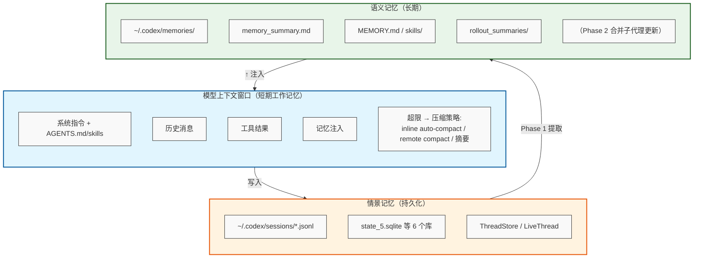

# oh-my-pi 记忆架构调研

> 调研日期：2026-08-28 · 依据：`github.com/can1357/oh-my-pi`（main 分支源码 + 官方文档 `docs/memory.md`、`docs/mnemosyne-memory-backend.md`）

## 1. 总览：四个互斥后端，默认全关

`memory.backend` 是唯一运行时选择器（`resolveMemoryBackend`，`packages/coding-agent/src/memory-backend/resolve.ts`）：

| backend     | 存储                                  | 本质                       |
| ----------- | ----------------------------------- | ------------------------ |
| `off`       | 无                                   | no-op                    |
| `local`     | 项目级 SQLite 队列 + 磁盘 Markdown         | 会话回放式摘要管线（LLM 两阶段提炼）     |
| `mnemopi`   | 本地 SQLite（`@oh-my-pi/pi-mnemopi` 包） | 类人记忆引擎：工作记忆/情景记忆/事实图谱/衰退 |
| `hindsight` | 远程 Hindsight 服务器                    | 远程 bank-scoped 记忆        |

`local` 是 legacy 管线（`memories.enabled: true` 会迁移到它）；`mnemopi` 是最重、最近开发的本地引擎（`packages/mnemopi/` 约 1.2 万行）。三种后端在"何时召回、何时写入、何时合并"上行为各异，但都通过同一接口暴露给 agent。

## 2. 统一抽象：`MemoryBackend` 接口

`memory-backend/types.ts` 定义契约，所有消费者（session、slash 命令、工具）都经 `resolveMemoryBackend(settings)` 路由，单一事实源：

- ** `start(options)` ** — 会话启动时挂后台工作/订阅；约定 MUST 不抛错，配错也不破坏 agent 循环。子代理通过 `taskDepth` + `parentMnemopiSessionState` 继承父状态。
- ** `buildDeveloperInstructions()` ** — 每次重建系统提示时注入的 Markdown 追加段（"Memory Guidance" 块）。
- ** `beforeAgentStartPrompt()` ** — 唯一能在全新会话**第一轮回答前**影响提示的钩子（首轮召回在此竞速）。
- ** `preCompactionContext()` ** — 压缩（compaction）时把记忆拼进摘要 prompt 的 `extraContext`。
- ** `clear()/enqueue()` ** — `/memory clear|reset|enqueue|rebuild`。
- ** `status()/search()/save()/stats()/diagnose()` ** — 支撑 `retain` / `recall` / `reflect` / `memory_edit` 工具和 `/memory view|stats|diagnose`。

工具层经 `createMemoryRuntimeContext`（`memory-backend/runtime.ts`）暴露给 agent：`status/search/save` 三个能力。被注入的系统提示（`STATIC_INSTRUCTIONS` + 各后端指令，`mnemopi/backend.ts`）教 agent 用 `recall` / `retain` / `reflect` / `memory_edit` / `learn`。

## 3. 注入与生命周期（三种后端共同的挂点）

- **首轮召回**：`session/session-tools.ts` 在首轮生成前调 `beforeAgentStartPrompt`，后端返回 `<memories>` 块；`agent_start` 监听器同时触发异步召回，先到者生效。
- **持续注入**：`sdk.ts` 每次 `refreshBaseSystemPrompt` 调 `buildDeveloperInstructions`。
- **自动写入节奏**：mnemopi 每 `retainEveryNTurns`（默认 4 个用户回合）保留已完成回合；hindsight 默认每 3 回合。
- **压缩时**：`session/session-maintenance.ts` 在压缩摘要前调 `preCompactionContext`。
- **退出时**：`agent_end` 排空 retain 队列；mnemopi 交互退出给 1.5 s 排空预算，超时 detach（工作记忆行已落盘，但最后几回合的提升/嵌入可能不完整）—— `/memory enqueue` 是显式强持久化边界。
- 设计定位明确写死：**召回记忆是背景上下文，不是指令**；与当前 repo 状态/用户指令冲突时视为过期（`read-path.md` prompt 第 5 条）。

## 4. Local 后端：两阶段 LLM 提炼管线

`memories/index.ts`（1438 行）+ `memories/storage.ts`（578 行）。只在启动时跑、跳过子代理和未持久化会话。

**Phase 1 — 逐会话提取**：扫描最近会话（`threadScanLimit` 300），对每个"上次处理后有过变更"的会话，用 `default` 角色模型读历史，按 `stage_one_system.md` 产出 `{rollout_summary, rollout_slug, raw_memory}` ——只留约束、决策、工作流、已解决的失败；无价值返回空串。跳过太新（`minRolloutIdleHours` 12 h）、太旧（`maxRolloutAgeDays` 30）、活跃中的会话。并发 8，带 lease（120 s）+ 重试延迟（120 s）。

**Phase 2 — 跨会话合并**：用 `smol` 角色（fallback default→当前模型→注册表第一个）读全部 raw memories，产出三样磁盘产物：

- `MEMORY.md` — 长期记忆全文
- `memory_summary.md` — 启动时注入的精简文本
- `skills/<name>/SKILL.md(+scripts/templates/examples)` — 可复用流程 playbook

合并用 lease+heartbeat（180 s/30 s）防多进程双跑；旧 skill 目录自动清理；输出写盘前 `redactSecrets()` 脱敏。

**SQLite 队列**（`storage.ts`）：`memory_threads`（会话注册表）+ `jobs` 表，`kind = memory_stage1 | memory_consolidate_global`。关键设计：**Phase 2 job key 按 cwd 隔离**（`global:${cwd}`），修过跨项目记忆污染 bug（#369）；`listStage1OutputsForGlobal` 也按 cwd 过滤。watermark 机制驱动增量：`enqueueGlobalWatermark` 记录源更新时间，Phase 2 只合并 watermark 之前的输出。

** `learn` 工具**（`autolearn.enabled: true` 时可用）：写入 `learned.md`，newest-first、去重、脱敏、**注入中和**（`neutralizeInjection` 剥离控制字符/分隔符，防止 prompt 注入），上限 100 条、每条 2000 字符。local 后端**没有**结构化检索—— `status()` 明说 `searchable: false`。

## 5. Mnemopi 后端：完整记忆引擎（重点）

### 5.1 分层

```
Mnemopi facade (core/memory.ts, 681行) — 薄壳, 默认实例/银行路由
  └─ BeamMemory (core/beam/index.ts) — 真正引擎
       ├─ store.ts (1083)      写入/去重/嵌入调度/裁剪
       ├─ recall.ts (1221)     召回/评分/MMR
       ├─ consolidate.ts (1132) sleep 合并/情景降级/事实提取
       ├─ schema.ts (426)      SQLite DDL + FTS5 + 触发器
       ├─ episodic-graph.ts   情景图谱（实体链接）
       ├─ polyphonic-recall.ts 4 声道召回 + RRF
       └─ aaak.ts 等           确定性压缩/模式/时间解析/衰退
coding-agent wrapper (mnemopi/backend.ts + state.ts) — 银行 scoping、会话状态、回合保留
```

### 5.2 存储模型（`beam/schema.ts`，核心表）

- ** `working_memory` ** — 工作记忆（短期）：`importance, veracity, memory_type, trust_tier, valid_until, superseded_by, scope, recall_count, last_recalled, event_date, temporal_tags, corrected_by` 等 ~30 列。默认 TTL 24h。
- ** `episodic_memory` ** — 情景记忆（长期）：同构 + `tier`（降级层）、`summary_of`、`binary_vector`。FTS 5 外挂表 + 触发器同步。
- ** `memoria_facts` ** — 带版本的事实表（`version_id, previous_value, valid_from/to_msg_idx` → 事实演化）。
- ** `memoria_kg` ** — 三元组知识图谱（subject/predicate/object + confidence）。
- ** `memoria_timelines / instructions / preferences` ** — 时间线、指令、偏好（`evolution` 追踪偏好变化）。
- ** `facts` ** — 另一张 SPO 表 + FTS（与 `memoria_kg` 并存，注释表明经历 triplestore 拆分迁移）。
- ** `annotations` **（memory_id→kind/value 键值）、** `scratchpad` **、** `memory_validations` **（验证审计，每记忆保留最近 3 条）、** `memory_embeddings` **（embedding_json + model）。

### 5.3 写入路径（`store.ts` `remember`）

内容 → **归一化查重**（命中则提升 importance、刷新 timestamp、置 `consolidated_at=NULL` 使其重新可合并）→ 插入 working_memory → 时间标注（`temporal-parser` 提取 event_date）→ 可选实体/图谱链接（`proactiveLinking`）→ `trimWorkingMemory`（上限 1000 条）→ 异步嵌入调度 → `extract: true` 时调度事实提取。关键细节：`embedText` / `extractText` 可与会话内容解耦——coding-agent 保留完整多作者 transcript，但事实挖掘只读用户回合（issue #3372，防助手散文被误记为 `Instruction:`）。

### 5.4 召回路径（`recall.ts`）

线性召回：query 嵌入（无嵌入配置则纯 FTS）→ 同义词扩展 + 查询意图分类调权重 → 候选收集（working+episodic）→ **加权评分**：`vec(0.5) + fts(0.3) + importance(0.2)`，叠加时间衰退（`temporalBoost`，半衰期 72 h）和"查询是否问当前状态"（`queryAsksCurrent` → temporalWeight 0.45）→ 跨层去重 → token ≥4 时**覆盖度多样化** → 可选 MMR 重排（λ 0.7）→ 更新 recall_count。结果带 `explanation` 和逐声道分数，便于审计。

**多声道召回**（`polyphonic-recall.ts`，`mnemopi.polyphonicRecall: true` 开启）：vector（向量）+ graph（情景图谱关联）+ fact（SPO 事实）+ temporal（时间线）四路并行，**RRF 倒数秩融合**。FTS-only 部署（`noEmbeddings: true`）走 `orchestrateRecall`（`orchestrator.ts`）自动降级。

### 5.5 合并与遗忘（`consolidate.ts` `sleep`）

- 选取 `consolidated_at IS NULL` 且超龄（TTL/2 = 12 h）的工作记忆行 → 加合并时间戳**先占锁防并发双跑** → 按 source 分组分块 → 每块用 **aaak**（确定性压缩，`PHRASE_MAP` / `STRUCTURAL_REPLACEMENTS` 把 "User prefers " → "PREF " 等，`llm_used: false`）生成摘要 → 写入 episodic（tier 1，importance 0.6，scope/veracity 聚合）→ `degradeEpisodic`：按年龄降 tier（T 2/T 3 阈值），低 tier 记忆进一步压缩。工作记忆 TTL 内**不会**被 `enqueue` 强制合并（年龄门控）。

### 5.6 银行与 scoping（coding-agent 层）

- `global`：单共享库；`per-project`：按工作目录 basename + 绝对路径稳定哈希派生银行；`per-project-tagged`：写项目库 + 读项目库**和**共享库（结果合并去重）。项目命名：取 git 主 checkout 根 → basename 小写，**跨 worktree 折叠**（`~/code/General` → `project:general`）。
- 共享银行是 `mnemopi/mnemopi.db`，项目银行是 `banks/<name>/mnemopi.db`（`BankManager`）。`/memory clear` 删本地库+WAL/SHM（含重试抗 EBUSY）；hindsight 的 clear 只清本地会话状态，**不删服务端 bank**。

## 6. Hindsight 后端（远程）

默认 `http://localhost:8888`，`HINDSIGHT_*` 环境变量覆盖 18 项配置。`per-project-tagged` 默认：写共享 bank + 项目 tag，召回含 tagged + untagged 全局。首轮自动召回（`autoRecall: true`），每 3 回合自动 retain；失败只记日志不影响会话。无 `memory_edit`（上游不编辑）。`recall` 注入作背景上下文，压缩时也可用。

## 7. 工具面与 `memory://` URL

- 工具：`recall`（预览+ID）、`retain`（显式存事实）、`reflect`（跨记忆综合回答）、`memory_edit`（update/forget/invalidate；fact 行只读，#4725）、`learn`（autolearn）。
- `memory://` 内部 URL（`internal-urls/memory-protocol.ts`）：`memory://root`（摘要）、`/MEMORY.md`、`/learned.md`、`/skills/<name>/SKILL.md`；mnemopi 后端下 `memory://<memory-id>` 读取完整行（带 YAML front-matter），跨所有活跃会话的 scoped banks 查找。路径校验防 `..` 逃逸，glob 通配符先解码再验证。

## 8. 可靠性/安全设计（值得借鉴）

1. **lease+heartbeat+ownership token** 防多进程双跑（local Phase 1/2、mnemopi sleep 占锁）。
2. **watermark 增量**：只处理"变更过"的会话，避免每次全量重扫。
3. **每处写盘前 `redactSecrets` **；`learn` 还做 prompt 注入中和 + 读回时再中和（手改文件也防）。
4. **后端故障隔离**：任何 backend 异常只 log 不打断 agent；启动失败则后端 inert。
5. **冲突语义**：重复记忆取 importance max；事实表版本化（previous_value/valid_from）；`superseded_by` / `invalidate` 显式作废。
6. **记忆不权威**：prompt 反复声明"repo 状态/用户指令 > 记忆"，并要求引用 `memory://` 路径 + 当前 repo 证据。

## 9. 设计要点小结

- **四种记忆范式并存**：回放式摘要（local）、双存储区工作/情景（mnemopi）、图谱+事实+时间线（mnemopi polyphonic）、远程向量库（hindsight）。
- **注入即启发**：记忆永远以"背景块"进系统提示，权重最低，可被 repo 证据推翻——避免了记忆污染主 prompt 的经典问题。
- **异步 + 门控**：提取/嵌入/保留全部后台化，回合节奏（4 回合）与年龄门控（12 h）平衡成本与新鲜度。
- **确定性兜底**：aaak 压缩和 FTS 让无 LLM/无嵌入环境仍可用。
- **作用域折叠**：worktree 折叠 + 项目哈希银行，解决多目录/大小写/链接工作树下的记忆隔离。

---

## 附录：如何开启记忆后端

配置位置（二选一）：
- **全局**：`~/.omp/agent/config.yml`（Windows：`C:\Users\y86133\.omp\agent\config.yml`）
- **项目级**：项目根目录 `.omp/config.yml`
- 或 TUI 内 `/settings` → memory → backend 交互选择

### 最简单：local（纯本地，无需任何外部服务/API）

```yaml
memory:
  backend: local
```

启动时后台管线自动对历史会话做两阶段提炼，之后每次会话开头注入 `memory_summary.md` 摘要。可选：

```yaml
memory:
  backend: local
autolearn:
  enabled: true      # 开启 learn 工具，显式存教训到 learned.md
```

### 推荐：mnemopi（本地 SQLite 完整记忆引擎，可检索）

```yaml
memory:
  backend: mnemopi
mnemopi:
  scoping: per-project        # global | per-project（默认）| per-project-tagged
  autoRecall: true            # 首轮自动召回
  autoRetain: true            # 每 retainEveryNTurns 回合自动保留
  retainEveryNTurns: 4
```

- 默认用本地嵌入模型（`BAAI/bge-base-en-v1.5`，首次会下载）；不想下载/无嵌入环境可纯 FTS：

```yaml
memory:
  backend: mnemopi
mnemopi:
  noEmbeddings: true
```

- 或接远程嵌入/LLM（OpenAI 兼容）：

```yaml
mnemopi:
  embeddingModel: text-embedding-3-small
  embeddingApiUrl: https://api.openai.com/v1
  embeddingApiKey: ${OPENAI_API_KEY}
```

### hindsight（需要自建/接入远程 Hindsight 服务器）

```yaml
memory:
  backend: hindsight
hindsight:
  apiUrl: http://localhost:8888
  apiToken: ${HINDSIGHT_API_TOKEN}
```

### 验证与运维

- 会话内 `/memory view` 看当前注入内容；`/memory stats`、`/memory diagnose` 看后端统计/诊断。
- `/memory enqueue` 强制保留+合并；`/memory clear` 清空（hindsight 只清本地，不删服务端 bank）。
- 记忆默认**项目级隔离**：每个仓库各记各的。

> 注意：三种后端互斥，`memory.backend` 同时只生效一个；切换后旧后端数据保留，不会自动迁移。


# Codex 记忆架构

> 依据 [openai/codex](https://github.com/openai/codex) 仓库快照（commit `6be2a6ca952ac9f70676ce4dd07fda27175aa9dd`，2026-08-28 浅克隆）源码整理，并参考 OpenAI 官方文档。仓库内记忆子系统仍快速演进，不同版本的行为可能不同。

## 总览

Codex 的记忆不是单一数据库，而是分层的组合，可概括为四层本地机制加一层云端机制：

1. **短期记忆**：模型上下文窗口与压缩（Context Window / Compaction）
2. **情景记忆**：会话日志（rollout JSONL）+ SQLite 状态库
3. **语义记忆**：两阶段后台"记忆流水线"生成的文件型长期记忆（`~/.codex/memories/`）
4. **静态指令记忆**：`AGENTS.md`、`config.toml`、skills、prompts 等每次会话加载的声明式上下文
5. **云端记忆**：ChatGPT 侧的 Memories / Chronicle（可选）



---

## 1. 短期记忆：上下文窗口与压缩

模型可见的上下文是"工作记忆"，Codex 在其中组装系统/开发者指令、历史消息、工具调用结果、文件/工作区上下文，以及注入的记忆片段。上下文超限时通过压缩保持连续性：

- `codex-rs/core/src/tasks/compact.rs`、`codex-rs/core/src/compact.rs`：inline auto-compact 与 remote compact（v 1/v 2），用 `SUMMARIZATION_PROMPT` 将旧历史总结后替换进窗口。
- `codex-rs/core/src/context_manager/history.rs`：压缩/回滚时重写历史（`history_rewritten` 标记）。
- `codex-rs/core/src/state/auto_compact_window.rs`：记录自动压缩窗口与 token 预算状态。
- 压缩有 pre-sampling compact、token 预算、模型回退等机制（`compact_token_budget.rs`、`compact_model_fallback.rs`），并支持压缩后继续续接会话。

## 2. 情景记忆：会话日志与 SQLite 状态库

每一次会话都被完整落盘、可回放：

- **rollout 日志**：`codex-rs/rollout/src/recorder.rs` 把每个会话写成 `~/.codex/sessions/rollout-<时间戳>-<id>.jsonl`，不可变、可回放（`jq` / `fx` 可查看）。`thread/revert` 会生成新的不可变 rollout 文件；旧会话可归档。
- **SQLite 状态库**：`codex-rs/state/src/sqlite.rs` 管理 6 个数据库（均位于 `~/.codex/`）：
  - `state_5.sqlite`：线程元数据（含 `memory_mode`）、会话状态
  - `thread_history_1.sqlite`：分页线程历史
  - `logs_2.sqlite`：日志
  - `goals_1.sqlite`：目标
  - `queue_1.sqlite`：持久化消息队列
  - `memories_1.sqlite`：记忆流水线专用库
- **存储抽象**：`codex-thread-store` 定义 `ThreadStore` trait（`append_items`、`update_thread_metadata`），`LiveThread` 负责活动会话持久化，`ThreadManager` 统一路由元数据变更；本地实现通过 rollout JSONL + SQLite 落盘。

## 3. 语义记忆：两阶段后台记忆流水线

这是仓库里最核心的新机制，读写路径分离，说明见 `codex-rs/memories/README.md`。

### 3.1 触发条件

流水线在 **root 会话启动且有用户输入时**异步触发（`codex-rs/app-server/src/request_processors/turn_processor.rs` → `start_memories_startup_task`），仅当：

- 会话非 ephemeral（临时会话跳过）
- `Feature::MemoryTool` 功能开关启用
- 会话不是子代理会话
- 状态库（state DB）可用

### 3.2 写路径：Phase 1（每线程提取）

- 从状态库按启动认领规则选择近期、空闲且未被占用的 rollout（默认：10 天内、空闲 ≥6 小时、每启动最多处理 2 个）。
- 过滤 rollout 中与记忆相关的内容，并行调用模型（`extract_model`，带并发上限），期望结构化输出：
  - `raw_memory`：结构化可检索记忆
  - `rollout_summary`：详细 rollout 摘要（含偏好信号、可复用知识、失败防护、证据引用）
  - `rollout_slug`：文件安全摘要名
- 生成内容做密钥脱敏（`[REDACTED_SECRET]`），写入 `memories_1.sqlite` 的 `stage1_outputs` 表。
- 任务用 `jobs` 表做租约/认领，防止并发重复；失败带退避重试。

### 3.3 写路径：Phase 2（全局合并）

- 拿全局 phase-2 锁（只允许一个合并者操作记忆工作区）。
- 按 `usage_count` 优先、最近使用/生成时间其次，选择 Top-N 条 stage-1 输出（默认 256 条；30 天未使用即淘汰）。
- 同步本地记忆工件：`raw_memories.md`（稳定按线程 ID 升序合并）、`rollout_summaries/`（每条被选 rollout 一个摘要文件），并清理过期文件。
- 记忆目录本身是一个 git 基线仓库（`~/.codex/memories/.git`），同步后生成 `phase2_workspace_diff.md`（相对上次成功基线的 diff），作为合并子代理的输入。
- 若有变更，启动一个**内部合并子代理**：无审批、无网络、仅本地写、禁用协作/递归委派，运行后更新 `MEMORY.md`、`memory_summary.md`、`skills/`，然后重置 git 基线。

### 3.4 记忆目录与文件布局

```
~/.codex/memories/
├── memory_summary.md          # 总是注入系统提示的摘要索引（首行必须为 v1）
├── MEMORY.md                  # 可搜索的任务分组手册（检索主文件）
├── raw_memories.md            # Phase 1 输出的机械合并（Phase 2 输入，临时文件）
├── rollout_summaries/         # 每条 rollout 的摘要（含证据片段）
├── skills/<skill-name>/       # 可复用流程：SKILL.md + scripts/ + examples/ + templates/
└── extensions/ad_hoc/notes/   # 用户主动请求更新记忆时写入的笔记
```

### 3.5 读路径：注入与工具

- `codex-rs/ext/memories/src/extension.rs` 在 `use_memories=true` 且功能开关启用时，把 `read_path.md` 模板渲染成 developer-policy 提示注入会话。
- 模板注入 `memory_summary.md`（按 token 预算截断），并指导模型按"快速记忆检索"流程使用：先搜 `MEMORY.md`，再按需打开 `rollout_summaries/` 或 `skills/`。
- 可选（`dedicated_tools=true`）暴露记忆工具：`memory list`、`memory read`、`memory search`、`ad_hoc_note`。
- 模型使用记忆后必须输出 `<oai-mem-citation>` 引用块（文件+行号+用途说明+rollout id），用于使用统计与反哺 Phase 2 排序。

### 3.6 使用统计与引用

- `usage_count`、`last_usage` 记录每条记忆的使用情况，Phase 2 据此排序/淘汰。
- 引用解析：`codex-rs/memories/read/src/citations.rs` 解析 `<oai-mem-citation>`，提取条目与 rollout ID。
- 读路径遥测：`codex-rs/memories/read/src/usage.rs` 按命令/用途分类统计记忆读取。

### 3.7 线程 memory_mode 与污染防护

每个线程在状态库中有 `memory_mode`：

- `enabled`：默认（`generate_memories=true` 时新建线程即启用）
- `disabled`：不生成/不使用记忆
- `polluted`：一旦会话使用过 MCP、Web 搜索、工具搜索等外部上下文（`disable_on_external_context=true` 时），该线程被标记为 polluted，不再作为记忆来源

### 3.8 配置项（config.toml `[memories]`）

| 配置 | 默认 | 说明 |
| --- | --- | --- |
| `generate_memories` | `true` | 是否生成记忆 |
| `use_memories` | `true` | 是否注入既有记忆 |
| `dedicated_tools` | `false` | 是否暴露专用记忆工具 |
| `disable_on_external_context` | `false` | 使用外部上下文（MCP/搜索）后是否标记 polluted |
| `max_raw_memories_for_consolidation` | `256` | Phase 2 最多合并的原始记忆数（1–4096） |
| `max_unused_days` | `30` | 记忆未被使用超过 N 天即淘汰（0–365） |
| `max_rollout_age_days` | `10` | 参与记忆的 rollout 最大年龄（0–90） |
| `max_rollouts_per_startup` | `2` | 每次启动最多处理的 rollout 数（1–128） |
| `min_rollout_idle_hours` | `6` | 生成记忆前最小空闲时间（1–48，建议 >12） |
| `min_rate_limit_remaining_percent` | `25` | 限流窗口剩余比例低于该值则跳过 |
| `extract_model` | 继承默认 | Phase 1 提取用模型 |
| `consolidation_model` | 继承默认 | Phase 2 合并用模型 |

另有隐藏命令 `codex debug clear-memories` 可清空记忆库与记忆目录。

### 3.9 数据结构（memories_1.sqlite）

`codex-rs/state/memory_migrations/0001_memories.sql`：

- `stage1_outputs`：`thread_id`（主键）、`source_updated_at`、`raw_memory`、`rollout_summary`、`rollout_slug`、`generated_at`、`usage_count`、`last_usage`、`selected_for_phase2`、`selected_for_phase2_source_updated_at`
- `jobs`：`kind`、`job_key`、`status`、`worker_id`、`ownership_token`、租约/退避字段、`input_watermark`、`last_success_watermark`

## 4. 静态指令记忆

全局 `~/.codex/AGENTS.md`、仓库根 `AGENTS.md`、`config.toml`、`~/.codex/skills` 与仓库 `.codex/skills`、prompts、plugins 属于每次会话都会加载的"声明式记忆"，与自动生成的语义记忆互补。本项目当前会话的 OMX/AGENTS.md 即属此类。

## 5. 云端记忆：ChatGPT 侧 Memories / Chronicle

OpenAI 官方文档（developers.openai.com/codex/memories/chronicle、learn.chatgpt.com/docs/customization/memories）说明：

- **Memories**：让 ChatGPT 与 Codex 把早期工作中的有用上下文带到未来工作；启用后 Codex 可把符合条件的旧对话转成本地记忆文件（桌面端：设置 → Personalization → Enable memories）。
- **Chronicle**：macOS Codex 应用的可选"研究预览"功能，本地捕获屏幕上下文，定期启动沙盒化的临时 Codex 会话，把近期活动总结成记忆，供后续对话使用。

> 注意：本文撰写时这两个官方页面在抓取时返回 403/代理错误，以上云侧内容依据官方搜索摘要整理，尚未逐页打开核实；本地架构细节以仓库源码为准。

## 证据与来源

- 仓库：https://github.com/openai/codex（快照 commit `6be2a6ca952ac9f70676ce4dd07fda27175aa9dd`）
- 关键源码（仓库内相对路径）：
  - `codex-rs/memories/README.md`：记忆流水线总述
  - `codex-rs/memories/write/src/start.rs`：流水线触发
  - `codex-rs/memories/write/src/phase1.rs` / `phase2.rs`：两阶段实现
  - `codex-rs/memories/write/templates/memories/stage_one_system.md`：Phase 1 提取提示词
  - `codex-rs/memories/write/templates/memories/consolidation.md`：Phase 2 合并提示词
  - `codex-rs/ext/memories/src/extension.rs`：读路径注入与工具
  - `codex-rs/ext/memories/templates/memories/read_path.md`：记忆使用指令
  - `codex-rs/state/src/sqlite.rs`：6 个 SQLite 库定义
  - `codex-rs/state/memory_migrations/0001_memories.sql`：记忆表结构
  - `codex-rs/rollout/src/recorder.rs`：会话 rollout JSONL
  - `codex-rs/core/src/compact.rs`、`codex-rs/core/src/tasks/compact.rs`：上下文压缩
  - `codex-rs/config/src/types.rs`：`[memories]` 配置项
- 官方文档：
  - https://developers.openai.com/codex/memories/chronicle
  - https://learn.chatgpt.com/docs/customization/memories

## 已知局限

- 记忆子系统演进很快，Phase 1/2、Chronicle 均为较新特性，不同版本行为可能不同。
- 本文撰写时官方文档页面无法直接抓取（403/代理错误），云侧内容未逐页核实。
# 记忆架构调研（Agent Memory Architecture）

> 调研时间：2026-08-28。覆盖 oh-my-pi/Mnemopi 本地实现（源码级）与主流外部方案（mem 0、Zep/Graphiti、Hindsight、Letta、Claude Code），来源见文末[参考来源](#参考来源)。

---

## 一、五个核心问题

### 1. 记忆是什么

**定义：agent 跨会话持久化的状态**，与"上下文窗口"（临时、随会话消失）相对。业内共识的分层与分类：

- **按时间跨度分层**（MemGPT/Letta 的 LLM-as-OS 模型）：
  - **Working memory（工作记忆）**：常驻上下文内，agent 可直接读写（Letta 的 `persona` / `human` 记忆块；Mnemopi 的 working memory 表，默认 TTL 24 小时）。
  - **Long-term memory（长期记忆）**：上下文之外的外部存储，按需检索进上下文。
- **按内容类型分类**（认知科学迁移）：
  - **Episodic（情景记忆）**：发生过的事件、会话记录。
  - **Semantic（语义记忆）**：事实、偏好、决策——"部署目标是 stable-cluster"。
  - **Procedural（程序性记忆）**：技能/流程/playbook（oh-my-pi local 后端会生成 `skills/` playbook）。
- **记忆即上下文，不是指令**：所有主流实现都强调注入的记忆是 *background context*，与当前用户消息/工具输出冲突时以后者为准（oh-my-pi `docs/memory.md` 原文如此；oh-my-pi 文档还要求：记忆影响计划时引用记忆工件路径并用当前仓库证据佐证，冲突时把记忆当过期处理）。

oh-my-pi 侧的具体形态：
- **local 后端**：`MEMORY.md`（长期文档）+ `memory_summary.md`（启动注入）+ `learned.md`（`learn` 工具捕获的课程）+ `skills/`（程序性技能）。
- **mnemopi 后端**：本地 SQLite 库（working memory + episodic graph + fact 表 + 向量）。
- **hindsight 后端**：远程银行（bank），`per-project-tagged` 作用域。

### 2. agent 怎么找到它（检索路径）

分"自动注入"与"显式工具"两条路：

**自动注入**
- 会话首轮把摘要/召回结果注入 system prompt。oh-my-pi：local 后端注入 **Memory Guidance** 块；mnemopi 后端注入 `<memories>` 块（默认 `recallLimit: 8` 条）；Hindsight 首轮 `autoRecall`。
- 压缩（compaction）时把召回记忆作为额外上下文（oh-my-pi 的 `preCompactionContext`）。

**显式工具**（mnemopi/hindsight 后端暴露）
- `recall`：按查询搜记忆，返回带 ID 的预览。
- `retain`：显式存入耐久事实。
- `reflect`：跨多条召回记忆合成一个答案（见问题 5）。
- `memory_edit`：`update` / `forget` / `invalidate`（见问题 4）。

**底层检索机制**（按实现不同）
- **全文检索 FTS**：SQLite FTS 5 关键词匹配（Mnemopi 的 `noEmbeddings` 降级路径；零依赖、可离线）。
- **向量相似度**：embedding 模型（Mnemopi 默认 `BAAI/bge-base-en-v1.5` 768 维 / 多语 `intfloat/multilingual-e5-large` 1024 维）算 query 与记忆的余弦相似度。
- **图遍历**：知识图谱 BFS/多跳（Mnemopi 的 `graph` voice 走 `findGistsByParticipant` / `findRelatedMemories`；mem 0 g；Zep Graphiti）。
- **时序查询**：按时间窗口/实体时间线（Mnemopi 的 `temporal` voice；Zep 的 point-in-time 查询）。
- **融合排序**：Mnemopi `polyphonicRecall` 把 vector/graph/fact/temporal 四路召回做 **RRF（Reciprocal Rank Fusion）**；另配 `enhancedRecall` 查询缓存。

### 3. 怎么维护

所有成熟方案都遵循同一模式：**写路径要快，维护放后台**（mem 0 Dream 博客原文的类比：LSM 压缩、Postgres vacuum、git GC）。

**写时（在线）**
- LLM 从对话对中抽取事实/偏好/决策（mem 0 单次 ADD-only 抽取；Mnemopi 的 `scheduleFactExtraction` 后台抽取 + 正则实体抽取）。
- 重要性打分（Mnemopi `remember(..., importance: 0.8)`）、veracity 标注。
- 去重：精确文本去重（`learned.md` 按文本去重，上限 100 条）。

**后台（离线/周期性）——"睡眠-巩固"周期**
- **oh-my-pi local 两阶段流水线**：
  - Phase 1 逐会话抽取：对变更过的历史会话各跑一次模型抽取，产出 raw memory block + 摘要；
  - Phase 2 合并：跨全部抽取结果生成 `MEMORY.md` / `memory_summary.md` / `skills/`。用 lease + heartbeat 防多进程双跑；写出前做密钥脱敏。
- **mem 0 Dream**（每周后台跑）：merge（旧条目标 `merged` 并指向替代，默认从搜索隐藏）、supersede（旧事实标 `superseded` 指向新事实，默认仍出现在搜索，`latest_only=true` 只看当前）、synthesize（把多条相关记忆综合成一条更高层记忆，保守触发）。**任何操作都不物理删除**，全部记录状态变更与指针，可在面板审计。
- **Mnemopi sleep/consolidation**：`sleepAllSessions` 选取 `workingMemoryTtlHours/2`（默认 12 小时）以上未合并的 working memory 行，巩固为 episodic 记忆并写入 gist/图边（`consolidateToEpisodic`）。
- **Claude Code AutoDream**：对记忆文件做 prune（删过期/被取代信息）+ merge（合并重复条目）+ 综合，即"优化而非擦除"。
- **Hindsight**：consolidation 把短期记忆整合进长期、派生观察。
- **TTL 剪枝**：Mnemopi working memory 到期行被 trim（并级联清理 embeddings/facts/graph 边，见 CHANGELOG #4819）；mem 0 支持 `expiration_date`。

**维护的关键洞察**：写时决策只看当前会话 + 少量相似记忆，看不到全局，所以重复/矛盾/散落的事实必然产生——必须有一个能看到全局的后台维护进程来收敛。

### 4. retire 和 delete 的区别

**一句话：retire 是软删除（从检索中隐藏、保留历史、可逆），delete 是硬删除（物理移除、不可恢复）。**

| 维度 | retire / retire 系操作 | delete / 硬删除 |
|---|---|---|
| 数据 | 保留在存储中（移入归档/标记状态） | 物理删除，不可检索也不可恢复 |
| 检索可见性 | 从 recall/consolidation 排除（或仅按需可见） | 彻底不可见 |
| 历史/审计 | 完整保留，可追溯、可反悔 | 无 |
| 典型用途 | 事实过时、被取代、不想再影响 agent | GDPR/CCPA 用户擦除请求、清除脏数据 |
| 可逆性 | 可逆（可恢复为 valid） | 不可逆 |

**各系统的具体对应**：
- **Hindsight**：`retire` 端点 = 把记忆的 curation state 置为 `invalidated` → 从 recall 与 consolidation 排除、剪掉关联链接与派生观察、移入 archive，可附自由文本原因；**可逆**（state 置回 `valid` 恢复）。`delete` 才是永久移除。
- **mem 0**：不叫 retire，等价物是 **superseded / merged** 生命周期状态（保留记录与 `replacement_memory_id` 指针，`latest_only` 过滤）；delete 是物理删除，用于合规擦除。
- **Mnemopi / oh-my-pi**：`memory_edit` 的 `invalidate` = "softly supersede"（软性取代，可传 `replacement_id`），`forget` = 永久删除；事实表（fact rows）只读、只能失效不能编辑。
- **Zep / Graphiti**：思想同源但更彻底——新事实到来时**关闭旧边的 `t_invalid` 时间窗而不是删除**，实现 bi-temporal 历史保留。

### 5. reflect 和 dreaming 的区别

**一句话：reflect 是"读时合成"（查询路径上的即时答案生成），dreaming 是"写后整理"（后台的存储维护）。两者一个向 agent 输出答案，一个向存储输出变更。**

| 维度 | reflect | dreaming（Dream / sleep / 巩固） |
|---|---|---|
| 时机 | 查询时（query-time），agent 调用工具那一刻 | 后台/周期性（offline），独立于请求路径 |
| 输入 | 召回的记忆条目（或问题 + facts） | 整个记忆库/一组相关记忆 |
| 输出 | 一个合成答案文本，返回给 agent | 存储变更：合并、supersede、综合、剪枝、提升 |
| 是否改变存储 | 否 | 是 |
| 类比 | 人"回忆并归纳" | 人"睡觉时巩固记忆" |
| 实现例子 | Mnemopi `reflect`（把 top-k 召回事实按分数排序拼接/综合）；Hindsight `reflect`（"synthesizes insights from stored memories"） | mem 0 Dream；Supermemory "dreaming"；Claude Code AutoDream；Letta sleep-time compute；Mnemopi `sleep` /consolidation |

注意一个容易混淆点：Mnemopi 源码里 `core/shmr.ts` 的 `reflect` 是轻量实现（对召回 facts 按 score 排序取 top-k 拼接成字符串），而工具层/后端的 `reflect` 是"跨记忆合成回答"；两者都是读时操作。而 Mnemopi 的 `sleep` 对应外部世界的 "dream" 概念——所以"reflect vs dreaming"本质是 **读路径 vs 写路径/维护路径** 的分工。

---

## 二、记忆存储类别

### 1. 纯文本记忆（Markdown 文件）

代表：oh-my-pi local 后端（`MEMORY.md` / `memory_summary.md` / `learned.md`）、Claude Code 的 `CLAUDE.md` + 记忆文件目录、Cursor 规则文件。

- 优点：人类可读可手改、git 可版本化、零依赖零成本、透明（写错了直接看得到）。
- 缺点：无真正的检索排序（只能全文注入或线性扫）、受上下文预算限制（oh-my-pi 默认 `summaryInjectionTokenLimit: 5000`）、事实冲突无检测、无法做相似度召回。
- 适用：单项目、轻量、可审计的"指南型"记忆；不适合海量事实。

### 2. SQLite 状态库（state.db 型）

代表：**Letta（MemGPT）**——整个 agent 状态（消息历史、工具调用、所有 memory blocks）持久化在一个 `state.db` SQLite 文件里，每个 memory block 一行（`block_id`、描述、大小限制、文本），agent 通过读写块来自我编辑记忆；**Mnemopi**（`mnemopi.db`，含 working memory、episodic 图、facts、`memory_embeddings`、`graph_edges` 等表，FTS 5 全文索引）；以及各类 agent 的会话/任务队列库（oh-my-pi 的 `memories/storage.ts` 就是 SQLite 任务队列）。

- 优点：ACID 事务、结构化查询、单文件好部署、WAL 并发、FTS 5 全文检索、schema 可迁移。
- 缺点：原生不做语义向量检索（需扩展或自建 embedding 列）、图查询能力弱（要自建边表）、大数据量下性能靠索引工程。
- 适用：本地优先、需要一致性与可移植性的记忆主干——这是本地 agent（oh-my-pi 选型）的主流方案。

### 3. 向量数据库（pgvector 等）

代表：pgvector（Postgres 扩展，`vector` 列 + 索引）、Qdrant、Chroma、Milvus、Weaviate。mem 0 的默认形态就是"flat、层级化的向量存储，按 user/session/agent 作用域隔离"，支持混合检索。

- 优点：语义相似度召回（同义改写也能命中）、可扩展性强、RAG 生态成熟、与业务库同库（pgvector 免额外组件）。
- 缺点：无结构（每个记忆是孤立向量）、无法表达关系、事实冲突与时序变化无感知（旧事实和新事实都在）、幻觉召回。典型补救是叠加 FTS 混合检索或叠加图/时序层。
- 适用：规模大、语义召回是刚需、已有 Postgres 的场景。

### 4. mem 0：row memory 与 graph memory

mem 0 是双形态架构：

- **Row memory（行记忆）**：核心形态。抽取的事实以自然语言记忆条存在扁平层级向量库中，带 user/session/agent 作用域与元数据（`lifecycle_state`、`replacement_memory_id`、`expiration_date`），语义检索 + 精确匹配。写路径是单次 ADD-only 抽取（不 UPDATE/DELETE，靠 Dream 后台收敛）。
- **Graph memory（Mem 0 g，图记忆）**：可选增强层。把记忆建模为**有向带标签知识图**——实体为节点、关系为边，支持冲突检测、多跳推理、时序更新；可插拔后端 Neo 4 j / Memgraph / Amazon Neptune，自动做每用户子图隔离防数据泄漏。向量层管"快而松"的语义召回，图层管"关系感知"的推理。

官方定位：向量检索处理直白用例，图层在需要实体关系时才接上，避免为简单场景引入复杂时序架构。

### 5. Zep：时序知识图谱（Temporal Knowledge Graph / Graphiti）

Zep 的开源核心 **Graphiti** 是实时增量 **bi-temporal 知识图谱引擎**：

- **每条边带两个时间轴**：`valid time`（事实在世界上为真的时间窗 `t_valid` – `t_invalid`）与 `ingestion time`（系统何时学到的）。新事实与旧边矛盾时，**关闭旧边 validity 窗口而不是删除**，完整保留历史。
- **三层子图**：episode 子图（细粒度交互记录）→ semantic entity 子图（实体抽象）→ community 子图（更高层聚合），支撑"现在在哪工作"和"六月在哪工作"两类查询。
- LLM 负责把新边与语义相关的旧边比较，识别矛盾并触发失效。
- 商业版跑在自研 Context Graph Engine 上（亚 200 ms p 95）；自托管可落 Neo 4 j / FalkorDB。

这代表了"invalidate 而非 delete + 可回溯 + 关系推理"的路线，与 mem 0 g 同属图记忆阵营，但多了时序维度，是 agent 记忆里最接近"完整历史账本"的设计。

### 6. 其他值得一提的形态

- **Hindsight（Vectorize）**：图 + 实体中心。TEMPR（Temporal Entity Memory Priming Retrieval）把对话转成结构化、时序、实体感知的记忆图；`retain` / `recall` / `reflect` 工具集；bank 作用域 + 可退休/恢复的 curation state。
- **混合/多路召回（当前趋势）**：Mnemopi 的 polyphonic recall（vector + graph + fact + temporal 四 voice + RRF）、mem 0 的向量+图混合、Claude Code 的文本文件 + AutoDream。单一形态正在让位给"分层的多形态组合"。

---

## 三、类别速查对比

| 形态 | 代表 | 检索 | 关系/时序 | 维护 | 成本 | 典型定位 |
|---|---|---|---|---|---|---|
| 纯文本 | oh-my-pi local、Claude Code | 注入/线性 | 无 | 模型重写（两阶段流水线/AutoDream） | 极低 | 项目指南、可审计记忆 |
| SQLite state.db | Letta、Mnemopi | FTS + 自建向量列 | 边表自建 | sleep/consolidation、TTL | 低 | 本地持久 agent 状态 |
| 向量库 | pgvector、Qdrant、Chroma | 语义相似度 | 无 | 需外部策略 | 中 | 大规模语义召回 |
| mem 0 row | mem 0 | 混合（向量+精确） | 无 | Dream（merge/supersede/synthesize） | 中（SaaS） | 通用记忆层 |
| mem 0 graph | mem 0 g | 图遍历 + 向量 | 关系、冲突检测 | 图更新 | 高 | 需要多跳推理 |
| 时序 KG | Zep/Graphiti | 图 + 时序 | 双时间轴、可回溯 | invalidate 式演化 | 高 | "何时为真"场景 |
| 混合多路 | Mnemopi polyphonic | FTS+向量+图+时序+RRF | 有 | sleep + 图链接 | 中 | 本地全能引擎 |

## 四、给 oh-my-pi 场景的结论

- oh-my-pi 的三种后端正好覆盖三类路线：**local（纯文本）→ mnemopi（SQLite + 混合检索 + sleep 巩固）→ hindsight（远程图记忆）**，可视为按需升级路径。
- 若本地自建，**Mnemopi 的 SQLite 方案已具备**：FTS + 本地/远程 embedding、polyphonic 四路召回、working→episodic 巩固（sleep）、`invalidate` 软失效——外部方案（mem 0 Dream、Graphiti）的能力对应物基本齐备，缺的是每周级 Dream 式全库合并/综合任务（可考虑在 `/memory enqueue` 或定期任务里扩展）。
- retire/delete、reflect/dream 两组概念在所有方案里语义一致：**软删除保留历史可逆 vs 硬删除合规擦除；读时合成 vs 后台维护**。跨系统迁移心智成本低。

---

## 参考来源

- oh-my-pi `docs/memory.md`、`docs/mnemosyne-memory-backend.md`、`packages/mnemopi/`（README、CHANGELOG、`src/core/shmr.ts`）— 本地仓库源码
- Hindsight：retire/delete API — https://hindsight.vectorize.io/api-reference ；Hindsight paper — https://arxiv.org/html/2512.12818v1 ；GitHub — https://github.com/vectorize-io/hindsight
- mem 0 Dream 博客 — https://mem0.ai/blog/dream-background-memory-consolidation-for-ai-agents ；mem 0 文档（delete/expiration）— https://docs.mem0.ai/core-concepts/memory-operations/delete 、https://docs.mem0.ai/platform/features/memory-expiration ；Mem 0 g paper — https://arxiv.org/html/2504.19413v1
- Zep/Graphiti：bi-temporal KG paper — https://arxiv.org/html/2501.13956v1 ；GitHub — https://github.com/getzep/graphiti ；Neo 4 j 博客 — https://neo4j.com/blog/developer/graphiti-knowledge-graph-memory
- Letta（MemGPT）：state.db / memory blocks — https://www.letta.com/blog/memory-blocks 、https://blog.stackademic.com/letta-platform-for-stateful-llm-agents-a83b58a1c926
- Claude Code AutoDream — https://www.mindstudio.ai/blog/what-is-claude-code-autodream-memory-consolidation-like-sleep
- Supermemory "dreaming" 对比 — https://kenhuangus.substack.com/p/how-ai-agents-actually-remember-inside


