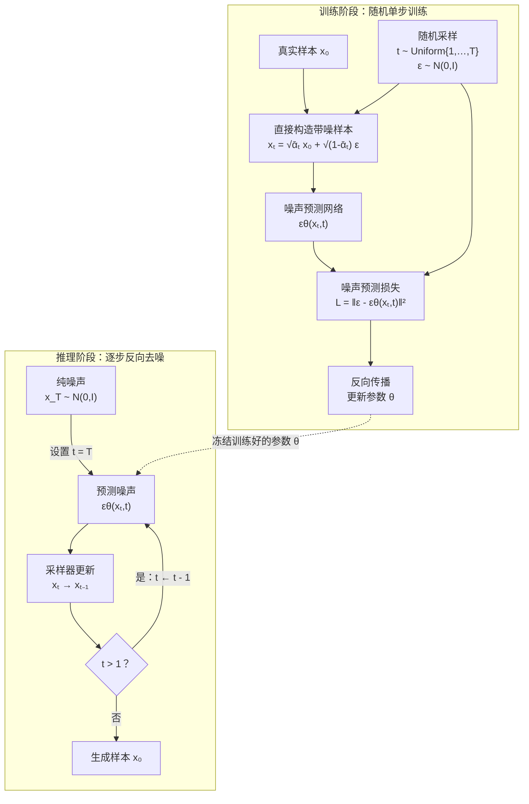

# GPT 的 Transformer block

![[Pasted image 20261001210449.png]]

# 多头注意力

![[Pasted image 20261001213706.png]]

# GPT 的 Decoder 阶段

![[Pasted image 20261001215512.png]]

# 扩散模型

## 前向扩散过程

给定真实数据 $x_0 \sim q(x_0)$，前向过程在 $T$ 步内逐步加入高斯噪声：

$$
q(x_t \mid x_{t-1}) = \mathcal{N}\left(x_t; \sqrt{1-\beta_t}\, x_{t-1},\ \beta_t \mathbf{I}\right)
$$

其中 $\{\beta_t\}_{t=1}^T$ 是噪声调度（noise schedule），通常 $\beta_t \in (0,1)$ 且随 $t$ 增大。

令 $\alpha_t = 1 - \beta_t$，$\bar{\alpha}_t = \prod_{s=1}^t \alpha_s$，则可由 $x_0$ **直接采样**任意时刻 $x_t$：

$$
q(x_t \mid x_0) = \mathcal{N}\left(x_t; \sqrt{\bar{\alpha}_t}\, x_0,\ (1-\bar{\alpha}_t)\mathbf{I}\right)
$$

等价地：

$$
x_t = \sqrt{\bar{\alpha}_t}\, x_0 + \sqrt{1-\bar{\alpha}_t}\, \epsilon,\quad \epsilon \sim \mathcal{N}(0,\mathbf{I})
$$

当 $T \to \infty$ 且 $\bar{\alpha}_T \to 0$ 时，$x_T$ 近似为标准高斯分布

## 二、反向去噪过程（Reverse Process）

反向过程学习从 $x_T$ 逐步恢复 $x_0$：

$$
p_\theta(x_{t-1} \mid x_t) = \mathcal{N}\left(x_{t-1}; \mu_\theta(x_t, t),\ \Sigma_\theta(x_t, t)\right)
$$

当 $\beta_t$ 足够小时，反向过程也可近似为高斯分布。通常固定方差 $\Sigma_\theta = \sigma_t^2 \mathbf{I}$，其中：

$$
\sigma_t^2 = \beta_t \quad \text{或} \quad \sigma_t^2 = \tilde{\beta}_t = \frac{1-\bar{\alpha}_{t-1}}{1-\bar{\alpha}_t}\beta_t
$$

均值 $\mu_\theta(x_t, t)$ 由神经网络预测。根据贝叶斯公式，真实后验为：

$$
q(x_{t-1} \mid x_t, x_0) = \mathcal{N}\left(x_{t-1}; \tilde{\mu}_t(x_t, x_0),\ \tilde{\beta}_t \mathbf{I}\right)
$$

其中：

$$
\tilde{\mu}_t(x_t, x_0) = \frac{\sqrt{\bar{\alpha}_{t-1}}\beta_t}{1-\bar{\alpha}_t} x_0 + \frac{\sqrt{\alpha_t}(1-\bar{\alpha}_{t-1})}{1-\bar{\alpha}_t} x_t
$$

## 三、训练目标

### 1. 变分下界（ELBO）

最大化对数似然 $\log p_\theta(x_0)$ 的变分下界：

$$
\log p_\theta(x_0) \geq \mathbb{E}_{q}\left[\log \frac{p_\theta(x_{0:T})}{q(x_{1:T}\mid x_0)}\right]
= \mathbb{E}_q\left[\log p_\theta(x_0\mid x_1) - \sum_{t=2}^T D_{KL}(q(x_{t-1}\mid x_t,x_0)\,\|\,p_\theta(x_{t-1}\mid x_t)) - D_{KL}(q(x_T\mid x_0)\|p(x_T))\right]
$$

### 2. 简化损失（DDPM）

将 $x_0$ 用 $x_t$ 和 $\epsilon$ 表示：

$$
x_0 = \frac{x_t - \sqrt{1-\bar{\alpha}_t}\,\epsilon}{\sqrt{\bar{\alpha}_t}}
$$

代入 $\tilde{\mu}_t$，可推出均值应预测为：

$$
\mu_\theta(x_t,t) = \frac{1}{\sqrt{\alpha_t}}\left(x_t - \frac{\beta_t}{\sqrt{1-\bar{\alpha}_t}}\epsilon_\theta(x_t,t)\right)
$$

最终训练目标简化为**预测噪声**的 MSE：

$$
\boxed{\mathcal{L}_{\text{simple}} = \mathbb{E}_{t,x_0,\epsilon}\left[\left\|\epsilon - \epsilon_\theta\left(\sqrt{\bar{\alpha}_t}x_0 + \sqrt{1-\bar{\alpha}_t}\epsilon,\ t\right)\right\|^2\right]}
$$

其中 $t \sim \text{Uniform}\{1,\dots,T\}$，$\epsilon \sim \mathcal{N}(0,\mathbf{I})$。

> 也有预测 $x_0$ 或速度 $v = \sqrt{\bar{\alpha}_t}\epsilon - \sqrt{1-\bar{\alpha}_t}x_0$ 的等价参数化。

---

## 四、推理（采样）过程

训练完成后，从纯噪声 $x_T \sim \mathcal{N}(0,\mathbf{I})$ 出发，逐步反向去噪：

$$
x_{t-1} = \mu_\theta(x_t,t) + \sigma_t z,\quad z \sim \mathcal{N}(0,\mathbf{I})\ \text{（}t>1\text{），}t=1\text{ 时 }z=0
$$

代入 $\mu_\theta$：

$$
x_{t-1} = \frac{1}{\sqrt{\alpha_t}}\left(x_t - \frac{\beta_t}{\sqrt{1-\bar{\alpha}_t}}\epsilon_\theta(x_t,t)\right) + \sigma_t z
$$

重复 $t = T, T-1, \dots, 1$，最终得到 $x_0$。

---

## 五、关键公式汇总

| 阶段         | 公式                                                         |
| ------------ | ------------------------------------------------------------ |
| 前向单步     | $q(x_t\mid x_{t-1})=\mathcal{N}(\sqrt{1-\beta_t}x_{t-1},\beta_t\mathbf{I})$ |
| 前向闭式     | $x_t=\sqrt{\bar{\alpha}_t}x_0+\sqrt{1-\bar{\alpha}_t}\epsilon$ |
| 反向分布     | $p_\theta(x_{t-1}\mid x_t)=\mathcal{N}(\mu_\theta,\sigma_t^2\mathbf{I})$ |
| 真实后验均值 | $\tilde{\mu}_t=\frac{\sqrt{\bar{\alpha}_{t-1}}\beta_t}{1-\bar{\alpha}_t}x_0+\frac{\sqrt{\alpha_t}(1-\bar{\alpha}_{t-1})}{1-\bar{\alpha}_t}x_t$ |
| 训练损失     | $\mathcal{L}=\mathbb{E}\|\epsilon-\epsilon_\theta(x_t,t)\|^2$ |
| 采样更新     | $x_{t-1}=\frac{1}{\sqrt{\alpha_t}}(x_t-\frac{\beta_t}{\sqrt{1-\bar{\alpha}_t}}\epsilon_\theta)+\sigma_t z$ |

---

## 六、与得分匹配/随机微分方程的联系

连续时间下，前向过程可写为 SDE：

$$
dx = -\frac{1}{2}\beta(t)x\,dt + \sqrt{\beta(t)}\,dw
$$

反向 SDE：

$$
dx = \left[-\frac{1}{2}\beta(t)x - \beta(t)\nabla_x\log p_t(x)\right]dt + \sqrt{\beta(t)}\,d\bar{w}
$$

其中 $\nabla_x\log p_t(x)$ 为得分函数，与噪声预测的关系为：

$$
\nabla_x\log p_t(x) = -\frac{\epsilon_\theta(x_t,t)}{\sqrt{1-\bar{\alpha}_t}}
$$

这引出了 **DDIM**、**Score SDE**、**Flow Matching** 等更高效的采样方法。

## 训练过程图示

![[Pasted image 20261001231046.png]]

## 解码过程图示

![[Pasted image 20261001231119.png]]

# DiT 架构

# DiT Block 结构