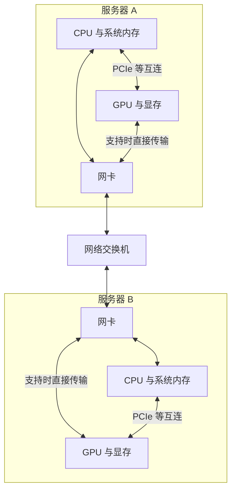

# FSDP 定位

**FSDP**（Fully Sharded Data Parallel，全分片数据并行）。这些技术属于不同层，可以组合在同一套训练系统里：

> **Ray 安排进程在哪里运行；FSDP 决定模型怎样分片、何时通信；NCCL 执行 GPU 间的通信；RDMA 提供跨机器高效搬运内存数据的能力。**

先把生态按层展开：

| 层次      | 代表技术                       | 负责什么                  |
| ------- | -------------------------- | --------------------- |
| 集群资源管理  | Kubernetes、Slurm           | 分配机器、GPU，启动和管理作业      |
| 分布式任务运行 | Ray、Ray Train、torchrun     | 启动训练进程、分配资源、建立运行环境    |
| 训练框架    | PyTorch、JAX                | 张量计算、自动求导、优化器         |
| 并行训练策略  | DDP、FSDP、ZeRO、张量并行、流水线并行   | 决定数据和模型如何分布，以及需要哪些通信  |
| 分布式通信接口 | `torch.distributed`        | 提供进程组以及 AllReduce 等操作 |
| 通信实现    | NCCL、Gloo、MPI              | 实现集合通信和点对点通信          |
| 传输机制    | RDMA、TCP/IP、GPU P 2 P      | 实际搬运数据                |
| 物理互连    | NVLink、PCIe、InfiniBand、以太网 | 提供硬件连接和带宽             |

**这是一张职责地图，并非必须逐层安装的依赖链。** 例如，`torchrun + PyTorch FSDP + NCCL` 就能训练，不一定需要 Ray。

**1. Ray：安排“谁在哪台机器上干什么”**

Ray 是通用分布式执行框架；Ray Train 是其训练组件。

例如，你申请 16 张 GPU，Ray Train 可以启动 16 个训练 worker，给每个 worker 分配 GPU，并建立 PyTorch 分布式环境。GPU 训练默认使用 NCCL 后端。[Ray 2.59.0](https://docs.ray.io/en/latest/train/user-guides/using-accelerators.html?utm_source=chatgpt.com)

关键区别是：

- **任务调度、状态汇报**：由 Ray 的运行系统处理。
- **训练中的大规模张量同步**：通常由 PyTorch 调用 NCCL 处理。

所以，梯度一般不会先变成 Ray 对象，再由 Ray 一个个转发给其他 GPU。

**2. FSDP：安排“谁保存哪块模型，什么时候交换”**

先比较 DDP 与 FSDP：

| 策略              | 每张 GPU 保存什么                      | 主要通信                           |
| ----------------- | -------------------------------------- | ---------------------------------- |
| DDP               | 完整模型、完整优化器状态，处理不同数据 | 同步梯度，通常使用 AllReduce       |
| FSDP 的全分片模式 | 参数、梯度、优化器状态的分片           | 参数 AllGather、梯度 ReduceScatter |

FSDP 的思路是：**平时只保存自己负责的模型分片，计算某个模块时临时收集该模块的完整参数。**

典型流程：

1. 计算某个模块前，**AllGather 参数分片**。
2. 用完整参数做本地计算。
3. 按策略释放完整参数，保留分片。
4. 反向传播得到梯度后，**ReduceScatter 梯度**。
5. 每张 GPU 用归约后的梯度分片更新自己负责的参数。

实际实现会按模块组织通信，并尝试让通信与计算重叠；是否在前向后立即释放参数取决于配置。[PyTorch Tutorials 2.14.0+cu130 documentation](https://docs.pytorch.org/tutorials/intermediate/FSDP_tutorial.html?highlight=flatten&utm_source=chatgpt.com)

因此，**FSDP 是训练与内存管理策略，不是网络协议。**

**3. NCCL：执行“这一组 GPU 如何共同交换张量”**

NCCL 是 NVIDIA 的 GPU 通信库。它提供的常用操作包括：

| 操作          | 含义                                 | 常见用途           |
| ------------- | ------------------------------------ | ------------------ |
| Broadcast     | 一份数据发给所有参与者               | 初始化参数         |
| AllGather     | 每人贡献一块，所有人得到完整拼接结果 | 收集 FSDP 参数     |
| ReduceScatter | 先归约，再把结果分片分给参与者       | 同步 FSDP 梯度     |
| AllReduce     | 归约后，每人都得到完整结果           | 同步 DDP 梯度      |
| AllToAll      | 每人分别向其他参与者发送不同数据     | MoE token 路由     |
| Send / Recv   | 两个参与者之间传输                   | 流水线阶段交换激活 |

**集合通信是多方共同执行的操作**：相关 rank 必须按兼容的顺序参与，而不是某张 GPU 随时发一个 HTTP 请求，其他 GPU 被动响应。[GitHub](https://github.com/NVIDIA/nccl/blob/master/docs/userguide/source/usage/collectives.rst?utm_source=chatgpt.com)

NCCL 会结合拓扑、消息大小和配置选择算法与传输路径。Ring、Tree 属于通信算法；NVLink、RDMA 属于底层传输与连接能力。

**4. RDMA：让网卡高效访问内存**

RDMA 是 Remote Direct Memory Access，远程直接内存访问。

它允许网卡在完成必要的内存注册和连接配置后，直接访问授权的内存区域，降低传输过程中 CPU 介入和内存复制的开销。常见网络实现包括：

- **InfiniBand**
- **RoCE**：在以太网上提供 RDMA

但需要区分：

> **RDMA 可以访问主机内存；GPUDirect RDMA 进一步允许受支持的网卡直接访问 GPU 显存。**

在硬件、驱动和配置满足条件时，跨节点 GPU 数据可以避免通过 CPU 内存中转。CPU 仍参与连接建立、工作提交等控制工作。[GPUDirect RDMA 13.4 documentation](https://docs.nvidia.com/cuda/gpudirect-rdma/contents.html?utm_source=chatgpt.com)

典型路径是：

| 场景                      | 数据路径                                             |
| ------------------------- | ---------------------------------------------------- |
| 同机 GPU 通信             | GPU 显存 → NVLink 或 PCIe → GPU 显存                 |
| 跨机，支持 GPUDirect RDMA | GPU 显存 → 本机网卡 → 网络 → 远端网卡 → GPU 显存     |
| 跨机，需要主机内存中转    | GPU 显存 → 主机内存 → 网络 → 远端主机内存 → GPU 显存 |

具体采用哪条路径由系统能力和通信配置决定，并非使用 NCCL 就必然使用 RDMA。

**5. 追踪一次训练迭代**

假设有 **2 台机器，每台 4 张 GPU，使用 Ray Train + PyTorch FSDP + NCCL**。通常每张 GPU 对应一个训练进程，共 8 个 rank。

**启动阶段：**

1. 集群提供机器与 GPU。
2. Ray Train 启动 8 个 worker。
3. worker 获得 rank、GPU 编号等信息，初始化分布式进程组。
4. NCCL 建立通信器及所需连接。
5. 加载模型、建立 FSDP 分片和优化器。

**每次迭代：**

| 阶段       | 发生什么                         | 数据流                             |
| ---------- | -------------------------------- | ---------------------------------- |
| 读取 batch | 每个 rank 取得自己的训练样本     | 存储 → CPU 内存 → 本地 GPU         |
| 前向传播   | 收集即将计算模块的参数，执行计算 | 参数分片在 GPU 间 AllGather        |
| 计算 loss  | 用本地输出和标签计算损失         | 主要在本地 GPU                     |
| 反向传播   | 按需收集参数，计算梯度           | 参数 AllGather；梯度 ReduceScatter |
| 更新参数   | 优化器更新本地负责的参数分片     | 通常是本地 GPU 操作                |
| 汇报与保存 | 汇总指标，定期保存 checkpoint    | 小型指标归约；状态写入存储         |

其中，一次“收集参数”的调用链可写成：

**FSDP 的计算钩子 → `torch.distributed` → ProcessGroupNCCL → NCCL AllGather → 同机互连或跨机网络 → 目标 GPU 缓冲区。**

这里有两层含义：

- FSDP 决定：**现在需要哪些参数**。
- NCCL 及底层传输决定：**怎样把这些参数搬过来**。

分布式训练更像是**多个长期运行的进程，协调执行同一个训练循环**；“请求链路”主要发生在启动控制、通信操作和存储访问中。

**6. 分布式训练到底传什么？**

你提到的权重、原始数据和梯度都可能传输，但**频率、目的地、所走的系统不同**。

| 数据                  | 为什么传                            | 常见场景和路径                      |
| --------------------- | ----------------------------------- | ----------------------------------- |
| 原始样本、token、标签 | 给计算提供输入                      | 数据存储 → worker；通常不走 NCCL    |
| 模型参数              | 初始化、恢复、收集参数分片          | 存储读取；Broadcast；FSDP AllGather |
| 梯度                  | 合并不同样本产生的更新方向          | DDP AllReduce；FSDP ReduceScatter   |
| 激活值                | 下一个模型分片需要前一个分片的输出  | 张量并行、流水线并行                |
| 激活的梯度            | 把反向信号传回上一个模型分片        | 流水线并行等                        |
| MoE token 与专家输出  | 把 token 送到负责的专家，再返回结果 | AllToAll 等                         |
| 优化器状态            | 保存、恢复、重新分片或迁移          | checkpoint、offload、调整并行布局   |
| 指标与控制信息        | 汇总 loss、检查状态、协调执行       | 小张量归约、RPC、调度系统           |
| checkpoint            | 保存可恢复的训练状态                | GPU/CPU → 文件系统或对象存储        |

两个容易混淆的地方：

- **优化器状态通常不需要每一步全量交换。** 在普通 FSDP 中，每个 rank 可以持有并更新自己的状态分片。
- **激活也不一定要跨 GPU 传。** 单纯数据并行时，各 rank 独立做前向；增加张量并行、流水线并行或专家并行后，激活通信才成为主要流量之一。

你可以用三个问题快速定位任何一个技术：

1. **它决定在哪里运行吗？** → Ray、Slurm、Kubernetes。
2. **它决定分什么、何时传吗？** → DDP、FSDP、各种模型并行。
3. **它负责怎样传吗？** → NCCL、RDMA、NVLink、网卡与网络。

**训练策略决定通信需求，通信库实现协作操作，底层互连决定数据搬运的成本。**

# 硬件层级

分布式训练可以从两个角度理解：**软件层级决定“传什么、怎样协同”，硬件路径决定“数据实际经过哪里”。** CPU、GPU、内存、网卡、交换机属于硬件路径，但它们并不总是按同一条链路串起来。

先把机器内部和机器之间分开：

服务器 B 服务器 A 网卡 GPU 与显存 CPU 与系统内存 CPU 与系统内存 GPU 与显存网卡网络交换机 PCIe 等互连支持时直接传输支持时直接传输 PCIe 等互连

## 1. 硬件层：每个部件负责什么？

| 部件                  | 分布式训练中的主要职责                                 | 关键连接                  |
| --------------------- | ------------------------------------------------------ | ------------------------- |
| **CPU**               | 运行训练程序、准备数据、调度 GPU 工作、发起通信        | 系统内存、GPU、网卡       |
| **系统内存 RAM**      | 保存数据批次、CPU 上的张量、缓存；必要时中转通信数据   | CPU 内存总线、设备 DMA    |
| **GPU**               | 执行前向、反向、优化器等计算，也参与通信操作           | 显存、其他 GPU、网卡      |
| **显存 HBM/GDDR**     | 保存权重、梯度、激活、优化器状态                       | GPU 内存系统              |
| **PCIe**              | 连接 GPU、网卡等设备；承载主机与设备以及部分设备间传输 | PCIe 交换机、CPU 根复合体 |
| **NVLink / NVSwitch** | 在支持的系统中提供高速 GPU 间互连                      | GPU ↔ GPU                 |
| **网卡 NIC / HCA**    | 将服务器内的数据送入网络，接收远端数据                 | PCIe、网络链路            |
| **网络交换机**        | 在服务器之间转发网络数据                               | 多台服务器的网卡          |

两个容易混淆的地方：

- **“内存”需要区分系统内存与显存。** 训练中的大张量通常在显存里。
- **NVSwitch 与网络交换机属于不同互连体系。** 前者主要连接 GPU 的 NVLink 网络；后者连接服务器网卡。

## 2. 软件层：从训练逻辑到底层传输

可以理解为下面这几层：

| 层级                     | 回答的问题                             | 典型技术                                                 |
| ------------------------ | -------------------------------------- | -------------------------------------------------------- |
| **训练与并行策略**       | 哪台机器计算哪部分？哪些张量需要交换？ | DDP、FSDP、张量并行、流水线并行、专家并行                |
| **分布式运行与进程管理** | worker 在哪里启动？如何找到彼此？      | `torchrun`、Ray、集群调度系统                            |
| **集合通信接口**         | 需要广播、汇总还是分发？               | `torch.distributed`、AllReduce、AllGather、ReduceScatter |
| **通信库**               | 如何把这些操作拆成高效的数据交换？     | NCCL                                                     |
| **传输机制**             | 数据怎样在设备和机器之间移动？         | GPU P 2 P、共享内存、Sockets、RDMA                         |
| **硬件互连**             | 字节经过哪些设备和线路？               | PCIe、NVLink、网卡、交换机                               |

**这是一种职责划分，并不是每次通信都要经过所有技术。** 例如 Ray 可以负责启动训练 worker，但每次梯度交换通常由训练框架和 NCCL 完成。

其中：

- **FSDP 是训练状态分片策略**，决定什么时候聚合参数、怎样分摊梯度等。
- **NCCL 是 GPU 通信库**，实现集合通信并选择合适的传输路径。
- **RDMA 是远程内存访问机制**，让网卡直接访问已注册的内存，减少 CPU 参与和中间拷贝。
- **交换机是实际转发数据的硬件。**

## 3. 追踪一次梯度同步

以两台服务器上的 DDP 训练为例，每台服务器都有 GPU。

**① CPU 启动计算**

Python 训练程序在 CPU 上执行，向 GPU 提交前向、反向等任务。GPU 执行后，梯度产生在显存中。

**② 框架发起集合通信**

DDP 在梯度就绪时，对梯度桶发起 AllReduce，让不同 worker 的梯度得到一致的归约结果。

这里“发起”通常是异步提交，CPU 不必等待每一字节传完才继续做其他事情。

**③ NCCL 编排通信**

NCCL 根据拓扑和操作规模等因素，把 AllReduce 分解为多步交换。可能使用环、树等算法，也可能分层组织机器内部与机器之间的通信。

**④ 数据沿实际硬件路径移动**

存在两类典型跨机路径：

| 路径                           | 数据大致经过哪里                                             |
| ------------------------------ | ------------------------------------------------------------ |
| **通过系统内存中转**           | GPU 显存 → 系统内存 → 网卡 → 交换机 → 远端网卡 → 远端系统内存 → 远端 GPU 显存 |
| **支持 GPUDirect RDMA 的路径** | GPU 显存 → 网卡 → 交换机 → 远端网卡 → 远端 GPU 显存          |

第二条路径需要硬件、驱动和拓扑支持。**RDMA 本身不等于直接访问 GPU 显存；GPUDirect RDMA 才把这种能力扩展到 GPU 内存。**

即使数据没有经过系统内存中转，CPU 仍然可能负责初始化、提交任务和协调。**数据绕过 CPU 拷贝，不代表整个操作不需要 CPU。**

**⑤ GPU 使用同步后的梯度更新参数**

通信完成后，GPU 上的优化器计算使用归约结果更新参数，然后进入下一步训练。

## 4. 不同并行方式，会让不同数据走这些路径

| 场景              | 主要交换的数据              | 常见通信                       |
| ----------------- | --------------------------- | ------------------------------ |
| **数据并行 DDP**  | 梯度                        | AllReduce                      |
| **FSDP**          | 参数分片、梯度分片          | AllGather、ReduceScatter       |
| **张量并行 TP**   | 层内中间结果、部分梯度      | AllReduce、AllGather 等        |
| **流水线并行 PP** | 阶段边界的激活与激活梯度    | 点对点发送/接收                |
| **专家并行 EP**   | 路由给不同专家的 token 表示 | AllToAll                       |
| **数据加载**      | 原始样本、处理后的 batch    | 存储读取、网络读取、CPU → GPU  |
| **Checkpoint**    | 权重、优化器状态等          | 显存/内存 → 存储，可能经过网络 |

所以，**分布式训练的“交互层级”核心是：并行策略决定通信需求，通信库组织交换，传输机制利用硬件搬运数据。** 真正分析性能时，要追踪某个具体张量：它在哪块显存里产生，交给谁，经过什么互连，最终由谁使用。