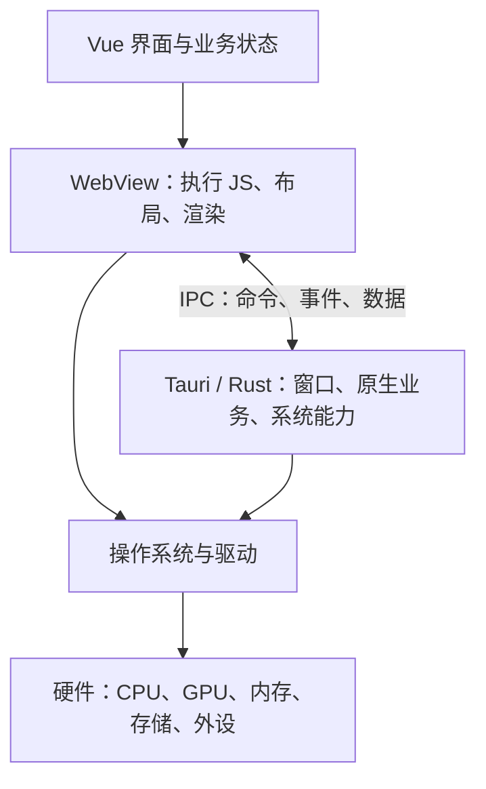

**Vue 负责描述和更新界面，WebView 负责执行并显示这个界面，Tauri 负责把它装进原生应用，并连接操作系统能力。硬件则在最底层执行计算、存储数据和输出画面。**

这里要分清楚两件事：**构建时，源码变成什么；运行时，谁执行这些东西。**

**1. 构建时：Vue 项目变成 WebView 能理解的文件**

你写的 Vue 文件通常是：

```
<template>
  <button @click="count++">{{ count }}</button>
</template>

<script setup>
import { ref } from 'vue'
const count = ref(0)
</script>

<style>
button { color: blue; }
</style>
```

`.vue` 是方便开发的源码格式，WebView 通常不会直接执行它。Vite 等构建工具会把项目转换成：

|产物|作用|
|---|---|
| `index.html` |页面入口，引用 JS、CSS，提供挂载位置|
| `assets/*.js` |Vue 运行时代码、组件逻辑、编译后的模板等|
| `assets/*.css` |样式|
|图片、字体等|页面资源|

**Vue 的模板通常编译成 JavaScript 渲染函数，因此打包后的 HTML 可能非常简单。**页面的大部分内容由 JS 在运行时创建和更新。Vue 官方推荐的构建流程会把生产产物放到 `dist` 目录。[GitHub](https://github.com/vuejs/docs/blob/main/src/guide/quick-start.md?utm_source=chatgpt.com)

与此同时，Rust 编译器把 **Tauri 框架代码和你的 Rust 代码**编译成原生程序。典型的 Tauri 构建再将前端资源纳入应用，生成可执行文件和安装包。

所以，**打包没有把 Vue 的全部 JS 转成 Rust 原生机器码**：前端仍由 WebView 的 JavaScript 引擎执行。

**2. 运行时：它们不是一条简单的上下堆叠，而是两个协作部分**



具体分工是：

|部分|所处位置|主要负责|
|---|---|---|
|HTML / CSS / JS|前端资源|页面入口、样式、程序逻辑|
|Vue|WebView 内的 JS 框架|组件、响应式状态、界面更新|
|WebView|原生应用中的网页运行环境|执行 JS、管理 DOM、布局、绘制、处理网页输入|
|Tauri / Rust|原生应用核心|创建窗口和 WebView、生命周期、IPC、插件、原生业务|
|操作系统与驱动|系统层|进程调度、文件、网络、窗口合成、设备访问|
|硬件|物理执行层|计算、内存读写、存储、显示和输入|

Tauri 的核心进程管理 WebView，并通过 IPC 与前端通信；具体进程划分还取决于平台的 WebView 实现。[Tauri](https://v2.tauri.app/concept/process-model/?utm_source=chatgpt.com)

**3. WebView 到底是什么？**

可以把它理解为：**能够嵌入原生窗口的浏览器内容区域。**

它提供浏览器的关键运行能力：

- HTML 解析和 DOM；
- CSS 布局与绘制；
- JavaScript 引擎；
- 网页事件循环；
- 部分浏览器 API。

它通常没有完整浏览器的地址栏、标签页等外壳。

Tauri 在 Windows 使用 **WebView 2**，macOS 使用 **WKWebView**，Linux 使用 **WebKitGTK**。[Tauri](https://v2.tauri.app/concept/process-model/?utm_source=chatgpt.com)

所以，**Vue 运行在 WebView 里面；WebView 被 Tauri 创建和管理。**

**4. 为什么 Vue 和 Tauri 能结合？**

因为双方的接口恰好匹配：

> Vue 项目生成标准 Web 资源；Tauri 提供能够加载这些资源的 WebView，并提供连接原生能力的桥梁。

Tauri 不需要理解你的 `.vue` 组件。它需要的是构建后的 HTML、CSS、JS。因此同样可以结合 React、Svelte，或者直接手写 HTML 和 JS。

需要原生能力时，前端通过 Tauri 的 JS API 发出请求，Rust 端处理后返回数据。例如：

```
import { invoke } from '@tauri-apps/api/core'

const content = await invoke('read_document', {
  path: '/some/document.txt'
})
```

这里的 `invoke` 会跨越前端与原生核心的边界，调用你注册的 Rust 命令；它不是普通的同进程 JS 函数调用。Tauri 用命令、事件等 IPC 机制连接两端。[Tauri](https://v2.tauri.app/concept/inter-process-communication/?utm_source=chatgpt.com)

**5. 硬件什么时候参与？看两个具体过程**

**点击一个计数按钮：**

1. 鼠标产生输入，操作系统把事件送到窗口和 WebView。
2. WebView 执行 JS 点击回调，`count++`。
3. Vue 根据状态变化更新 DOM。
4. WebView 重新计算必要的布局、绘制和合成。
5. 操作系统把窗口画面合成到屏幕上。

其中 CPU 执行 JS 和布局等工作，内存保存状态与页面数据；渲染过程中可能使用 GPU 加速。**普通界面更新通常不需要调用 Rust。**

**点击“读取文件”：**

1. Vue 的点击回调调用 `invoke`。
2. IPC 把请求交给 Tauri / Rust。
3. Rust 调用操作系统文件接口。
4. 操作系统通过文件系统、缓存和驱动访问数据，必要时读取存储设备。
5. 结果返回前端，Vue 更新界面，WebView 显示内容。

因此，**硬件同时支撑前端和原生核心，并不是只有 Rust 才会使用硬件。**区别在于访问路径和权限：前端通过 WebView 提供的能力工作，原生核心通过操作系统接口实现更广泛的系统操作。

你可以用一句话记住这套关系：**Vue 决定界面如何随状态变化，WebView 让 Web 界面运行起来，Tauri 让它成为具有原生能力的应用，操作系统和硬件完成实际执行。**