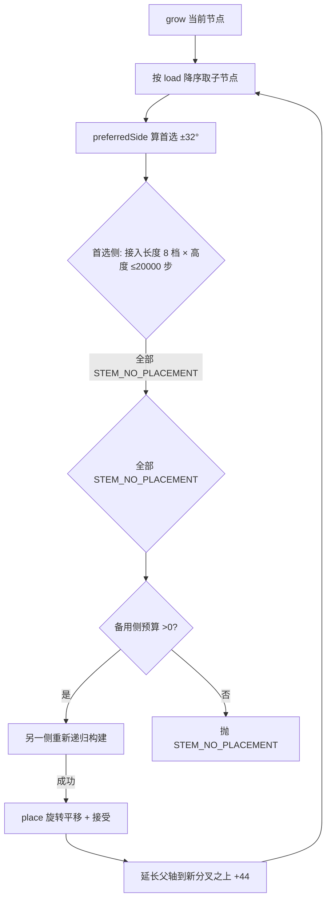

```mermaid
flowchart TD
    A["grow 当前节点"]
    B["按 load 降序取子节点"]
    C["preferredSide 算首选 ±32°"]
    D{"首选侧: 接入长度 8 档 × 高度 ≤20000 步"}
    E{"全部 STEM_NO_PLACEMENT"}
    F{"备用侧预算 >0?"}
    G["另一侧重新递归构建"]
    H["抛 STEM_NO_PLACEMENT"]
    I["place 旋转平移 + 接受"]
    J["延长父轴到新分叉之上 +44"]

    A --> B
    B --> C
    C --> D
    D -->|全部 STEM_NO_PLACEMENT| E
    E --> F
    F -->|是| G
    F -->|否| H
    G -->|成功| I
    I --> J
    J --> B
```