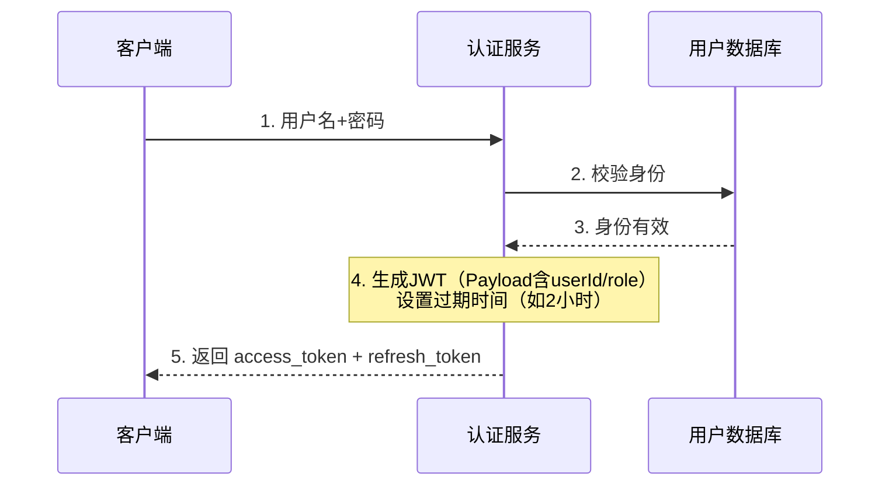
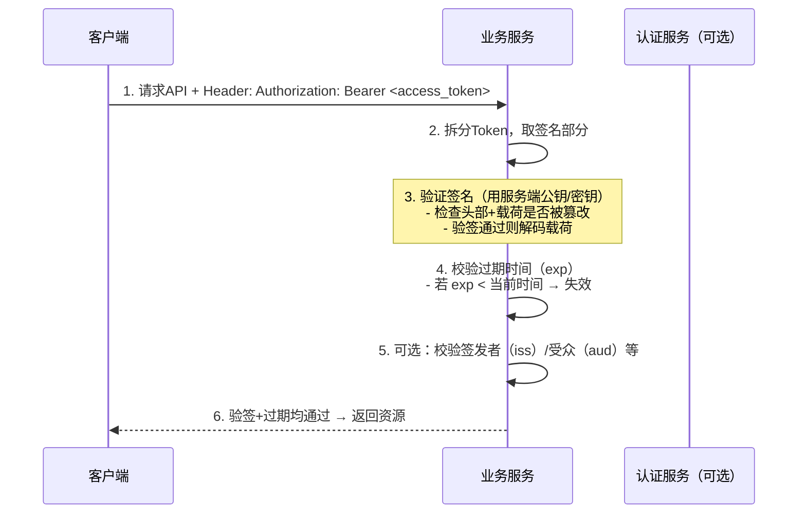
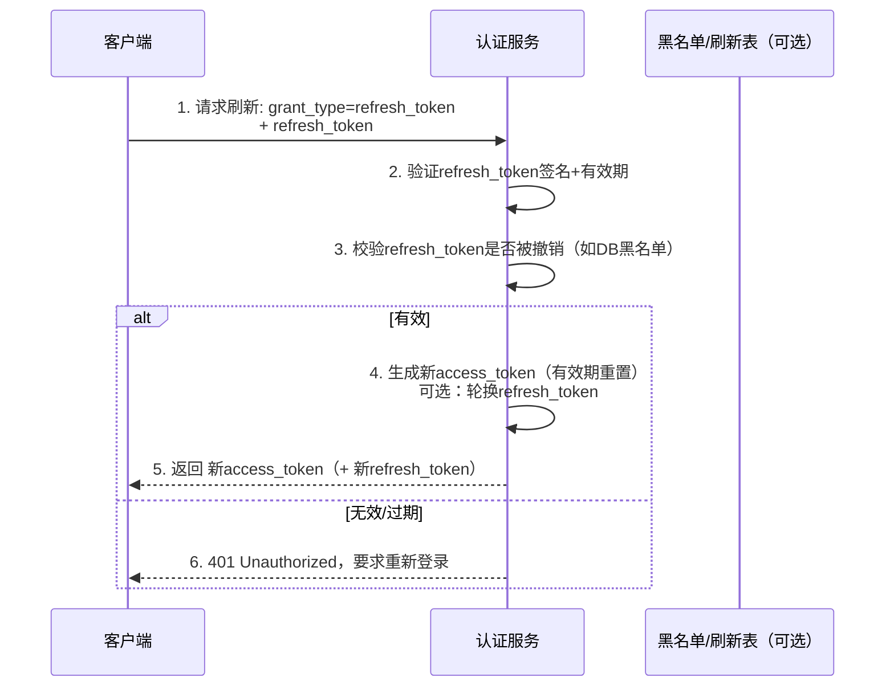

# HS256

```python
import jwt
key = "secret"
encoded = jwt.encode(
	{"some": "payload"},
	key,
	algorithm="HS256"
)
print(jwt.decode(encoded, key, algorithms="HS265"))
```

# 登录与颁发 Token（首次获取）



# 正确请求资源（验证逻辑）



# Access Token 过期 → 用 Refresh Token 刷新

