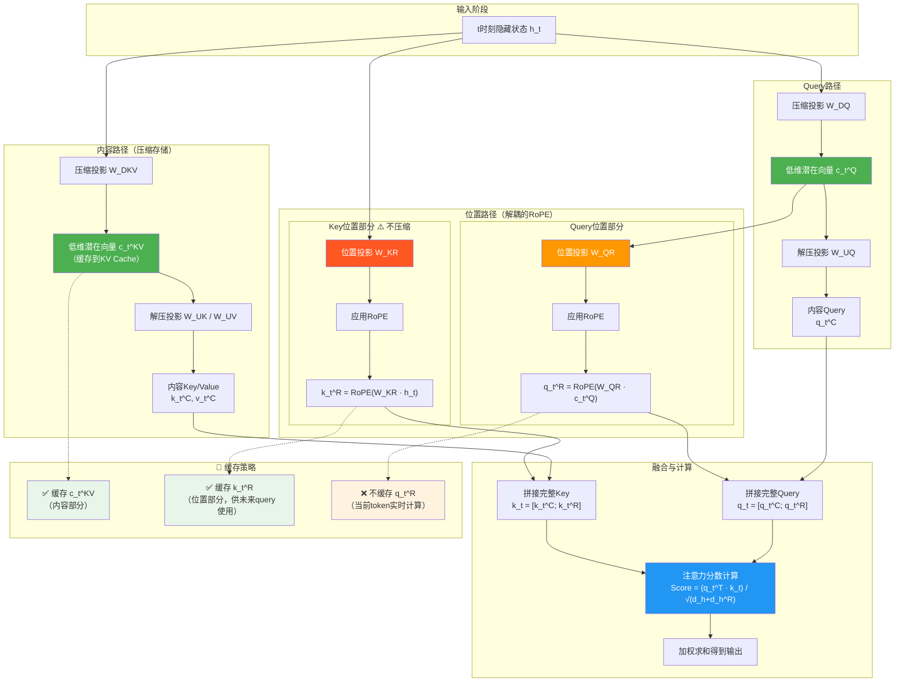
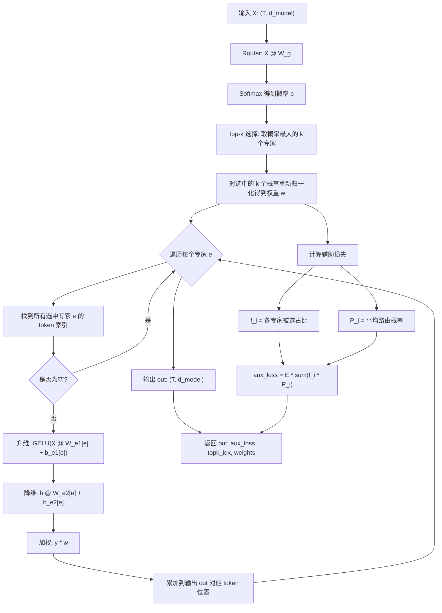
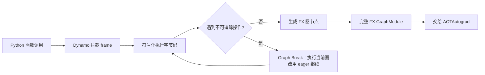
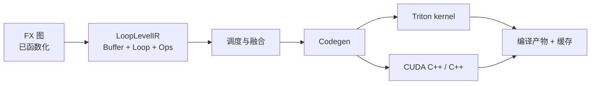

# 单头

```python
import torch
import torch.nn.functional as F


def self_attention_single_head(
    X: torch.Tensor,  # 输入序列特征 (batch, seq_len, d_model) 或 (seq_len, d_model)
    W_q: torch.Tensor,  # Query 权重矩阵 (d_model, d_k)
    W_k: torch.Tensor,  # Key 权重矩阵 (d_model, d_k)
    W_v: torch.Tensor,  # Value 权重矩阵 (d_model, d_v)
) -> tuple[torch.Tensor, torch.Tensor]:
    r"""单头自注意力（手写实现）。

    自注意力的核心公式：

    $$
    \text{Attention}(Q, K, V) =
    \text{softmax}\left(\frac{QK^\top}{\sqrt{d_k}}\right) V
    $$

    其中三个线性投影为：

    $$
    Q = XW_q,\qquad K = XW_k,\qquad V = XW_v
    $$

    计算步骤：
    1. 用三个权重矩阵把输入 $X$ 投影为 Query / Key / Value；
    2. 计算缩放点积分数 $\text{scores} = QK^\top / \sqrt{d_k}$，
       除以 $\sqrt{d_k}$ 是为了防止点积过大导致 softmax 梯度消失；
    3. 对分数在 key 维度（dim=-1）做 softmax，得到注意力权重；
    4. 用注意力权重对 Value 加权求和得到输出。

    参数：
        X: 输入张量，形状 (batch, seq_len, d_model) 或 (seq_len, d_model)。
        W_q, W_k, W_v: 投影权重，形状均为 (d_model, d_k)（此处取 d_v = d_k）。

    返回：
        output: 注意力输出，形状与输入序列维度一致 (batch, seq_len, d_k)。
        attn_weights: 注意力权重 (batch, seq_len, seq_len)，每行和为 1。
    """

    # --- 1. 线性投影：Q = XW_q, K = XW_k, V = XW_v ---
    Q = X @ W_q  # (…, seq_len, d_k)
    K = X @ W_k  # (…, seq_len, d_k)
    V = X @ W_v  # (…, seq_len, d_k)

    # --- 2. 缩放点积分数 scores = QK^T / sqrt(d_k) ---
    d_k = Q.size(-1)  # 特征维度，用于缩放
    # 注意：用 mT 只转置最后两维，(…, seq_len, d_k) -> (…, d_k, seq_len)
    scores = Q @ K.mT / (d_k**0.5)  # (…, seq_len, seq_len)

    # --- 3. 对最后一维（key 方向）做 softmax 归一化 ---
    attn_weights = F.softmax(scores, dim=-1)  # (…, seq_len, seq_len)，每行和为 1

    # --- 4. 注意力权重加权求和 Value ---
    output = attn_weights @ V  # (…, seq_len, d_k)

    return output, attn_weights


if __name__ == "__main__":
    # ========== 测试输入 ==========
    torch.manual_seed(0)  # 固定随机种子，保证结果可复现

    seq_len, d_model, d_k = 4, 8, 8  # 序列长度 / 输入维度 / 注意力维度

    # 测试 1：单序列输入（无 batch 维）
    X = torch.randn(seq_len, d_model)  # (4, 8)
    W = torch.randn(d_model, d_k)  # (8, 8)，三个投影用同一个权重简化演示
    output, attn = self_attention_single_head(X, W, W, W)
    print(f"单序列: X{X.shape} -> output{output.shape}, attn{attn.shape}")
    print(f"attn 每行和（应为 1）: {attn.sum(dim=-1).tolist()}")

    # 测试 2：带 batch 的输入（深度学习常用形状）
    batch = 2
    X_batch = torch.randn(batch, seq_len, d_model)  # (2, 4, 8)
    output_b, attn_b = self_attention_single_head(X_batch, W, W, W)
    print(f"batch: X{X_batch.shape} -> output{output_b.shape}, attn{attn_b.shape}")
    print(f"attn 每行和（应为 1）: {attn_b.sum(dim=-1).tolist()}")

    # 测试 3：断言检查，验证注意力权重确实归一化
    assert torch.allclose(attn.sum(dim=-1), torch.ones(seq_len), atol=1e-5)
    assert torch.allclose(attn_b.sum(dim=-1), torch.ones(batch, seq_len), atol=1e-5)
    print("全部断言通过 ✓")

```

# 带 Mask 的通用版本

增加一个内容

```

def self_attention_batch(X, W_q, W_k, W_v, mask=None):
...

if mask is not None:
    # 将 mask 中为 0 的位置设为 -inf
    scores = scores.masked_fill(mask == 0, float('-inf'))
...

```

## 多头注意力

$$
\text{scores}_{ij} = \frac{Q_i K_j^\top}{\sqrt{d_k}} +
\begin{cases}
	0 & \text{mask}_{ij} = 1 \\
	-\infty & \text{mask}_{ij} = 0
\end{cases}
$$

```python
import torch
import torch.nn.functional as F


def self_attention_batch(
    X: torch.Tensor,  # 输入 (batch, seq_len, d_model)
    W_q: torch.Tensor,  # Query 权重 (d_model, d_k)
    W_k: torch.Tensor,  # Key 权重 (d_model, d_k)
    W_v: torch.Tensor,  # Value 权重 (d_model, d_v)
    mask: torch.Tensor | None = None,  # (seq_len, seq_len) 或 (batch, seq_len, seq_len)；1=参与 attention，0=屏蔽
) -> tuple[torch.Tensor, torch.Tensor]:
    r"""带 batch 和 mask 的单头自注意力。

    公式与单序列版本相同，只是多了 batch 维：

    $$
    \text{Attention}(Q, K, V) =
    \text{softmax}\left(\frac{QK^\top}{\sqrt{d_k}} + \text{mask}\right) V
    $$

    mask 的作用：把不想 attend 的位置（padding 填充位、未来位置等）在
    softmax 之前设为 $-\infty$，使对应位置的概率变为 0。

    $$
    \text{scores}_{ij} = \frac{Q_i K_j^\top}{\sqrt{d_k}} +
    \begin{cases}
        0 & \text{mask}_{ij} = 1 \\
        -\infty & \text{mask}_{ij} = 0
    \end{cases}
    $$

    参数：
        X: 输入张量 (batch, seq_len, d_model)。
        W_q, W_k, W_v: 投影权重 (d_model, d_k)。
        mask: 注意力掩码，1 表示允许 attend，0 表示屏蔽。
            形状可为 (seq_len, seq_len)（所有 batch 共用）或
            (batch, seq_len, seq_len)（每个样本不同）。
            注意：某一行全为 0 时 softmax 会得到 NaN。

    返回：
        output: 注意力输出 (batch, seq_len, d_k)。
        attn_weights: 注意力权重 (batch, seq_len, seq_len)，每行和为 1。
    """

    # --- 1. 线性投影 ---
    Q = X @ W_q  # (batch, seq_len, d_k)
    K = X @ W_k
    V = X @ W_v

    # --- 2. 缩放点积分数 ---
    d_k = Q.size(-1)
    scores = Q @ K.mT / (d_k**0.5)  # (batch, seq_len, seq_len)

    # --- 3. 应用 mask：把 0 的位置填 -inf ---
    if mask is not None:
        scores = scores.masked_fill(mask == 0, float("-inf"))

    # --- 4. softmax + 加权求和 ---
    attn_weights = F.softmax(scores, dim=-1)  # (batch, seq_len, seq_len)
    output = attn_weights @ V  # (batch, seq_len, d_k)

    return output, attn_weights


def multi_head_attention(
    X: torch.Tensor,  # 输入 (batch, seq_len, d_model)
    W_q: torch.Tensor,  # Query 权重 (d_model, num_heads * head_dim)
    W_k: torch.Tensor,  # Key 权重 (d_model, num_heads * head_dim)
    W_v: torch.Tensor,  # Value 权重 (d_model, num_heads * head_dim)
    num_heads: int = 2,  # 注意力头数
    mask: torch.Tensor | None = None,  # 同 self_attention_batch
    W_o: torch.Tensor | None = None,  # 输出投影 (num_heads*head_dim, d_model)；None 则不投影
) -> tuple[torch.Tensor, torch.Tensor]:
    r"""多头自注意力（手写实现）。

    多头就是把 $d_k$ 维的特征切成 $h$ 份，每个头独立做一次注意力，
    最后拼接起来再做一次线性投影：

    $$
    \text{MultiHead}(Q, K, V) =
    \text{Concat}(\text{head}_1, \dots, \text{head}_h) W_o
    $$

    $$
    \text{head}_i = \text{softmax}\left(
        \frac{(XW_q^i)(XW_k^i)^\top}{\sqrt{d_k}} + \text{mask}
    \right) XW_v^i
    $$

    每个头关注不同的子空间（例如有的头关注局部依赖，有的关注长距离），
    这是 Transformer 里 attention 层的关键设计。

    参数：
        X: 输入张量 (batch, seq_len, d_model)。
        W_q, W_k, W_v: 投影权重 (d_model, num_heads * head_dim)。
        num_heads: 头数，必须整除 W_q 的最后一维。
        mask: 同 self_attention_batch，形状 (seq_len, seq_len) 或
            (batch, seq_len, seq_len)，自动广播到所有头。
        W_o: 输出投影 (num_heads*head_dim, d_model)；传 None 时直接返回拼接结果。

    返回：
        output: 注意力输出 (batch, seq_len, num_heads*head_dim) 或投影后 (batch, seq_len, d_model)。
        attn_weights: 每个头的注意力权重 (batch, num_heads, seq_len, seq_len)。
    """

    batch, seq_len, _ = X.shape
    # 每个头的维度 = 总维度 / 头数
    assert W_q.size(-1) % num_heads == 0, "num_heads 必须整除 W_q 最后一维"
    head_dim = W_q.size(-1) // num_heads

    # --- 1. 线性投影并拆成多头 ---
    # 先投影得到 (batch, seq_len, num_heads*head_dim)
    Q = X @ W_q
    K = X @ W_k
    V = X @ W_v
    # 拆头: (batch, seq_len, num_heads, head_dim) -> 转置 -> (batch, num_heads, seq_len, head_dim)
    # 这样每个头内部就是独立的 (batch, seq_len, head_dim) 矩阵，可并行批量计算
    Q = Q.view(batch, seq_len, num_heads, head_dim).transpose(1, 2)
    K = K.view(batch, seq_len, num_heads, head_dim).transpose(1, 2)
    V = V.view(batch, seq_len, num_heads, head_dim).transpose(1, 2)

    # --- 2. 缩放点积分数（所有头一起算）---
    scores = Q @ K.mT / (head_dim**0.5)  # (batch, num_heads, seq_len, seq_len)

    # --- 3. 应用 mask（自动广播到所有头）---
    if mask is not None:
        scores = scores.masked_fill(mask == 0, float("-inf"))

    # --- 4. 每个头独立 softmax + 加权求和 ---
    attn_weights = F.softmax(scores, dim=-1)  # (batch, num_heads, seq_len, seq_len)
    heads = attn_weights @ V  # (batch, num_heads, seq_len, head_dim)

    # --- 5. 拼接多头并做输出投影 ---
    # 还原维度: (batch, num_heads, seq_len, head_dim) -> (batch, seq_len, num_heads, head_dim)
    # -> view 展平为 (batch, seq_len, num_heads*head_dim)
    concat = heads.transpose(1, 2).contiguous().view(batch, seq_len, num_heads * head_dim)
    output = concat @ W_o if W_o is not None else concat

    return output, attn_weights


def build_causal_mask(seq_len: int) -> torch.Tensor:
    r"""构造因果 mask：只允许 attend 到当前位置及之前的位置。

    $$
    \text{mask}_{ij} = \begin{cases}
        1 & j \le i \quad (\text{当前位置或之前}) \\
        0 & j > i \quad (\text{未来位置，需屏蔽})
    \end{cases}
    $$

    用于自回归解码（GPT 类模型）：生成第 $i$ 个 token 时不能看到
    第 $i+1$ 个及之后的 token。
    """
    # tril 生成下三角全 1 矩阵，上三角为 0
    return torch.tril(torch.ones(seq_len, seq_len, dtype=torch.bool))


if __name__ == "__main__":
    # ========== 测试输入 ==========
    torch.manual_seed(0)
    batch, seq_len, d_model = 2, 6, 8
    d_k = 8

    X = torch.randn(batch, seq_len, d_model)  # (2, 6, 8)
    W = torch.randn(d_model, d_k)  # (8, 8)

    print("=" * 50)
    print("测试 1：batch 单头 + padding mask")
    print("=" * 50)
    # padding mask：屏蔽每个序列的最后一个 token（视为填充位）
    pad_mask = torch.ones(batch, seq_len, seq_len, dtype=torch.bool)
    pad_mask[:, :, -1] = False  # 任何位置都不能 attend 到最后一个 token
    out1, attn1 = self_attention_batch(X, W, W, W, mask=pad_mask)
    print(f"output{out1.shape}, attn{attn1.shape}")
    # 校验：最后一列的注意力权重全为 0（被屏蔽）
    assert (attn1[:, :, -1] == 0).all(), "被屏蔽的 token 不应被 attend"
    # 校验：未屏蔽的行和为 1
    assert torch.allclose(attn1.sum(dim=-1), torch.ones(batch, seq_len), atol=1e-5)
    print(f"✓ 被屏蔽列全为 0，其余行和为 1")

    print("=" * 50)
    print("测试 2：多头注意力 + 因果 mask")
    print("=" * 50)
    num_heads, head_dim = 2, 4
    W_mh = torch.randn(d_model, num_heads * head_dim)  # (8, 8)
    causal = build_causal_mask(seq_len)  # (6, 6) 下三角
    out2, attn2 = multi_head_attention(X, W_mh, W_mh, W_mh, num_heads=num_heads, mask=causal)
    print(f"output{out2.shape}, attn{attn2.shape}")
    # 校验：因果 mask 下注意力矩阵必须是下三角（上三角全为 0）
    upper = torch.triu(attn2, diagonal=1)
    assert (upper == 0).all(), "因果 mask 下不能 attend 未来位置"
    # 校验：每行和为 1（第 i 行至少能 attend 到自己）
    assert torch.allclose(attn2.sum(dim=-1), torch.ones(batch, num_heads, seq_len), atol=1e-5)
    print(f"✓ 上三角全为 0（因果），每行和为 1")
    print(f"  头 0 的注意力权重（batch 0，可看到每个 token 只 attend 自己及之前）:")
    print(attn2[0, 0].round(decimals=2))

    print("=" * 50)
    print("测试 3：多头 + 输出投影 W_o")
    print("=" * 50)
    W_o = torch.randn(num_heads * head_dim, d_model)
    out3, attn3 = multi_head_attention(X, W_mh, W_mh, W_mh, num_heads=num_heads, mask=causal, W_o=W_o)
    print(f"output{out3.shape}（投影回 {d_model} 维）")
    assert out3.shape == (batch, seq_len, d_model)

    print("\n全部断言通过 ✓")
```

# MLA 多头潜在注意力

标准 MHA 每个 token 要缓存所有头的 K 和 V（$2 \times n_h \times d_h$ 个浮点数），序列一长 KV cache 就爆炸。MLA 的核心思路：
把 K 和 V 联合压缩成一个低维潜在向量，只缓存它。

对第 $t$ 个 token：

$$
c_t^{KV} = W^{DKV} h_t \qquad
k_t^C = W^{UK} c_t^{KV}, \quad
v_t^C = W^{UV} c_t^{KV}
$$

Query 同样先压缩再升维：

$$
c_t^Q = W^{DQ} h_t \qquad
q_t^C = W^{UQ} c_t^Q
$$

RoPE 依赖位置、无法折进低秩压缩，所以 MLA 把旋转位置编码解耦出来：

$$
q_t^R = \text{RoPE}(W^{QR} c_t^Q), \qquad
k_t^R = \text{RoPE}(W^{KR} h_t)
$$

最终拼接 content 与 rotary 两部分算注意力：

$$
q_t = [q_t^C;\, q_t^R], \quad k_t = [k_t^C;\, k_t^R], \qquad
o_t = \sum_{i \le t} \text{softmax}_i\!\left(
	\frac{q_t^\top k_i}{\sqrt{d_h + d_h^R}}
\right) v_i^C
$$

缓存对比（每 token）：标准 MHA 缓存 $2 n_h d_h$；MLA 只缓存
$c_t^{KV}$（$d_c$ 维）+ $k_t^R$（$n_h d_h^R$ 维），通常 $d_c \ll n_h d_h$。
推理时还可把 $W^{UK}$ 吸收进 $W^{UQ}$（$q^{C\top} k^C =c^{Q\top}(W^{UQ\top}W^{UK})c^{KV}$），连升维都省掉。


```python
import torch
import torch.nn.functional as F

from multi_head_attention import build_causal_mask  # 复用上一文件的因果 mask


def rotary_embedding(x: torch.Tensor, theta: float = 10000.0) -> torch.Tensor:
    r"""旋转位置编码 RoPE（Rotary Position Embedding）。

    对最后一维按相邻两元素成对旋转。位置 $m$ 处、频率 $\theta_j$ 的旋转：

    $$
    \begin{pmatrix} x'_{2j} \\ x'_{2j+1} \end{pmatrix}
    = \begin{pmatrix}
        \cos(m\theta_j) & -\sin(m\theta_j) \\
        \sin(m\theta_j) & \cos(m\theta_j)
    \end{pmatrix}
    \begin{pmatrix} x_{2j} \\ x_{2j+1} \end{pmatrix},
    \qquad \theta_j = \theta^{-2j/d}
    $$

    关键性质：两个向量的内积只取决于**相对位置**，因此位置信息天然融入
    注意力分数，且不增加可学习参数。

    参数：
        x: 输入张量 (..., seq_len, d)，d 必须为偶数。
        theta: 基频（base），控制频率跨度。

    返回：
        旋转后的张量，形状不变。
    """

    d = x.size(-1)
    seq_len = x.size(-2)
    assert d % 2 == 0, "最后一维必须为偶数（按对旋转）"

    # 频率: (d/2,)，位置: (seq_len,)，外积得到每个位置每对维度的旋转角
    freqs = 1.0 / (theta ** (torch.arange(0, d, 2, dtype=torch.float32) / d))
    positions = torch.arange(seq_len, dtype=torch.float32)
    angles = positions[:, None] * freqs[None, :]  # (seq_len, d/2)
    cos = angles.cos()
    sin = angles.sin()

    # 拆成相邻对: (..., seq_len, d/2, 2)
    x_pairs = x.float().reshape(*x.shape[:-1], -1, 2)
    x0, x1 = x_pairs[..., 0], x_pairs[..., 1]

    # 旋转公式（cos/sin 自动广播到 batch/head 维）
    rotated = torch.stack(
        [x0 * cos - x1 * sin, x0 * sin + x1 * cos], dim=-1
    )
    return rotated.reshape_as(x).type_as(x)


def multi_head_latent_attention(
    X: torch.Tensor,  # 输入 (batch, seq_len, d_model)
    W_dkv: torch.Tensor,  # KV 下投影 (d_model, d_c)，把 K/V 压缩到 d_c 维潜在空间
    W_uk: torch.Tensor,  # Key 上投影 (d_c, n_h * d_h)
    W_uv: torch.Tensor,  # Value 上投影 (d_c, n_h * d_h)
    W_dq: torch.Tensor,  # Query 下投影 (d_model, d_c')
    W_uq: torch.Tensor,  # Query 上投影 (d_c', n_h * d_h)
    W_qr: torch.Tensor,  # 旋转 Query 投影 (d_c', n_h * d_h^R)
    W_kr: torch.Tensor,  # 旋转 Key 投影 (d_model, n_h * d_h^R)
    num_heads: int,  # 头数 n_h
    head_dim: int,  # 每头内容维度 d_h
    rotary_dim: int,  # 每头旋转位置编码维度 d_h^R
    rope_theta: float = 10000.0,  # RoPE 基频
    mask: torch.Tensor | None = None,  # 同前两个文件，1=允许 attend
    W_o: torch.Tensor | None = None,  # 输出投影 (n_h*d_h, d_model)，None 则不投影
) -> tuple[torch.Tensor, torch.Tensor]:
    r"""多头潜在注意力 MLA（DeepSeek-V2 提出，V3/R1 沿用）。

    标准 MHA 每个 token 要缓存所有头的 K 和 V（$2 \times n_h \times d_h$
    个浮点数），序列一长 KV cache 就爆炸。MLA 的核心思路：
    把 K 和 V 联合压缩成一个低维潜在向量，只缓存它。

    对第 $t$ 个 token：

    $$
    c_t^{KV} = W^{DKV} h_t \qquad
    k_t^C = W^{UK} c_t^{KV}, \quad
    v_t^C = W^{UV} c_t^{KV}
    $$

    Query 同样先压缩再升维：

    $$
    c_t^Q = W^{DQ} h_t \qquad
    q_t^C = W^{UQ} c_t^Q
    $$

    RoPE 依赖位置、无法折进低秩压缩，所以 MLA 把旋转位置编码解耦出来：

    $$
    q_t^R = \text{RoPE}(W^{QR} c_t^Q), \qquad
    k_t^R = \text{RoPE}(W^{KR} h_t)
    $$

    最终拼接 content 与 rotary 两部分算注意力：

    $$
    q_t = [q_t^C;\, q_t^R], \quad k_t = [k_t^C;\, k_t^R], \qquad
    o_t = \sum_{i \le t} \text{softmax}_i\!\left(
        \frac{q_t^\top k_i}{\sqrt{d_h + d_h^R}}
    \right) v_i^C
    $$

    缓存对比（每 token）：标准 MHA 缓存 $2 n_h d_h$；MLA 只缓存
    $c_t^{KV}$（$d_c$ 维）+ $k_t^R$（$n_h d_h^R$ 维），通常 $d_c \ll n_h d_h$。
    推理时还可把 $W^{UK}$ 吸收进 $W^{UQ}$（$q^{C\top} k^C =
    c^{Q\top}(W^{UQ\top}W^{UK})c^{KV}$），连升维都省掉。

    参数：
        X: 输入 (batch, seq_len, d_model)。
        W_dkv/W_uk/W_uv/W_dq/W_uq/W_qr/W_kr: 各投影权重，形状见签名注释。
        num_heads/head_dim/rotary_dim: 结构参数。
        rope_theta: RoPE 基频。
        mask: 同前，自动广播到所有头。
        W_o: 可选输出投影。

    返回：
        output: (batch, seq_len, n_h*d_h) 或投影后 (batch, seq_len, d_model)。
        attn_weights: (batch, n_h, seq_len, seq_len)，每头每行和为 1。
    """

    batch, seq_len, _ = X.shape
    n_h, d_h, d_h_r = num_heads, head_dim, rotary_dim
    d_c = W_dkv.size(-1)  # KV 潜在维度
    d_c_q = W_dq.size(-1)  # Query 潜在维度

    # --- 1. KV 联合压缩（MLA 的核心）---
    # c_t^KV 就是每个 token 需要缓存的潜在向量，后续 K/V 都由它升维还原
    C_kv = X @ W_dkv  # (b, s, d_c)  ← 缓存它
    K_c = (C_kv @ W_uk).view(batch, seq_len, n_h, d_h).transpose(1, 2)  # (b, n_h, s, d_h)
    V_c = (C_kv @ W_uv).view(batch, seq_len, n_h, d_h).transpose(1, 2)

    # --- 2. Query 压缩 ---
    C_q = X @ W_dq  # (b, s, d_c')
    Q_c = (C_q @ W_uq).view(batch, seq_len, n_h, d_h).transpose(1, 2)

    # --- 3. 解耦的旋转 query/key（RoPE 只作用在这部分）---
    Q_r = (C_q @ W_qr).view(batch, seq_len, n_h, d_h_r).transpose(1, 2)
    K_r = (X @ W_kr).view(batch, seq_len, n_h, d_h_r).transpose(1, 2)
    Q_r = rotary_embedding(Q_r, rope_theta)  # (b, n_h, s, d_h^R)
    K_r = rotary_embedding(K_r, rope_theta)  # ← K_r 也需要缓存（配合未来的 query 算分数）

    # --- 4. 拼接 content + rotary 两部分，计算注意力 ---
    Q = torch.cat([Q_c, Q_r], dim=-1)  # (b, n_h, s, d_h + d_h^R)
    K = torch.cat([K_c, K_r], dim=-1)
    scores = Q @ K.mT / ((d_h + d_h_r) ** 0.5)  # (b, n_h, s, s)，缩放用总维度

    if mask is not None:
        scores = scores.masked_fill(mask == 0, float("-inf"))

    attn_weights = F.softmax(scores, dim=-1)

    # --- 5. 加权求和：只对 content 部分 V 求加权（rotary 维度不参与输出）---
    heads = attn_weights @ V_c  # (b, n_h, s, d_h)

    # --- 6. 拼接多头 + 可选输出投影 ---
    concat = heads.transpose(1, 2).contiguous().view(batch, seq_len, n_h * d_h)
    output = concat @ W_o if W_o is not None else concat

    return output, attn_weights


if __name__ == "__main__":
    # ========== 测试输入 ==========
    torch.manual_seed(0)
    batch, seq_len, d_model = 2, 8, 32  # 输入形状
    n_h, d_h, d_h_r = 4, 8, 4  # 4 头，每头内容 8 维、旋转 4 维
    d_c, d_c_q = 16, 16  # KV/Query 潜在维度（远小于 n_h*d_h = 32，体现压缩）

    X = torch.randn(batch, seq_len, d_model)
    scale = 0.1  # 权重缩放，避免 softmax 过于尖锐
    W_dkv = torch.randn(d_model, d_c) * scale
    W_uk = torch.randn(d_c, n_h * d_h) * scale
    W_uv = torch.randn(d_c, n_h * d_h) * scale
    W_dq = torch.randn(d_model, d_c_q) * scale
    W_uq = torch.randn(d_c_q, n_h * d_h) * scale
    W_qr = torch.randn(d_c_q, n_h * d_h_r) * scale
    W_kr = torch.randn(d_model, n_h * d_h_r) * scale

    print("=" * 50)
    print("测试 1：MLA 前向 + 因果 mask")
    print("=" * 50)
    causal = build_causal_mask(seq_len)
    out, attn = multi_head_latent_attention(
        X, W_dkv, W_uk, W_uv, W_dq, W_uq, W_qr, W_kr,
        n_h, d_h, d_h_r, mask=causal,
    )
    print(f"output{out.shape}, attn{attn.shape}")
    assert out.shape == (batch, seq_len, n_h * d_h)
    assert attn.shape == (batch, n_h, seq_len, seq_len)
    assert (torch.triu(attn, diagonal=1) == 0).all(), "因果 mask 下不能 attend 未来"
    assert torch.allclose(attn.sum(-1), torch.ones(batch, n_h, seq_len), atol=1e-5)
    print("✓ 形状正确、因果性正确、每行和为 1")

    print("=" * 50)
    print("测试 2：RoPE 性质（相对位置不变性 + 范数保持）")
    print("=" * 50)
    # 固定一对向量 q、k，让它们分别出现在位置 (5,3) 和 (2,0)——相对位置差都是 2
    q_vec, k_vec = torch.randn(4), torch.randn(4)
    v = torch.zeros(1, 6, 1, 4)
    v[:, 5], v[:, 2] = q_vec, q_vec
    v[:, 3], v[:, 0] = k_vec, k_vec
    r = rotary_embedding(v)
    # 内积只依赖相对位置：<q@5, k@3> 应等于 <q@2, k@0>（相对位置差都是 2）
    rel_a = (r[:, 5] * r[:, 3]).sum()
    rel_b = (r[:, 2] * r[:, 0]).sum()
    assert torch.allclose(rel_a, rel_b, atol=1e-5)
    print(f"相对位置差 2 的两组内积: {rel_a.item():.4f} == {rel_b.item():.4f}")
    # 旋转不改变向量长度
    assert torch.allclose(r.norm(dim=-1), v.norm(dim=-1), atol=1e-5)
    print("✓ 内积仅依赖相对位置、旋转保持范数")

    print("=" * 50)
    print("测试 3：KV cache 对比")
    print("=" * 50)
    mha_cache = 2 * n_h * d_h
    mla_cache = d_c + n_h * d_h_r
    print(f"标准 MHA: 2×{n_h}×{d_h} = {mha_cache} floats/token")
    print(f"MLA: d_c({d_c}) + n_h×d_h^R({n_h}×{d_h_r}) = {mla_cache} floats/token")
    print(f"本示例节省 {mha_cache / mla_cache:.2f}×")
    # DeepSeek-V2 论文真实配置（n_h=128, d_h=128, d_c=512, d_h^R=64）
    real_mha = 2 * 128 * 128
    real_mla = 512 + 128 * 64
    print(f"DeepSeek-V2 真实配置: {real_mha} -> {real_mla} = {real_mha / real_mla:.2f}×")

    print("=" * 50)
    print("测试 4：输出投影 W_o")
    print("=" * 50)
    W_o = torch.randn(n_h * d_h, d_model) * scale
    out4, _ = multi_head_latent_attention(
        X, W_dkv, W_uk, W_uv, W_dq, W_uq, W_qr, W_kr,
        n_h, d_h, d_h_r, mask=causal, W_o=W_o,
    )
    assert out4.shape == (batch, seq_len, d_model)
    print(f"output{out4.shape}（投影回 {d_model} 维）✓")

    print("\n全部断言通过 ✓")

```




# MOE 模型

```python
import torch
import torch.nn.functional as F


def moe_forward(
    X: torch.Tensor,  # 输入 (batch, seq_len, d_model)
    W_g: torch.Tensor,  # router 权重 (d_model, num_experts)
    W_e1: torch.Tensor,  # 各专家升维权重 (num_experts, d_model, d_ff)
    b_e1: torch.Tensor,  # (num_experts, d_ff)
    W_e2: torch.Tensor,  # 各专家降维权重 (num_experts, d_ff, d_model)
    b_e2: torch.Tensor,  # (num_experts, d_model)
    top_k: int = 2,  # 每个 token 选几个专家
) -> tuple[torch.Tensor, torch.Tensor, torch.Tensor, torch.Tensor]:
    r"""Mixture of Experts 前向（稀疏路由）。

    - router 给每个 token 打分，选 top_k 个专家，权重归一化后加权求和。
    - 未选中的专家不计算（只把 dispatch 到的 token 送进对应专家），实现真正稀疏。
    - 返回 load-balancing 辅助损失（Switch Transformer 风格），训练时乘以系数加到总损失。
    """
    batch, seq_len, d_model = X.shape
    num_experts = W_e1.shape[0]
    X_flat = X.reshape(-1, d_model)  # (n_tokens, d_model)
    n_tokens = X_flat.shape[0]

    # --- 1. router: 打分 + softmax ---
    logits = X_flat @ W_g  # (n_tokens, num_experts)
    probs = F.softmax(logits, dim=-1)

    # --- 2. top-k 选择 ---
    topk_vals, topk_idx = probs.topk(top_k, dim=-1)  # 各 (n_tokens, top_k)
    # 对选中的 k 个概率重新归一化（GShard/Switch 惯例，等价于 mask 掉未选中项再 softmax）
    weights = F.softmax(topk_vals, dim=-1)

    # --- 3. 稀疏 dispatch: 逐专家处理被选中的 token ---
    output = torch.zeros(n_tokens, d_model, dtype=X.dtype, device=X.device)
    for e in range(num_experts):
        rows, slots = (topk_idx == e).nonzero(as_tuple=True)  # 选了专家 e 的 token 及其 slot
        if rows.numel() == 0:
            continue
        h = F.gelu(X_flat[rows] @ W_e1[e] + b_e1[e])  # (n, d_ff) 升维 + 激活
        y = h @ W_e2[e] + b_e2[e]  # (n, d_model) 降维
        w = weights[rows, slots].unsqueeze(-1)  # (n, 1) 该 token 在该 slot 的权重
        output.index_add_(0, rows, y * w)  # 加权累加回对应 token

    # --- 4. load-balancing 辅助损失: 鼓励 token 均匀分配到各专家 ---
    f_i = torch.bincount(topk_idx.flatten(), minlength=num_experts).float() / (n_tokens * top_k)  # 各专家被选占比
    P_i = probs.mean(dim=0)  # 各专家的平均路由概率
    aux_loss = (f_i * P_i).sum() * num_experts  # 越小越均衡; 均匀时 = 1

    return output.reshape(batch, seq_len, d_model), aux_loss, topk_idx, weights


if __name__ == "__main__":
    # ========== 测试输入 ==========
    torch.manual_seed(0)
    d_model, num_experts, d_ff, top_k = 8, 4, 16, 2
    X = torch.randn(2, 3, d_model)
    W_g = torch.randn(d_model, num_experts)  # router
    W_e1 = torch.randn(num_experts, d_model, d_ff) * 0.1
    b_e1 = torch.zeros(num_experts, d_ff)
    W_e2 = torch.randn(num_experts, d_ff, d_model) * 0.1
    b_e2 = torch.zeros(num_experts, d_model)

    out, aux, topk_idx, weights = moe_forward(X, W_g, W_e1, b_e1, W_e2, b_e2, top_k)

    # ========== 断言 ==========
    assert out.shape == X.shape, f"输出形状 {out.shape} != 输入 {X.shape}"
    assert torch.isfinite(out).all(), "输出含 NaN/Inf"
    assert out.abs().sum() > 0, "输出全零，路由或加权有问题"
    assert torch.isfinite(aux) and aux >= 0, f"辅助损失异常: {aux}"

    n = X.shape[0] * X.shape[1]
    # 每个 token 恰好选出 top_k 个不重复专家
    assert topk_idx.shape == (n, top_k)
    assert topk_idx.unique(dim=1).shape == topk_idx.shape, "同一 token 选了重复专家"
    # 总 dispatch 次数 = n * top_k
    dispatched = (topk_idx == torch.arange(num_experts).view(-1, 1, 1)).sum().item()
    assert dispatched == n * top_k, f"dispatch {dispatched} != {n * top_k}"

    # 与逐 token 手算的参考实现对比
    Xf = X.reshape(n, d_model)
    for t in range(n):
        expect = torch.zeros(d_model)
        for k in range(top_k):
            e = topk_idx[t, k].item()
            h = F.gelu(Xf[t] @ W_e1[e] + b_e1[e])
            expect = expect + weights[t, k] * (h @ W_e2[e] + b_e2[e])
        assert torch.allclose(out.reshape(n, d_model)[t], expect, atol=1e-5), f"token {t} 与参考实现不符"

    # ========== 打印路由情况 ==========
    print(f"输入形状 {tuple(X.shape)} -> 输出形状 {tuple(out.shape)}")
    print(f"top_k={top_k}, 专家数={num_experts}")
    print("各 token 路由:", topk_idx.tolist())
    print(f"各专家被选占比 f_i: {torch.bincount(topk_idx.flatten(), minlength=num_experts).float() / (n * top_k)}")
    P_i = torch.softmax(X.reshape(n, d_model) @ W_g, dim=-1).mean(0)
    print(f"平均路由概率 P_i:  {P_i}")
    print(f"load-balancing 辅助损失: {aux.item():.4f}")
    print("\n全部断言通过 ✓")

```




# 算子融合

算子融合（operator fusion）是把多个小算子合并成一个 kernel 的技术，是省内存带宽和启动开销的关键优化，也是 `torch.compile` 最主要的收益来源之一。

**为什么要融合**：GPU 算力增长速度远快于显存带宽，多数逐元素算子（elementwise / pointwise）是**内存带宽瓶颈（memory-bound）**——算一次要读一遍 HBM、写一遍 HBM。链式算子会成倍放大访存。

以 $y = \text{gelu}(xW + b)$ 为例（$x$ 为 $M \times N$）：

- **不融合**：`mm` 写 $MN$ 个元素 → `add` 读 $MN$、写 $MN$ → `gelu` 读 $MN$、写 $MN$。三趟 kernel，中间结果反复往返 HBM。
- **融合**：`mm` 的 tile 结果留在寄存器/共享内存，`add` 与 `gelu` 在同一个 kernel 里就地完成，只写一次。

$$\text{HBM 流量}:\quad 2MN + 2MN + 2MN \;\longrightarrow\; 2MN \text{（加法）} + MN \text{（写回）}$$

**两类融合**：

| 类型 | 别名 | 含义 |
|---|---|---|
| 纵向融合 | vertical / producer-consumer | 把算子输出直接喂给下一个算子，中间结果留在片上 |
| 横向融合 | horizontal | 把互不依赖的同构算子合成一个 kernel，共享访存 |

**收益与限制**：

- 收益：减少 HBM 读写、减少 kernel launch、降低端到端延迟、提高带宽利用率。
- 限制：寄存器/共享内存容量有限，融合过大导致 **register spill**；归约（reduction）、矩阵乘这类有特殊并行结构的算子不像 pointwise 那样自由融合。

**常见融合模式**：

| 模式 | 例子 | 说明 |
|---|---|---|
| Pointwise 链 | `add → relu → mul` | 最易融合，逐元素 |
| Reduction + pointwise | `sum → div`（softmax 尾段） | 归一化类 |
| GEMM epilogue | `mm + bias + gelu` | 高性能库常见 |
| 多路共享输入 | 多个 head 的输出投影 | 横向融合 |

后端会自动完成这件事（见「调度器与融合」）。手写时可用 `torch.compile` 或直接写 Triton。

```python
import torch
import torch.nn.functional as F

# eager：mm / add / gelu 是三个独立 kernel
# torch.compile：add 与 gelu 会融进 mm 的 epilogue
def f(x, w, b):
    return F.gelu(x @ w + b)

cf = torch.compile(f)
out = cf(torch.randn(128, 256), torch.randn(256, 512), torch.randn(512))
```

---

# Dynamo 抓图

TorchDynamo 是 `torch.compile` 的前端：它从**正在运行的 Python 字节码**里提取计算图，用户无需改代码。

**工作机制**：

1. 通过 CPython 的 **frame evaluation API**（PEP 523）拦截每个 Python frame 的执行，而不用 `sys.settrace` 那种高开销方式。
2. 对字节码做**符号化执行**（symbolic bytecode execution）：张量操作翻译成 FX 图节点，非张量操作、标量运算保留为普通 Python。
3. 遇到无法追踪的构造时产生 **graph break**：先把当前图执行完，用 eager 继续，再重新开一张图。

```python
import torch

def g(x):
    y = x @ x.mT             # 进图
    if y.sum() > 0:          # 依赖张量值 → graph break
        y = y + 1
    return torch.nn.functional.relu(y)

torch._dynamo.explain(g)(torch.randn(4, 4))   # 打印图数量与 break 原因
```

**关键点**：

- Dynamo 抓的是**张量级计算图**，输出是 `torch.fx.GraphModule`（FX 图），不是算子级 IR。
- 抓图**惰性、按需**：首次调用某函数时编译并缓存，之后走 guard。
- **避免 graph break** 是高性能前提。常见诱因：`print`、`tensor.item()`、`.numpy()`、依赖张量值的 `if` / `while`、动态属性、图外的第三方库。
- 用 `TORCH_LOGS=graph_breaks` 定位，`torch._dynamo.explain` 看汇总。
- 支持**动态形状**：默认对形状做静态假设并加 guard，形状变化会重编译；`torch._dynamo.mark_dynamic(x, 0)` 可显式声明动态维度。



---

# guard 守卫

Dynamo 缓存的图是**针对一组特定假设**编译的。每次命中缓存前，必须检查这些假设仍成立——这就是 **guard**；guard 失败就触发**重编译（recompile）**。

**guard 检查什么**：

| guard 类型 | 例子 |
|---|---|
| 类型 / 身份 | `type(x) is Tensor`、函数对象 id、全局变量 id |
| 张量属性 | `dtype`、`device`、`requires_grad`、`layout` |
| 形状 | 静态形状精确匹配，如 `x.shape[0] == 128` |
| 常量 / 闭包值 | 捕获的 Python 值，如 `self.training`、`scale` |
| 数据指针 | 判断对象是否被替换（alias 检查） |

**为什么重要**：guard 决定“何时复用、何时重编译”。**形状频繁变化**（变长序列、可变 batch）会造成反复编译的 **recompilation thrashing**，编译开销吃掉全部收益。

```python
import torch

def h(x, scale):
    return x * scale              # scale 被捕获 → guard on scale

torch._dynamo.config.cache_size_limit = 8   # 单个 code object 最多缓存几份编译结果
```

排查：`TORCH_LOGS=guards` 打印每条 guard 与失败原因，`TORCH_LOGS=recompiles` 看重编译计数。

**动态形状**：`torch.compile(dynamic=True)` 或 `mark_dynamic` 让形状进入**符号化（symbolic shapes）**，用约束（如 $s_0 \ge 1$）代替精确值，从而用一张图覆盖多种形状。符号形状仍可能需要 guard 来保证正确性，通常配合 `TORCH_LOGS=dynamic` 调试。

**注意**：guard 是正确性机制，不只是性能机制——它保证“复用这张图”在语义上安全。

---

# AOTAutograd

Dynamo 只抓前向图；**AOTAutograd** 负责把它**提前（Ahead-Of-Time）**变成一个同时含前向与反向的图，让反向也能被编译优化，而不是 eager 那样逐算子走 autograd。

**流程**：

1. 接收 Dynamo 的 FX 前向图。
2. 用 tracer 运行得到**联合图（joint graph）**：前向 + 由 autograd 引擎生成的反向。
3. 在联合图上做 **min-cut partition**，切成前向/反向两块，同时决定哪些中间激活需要保存（saved tensors）。
4. 生成两个可独立编译的图（forward / backward）和一个 autograd Function 包装，把两者接回 PyTorch autograd 引擎。

```python
import torch
from torch._functorch.aot_autograd import aot_module_simplified

def compiler_fn(gm, example_inputs):
    return gm          # 假编译器：原样返回

compiled = aot_module_simplified(
    torch.nn.Linear(4, 4),
    [torch.randn(2, 4)],
    fw_compiler=compiler_fn,
    bw_compiler=compiler_fn,
)
```

**收益**：

- 反向也是**编译图**，能融合、减少中间张量、去掉 Python 开销。
- 在图级别决策**激活重算（activation checkpointing）**，降低显存。
- 让 `torch.compile` 支持 `autograd`、`grad`、`vmap` 等组合。

调试：`TORCH_LOGS=aot`、`TORCH_LOGS=aot_graphs` 可看到联合图与切分结果。

---

# 分解与函数化

进入 Inductor 之前，图要经过两步规范化：**分解（decomposition）** 与 **函数化（functionalization）**。

## 分解

把**高层复合算子**拆成**少量核心 ATen 算子**，让后端只需实现/优化一小套基础 op：

- `aten.softmax` → `amax + sub + exp + sum + div`
- `aten.addmm` → `mm + broadcast add`
- `aten.layer_norm` → `mean + var + rsqrt + mul + add`
- 多数 `*_backward` 也会分解为基础反向公式

好处是**算子集合可控、优化规则可复用、便于多硬件后端**；代价是可能错过库级融合（如 cuBLAS/cuDNN 内部的实现），所以 Inductor 会在“分解”与“走外部库”之间权衡。

## 函数化

PyTorch 的算子允许**就地修改（in-place）** 和**别名（aliasing）**：`x.add_(1)`、`y = x.view(...)`、`x[0] = ...`。但编译图希望是**纯函数**（无副作用），才能安全地重排、融合、并行。

函数化把带 mutation / alias 的图改写成纯函数形式，并显式维护**版本计数（version counter）**保证语义：

- `x.add_(1)` → `x.copy_(x.add(1))`（副本更新）
- `view` / `expand` / `transpose` 等别名通过显式 `alias` 节点表达
- 引入 `_to_copy` 等显式拷贝，使别名关系清晰

```python
import torch

def m(x):
    y = x + 1
    y.relu_()          # in-place
    return y

torch.compile(m)(torch.randn(3))
```

**为什么关键**：没有函数化，融合会改变语义（因为融合默认按无副作用处理）。有了它，Inductor 才能自由 reorder / fuse。这也是 `torch.compile` 对某些 in-place / view 操作支持有限的根源——函数化失败就 graph break。

---

# Inductor IR

TorchInductor 是 `torch.compile` 的默认后端编译器（`torch._inductor`），核心是一套面向循环的中间表示——**LoopLevelIR**。

**IR 组成**：

- **Buffer**：输入、输出、中间张量，含 dtype、device、形状、布局（stride）。
- **Loop 节点**：一次遍历（`for` 循环），带迭代范围与维度信息。
- **Ops**：`Pointwise`、`Reduction`、`Scan`、`Gather`、`Scatter`、`Bucketize`，以及 `Template` / `ExternKernel`（调用 cuBLAS、cuDNN、CUTLASS 等外部库）。
- **依赖 DAG**：节点通过 buffer 读写建立依赖。

**IR 特点**：

1. **循环级抽象**：不直接生成最终代码，而是描述“怎么遍历、读什么、算什么、写哪里”，后端再映射到 Triton / CUDA C++ / CPU C++。
2. **布局推理**：为每个 buffer 选择内存格式（contiguous、channels-last、转置等），决定是否插入 layout conversion。
3. **代码生成**：`codegen` 把 IR 转成设备代码。

```python
import torch

@torch.compile
def f(x, w, b):
    return torch.nn.functional.gelu(x @ w + b)

# 查看 IR / 生成代码
import torch._inductor.config as cfg
cfg.trace.enabled = True     # 生成 Chrome trace
cfg.debug = True             # 保存 IR 与生成代码到缓存目录
```

产物位置：`TORCH_LOGS=inductor`，以及 `TORCHINDUCTOR_CACHE_DIR`（默认 `~/.cache/torch/inductor`）下的 `output_code.py`、`ir_pre_fusion.txt`、`ir_post_fusion.txt`。



---

# 调度器与融合

调度器（Scheduler）在 LoopLevelIR 上决定**哪些节点合并进同一个 kernel**，是融合真正发生的地方。

**核心步骤**：

1. **依赖分析**：根据 buffer 的读写（RAW / WAR / WAW）建立 `SchedulerNode` DAG。
2. **融合决策**：把满足条件的相邻节点合并——
   - **纵向融合**：producer → consumer，若 producer 结果只被该 consumer 使用，可内联进 consumer 的循环体；
   - 检查重复计算代价、寄存器/共享内存容量、迭代空间是否可对齐；
   - 用 `can_fuse` / `score_fusion_memory` 一类启发式打分。
3. **布局与拷贝**：必要时插入 layout conversion 或 copy。
4. **归约处理**：reduction 常单独成 kernel；pointwise 可融进归约的 epilogue（如 softmax 的 `sub/exp/div`），或用 split reduction 提高并行度。
5. **分块（tiling）**：为 reduction 与 matmul 选择 tile 大小。

**调度器类型**：

| 调度器 | 用途 |
|---|---|
| Normal / pointwise `Scheduler` | 逐元素与一般循环融合 |
| `ReductionScheduler` | 归约（sum / mean / softmax） |
| `PersistentReductionScheduler` | 单 kernel 内完成归约 |
| `TritonScheduler` / `CUDAScheduler` | 生成 Triton / CUDA |
| `ExternKernelScheduler` | 外部库（cuBLAS 等） |
| `ForeachKernelScheduler` | 批量同构算子（foreach） |
| `CATAScheduler` | 复杂融合的代价感知搜索 |

**调试**：`TORCH_LOGS=fusion`、`TORCHINDUCTOR_UNIQUE_KERNEL_NAMES=1`；产物里的 `ir_post_fusion.txt` 能看到融合后的分组与每个 kernel 覆盖的 op。

---

# Triton 与块

Inductor 默认把 GPU 上的融合结果生成 **Triton** 代码。Triton 是面向 GPU 的 Python DSL，核心是**块级（block-level）编程**：你写的是“操作整个 tile”的代码，编译器负责线程映射、共享内存与流水线。

**编程模型要点**：

- `tl.program_id` 取得当前块索引，一个 program 处理一个 tile；
- `tl.load` / `tl.store` 以整块为单位读写，**自动合并访存（coalescing）**；
- `tl.arange` 生成块内索引；
- `BLOCK_SIZE`、`num_warps`、`num_stages` 决定分块与流水；
- 面向张量的 `tl.dot`、`tl.sum`、`tl.max` 等由编译器映射到硬件指令。

Inductor 生成的 kernel 大致形态：

```python
import triton
import triton.language as tl

@triton.jit
def fused_kernel(X, B, Out, M, N, BLOCK: tl.constexpr):
    pid = tl.program_id(0)
    rows = pid * BLOCK + tl.arange(0, BLOCK)
    cols = tl.arange(0, N)
    mask = rows[:, None] < M
    x = tl.load(X + rows[:, None] * N + cols[None, :], mask=mask, other=0.0)
    b = tl.load(B + cols)
    x = x + b[None, :]                 # epilogue 里的 bias
    x = x * 0.5 * (1.0 + tl.erf(x / tl.sqrt(2.0)))   # gelu
    tl.store(Out + rows[:, None] * N + cols[None, :], x, mask=mask)
```

**相关配置**：`torch._inductor.config.triton.*`（如 `cudagraphs`、`use_block_ptr`）、`TORCHINDUCTOR_MAX_AUTOTUNE`。生成的 Triton 源码默认缓存在 `~/.cache/torch/inductor/`。

Triton 的编译器（基于 LLVM）会把块程序降到 PTX / SASS。相比手写 CUDA，它牺牲一点极致性能，换来**自动分块、自动向量化、易于自动生成**。

---

# 编译缓存

“编译一次、多次复用”是 `torch.compile` 能落地的前提。PyTorch 有多层缓存：

| 层 | 缓存内容 | 失效条件 |
|---|---|---|
| Dynamo 层 | code object → 已跟踪的 FX 图 + guards | guard 失败 / 超出 `cache_size_limit` |
| FX graph cache | 序列化的 FX 图（键含图结构、配置、dtype） | 图或配置变化 |
| AOTAutograd cache | 前向 / 反向图 | 图或 autograd 元数据变化 |
| Inductor 层 | 生成的 Triton / C++ 代码与编译产物 | IR、配置、硬件变化 |
| Autotune 缓存 | 最优 tile / 参数选择 | 形状、硬件、配置变化 |
| `CachingAutotuner` | 已编译的 Triton kernel 二进制 | 源码或参数变化 |

**磁盘缓存**：`TORCHINDUCTOR_CACHE_DIR`（默认 `~/.cache/torch/inductor`）保存 `output_code.py` 与 `.so`，可跨进程、跨运行复用，实现 **warm start**。缓存键由 guards + 编译配置 + 硬件能力（SM 版本）共同决定。

```bash
export TORCHINDUCTOR_CACHE_DIR=/tmp/torchinductor   # 自定义缓存目录
export TORCHINDUCTOR_FX_GRAPH_CACHE=1               # 开启 FX 图磁盘缓存
TORCH_LOGS=guards,cache_hit                         # 观察命中情况
```

**常见坑**：形状频繁变化导致缓存爆炸与重编译；关闭缓存让冷启动变慢；不同 GPU 架构产物不通用。相关开关：`torch._dynamo.config.cache_size_limit`、`TORCH_LOGS=recompiles`。

---

# 矩阵乘模板与 autotune

矩阵乘（GEMM）是 Transformer 的主要算力来源，Inductor 对它有专门处理：**模板 + 自动调参（autotune）**。

**模板系统**：

- `TritonTemplate`：参数化的 Triton matmul 模板（`BLOCK_M` / `BLOCK_N` / `BLOCK_K`、`GROUP_M`、`num_warps`、`num_stages`、输入精度、epilogue 融合）；
- `CUDATemplate`：CUDA C++ 模板；
- `ExternKernel`：直接调用 cuBLAS / cuBLASLt / CUTLASS / rocBLAS 等高性能库。

Inductor 先判断该 GEMM 是否“值得自己做”：小矩阵、特殊 epilogue、融合收益大时走模板；否则走外部库。

**Autotune 流程**：

1. 由启发式或历史结果给出一组候选 config；
2. 在目标 GPU 上各编译并 **benchmark**；
3. 选最快者，写入 autotune 缓存；
4. 相同形状 / 配置后续直接复用。

```python
import torch._inductor.config as cfg

# 开启 GEMM 自动调参（显著增加首次编译时间）
cfg.max_autotune = True
cfg.max_autotune_gemm_backends = "TRITON,ATEN"   # 候选后端
cfg.autotune_local_cache = True                  # 复用本地调参结果
cfg.coordinate_descent_tuning = True             # 协调下降搜索
```

也可用环境变量 `TORCHINDUCTOR_MAX_AUTOTUNE=1`。**权衡**：autotune 提升稳态性能，但增加编译 / 冷启动时间——长驻推理服务适合开，短生命周期脚本可能得不偿失。模板实例名（如 `mm_128_256_512_...`）与结果可在 Inductor 缓存中看到。

---

# CUDA Graphs

CUDA Graphs 把**一串 kernel 启动**录制成图，之后一次 replay 提交，**消除逐 kernel 的 CPU launch 开销**。对“大量小 kernel”的模型提升明显，尤其是 `torch.compile` 的 `reduce-overhead` 模式。

```python
import torch

model = torch.nn.Sequential(torch.nn.Linear(64, 64), torch.nn.ReLU()).cuda()
g = torch.cuda.CUDAGraph()
static_in = torch.randn(8, 64, device="cuda")

with torch.cuda.graph(g):
    static_out = model(static_in)

# 后续把真实输入拷进静态 buffer，再 replay
real_in = torch.randn(8, 64, device="cuda")
static_in.copy_(real_in)
g.replay()
```

**torch.compile 集成**：`mode="reduce-overhead"` 会自动用 CUDA Graphs 包裹编译区域（配合静态输入 buffer），并用 **CUDA Graph Trees** 支持同一模型的不同分支。

```python
cf = torch.compile(model, mode="reduce-overhead")
```

**硬约束**（也是常见坑）：

| 约束 | 原因 |
|---|---|
| 地址固定 | 图内指针必须稳定，需用静态输入 / 输出 buffer |
| 形状 / 控制流固定 | 不同形状或分支需另录一张图 |
| 不能 CPU 同步 | 图内禁止 `.item()`、`.cpu()`、`print` |
| 不能有 graph break | 中断会导致多图或回退 |
| 内存池固定 | 需在专用 pool 中分配，配合 `torch.cuda.graph_pool_handle` |

**调试**：`TORCH_LOGS=cudagraphs`、`torch._inductor.config.triton.cudagraphs`、`cudagraph_skip_dynamic_graphs`。录制前需要 **warmup**，避免把首次分配和惰性初始化录进去。