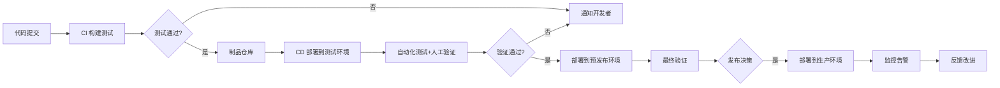
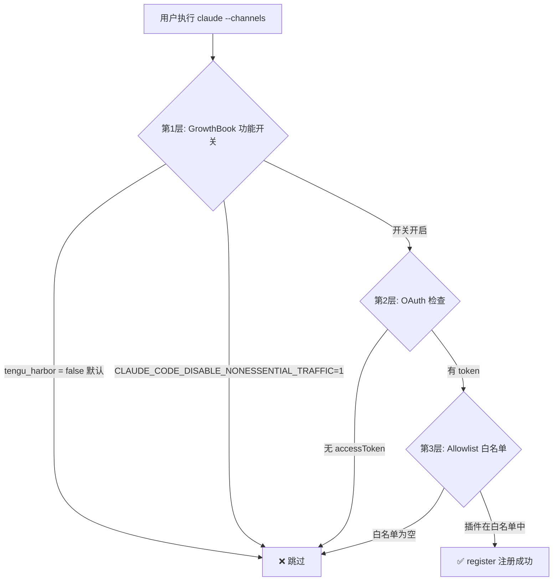
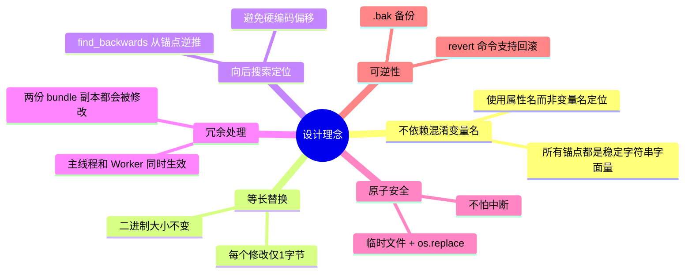
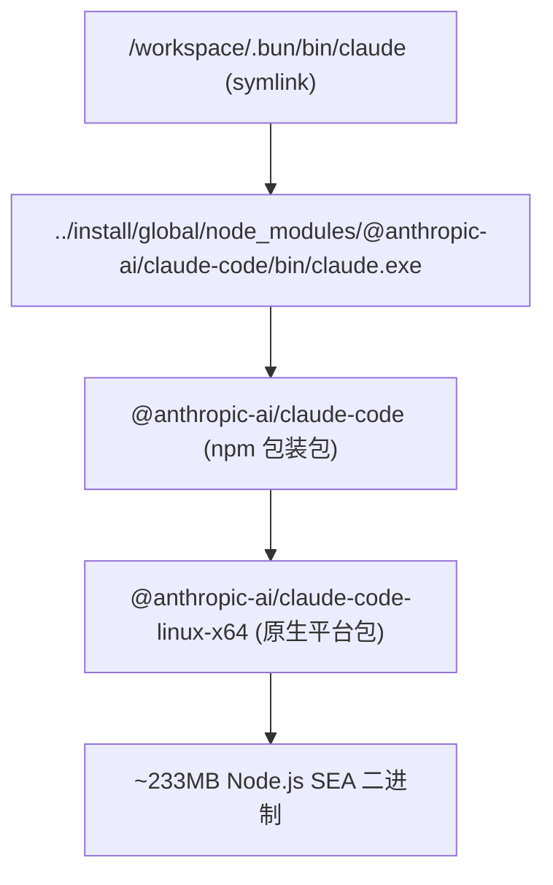
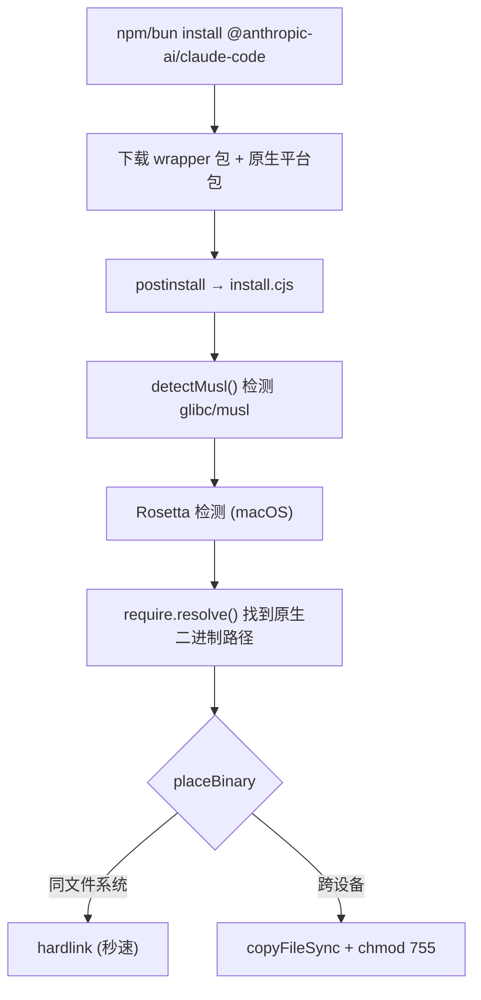
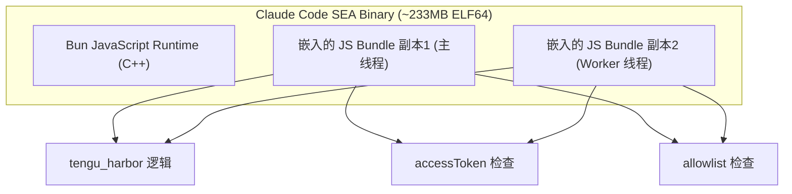
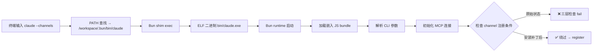
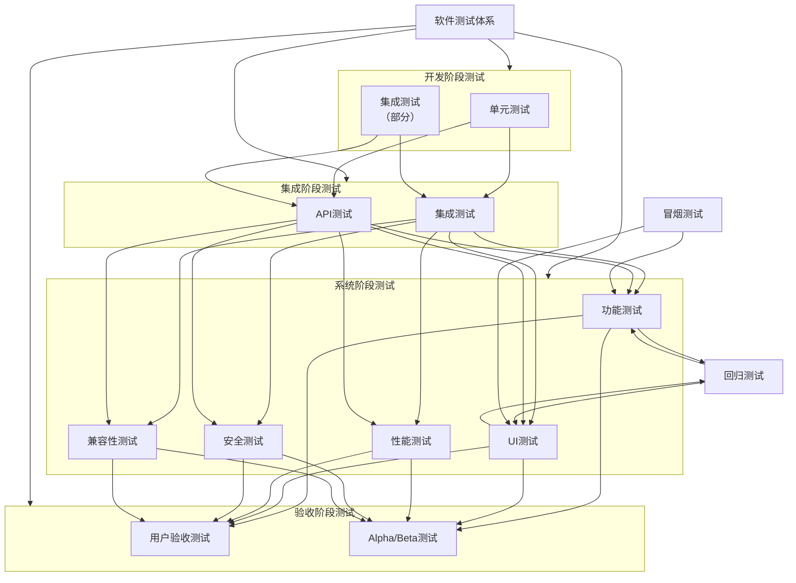

# 快速查看项目环境库依赖

```bash
cd /path/to/project
# pip install pipreqs
pipreqs . 
```

在当前文件夹下会生成一个requirements.txt文件

# 使用图书馆检索外文刊文

1. 登录 VPN
2. 进入 https://library.shiep.edu.cn/ 登录
3. 搜索目标刊物

# 实验代码开发与运行规范

## 一、环境准备与数据管理

### 步骤1：资源预置
- 将常用的数据集和模型文件提前下载并保存到云盘中，利用内网高速访问的优势
- 为每个项目创建独立的虚拟环境，避免不同项目之间的包版本冲突和依赖冲突

### 步骤2：代码可运行性测试
- 从完整数据集中抽取少量样本（建议百分之一到百分之五），生成一个迷你数据集
- 修改代码中的数据集路径或配置文件，将路径指向迷你数据集
- 在所有需要运行的任务上测试代码是否能正常执行，确保基本流程无误

## 二、硬件性能测试

### 步骤3：单轮次验证
- 保持使用完整数据集，但将训练轮次参数设置为1
- 依次测试所有任务，观察硬件资源占用情况，判断是否满足完整训练需求

### 步骤4：任务打包与管道化
- 将所有任务的启动命令集中写入一个脚本文件中
- 使用管道操作符连接各命令，确保任务按顺序执行且前一个任务失败时后续任务自动停止

## 三、脱机运行与监控

### 步骤5：后台运行配置
- 使用后台挂载命令启动任务，配合输出重定向将运行日志保存到指定文件
- 记录启动后的进程识别号，便于后续管理或终止任务
- 定期使用日志查看命令监控运行状态

### 步骤6：邮件通知机制
- 编写邮件发送功能模块，能够发送包含实验名称、运行状态、日志文件路径、完成时间等信息的邮件
- 在主程序入口处使用异常捕获结构：正常完成时发送成功通知，发生异常时发送包含错误信息的失败通知

## 四、云端实验规范

### 步骤7：远程测试脚本
- 编写适用于云端服务器的测试脚本，在脚本中创建带有时间戳的实验目录
- 使用云盘挂载工具将数据集以守护进程方式挂载到实验目录中
- 创建软链接将数据、检查点、日志等目录链接到代码期望的位置，避免路径错误
- 以挂载方式启动主程序

### 步骤8：路径健壮性处理
- 设计路径管理模块，能够自动尝试多个可能的数据存放位置
- 候选路径应包括：项目目录下的data文件夹、项目目录下的datasets文件夹、云盘挂载点、上级目录中的data文件夹等
- 当所有候选路径都不存在时，抛出明确的文件未找到异常

## 五、检查点编程规范

### 步骤9：初始化检查点结构
- 在进入循环处理之前，首先检查检查点目录是否存在，不存在则创建
- 尝试加载已有的检查点文件，如果文件不存在则初始化为空容器
- 检查点容器通常存储已完成内容的唯一标识，可以是哈希值或通用唯一识别码
- 如果使用哈希值作为标识，需要在开始循环前预计算所有内容的哈希值并存入集合中
- 同时创建输出目录和输出文件，输出文件用于存储循环过程中产生的中间结果和最终结果

### 步骤10：带容错的循环执行
- 在循环开始前，对每个待处理项检查其唯一标识是否已存在于检查点中，存在则跳过
- 每成功处理完一个数据项，立即将其结果添加到输出文件中
- 同时将该数据项的唯一标识添加到检查点文件中
- 循环结束后，保存最终状态

## 六、异常处理与状态持久化

### 步骤11：异常处理框架
- 将整个循环执行过程包裹在异常捕获结构中
- 当循环内部发生异常时，捕获异常并打印错误信息，然后重新抛出异常
- 无论是否发生异常，最终确保执行状态保存：保存检查点文件和输出文件
- 这样可以保证已处理的数据不会因后续异常而丢失

## 七、Git 同步云端与本地实验版本

1. 一端提交更新，并推送到github
2. 一端pull即可。

## 八、完整实验执行流程

### 步骤14：一键启动流程
- 创建包含时间戳的唯一实验名称
- 检查运行环境：Python版本、GPU型号和显存容量
- 创建实验目录结构，包括检查点、输出、日志、数据等子目录
- 建立数据目录的软链接或挂载点
- 复制配置文件到实验目录中
- 使用终端复用器创建新的会话，在会话中执行训练命令并将输出同时写入日志文件
- 训练完成后自动调用邮件通知脚本
- 显示会话信息和监控命令提示，方便后续查看

## 九、核心原则总结

**环境隔离原则：** 每个项目使用独立虚拟环境，避免依赖冲突

**快速验证原则：** 先使用迷你数据集和单轮次参数验证代码正确性，再使用完整数据集

**断点续跑原则：** 循环处理前必须初始化检查点，每处理一个项目立即保存状态

**异常安全原则：** 使用异常捕获结构确保无论成功或失败都能持久化当前状态

**脱机运行原则：** 长时间任务必须使用后台挂载或终端复用器运行，不得在线执行

**路径健壮原则：** 避免硬编码相对路径，使用多候选路径自动解析机制

**及时通知原则：** 任务结束或异常时通过邮件等渠道主动通知，避免盲目等待

**环境一致性原则：** 使用容器封装运行环境，确保开发环境和生产环境一致

# 大文件安全上传

配置：

- 压缩格式：zip
- 压缩等级：仅存储
- 加密算法：AES-256
- 加密密码：idx

# 逆向 gitmind

1. 在gitmind官网 https://gitmind.cn/，新建一个最简单的脑图，导出为`gmind`文件

2. 在deepseek网站 https://chat.deepseek.com/ ，上传文件，回答提到zip编码。

3. 将下载的文件后缀由`gmind`，改为`zip`，并解压，得到一个conten.json，内容如下：

```json
{
    "id": "18qf38k56g0d7hocsjvy1rx6lamtg8o7",
    "created": 1738470488497,
    "modified": 1738470495238,
    "autoIncrementId": 5,
    "version": "2.1.3",
    "style": {
        "content": {
            "can-line-wrap": true
        },
        "layout": {
            "broadcast-margins": false,
            "avoid-overlay": false
        },
        "theme": {
            "colorTheme": "morandi-blue",
            "structTheme": "mind-arc"
        }
    },
    "root": {
        "data": {
            "id": "32e9438ab4",
            "expanded": true,
            "text": "A",
            "html": "A",
            "mindLayoutSplitIndex": 2
        },
        "style": {
            "text-underline": false,
            "text-line-through": false
        },
        "children": [
            {
                "data": {
                    "id": "32b2843aea",
                    "expanded": false,
                    "timeSnippet": ""
                },
                "style": {
                    "text-underline": false,
                    "text-line-through": false
                }
            },
            {
                "data": {
                    "id": "175dd6a4cd",
                    "expanded": false,
                    "timeSnippet": ""
                },
                "style": {
                    "text-underline": false,
                    "text-line-through": false
                }
            }
        ]
    },
    "floatRoots": [],
    "relLines": [],
    "watermark": {
        "id": "18qf38k56g0d7hocsjvy1rx6lamtg8o7",
        "show": false
    }
}
```

4. 还是交给deepseek做参数解读。

至此，我们就可以用程序生成配置文件，使用zip压缩，保存为gmind文件上传。

# Web of Science下载

1. 登录学校VPN

2. 进入上电图书馆

3. 搜索文章标题

4. 选择一个获取途径，比如SCI包库，点击

5. 进入Web of Science页面

6. 点击`Full text at publisher`

7. 进入ACM页面，点击`PDF`图标直接出现，或者将网址添加pdf参数

```
https://dl_acm_org.shiep.vpn358.com/doi/10.1145/3477495.3531891 # 原网址
https://dl_acm_org.shiep.vpn358.com/doi/pdf/10.1145/3477495.3531891 # pdf文件网址
```

# 浏览器查看文件下载地址

1. 浏览器，右键→检查→选择网络→过滤get包
2. 点击下载按钮
3. 点击新增的请求，在Headers选项中是真实下载地址。

# nltk 扩展包下载缓慢

1. 查看扩展包位置

```python
import nltk
nltk.find('.')
```

2. 直接克隆项目

```bash
git clone https://github.com/nltk/nltk_data.git
cd nltk_data
find . -name "*.zip" -exec sh -c 'unzip -d "$(dirname "{}")" "{}" && rm "{}"' \; 
```

powershell脚本

```powershell
Get-ChildItem -Recurse -Filter *.zip | ForEach-Object {
    Expand-Archive -Path $_.FullName -DestinationPath $_.DirectoryName
    Remove-Item $_.FullName
}
```

3. 将其packages包改名为`nltk_data`移动到扩展包位置

# bert ner

分词过程会将词语拆成分词形式，比如`##ing`，需要手动进行拼接分词凑成完整的词语

# 绘图边框配色

- 边框配色为填充配色和黑色的混合色，过渡色
- 浅色/亮色背景
- 不同的文本框背景色有区分度
- 线条采用过渡色（填充色与黑色混色）
- 布局简单，行列排布对应。

# 文件读取密集型任务

采用进程池而不是线程池

# CPU密集型任务

采用进程池而不是线程池，因为Python的GIL(全局解释锁)

# 底座模型对问答任务的影响

底座模型使用wiki数据进行训练，参数很可能包含答案。所以，不同的底座模型对问答任务的表现影响较大。

而且，外国模型对英文数据训练更为重视，普遍比国内的模型更容易打榜。

# 云服务器上部署大语言模型

1. 查看模型占用显存。使用`accelerate`库计算显存占用情况。
2. 在云服务平台上租满足显存占用的多卡容器。
3. 部署vllm
4. 使用vllm对大模型进行分布式推理

# 刷新环境变量

如果更新了环境变量，需要重开了一个命令行，刷新环境变量

# SUEP下链接flix

手动连接，因为每台设备每次接入 suep 都会被分配一个新的 IP 地址，而 flix 会记录上一次的 IP ，所以需要手动输入 10.x.x.x 的 IP 地址进行连接


# 查看日志没有出现

需要刷新目录

# aaai 

## 引用

论文页面→More Citation Formats→BibTex

## 两栏宽度

7 英寸

## 查看pdf图片

```
pdfimages -list your.pdf
```

## pdf转为CMYK格式

安装 Ghostscript：

```bash
apt upgrade
apt installl ghostscript
```

当前目录下批量转换

```bash
for f in *.pdf; do [[ "$f" != *_cmyk.pdf ]] && [[ ! -f "${f%.pdf}_cmyk.pdf" ]] && gs -dNOPAUSE -dBATCH -sDEVICE=pdfwrite -dColorConversionStrategy=/CMYK -dPDFSETTINGS=/prepress -dCompatibilityLevel=1.7 -dEmbedAllFonts=true -dAutoRotatePages=/None -sOutputFile="${f%.pdf}_cmyk.pdf" "$f"; done
```

单个文件转换

```bash
gs -dNOPAUSE -dBATCH -sDEVICE=pdfwrite -dColorConversionStrategy=/CMYK -dPDFSETTINGS=/prepress -dCompatibilityLevel=1.7 -dEmbedAllFonts=true -dAutoRotatePages=/None -sOutputFile=your_cmyk.pdf your.pdf
```

# sciencedirect 的引用

论文页面→Cite→Export Citation to BibTex

# 查看 pdf 字体类型

1. 安装工具

```bash
apt install poppler-utils -y
```

2. 使用

```bash
pdffonts youfile.pdf
```

# pdf中 type 3字体来源

1. emoji字体，阿里云矢量图库没有
2. python的`matplotlib`默认导出的字体是type 3


# 罗技键盘重连

长按切换键，直到快速闪烁，然后打开蓝牙连接。

# 分割pdf

1. 使用edge打开pdf。
2. 点击打印
3. 输入页数，选择另存为PDF。

# 获取overleaf中所有的文字

```javascript
window.overleaf.unstable.store.items.get("editor.view").value.state.doc.sliceString(0);
```

或者

```js
document.querySelector('.cm-content').cmView.view.state.doc.toString();
```

# 追踪某个网页事件

点击元素→检查→元素页面→右侧的事件监听器→点击某个事件→展开→点击所在的js文件

# 屏幕测量工具

用来复刻图片，下载Screen Ruler。

# Json序列化乱码

json.dumps的转义：当字符串包含非ASCII字符时，`json.dumps()`默认会将中文字符等转义为 `\uXXXX` 格式的 Unicode 转义序列

# 浏览器打开markdown并翻译

1. 装Markdown Viewer扩展。
2. 管理扩展，勾选运行访问文件URL
3. 扩展选项勾选：mathjax、emoji、toc、mermaid。
4. 打开本地Markdown文件，并点击翻译为中文。

# 极致字体锐化+背景白化

```bash
convert sidu.jpg -sharpen 0x2.0 -auto-level -contrast-stretch 0%x0% -level 25%,100% -white-threshold 90% -brightness-contrast 0x20 enhanced.jpg
```

# 拉取带cuda的Ubuntu镜像

三种层级：

| 特性             | base     | runtime  | devel    |
| ---------------- | -------- | -------- | -------- |
| **CUDA运行时库** | ✓ 最小集 | ✓ 完整集 | ✓ 完整集 |
| **CUDA开发库**   | ✗        | ✗        | ✓        |
| **头文件**       | ✗        | ✗        | ✓        |
| **nvcc编译器**   | ✗        | ✗        | ✓        |
| **gcc/g++**      | ✗        | ✗        | ✓        |
| **调试工具**     | ✗        | ✗        | ✓        |
| **体积**         | 最小     | 中等     | 最大     |
| **适用阶段**     | 生产     | 生产     | 开发     |

注意：初始化，修改`~/.bashrc`，添加

```bash
echo 'export PATH=/usr/local/cuda/bin:$PATH' >> ~/.bashrc
echo 'export LD_LIBRARY_PATH=/usr/local/cuda/lib64:$LD_LIBRARY_PATH' >> ~/.bashrc
```

# 从pdf中提取bib

1. 进入网站www.connectedpapers.com
2. 输入文章标题，点击build  a graph。
3. 点击`Prior works`和`Derivative works`
4. 点击Download即可下载。

# 机械硬盘初次使用

1. 购买硬盘盒和电源线（机械硬盘需要通电）。
2. 放入硬盘，并连接电源线、usb线、点击开关。
3. 在电脑端下载diskgenuius，对硬盘进行分区，分为1个区即可。
# 如何进行批量双面打印

> 实验室内的打印机

1. 选择双面翻转，长边翻转。
2. 先批量打印偶数页，
3. 手动翻转一次。
4. 再批量打印奇数页。

# 提示词攻击

- 语言与混淆攻击：利用编码、加密、翻译或特殊字符，使攻击载荷脱离模型的安全训练分布，同时保留语义可执行性。
- 上下文利用：利用长上下文窗口和上下文学习能力，通过大量伪造样本或干扰信息，“洗脑”模型接受恶意模式
- 多轮认知诱导：利用多轮对话的连贯性需求，逐步建立信任、分散注意力或改变系统规则，绕过单轮防御。
- 自动化优化：使用梯度下降、遗传算法或Agent反馈循环，自动搜索能强制模型越狱的对抗性后缀。
- 间接注入：攻击载荷嵌入在外部数据源（网页、邮件、文档）中，当模型检索该数据时触发攻击。
- 多模态注入：利用视觉或听觉编码，将恶意指令隐藏在图像像素或音频噪声中，绕过文本过滤器。

| **项目名称**          | **核心机制**   | **覆盖需求关键字** | **攻击类型**           | **适用场景**               | **仓库/来源**              |
| --------------------- | -------------- | ------------------ | ---------------------- | -------------------------- | -------------------------- |
| **AutoDAN**           | 分层遗传算法   | **混淆**           | 语义进化、隐身越狱     | 绕过 PPL 检测、黑盒攻击    | `SheltonLiu-N/AutoDAN`     |
| **GCG / AmpleGCG**    | 梯度优化       | **注入**           | 对抗性后缀、通用攻击   | 白盒/灰盒模型、高强度注入  | `llm-attacks`              |
| **CodeChameleon**     | 加密与编码     | **混淆、隐藏**     | 代码封装、隐式解密     | 绕过意图识别、利用代码能力 | `huizhang-L/CodeChameleon` |
| **DrAttack**          | 分解与重构     | **分散、隐藏**     | 子提示词拆解、ICL 重构 | 绕过语义聚合检测           | `xirui-li/DrAttack`        |
| **HouYi**             | 上下文分区     | **分散、注入**     | 负载分裂、应用层注入   | LLM 集成应用、Agent 攻击   | `LLMSecurity/HouYi`        |
| **TAP**               | 思维树代理     | **注入**           | 多轮对话、自动化推理   | 黑盒复杂模型、高效查询     | `RICommunity/TAP`          |
| **Crescendo (PyRIT)** | 渐进式诱导     | **隐藏**           | 多轮对话、登门槛效应   | 绕过拒答机制、红队测试     | `Azure/PyRIT`              |
| **PromptMap**         | 应用层 Fuzzing | **注入、隐藏**     | 间接注入、应用逻辑漏洞 | 插件、RAG、Copilot 应用    | `utkusen/promptmap`        |
| **BSPA**              | 检索增强       | **隐藏**           | 文生图隐写、NSFW 绕过  | 多模态生成安全             | `StealthyPrompt`           |
| **EasyJailbreak**     | 统一框架       | **全覆盖**         | 集成上述多种攻击       | 综合基准测试、算法研究     | `EasyJailbreak`            |
# 华为越过恶意安装

关闭网络，安装app即可。

# 现代企业的软件开发分工和开发流程

## 组织架构

核心角色

| 角色                      | 职责                                   |
| ------------------------- | -------------------------------------- |
| **产品经理 (PM)**         | 需求分析、产品规划、优先级管理         |
| **产品负责人 (PO)**       | 敏捷团队中的产品代表，维护产品待办列表 |
| **UI/UX 设计师**          | 用户界面设计、用户体验设计、交互原型   |
| **前端开发工程师**        | Web端、移动端界面开发                  |
| **后端开发工程师**        | 服务端逻辑、API 开发、数据库设计       |
| **全栈工程师**            | 兼顾前后端开发                         |
| **测试工程师 (QA)**       | 手动测试、自动化测试、质量管理         |
| **DevOps 工程师**         | CI/CD、容器化、云基础设施、监控告警    |
| **架构师**                | 系统架构设计、技术选型、技术标准制定   |
| **Scrum Master/敏捷教练** | 敏捷流程引导、团队协作优化             |

扩展角色

| 角色                       | 职责                             |
| -------------------------- | -------------------------------- |
| **安全工程师**             | 代码安全审计、漏洞扫描、安全策略 |
| **数据工程师**             | 数据管道、数据仓库、ETL          |
| **SRE (站点可靠性工程师)** | 系统稳定性、故障恢复、容量规划   |
| **技术文档工程师**         | 技术文档编写和维护               |

## 开发流程

敏捷开发 Scrum 框架结构

```
┌─────────────────────────────────────────────────────────┐
│                    产品愿景                               │
└─────────────────────────────────────────────────────────┘
                          ↓
┌─────────────────────────────────────────────────────────┐
│                 产品待办列表                              │
│              (按优先级排序的需求)                          │
└─────────────────────────────────────────────────────────┘
                          ↓
┌─────────────────────────────────────────────────────────┐
│                    冲刺规划会议                           │
│    从产品待办列表中挑选本冲刺要完成的任务 → 冲刺待办列表         │
└─────────────────────────────────────────────────────────┘
                          ↓
┌─────────────────────────────────────────────────────────┐
│                    冲刺执行                              │
│                    (通常1-4周)                           │
│  ┌──────────┐  ┌──────────┐  ┌──────────┐               │
│  │ 每日站会  │→ │   开发    │→ │  代码评审 │                 │
│  │ 15分钟    │  │   测试    │  │   合并   │                 │
│  └──────────┘  └──────────┘  └──────────┘               │
└─────────────────────────────────────────────────────────┘
                          ↓
┌─────────────────────────────────────────────────────────┐
│                    冲刺评审会议                          │
│                展示已完成功能给干系人                     │
└─────────────────────────────────────────────────────────┘
                          ↓
┌─────────────────────────────────────────────────────────┐
│                    冲刺回顾会议                          │
│               团队反思改进点，调整流程                    │
└─────────────────────────────────────────────────────────┘
```



代码开发工作流

```
1. 需求分析 → 创建分支 (feature/功能名)
                ↓
2. 本地开发 → 编写代码 + 单元测试
                ↓
3. 代码提交 → 推送到远程仓库
                ↓
4. Pull Request/Merge Request
                ↓
5. 代码评审 → 同行审核代码
                ↓
6. CI 检查 → 自动化构建 + 测试 + 代码质量扫描
                ↓
7. 合并入开发分支 / 主分支
                ↓
8. 自动部署 → 触发 CI/CD 部署流程
```

## 开发环节

1. 需求阶段

| 活动         | 参与者            | 产出               |
| ------------ | ----------------- | ------------------ |
| 需求收集     | 产品经理 + 业务方 | 需求文档           |
| 需求评审     | 全体成员          | 评审意见、优先级   |
| 用户故事编写 | 产品负责人 + 团队 | 用户故事、验收标准 |

2. 设计阶段

| 活动       | 参与者            | 产出                   |
| ---------- | ----------------- | ---------------------- |
| UI/UX 设计 | 设计师            | 原型图、设计稿         |
| 技术设计   | 架构师 + 开发人员 | 技术方案文档、API 文档 |
| 数据库设计 | 后端工程师 + DBA  | ER 图、表结构          |

3. 开发阶段

| 活动     | 参与者     | 产出               |
| -------- | ---------- | ------------------ |
| 前端开发 | 前端工程师 | 页面组件、交互逻辑 |
| 后端开发 | 后端工程师 | API 接口、业务逻辑 |
| 单元测试 | 开发人员   | 测试代码           |

4. 测试阶段

| 活动     | 参与者                | 产出         |
| -------- | --------------------- | ------------ |
| 代码评审 | 开发团队              | 评审反馈     |
| 集成测试 | 测试工程师            | 测试报告     |
| 系统测试 | 测试工程师 + 产品经理 | 测试报告     |
| 性能测试 | 测试工程师            | 性能分析报告 |
| 安全测试 | 安全工程师            | 安全扫描报告 |

5. 部署阶段

| 活动       | 参与者                | 产出         |
| ---------- | --------------------- | ------------ |
| CI/CD 配置 | DevOps 工程师         | 自动化流水线 |
| 环境部署   | DevOps 工程师         | 运行环境     |
| 验收测试   | 产品经理 + 测试工程师 | 验收报告     |

6. 运维阶段

| 活动     | 参与者       | 产出       |
| -------- | ------------ | ---------- |
| 监控告警 | SRE + DevOps | 监控仪表盘 |
| 故障处理 | 运维 + 开发  | 故障报告   |
| 持续优化 | 全体成员     | 优化方案   |

## 关键实践

| 实践               | 说明                   |
| ------------------ | ---------------------- |
| **代码评审**       | 确保代码质量、知识共享 |
| **持续集成**       | 频繁集成、早期发现问题 |
| **自动化测试**     | 回归测试、提高测试效率 |
| **基础设施即代码** | 环境配置版本化管理     |
| **监控与可观测性** | 日志、指标、链路追踪   |
| **文档驱动开发**   | 文档与代码同步更新     |

## 常见开发方法论对比

| 方法论           | 特点          | 适用场景          |
| ------------- | ----------- | ------------- |
| **Scrum**     | 固定冲刺周期、角色明确 | 需求变化频繁、中大规模团队 |
| **Kanban**    | 可视化看板、持续流动  | 需求相对稳定、运维团队   |
| **Waterfall** | 阶段推进、文档驱动   | 需求明确、安全关键系统   |
| **SAFe**      | 大规模敏捷框架     | 大型企业多团队协作     |
| **XP (极限编程)** | 实践驱动、结对编程   | 小团队、探索性项目     |
# 下载 Google Play 中的应用

1. 搜索 github 项目，看 release 发布版
2. 搜索官网提供的 apk 版本
3. 下载 Apkpure，在其中搜索安装

# 开胡桃卡

1. 下载 胡桃卡 app（搜索下载 app）
2. 搜索下载 Apkpure → 下载 ReadID Ready
3. 进入官网https://hutaocards.com/home，注册
4. 支付宝充值至 15 USD
5. 在手机 胡桃卡 app上登录，点击认证，跳转到 ReadID Ready。
6. 按指示扫描 护照，填写信息。
# github 项目分析

gemini 支持直接提交 github 项目用于分析

# 开发必备库

> 开发必备

| **开发必备库** | **Python**                   | **Java (Spring 生态)**       | **Javascript (Node.js)** | **Rust**               |
| -------------- | ---------------------------- | ---------------------------- | ------------------------ | ---------------------- |
| **日志库**     | Loguru / Structlog           | Logback / Log4j2             | Pino / Winston           | Tracing / Log          |
| **配置管理**   | Pydantic-Settings / Dynaconf | Spring Cloud Config / Apollo | Dotenv / Convict         | Config / Figment       |
| **数据库访问** | SQLAlchemy / Motor (Async)   | Mybatis-Plus / Hibernate     | Prisma / TypeORM         | SQLx / SeaORM          |
| **Web 框架**   | FastAPI / Django             | Spring Boot                  | NestJS / Fastify         | Axum / Actix-web       |
| **缓存**       | Redis-py / Dogpile.cache     | Redisson / Lettuce           | Ioredis / Keyv           | Redis-rs / Moka        |
| **消息队列**   | Celery / Kombu               | RocketMQ / RabbitMQ          | BullMQ / Amqplib         | Lapin / Rdkafka        |
| **服务通信**   | gRPC-python / Requests       | Feign / gRPC                 | Connect-es / Axios       | Tonic (gRPC) / Reqwest |
| **JSON 处理**  | Pydantic / Orjson            | Jackson / Gson               | 原生 JSON / Zod          | Serde-json             |
| **参数校验**   | Pydantic / Marshmallow       | Hibernate Validator          | Zod / Joi                | Validator / Serde      |
| **重试与熔断** | Tenacity / Resilience        | Resilience4j                 | Sentinel / Cockatiel     | Resilience-rs          |
| **任务调度**   | APScheduler / Celery Beat    | Quartz / Spring Task         | Agenda / BullMQ          | Tokio-cron-scheduler   |
| **单元测试**   | Pytest / Mock                | JUnit 5 / Mockito            | Vitest / Jest            | Cargo Test / Mockall   |
| **API 文档**   | FastAPI (Built-in)           | SpringDoc / Swagger          | Tsoa / Swagger-jsdoc     | Utoipa                 |
| **对象映射**   | Pydantic / Automapper        | MapStruct                    | Automapper-ts            | Serde (通常直接处理)   |
| **依赖注入**   | Dependency Injector          | Spring IoC                   | NestJS DI / InversifyJS  | Shaku / Alice          |
| **身份认证**   | PyJWT / Authlib              | Spring Security / Sa-Token   | Passport.js / Lucia      | Jsonwebtoken / Casbin  |
| **链路追踪**   | OpenTelemetry-python         | SkyWalking / Micrometer      | OpenTelemetry-js         | Tracing-opentelemetry  |
| **性能监控**   | Prometheus-client            | Micrometer                   | Prom-client              | Metrics                |
| **加密与散列** | Cryptography / Passlib       | BCrypt / Bouncy Castle       | Bcrypt.js / Argon2       | RustCrypto / Ring      |

# 项目开发文档撰写

## SDLC 各阶段与对应文档类型

Software Development Life Cycle

| 阶段          | 核心文档                     | 说明                               |
| ------------- | ---------------------------- | ---------------------------------- |
| **规划/启动** | 项目章程、可行性分析报告     | 项目目标、范围、资源估算           |
| **需求获取**  | 软件需求规格说明书 (SRS)     | 基于 IEEE 830 / ISO/IEC 29148 标准 |
| **系统设计**  | 软件设计描述 (SDD)、架构文档 | 高层设计、模块划分、接口定义       |
| **实现/开发** | 开发规范、代码注释规范       | 编码标准、代码审查清单             |
| **验证/测试** | 测试计划、测试用例、测试报告 | 基于 IEEE 829 或 ISO/IEC 29119     |
| **部署/交付** | 部署手册、用户手册、验收报告 | 运维指南、用户培训材料             |
| **运行/维护** | 维护手册、变更记录、问题报告 | 故障记录、补丁说明                 |
| **变更管理**  | 架构决策记录 (ADR)           | 重大决策的上下文与取舍             |

---

## 核心文档模板与标准

### 1. 需求规格说明书 (SRS)

**参考标准**: IEEE 830-1998 / ISO/IEC 29148:2011(2018)

**典型结构**:

- 1. Introduction (目的、范围、定义)
- 2. Product Overview (产品背景、目标用户)
- 3. Requirements (功能需求、非功能需求、接口需求)
- 4. Verification (验证方法)
- 5. Appendixes (附录)

**可用模板**:

- [jam01/SRS-Template](https://github.com/jam01/SRS-Template/blob/master/srs-template.md) - Markdown 版，基于 IEEE 830
- [IEEE-29148-SRS-LaTeX-Template](https://raw.githubusercontent.com/wxinix/IEEE-29148-SRS-LaTeX-Template/main/IEEE-29148-2018-SRS-Template.tex) - 正式排版模板

### 2. 软件设计描述 (SDD)

**参考标准**: IEEE 1016-2009

**典型结构**:

- 1. Introduction
- 2. Design Overview (设计概览)
- 3. Design Views (Context、Logical、Physical、Deployment 等)
- 4. Decisions (设计决策)
- 5. Appendixes

**可用模板**:

- [jam01/SDD-Template](https://github.com/jam01/SDD-Template/blob/master/sdd-template.md)
- [Jtachan/Design-Document-Template](https://github.com/Jtachan/Design-Document-Template)

### 3. 测试文档

**参考标准**: IEEE 829-2008 / ISO/IEC 29119

**测试计划结构**:

- 测试范围与目标
- 测试策略 (黑盒/白盒、回归测试等)
- 测试环境与工具
- 资源与时间计划
- 测试用例矩阵
- 风险与应对

**可用模板**:

- [Azure DevOps 测试计划指南](https://raw.githubusercontent.com/MicrosoftDocs/azure-devops-docs/main/docs/test/create-a-test-plan.md)
- [jam01 测试模板集合](https://github.com/jam01)

### 4. 架构决策记录 (ADR)

用于记录重大技术决策及取舍理由。

**可用模板**:

- [ADR Template Gist](https://gist.github.com/thedavidyoungblood/bccce859af7a476e44a290a2230e0913)
- [MADR (Markdown Any Decision Record)](https://adr.github.io/)

---

## 敏捷开发中的文档实践

**核心原则** (来自 [Agile Manifesto](https://agilemanifesto.org/)):

> "Working software over comprehensive documentation"

**敏捷文档特点**:

| 维度   | 瀑布模型       | 敏捷实践               |
| ------ | -------------- | ---------------------- |
| 文档量 | 完整、详尽     | Just Enough (够用即可) |
| 时机   | 前置、全量编写 | 按需、增量编写         |
| 形式   | 正式、长篇     | 轻量、协作友好         |
| 维护   | 低频更新       | 持续演进               |

**敏捷中的轻量文档**:

- User Story + Acceptance Criteria (替代冗长 SRS)
- Sprint Review 文档
- 技术债务列表
- Architecture Decision Records (ADR)
- Test Strategy 文档

---

## 编写要点总结

| 文档类型     | 编写要点                                                     |
| ------------ | ------------------------------------------------------------ |
| **SRS**      | 需求可测试、可验证、可追溯；避免实现细节；每条需求有唯一标识 |
| **SDD**      | 按视图组织 (Context/Logical/Physical)；关键决策有理由说明；接口定义清晰 |
| **测试文档** | 与需求直接映射；验收标准量化；测试环境独立描述               |
| **ADR**      | 记录 Context、Options、Decision、Consequences；保持简洁一页式 |

---

## 推荐模板清单

```
docs/
├── templates/
│   ├── srs-template.md        # 需求规格说明
│   ├── sdd-template.md        # 软件设计描述
│   ├── test-plan-template.md  # 测试计划
│   ├── test-case-template.md  # 测试用例
│   ├── adr-template.md        # 架构决策记录
│   └── deployment-guide.md    # 部署手册
├── project-charter.md         # 项目章程
├── glossary.md                # 术语表
└── changelog.md              # 变更日志
```

---

## 下一步行动建议

1. **建立模板库** — 基于上述模板建立你团队的文档模板库
2. **定制化适配** — 根据项目特点调整章节结构（如增加安全需求章节）
3. **工具集成** — 将模板集成到 Confluence、Notion 或 Git 仓库
4. **Reader Testing** — 让新成员或非作者验证文档可读性
# 机试准备

1. 胶带绑法：平衡绑法，
2. 宿舍是否电费充足

# M3u8下载流

1. 浏览器安装`FetchV`插件

2. 进入官网https://github.com/nilaoda/N_m3u8DL-RE/releases/tag，下载压缩包，然后解压，并添加环境变量

3. 安装 ffmpeg

4. 点开视频网页，在`FetchV`插件上右键，选择检查，在 console 运行脚本

   ```javascript
   chrome.storage.local.get(null, async (data) => {
       let count = 0;
       const commands = []; // 用于收集所有命令
   
       // 遍历所有网页标签的嗅探记录
       for (const key in data) {
           if (key.startsWith('storage')) { 
               const tabId = parseInt(key.replace('storage', ''));
               let pageTitle = "下载的视频";
   
               // 【黑科技】：根据标签ID，异步向浏览器请求该网页真实的标题
               try {
                   const tab = await chrome.tabs.get(tabId);
                   if (tab && tab.title) {
                       // 去除标题中 Windows/Mac 文件名不允许的特殊字符
                       pageTitle = tab.title.replace(/[\\/:*?"<>|]/g, "_").trim();
                   }
               } catch(e) { 
                   /* 如果网页已经被关了，就静默失败，使用后备名称 */ 
               }
   
               const tabData = data[key];
               // 过滤出 m3u8 资源
               const m3u8Items = Object.values(tabData).filter(i => i.type === 'hls' || i.type === 'm3u8' || i.url.includes('.m3u8'));
               
               // 优先查找名为 playlist.m3u8 的链接
               let selectedItem = null;
               if (m3u8Items.length > 0) {
                   // 尝试查找 playlist.m3u8
                   selectedItem = m3u8Items.find(item => {
                       const urlLower = item.url.toLowerCase();
                       return urlLower.includes('playlist.m3u8') || urlLower.endsWith('playlist.m3u8');
                   });
                   
                   // 如果没找到 playlist.m3u8，则使用第一个
                   if (!selectedItem) {
                       selectedItem = m3u8Items[0];
                   }
                   
                   count++;
                   
                   // 拼接基础下载命令，带上智能命名和并发限制
                   let cmd = `N_m3u8DL-RE.exe "${selectedItem.url}" --save-name "${pageTitle}" --thread-count 3 --auto-select --live-perform-as-vod`;
                   
                   // 拼接过滤后的请求头
                   if (selectedItem.headers) {
                       for (const h in selectedItem.headers) {
                           const headerName = h.toLowerCase();
                           if (!['host', 'connection', 'accept-encoding'].includes(headerName) && !headerName.startsWith('sec-')) {
                               cmd += ` -H "${h}: ${selectedItem.headers[h]}"`;
                           }
                       }
                   } else {
                       // 默认兜底 Header
                       cmd += ` -H "User-Agent: Mozilla/5.0 (Windows NT 10.0; Win64; x64) AppleWebKit/537.36 (KHTML, like Gecko) Chrome/120.0.0.0 Safari/537.36"`;
                   }
                   
                   commands.push(cmd); // 收集命令
               }
           }
       }
       
       if (count === 0) {
           console.warn("⚠️ 没有在缓存中找到任何 m3u8 资源，请确保在网页上插件的列表中有显示资源！");
       } else {
           // 合并所有命令，用换行符分隔
           const allCommands = commands.join("\n");
           console.log(allCommands);
       }
   });
   ```

5. 最好批量保存下载命令，然后批量下载。

# 大厂工作境界

| 境界  | 名称        | 核心要点                |
| --- | --------- | ------------------- |
| 1   | 完成任务      | 按指令交付结果，最基本要求       |
| 2   | 评估完成标准    | 理解多种标准，判断完成质量       |
| 3   | 汇报呈现      | 结构化表达，突出价值与数据       |
| 4   | 复盘沉淀      | 总结可复现、可推广的经验        |
| 5   | 预期管理      | 主动同步进度、暴露风险、控制承诺    |
| 6   | 向上管理与横向对齐 | 对齐上级目标，拉通协作方，消除信息差  |
| 7   | 风险预判与问题前置 | 提前识别阻塞点，设计备选方案      |
| 8   | 文档化与资产化   | 沉淀SOP、模板、工具，形成可复用资产 |
| 9   | 个人专业品牌    | 在细分领域成为公认专家，拥有标签    |
| 10  | 组织博弈感知    | 理解利益关系、考核周期、政治红线    |
| 11  | 定义问题      | 主动发现价值点，驱动新项目立项     |
| 12  | 能量管理与反内耗  | 专注高价值事务，避免无效拉扯与情绪消耗 |

# ChatGPT 会话导出

1. 安装浏览器扩展
2. 进入会话界面
3. 按操作指示导出会话
# 必备Skill

- agent-browser
- superpowers
- find-skills
- self-improving-agent
- anthropic/skills

# AI 操作飞书在线文档

## 安装 飞书 cli

1. 安装

```bash
bun x @larksuite/cli@latest install
```

2. 配置相关应用、权限。
3. 自动配置 飞书相关SKILL，只需发送网站即可。
# API 管理

将不同的LLM API 统一到一个通用的 API 下，以解耦 API 管理：

- 动态均衡
- 差错管理：
  - 自动重试
  - 级联降级
- 成本与审计控制

开源项目 `litellm`

# CVPR2026标题爬取

1. 找数据源 — 页面是 SPA（单页应用），内容通过 JS 动态加载。检查 papers.html 源码，找到它加载的 JS 文件 virtual.js。
2. 从 JS 中挖 API — virtual.js 里的 API.getPapers() 方法说明数据来自一个 JSON 文件。用 grep 搜索 start() 调用，找到了JSON 文件路径。
3. 直接请求 JSON — curl 拿到 https://cvpr.thecvf.com/static/virtual/data/cvpr-2026-orals-posters.json ，里面有 4212条记录，包含论文标题、作者、摘要等全部字段。按 UID 去重后 4071 篇。

## 复杂项目重构

### 一、认知类资产（理解原系统）

#### 1. 系统全景说明（System Overview）

- 项目目标 / 核心功能
- 用户路径（User Flow）
- 输入 / 输出定义
- 边界（系统做什么、不做什么）

👉 文件：

```
docs/overview.md
```

------

#### 2. 功能模块拆解（Functional Decomposition）

把系统拆成最小“职责单元”。

- 一级模块（如：生成器 / 调度器 / 存储）
- 二级模块（如：prompt构建 / 推理执行 / 校验器）
- 职责定义（每个模块只干一件事）

👉 文件：

```
docs/modules.md
```

------

#### 3. 业务流程 / 控制流

也就是你提到的流程图（核心）

- 主流程（Happy Path）
- 异常流程（失败 / 回滚）
- 分支策略（多候选 / 重试）

👉 文件：

```
docs/flows/
  main_flow.mmd
  retry_flow.mmd
  evaluation_flow.mmd
```

------

#### 4. 数据流 & 状态模型

很多项目失败在这里。

- 数据从哪里来 → 去哪里
- 状态如何变化（pending → running → done）
- 是否有持久化（你前面提到的 task.json 就属于这个）

👉 文件：

```
docs/data_flow.md
docs/state_machine.md
```

------

#### 5. 依赖分析（Dependency Mapping）

外部依赖：

- 模型（LLM / Diffusion）
- API（OpenAI / 本地推理）
- 系统组件（数据库 / 消息队列）

内部依赖：

- 模块之间调用关系

👉 文件：

```
docs/dependencies.md
```

------

### 二、设计类资产（如何重建）

#### 6. 架构设计（Architecture）

核心是：**如何重新组织模块**

- 单体 vs 微服务 vs agent
- 同步 vs 异步
- 控制层 vs 执行层

👉 文件：

```
docs/architecture.md
docs/architecture.mmd
```

------

#### 7. 模块 API 设计

定义模块之间怎么“说话”。

- 输入参数
- 输出结构
- 错误定义

👉 文件：

```
apis/
  planner.yaml
  generator.yaml
  evaluator.yaml
```

（建议用 OpenAPI / JSON Schema）

------

#### 8. 数据结构定义（Schema）

尤其你这种任务系统非常关键。

例如你之前的：

```json
{
  "id": "n",
  "subject": "...",
  "status": "pending",
  "blocks": []
}
```

需要扩展为：

- version
- timestamps
- dependency graph
- metadata

👉 文件：

```
schemas/
  task.schema.json
  scene.schema.json
```

------

#### 9. 状态机设计（State Machine）

复杂系统必须显式化：

- task lifecycle
- retry机制
- 锁 / 并发控制

👉 文件：

```
docs/state_machine.mmd
```

------

#### 10. 策略设计（Strategy Layer）

这是 AI 项目特有的：

- 生成策略（一次生成 / 分阶段）
- 评估策略（打分 / 过滤）
- 重写策略（局部 vs 全局）

👉 文件：

```
docs/strategies.md
```

------

### 三、执行类资产（真正落地）

#### 11. 任务定义（Task Spec）

你之前提的 Claude Task 就属于这里。

👉 文件：

```
tasks/
  1.json
  2.json
```

或 YAML：

```
tasks/
  generate_outline.yaml
  refine_scene.yaml
```

------

#### 12. 工作流定义（Workflow DSL）

关键资产之一。

定义：

- 步骤
- 依赖
- 条件执行

👉 文件：

```
workflows/
  novel_pipeline.yaml
```

示例：

```yaml
steps:
  - id: plan
    run: planner
  - id: generate
    run: generator
    depends_on: [plan]
  - id: evaluate
    run: evaluator
    depends_on: [generate]
```

------

#### 13. Prompt 资产（如果是 AI 项目）

必须模块化，而不是散落在代码里。

👉 文件：

```
prompts/
  planner.md
  generator.md
  evaluator.md
```

------

#### 14. 配置系统（Config）

控制运行时行为：

- 模型选择
- 参数（temperature / top_p）
- 开关（是否启用多候选）

👉 文件：

```
configs/
  default.yaml
  prod.yaml
```

------

#### 15. 执行引擎（Runtime Spec）

描述系统如何运行：

- 调度方式（队列 / DAG）
- 并发策略
- 重试策略

👉 文件：

```
docs/runtime.md
```

------

#### 16. 日志与可观测性

否则你根本调不动复杂系统。

👉 文件：

```
docs/observability.md
```

包括：

- trace id
- 每一步输出
- token使用
- latency

------

#### 17. 测试资产

不仅是单元测试：

- 功能测试（生成结果）
- 回归测试（风格一致性）
- 评估数据集

👉 文件：

```
tests/
  test_pipeline.py
evals/
  dataset.json
```

------

### 四、最终标准目录结构（推荐）

给你一个可以直接用的工程模板👇

```
project/
├── docs/
│   ├── overview.md
│   ├── modules.md
│   ├── architecture.md
│   ├── data_flow.md
│   ├── state_machine.mmd
│   ├── strategies.md
│   └── runtime.md
│
├── flows/
│   ├── main_flow.mmd
│   ├── retry_flow.mmd
│   └── eval_flow.mmd
│
├── schemas/
│   ├── task.schema.json
│   └── scene.schema.json
│
├── apis/
│   ├── planner.yaml
│   ├── generator.yaml
│   └── evaluator.yaml
│
├── workflows/
│   └── pipeline.yaml
│
├── tasks/
│   └── *.json
│
├── prompts/
│   ├── planner.md
│   ├── generator.md
│   └── evaluator.md
│
├── configs/
│   ├── default.yaml
│   └── prod.yaml
│
├── runtime/
│   └── engine.py
│
├── tests/
├── evals/
└── README.md
```

------

### 五、核心总结（最重要的4个资产）

如果你只做精简版，优先级是：

1. **模块拆解（modules.md）**
2. **流程图（flows.mmd）**
3. **任务结构（task schema）**
4. **工作流定义（workflow.yaml）**

👉 这4个决定了项目是否“可控”

------

### 六、给你一个关键建议（很重要）

你现在的方向（小说生成 + 工作流 + 本地模型）：

👉 本质不是“写代码”
👉 而是“设计一个可执行的认知系统”

所以：

- 不要先写代码
- 先把：
  - 状态机
  - workflow DSL
  - task schema
    定死

否则一定会陷入：

> prompt 地狱 + 逻辑失控 + 无法复现

# 定期同步

- 两台电脑之间
	- 密码
	- 笔记
- 两台手机之间
# 提前考虑最坏情况

1. 手机丢失：
	1. 华为手机：查找设备→登录→选择设备→导航
	2. 电话卡挂失
2. 手机损坏：
	1. 秀沿路867弄→大润发→手机坊→手机维修
3. 电话卡欠费
	1. 秀沿路867弄→电信营业厅→缴费/挂失
4. 钱包丢失
	1. 见身份证丢失
	2. 见银行卡丢失
5. 身份证丢失
	1. 任一公安派出所或户政服务大厅，办理挂失，并申请临时身份证。
	2. 现场填写《居民身份证挂失申报登记表》完成挂失，同时申请补办新证。挂失和补办是两个步骤。办理时长通常为20个工作日左右，可申请邮寄
6. 银行卡丢失
	1. 见身份证丢失
	2. 办理银行卡挂失：邮储、农业、建设、招商。

# openclaw 4.1 版本踩坑

```bash
npm install -g openclaw@2026.4.1
```

连接国内的deepseek API时，默认去掉命令行中的代理。
每条消息都要@机器人才能起作用。

# linux.do 入站小作文

```
你好，我目前是计算机科学专业的硕二学生，平时主要关注 Rust、Python、自动化工具链以及 AI 工作流相关方向，也喜欢折腾一些提升效率的小工具。平时会自己做一些开源项目，比如论文整理、Git 自动化和资料下载相关工具，也会长期阅读和整理技术论文。
最早是在 Google 搜索技术问题时接触到 LINUX DO，后来发现这里和很多泛技术论坛不太一样，整体讨论氛围更认真，也更注重内容质量。我很认可社区里“真诚、友善、团结、专业”的理念，也认同版规里关于拒绝 AI 灌水、反对无意义水贴和凑字数内容的要求。技术社区最难得的是长期沉淀下来的交流环境，所以也希望自己能认真参与，而不只是单纯注册一个账号。
如果能够加入，也希望以后能分享一些自动化工具、AI 工作流、Rust 工程实践以及论文整理方面的经验，和大家一起交流学习。
```


# 静态编译文件

使用容器进行最小化编译，即用即销毁。

# 技术选型

给某种编程语言 / 第三方库做技术选型时，搜索不是“搜一个库”，而是按**问题 → 候选 → 评估 → 验证 → 决策**来搜。

## 1. 先定义需求关键词

不要直接搜：

```text
rust http library
python pdf parser
go websocket
```

先拆需求：

```text
语言：Rust
场景：HTTP client
硬需求：async / streaming / proxy / timeout / retry / TLS
软需求：维护活跃 / 文档好 / API稳定 / 性能好
约束：跨平台 / 静态编译 / no OpenSSL / WASM / license
```

然后组合搜索。

## 2. 搜索入口顺序

推荐顺序：

```text
1. 官方生态索引
2. GitHub
3. 包管理器
4. 技术社区/博客/benchmark
5. 真实项目引用
6. issue / PR / release / commit
```

不同语言入口：

```text
Rust       crates.io, lib.rs, docs.rs, GitHub
Python     PyPI, GitHub, ReadTheDocs
Node.js    npm, GitHub
Go         pkg.go.dev, GitHub
Java       Maven Central, GitHub
C/C++      GitHub, vcpkg, Conan, distro packages
```

## 3. 搜索关键词模板

### 基础搜索

```text
<language> <feature> library
<language> <feature> crate/package
<feature> library comparison <language>
best <feature> library <language>
```

例子：

```text
rust async http client library
rust http client crate comparison
python pdf extraction library comparison
go websocket library benchmark
```

## 4. 搜“约束条件”

技术选型最容易漏的是约束。

```text
<library> proxy support
<library> streaming support
<library> async support
<library> wasm support
<library> static linking
<library> openssl dependency
<library> license
<library> memory usage
<library> performance benchmark
```

例子：

```text
reqwest proxy support
reqwest rustls static linking
pypdf table extraction
pdfplumber performance
tokio-tungstenite proxy support
```

## 5. 搜“缺点”和问题

不要只搜优点，要主动搜问题：

```text
<library> issue
<library> memory leak
<library> performance issue
<library> not maintained
<library> alternative
<library> vs <other_library>
<library> production use
```

例子：

```text
reqwest vs hyper
pypdf vs pymupdf
pdfplumber vs pymupdf
tokio tungstenite issue proxy
```

## 6. 看 GitHub 时重点看这些

不要只看 Star。

优先看：

```text
最近 commit 时间
最近 release 时间
issue 是否有人回复
PR 是否长期堆积
README 是否完整
examples 是否丰富
CI 是否正常
依赖是否太重
license 是否可用
是否有 breaking changes
```

简单判断：

```text
Star 高但两年没更新：谨慎
下载量高但 issue 爆炸：谨慎
API 简洁、文档完整、release 稳定：优先
被大项目使用：加分
```

## 7. 搜真实项目怎么用

这是很有用的方法：

```text
github search: "<library_name>" "<function_name>"
github search: "import <library>"
github search: "use <crate>::"
```

例子：

```text
"use reqwest::Client"
"import fitz" "pymupdf"
"from pdfminer.high_level import extract_text"
"use tokio_tungstenite"
```

目的：看别人真实工程怎么接入、封装、处理错误。

## 8. 建候选表

每次技术选型至少列 3 个候选：

| 维度       | 库 A | 库 B | 库 C |
| ---------- | ---- | ---- | ---- |
| 功能覆盖   |      |      |      |
| 文档质量   |      |      |      |
| 维护活跃   |      |      |      |
| 性能       |      |      |      |
| 依赖复杂度 |      |      |      |
| 跨平台     |      |      |      |
| License    |      |      |      |
| 学习成本   |      |      |      |
| 风险       |      |      |      |

## 9. 做最小验证 Demo

不要只看文档，必须写最小 PoC：

```text
能否安装
能否跑通核心功能
错误处理是否清晰
是否满足性能
是否满足部署约束
是否容易封装
```

例如 PDF 库验证：

```text
1. 普通文本 PDF
2. 双栏论文 PDF
3. 表格 PDF
4. 扫描版 PDF
5. 大文件 PDF
6. 中文 PDF
```

## 10. 最终输出格式

技术选型建议可以这样写：

```markdown
## 技术选型结论

推荐使用：xxx

原因：
1. 功能覆盖 xxx
2. 维护活跃 xxx
3. 文档/生态 xxx
4. 部署约束满足 xxx

备选：
- yyy：适合 xxx，但缺点是 xxx
- zzz：适合 xxx，但风险是 xxx

不推荐：
- aaa：原因 xxx

验证方式：
- demo1: xxx
- demo2: xxx
- benchmark: xxx

风险：
- xxx
- xxx
```

核心记住一句话：

> 技术选型不是找“最流行的库”，而是找“在你的约束下风险最低、验证成本最低、长期维护最稳的库”。


# 容器初始化

1. 编辑环境变量 `.env`

```bash
# 环境变量注入
SCRIPT_DIR="$(cd "$(dirname "${BASH_SOURCE[0]}")" && pwd)"
DOWNLOAD_DIR="${SCRIPT_DIR}/download"

if [[ -d "$DOWNLOAD_DIR" ]]; then
    for dir in "$DOWNLOAD_DIR"/*/; do
        if [[ -d "$dir" ]]; then
            if [[ -d "${dir}bin" ]]; then
                export PATH="${dir}bin:$PATH"
            else
                export PATH="${dir}:$PATH"
            fi
        fi
    done
fi

# 进入工作目录
cd $SCRIPT_DIR

export PATH="$(echo "$PATH" | awk -v RS=':' -v ORS=':' '!seen[$0]++' | sed 's/:$//')"

# 代理设置
alias pon="export {HTTP,HTTPS,http,https}_PROXY=http://172.21.160.1:7890"

alias poff "set -e HTTP_PROXY; set -e HTTPS_PROXY; set -e http_proxy; set -e https_proxy"

# XDG 转移
export XDG_CONFIG_HOME=$SCRIPT_DIR/.config
export XDG_DATA_HOME="$SCRIPT_DIR/.local/share"
export XDG_STATE_HOME="$SCRIPT_DIR/.local/state"
export XDG_CACHE_HOME="$SCRIPT_DIR/.cache"

# 磁盘占用

disk_usage() {
  sudo du -sh .[!.]* * 2>/dev/null | sort -rh
}


# 默认为 fish
fish
```

2. 安装 yazi neovim fish

```bash
SCRIPT_DIR="$(cd "$(dirname "${BASH_SOURCE[0]}")" && pwd)"
DOWNLOAD_DIR="${SCRIPT_DIR}/download"

mkdir -p $DOWNLOAD_DIR

cd $DOWNLOAD_DIR


# yazi
wget -nc https://github.com/sxyazi/yazi/releases/download/v26.1.22/yazi-x86_64-unknown-linux-musl.zip

unzip yazi-x86_64-unknown-linux-musl.zip

rm yazi-x86_64-unknown-linux-musl.zip

# neovim 使用本地静态编译包，必须在fish之前
git clone https://github.com/LazyVim/starter $XDG_CONFIG_HOME/nvim

# fish


wget https://github.com/fish-shell/fish-shell/releases/download/4.6.0/fish-4.6.0-linux-x86_64.tar.xz

tar -xf fish-4.6.0-linux-x86_64.tar.xz

rm fish-4.6.0-linux-x86_64.tar.xz

mkdir -p fish-4.6.0
mv fish fish-4.6.0/

export PATH= $SCRIPT_DIR/fish-4.6.0:$PATH

fish -c "curl -sL https://raw.githubusercontent.com/jorgebucaran/fisher/main/functions/fisher.fish | source && fisher install jorgebucaran/fisher && fisher install IlanCosman/tide@v6 && tide configure"
```

# fish 与 AI 工具不兼容

AI工具用 bash

# 「类预训练」元学习法

这套方法本质上是：

> 不把“学习”视为知识记忆，而是视为：
> 
> **对某领域 latent space 的压缩建模。**

你不是在背知识。

你是在：

- 建立模式分布
- 建立条件反射
- 建立抽象结构
- 建立误差修正机制

这套方法几乎适用于：

- 编程语言
- 算法
- 系统开发
- 大模型
- NLP
- 数学
- 安全
- 产品
- 研究
- 交易
- 设计

甚至任何复杂职业。

---

# 总体结构

整个学习过程：

```text
大规模模式暴露
    ↓
约束模仿
    ↓
真实反馈闭环
    ↓
自主抽象与创新
```

对应：

|元阶段|LLM类比|人类行为|
|---|---|---|
|Pattern Exposure|Pretraining|大量输入|
|Constraint Alignment|SFT|模仿优秀者|
|Feedback Optimization|RL|真项目/真实环境|
|Self-Evolution|Self-play|创造与研究|

---

# 第一阶段：Pattern Exposure（模式暴露）

这是整个学习系统最核心阶段。

大多数人死在这里。

因为：

他们以为：

```text
学习 = 主动输出
```

实际上：

```text
学习 = 大规模高质量输入
```

---

# 目标

建立：

- 领域语感
- 常见结构
- 抽象边界
- 高频模式
- 错误分布
- tradeoff直觉

本质：

> 建立领域 prior。

---

# 核心原则

## 1. 输入量优先于理解深度

很多人：

```text
“我没完全理解，所以不能继续。”
```

这是错误的。

LLM 预训练时：

也不是“理解后再读下一篇”。

而是：

```text
海量模式统计
```

人脑也是。

---

# 2. 优先学习“真实世界分布”

错误做法：

- 教程地狱
- 人造demo
- 玩具项目

正确做法：

- 优质开源项目
- 生产代码
- 高票方案
- 实际论文
- 工程日
- RFC
- issue讨论

因为：

> 真正的知识存在于真实约束里。

---

# 3. 高频接触同一模式

真正成长来自：

```text
同一个抽象
在不同上下文中
反复出现
```

比如：

学习系统设计：

你需要反复看到：

- queue
- retry
- backpressure
- cache
- consistency
- batching

而不是只看一次定义。

---

# Pattern Exposure 的具体操作

## 编程语言

每天：

- 阅读 3~5 个优质仓库片段
- 阅读标准库
- 阅读 issue / PR
- 阅读 benchmark
- 阅读测试代码

重点不是“会写”。

而是：

```text
知道别人怎么写
```

---

## 算法

不要只刷题。

要：

- 看题解演化
- 看不同复杂度方案
- 看错误解法
- 看数据结构适用边界

真正学习的是：

```text
problem pattern
```

---

## NLP / LLM

不要一开始炼丹。

先：

- 看论文
- 看训练代码
- 看 tokenizer
- 看 inference engine
- 看 eval pipeline
- 看 benchmark
- 看 scaling law

建立：

```text
系统感
```

---

# 第二阶段：Constraint Alignment（约束模仿）

这一阶段：

不是创造。

而是：

> 对齐领域最优分布。

---

# 为什么模仿很重要

因为：

初学者的问题不是：

```text
“没有创意”
```

而是：

```text
“不知道什么叫好”
```

模仿的本质：

是：

```text
把自己的参数
拉向高质量区域
```

---

# 正确模仿方式

不是复制。

而是：

## Reconstruction（重建）

例如：

- 看完源码后自己重写
- 不看答案实现同结构
- 仿写 AP
- 仿写目录结构
- 仿写模块拆分

---

# 模仿重点

不是语法。

而是：

- abstraction
- decomposition
- naming
- layering
- error handling
- observability
- extensibility

---

# 各领域例子

## 编程

仿写：

- CLI
- downloader
- parser
- mini redis
- mini tokio
- mini react

---

## NLP

复现：

- tokenizer
- attention
- LoRA
- RAG
- reranker
- eval

---

## 算法

复现：

- 常见 trick
- 数据结构模板
- 经典优化
- benchmark技巧

---

# 第三阶段：Feedback Optimization（反馈优化）

直到这阶段：

才真正进入：

```text
真实学习
```

因为：

现在你已经：

- 有 prior
- 有 pattern
- 有 alignment

于是：

真实世界反馈：

- bug
- latency
- 用户行为
- loss曲线
- 性能瓶颈
- 重构痛苦

才能真正更新你的“参数”。

---

# 为什么新手做项目成长慢

因为：

他们没有 prior。

于是：

项目中：

```text
90% 精力用于
对抗随机性
```

不是学习。

---

# RL阶段核心

## 必须有真实反馈

否则是假RL。

例如：

错误：

- 做完项目没人用
- 没有benchmark
- 没有性能指标
- 没有用户
- 没有review

正确：

- 有线上流量
- 有真实bug
- 有失败case
- 有性能压测
- 有code review
- 有A/B测试

---

# 第四阶段：Self-Evolution（自进化）

此时：

你已经：

- 内化大量模式
- 见过大量失败
- 形成自己的prior

开始：

```text
自主搜索 latent space
```

也就是：

- 发明
- 创新
- 新架构
- 新工具
- 新理论
- 新范式

---

# 最关键的元原则

# 1. 先压缩，再创造

错误：

```text
一上来追求原创
```

正确：

```text
先吸收世界分布
```

---

# 2. 学习速度 ≈ 高质量样本密度

决定成长速度的：

不是时间。

而是：

```text
单位时间内
接触多少高质量模式
```

---

# 3. 不要长期停留在教程空间

教程的问题：

是：

```text
数据分布失真
```

现实世界：

- 不整洁
- 有历史包袱
- 有tradeoff
- 有性能问题
- 有兼容性问题

真正成长来自这里。

---

# 4. 人类也需要 curriculum learning

不要：

```text
直接研究 Kubernetes源码
```

应该：

```text
small → medium → large
```

类似：

- 小CLI
- 小服务
- 小框架
- 中型系统
- 分布式系统
---

# 5. 真正的高手，本质是“高质量分布压缩器”

他们不是：

```text
记忆力强
```

而是：

```text
见过太多模式
```

于是：

看到问题时：

能快速匹配：

- latent pattern
- hidden structure
- failure mode
- tradeoff空间

这本质上已经非常像大模型。

# 快速切换搜索引擎

1. chrome 地址栏输入`chrome://settings/searchEngines`
2. 设置搜索栏快捷词
	1. `b` → www.bing.com
	2. `cb` → cn.bing.com
	3. `g` → www.google.om
3. 使用，在最上方（网址栏），输入快捷词（比如，`b`），按 `tab`，进入相应模式

# comfy-ui 快速搭建

1. 先找工作流文件（json）
2. 根据工作流文件找模型并下载。
	1. 显存不够？
		1. 下载量化模型
		2. 本地量化
3. 下载模型并运行。

# patch 更新

1. 通过 zread 或 deepwiki 或代码知识图谱快速定位 问题进行 patch.

# 容器内访问容器外的 ollama 服务

1. 获取容器外所在环境的 IP 地址
2. 通过命令访问

```bash
curl http://<ollama_ip>:11434/api/generate -d '{ "model": "qwen2.5:7b", "prompt": "hello", "stream": false }'
```

# Claude 

## Claude Code Channel 体系的三层限制

`--channels` 功能允许 MCP 服务器（如 Telegram Bot 插件）向 Claude 会话推送实时消息。Anthropic 在代码中设置了三道限制锁。



三层限制

| 层级  | 组件                                                         | 默认值       | 说明                                                       |
| ----- | ------------------------------------------------------------ | ------------ | ---------------------------------------------------------- |
| 第1层 | GrowthBook 功能开关 (`tengu_harbor` / `tengu_harbor_permissions`) | `!1` (false) | 当 `CLAUDE_CODE_DISABLE_NONESSENTIAL_TRAFFIC=1` 时无法访问 |
| 第2层 | OAuth 检查                                                   | `undefined`  | API key / 第三方代理用户没有 token 则直接 skip             |
| 第3层 | Allowlist 白名单                                             | 空列表       | 服务端批准列表为空，非白名单插件 skip                      |

## patch.py 的两个策略

### 策略 A: Decision Function 整体改写（默认）

语义化修改，在二进制中定位 channel 决定函数：

1. 定位包含 `claude/channel capability` 检查和特征消息的代码块
2. 保留最前面的 capability 检查（MCP 协议层校验）
3. 将剩余函数体替换为 `return{action:"register"}`，用空格填充保持长度不变
4. 处理 Bun 运行时标记：`// @bun @bytecode` → `// @bun @source__`

### 策略 B: Legacy 字节替换（回退方案）

当策略 A 失败时，回退到精确的 6 处单字节替换（每个修改只改 1 字节，等长替换）。

#### 补丁修改对照表

| #    | 修改         | 锚点（稳定字符串）                                           | 效果                                               |
| ---- | ------------ | ------------------------------------------------------------ | -------------------------------------------------- |
| 1    | `!1` → `!0`  | `tengu_harbor",!1)}`                                         | 功能开关默认值 false → true                        |
| 2    | `!1` → `!0`  | `tengu_harbor_permissions",!1)}`                             | 权限开关默认值 false → true                        |
| 3    | `!` → `空格` | `?.accessToken)return{action:"skip",kind:"auth"`             | `if(!token)` → `if( token)`，undefined 不触发 skip |
| 4    | `!` → `空格` | `.marketplace))return{action:"skip",kind:"allowlist"`        | `&&!KaH()` → `&& KaH()`，反转白名单逻辑            |
| 5    | `!` → `空格` | `)return{action:"skip",kind:"allowlist",reason:\server\|if(!D.dev)` | `if(!D.dev)` → `if( D.dev)`                        |
| 6    | `!` → `+`    | `noAuth:!`                                                   | `noAuth:!undefined` → `noAuth:+undefined` (=NaN)   |

> **注意**：Claude Code 是 Node.js SEA，二进制内嵌两份 JS bundle（主线程 + Worker），每个补丁需在两处偏移执行，共 12 处修改。

## 搜索算法

混淆后的变量名每次构建都会变（如 `waH`、`SL`、`KaH`），算法使用稳定字符串作为锚点。

### 搜索定位流程图

```mermaid
graph LR
    A[找到稳定字符串锚点] --> B[从锚点向前搜索 30 字节]
    B --> C[定位目标模式如 'if(!']
    C --> D[跳过 3 字节到 '!' 位置]
    D --> E[修改该字节: 0x21 → 0x20]
    E --> F[验证预期值匹配后写入]
```

## 安全机制

| 机制         | 说明                                                         |
| ------------ | ------------------------------------------------------------ |
| 备份优先     | 修改前复制原始文件为 `*.bak`                                 |
| 模式验证     | 修改前验证该位置字节确实是预期值（如 `0x21`），不匹配则拒绝执行 |
| 原子写入     | 先写临时文件，再用 `os.replace()` 原子替换                   |
| macOS 签名   | Darwin 上自动执行 `codesign --remove-signature` + `codesign -s -` |
| 文件大小下限 | 小于 10MB 的文件不认为是 Claude Code 二进制

## 关键设计


#  本地 Claude Code 的安装与运行机制

## 安装路径



## 安装流程

> install.cjs


## 二进制本质：Node.js SEA (Bun 构建)



从 `strings` 输出确认：
- 存在 `// @bun @bytecode @bun-cjs` 标记
- 两份 bundle 副本都包含所有相关代码
- `@source__` 回退可强制走源码版本

## 运行时链路




# 新增功能

## 需求与设计确认（前置）

1. **明确功能目标**：确定输入、输出、边界条件。
2. **设计接口 / 模块划分**：决定新功能与主模块的交互方式（API、事件、配置、数据库表等）。
## 实现功能模块（独立开发）

1. **创建新模块文件**（如 `new_feature.py`、`NewFeature.js`）。
2. **编写核心逻辑**：
    - 定义函数 / 类 / 服务。
    - 避免依赖主模块内部细节（低耦合）。
3. **内部自测**：使用示例输入验证基本逻辑。
4. **错误处理与日志**：保证异常不会静默失败。
## 接入主模块

1. **引入模块**：在主模块中导入或加载新功能。
2. **添加触发点**：
3. **状态集成**：
4. **开关 / 特性标志**（可选）：
## 测试

### 单元测试

- 针对新功能模块的核心函数。
- 覆盖正常路径、异常输入、边界值。
### 集成测试

- 新功能 + 主模块的联合调用（真实或 Mock 依赖）。
- 验证主模块与新功能之间的数据传递、错误传播。

### 端到端 / 验收测试

- 从用户或外部调用角度触发功能。
- 检查最终结果、副作用（数据库、日志、外部调用）。
## 发布与验证

1. **代码审查**。
2. **合并到主分支**。
3. **部署到测试环境**，运行回归测试。
4. **发布到生产**（按灰度或全量）。
5. **监控与回滚准备**。


# 现代化测试体系


#### **冒烟测试**

- **核心目标**：快速验证软件的核心功能是否正常，确保“主流程能跑通”。
- **执行时机**：每次收到新的软件版本后，进行详细测试之前。
- **关键特点**：测试范围很浅但很关键，相当于“进门测试”。如果连最基本的登录都做不到，就没必要进行后续测试了。

#### **回归测试**

- **核心目标**：排查代码修改（如新增功能、修复 Bug）是否对原有的旧功能造成了负面影响。
- **执行时机**：代码发生变更后，以及软件发布上线前。
- **关键特点**：测试范围广，通常是重复执行已有的测试用例，所以**特别适合用自动化来完成**。

#### **单元测试**

- **核心目标**：验证代码中最小的可测试单元（如一个函数、一个方法）逻辑是否正确。
- **执行时机**：编码阶段，通常由开发人员在写完代码后立即执行。
- **关键特点**：由**开发人员**完成，属于白盒测试（需要看代码逻辑），是发现和修复 Bug 最快、成本最低的方式。

#### **集成测试**

- **核心目标**：验证多个模块或服务之间能否协同工作，重点是检查它们之间的接口和数据传递。
- **执行时机**：在单元测试完成之后，将多个模块组合起来进行测试。
- **关键特点**：接口是测试重点。例如，测试“登录模块”和“个人中心模块”之间的数据传递是否正确。

#### **性能测试**

- **核心目标**：验证系统的响应速度、并发能力、稳定性等非功能性指标。
- **执行时机**：系统功能稳定后，或在生产环境上线前进行。
- **关键特点**：主要使用**自动化工具**（如 JMeter、LoadRunner）模拟大量用户访问，是典型的非功能测试。

# aria 2-next 渐进式 Rust 重写 —— 经验总结

## 一、整体数据

| 指标      | 数值                |
| --------- | ------------------- |
| 迁移模块  | 30+                 |
| Rust 测试 | 91 项（全部通过）   |
| C++ 测试  | 1009 项（全部通过） |
| 消除 C++  | ~4000 行            |
| 删除文件  | 26 个               |
| 新增 Rust | ~4500 行            |
| 静态编译  | 27 M，零动态依赖 ✅   |

---

## 二、7 种成功模式

| #    | 模式            | 适用场景               | 典型案例                            |
| ---- | --------------- | ---------------------- | ----------------------------------- |
| 1    | 纯函数 FFI      | 输入→输出，无状态      | base 32, help_tags, group_id         |
| 2    | Opaque 句柄     | 有状态对象             | SpeedCalc, GZipState, HashContext   |
| 3    | FSM 字节抽取    | 简单状态机（<15 状态） | chunked, announce_tier              |
| 4    | ValueBase 遍历  | 读 C++ 对象树          | bencode::encode, json::encode       |
| 5    | 工厂函数构造    | 写 C++ 对象树          | magnet::parse, bencode::decode      |
| 6    | 平台 crate 替换 | zlib/OpenSSL/GnuTLS    | flate 2, getrandom, sha 2, num-bigint |
| 7    | CXX 共享类型    | 复杂类型跨边界         | RustValue, CXX bridge               |

---

## 三、踩过的坑

### 1. 类型映射陷阱

```rust
// ❌ Rust bool → C int：UB（不同大小）
pub extern "C" fn foo() -> bool { true }

// ✅ 必须显式 i 32
pub extern "C" fn foo() -> i 32 { 1 }
```

**教训**：FFI 函数永远用 `i 32` / `i 64` / `u 8` 等定长类型，绝不用 Rust `bool`。

### 2. 字符串 ≠ 字符串

```rust
// ❌ CStr::from_ptr + to_string_lossy：非 UTF-8 字节被替换
let s = CStr::from_ptr(ptr).to_string_lossy(); // "\x 90" → "�"

// ✅ 原始字节指针
unsafe { std::slice::from_raw_parts(ptr, len) }
```

**教训**：bencode/torrent 数据是二进制，必须用 `*const u 8` + `len` 传递。

### 3. CXX crate 限制

```rust
// ❌ CXX 不支持数据携带的 enum
enum Value { String(Vec<u8>), Integer(i 64) }  // 无法桥接

// ✅ 包装为 struct
pub struct RustValue(pub Value);  // opaque type
```

**教训**：CXX `extern "Rust"` 只支持 unit struct 作为 opaque type。

### 4. 链接循环依赖

```
libaria 2_rs.a → 调用 aria 2_value_* → 定义在 libaria 2_core.a
libaria 2_core.a → 链接 libaria 2_rs.a
→ 符号解析死锁
```

**教训**：用 `cc` crate 在 `build.rs` 中把 C++ 桥接文件编译进 `libaria 2_rs.a`，打破循环。

### 5. 复杂 FSM 不可增量抽取

| 组件                        | 状态数 | 结果                                  |
| --------------------------- | ------ | ------------------------------------- |
| ChunkedDecodingStreamFilter | 13     | ✅ 字节抽取成功                        |
| BencodeParser               | 10     | ❌ 有 fall-through + 状态栈 + 回调时序 |
| HttpHeaderProcessor         | 22     | ❌ 深度集成 HttpHeader 对象            |

**教训**：有 fall-through 控制流 + 多个回调 + 外部对象操作的 FSM，必须完整 Rust 重写，不能增量抽取。

### 6. CXX 11_OVERRIDE 宏缺失

```
fatal error: 'CXX 11_OVERRIDE' does not name a type
```

**教训**：`build.rs` 中 `cc::Build` 必须加 `.define("HAVE_CONFIG_H", None)` 并 include 构建目录。

### 7. 环境脆弱性

- `cppunit` 多次丢失（apt 不持久）
- `cmake` / `ninja` 路径变化
- 网络不可用时无法下载 crate

**教训**：关键依赖应本地缓存；`build.rs` 应自适应多构建目录。

---

## 四、关键设计决策

| 决策                         | 原因                                  |
| ---------------------------- | ------------------------------------- |
| `cc` crate 编译 C++ 桥接     | 避免 CMake↔Cargo 链接循环             |
| Rust `Value` + `IndexMap`    | 取代 `std::map` + `std::deque` 双结构 |
| `extern "C"` 优先于 CXX      | 简单 FFI 不需要 CXX 的复杂度          |
| 强制 `USE_INTERNAL_BIGNUM=1` | Rust 提供实现，不需要 C 库            |
| `#[cfg(not(test))]`          | 避免 `cargo test` 链接 C++ 符号       |

---

## 五、何时停止

### 迁移边界信号

1. 剩余模块每个需 **5-10× 投入**（复杂 FSM、核心引擎）
2. **FFI 开销超过内联 C++**（高频小函数如 `isLws`）
3. **文件 I/O 和 OS 抽象层**（非算法，移植价值低）
4. **模板驱动代码**（C++ 模板无法映射到 Rust 泛型 FFI）

### 到达边界后

转入 **Rust-First**：
- 新功能直接写 Rust + CXX bridge
- 存量 C++ 保持不恶化