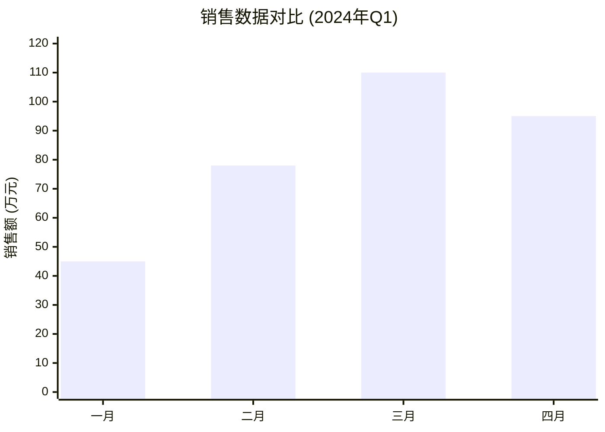
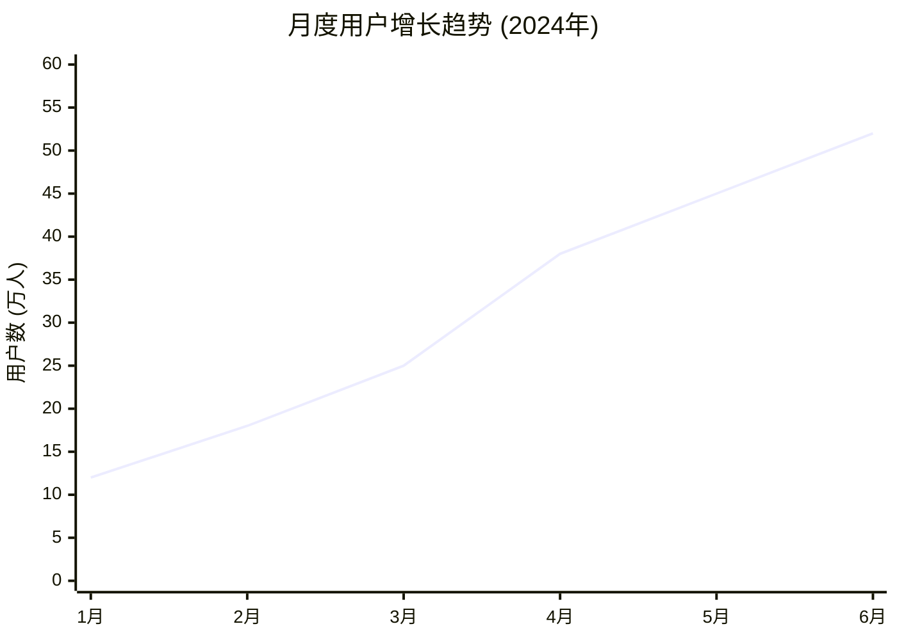
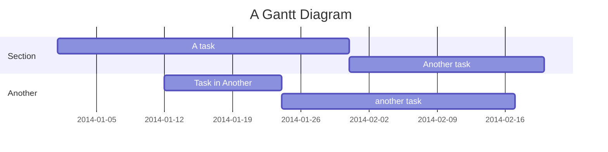
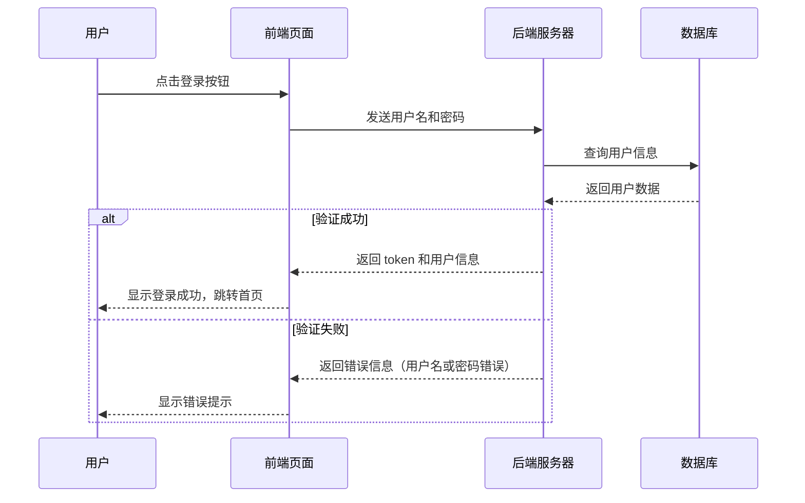
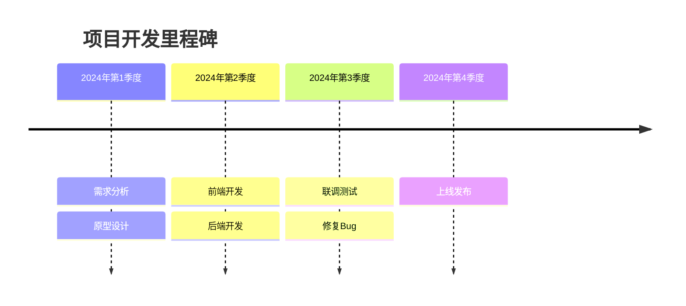
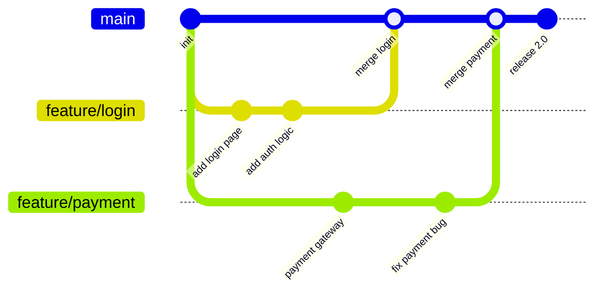
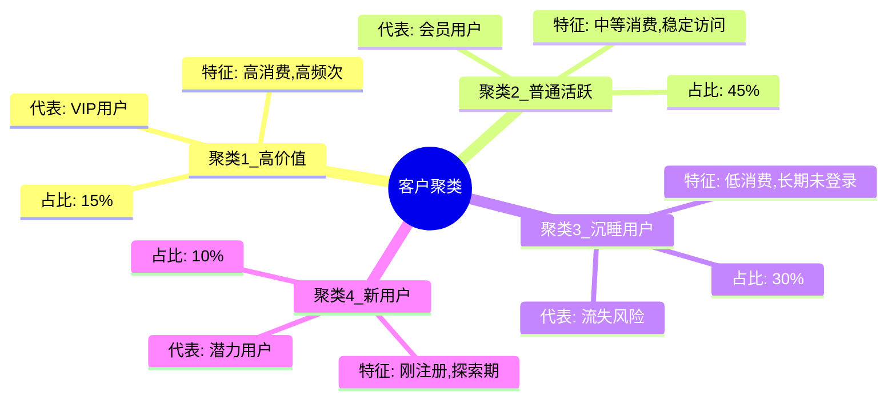
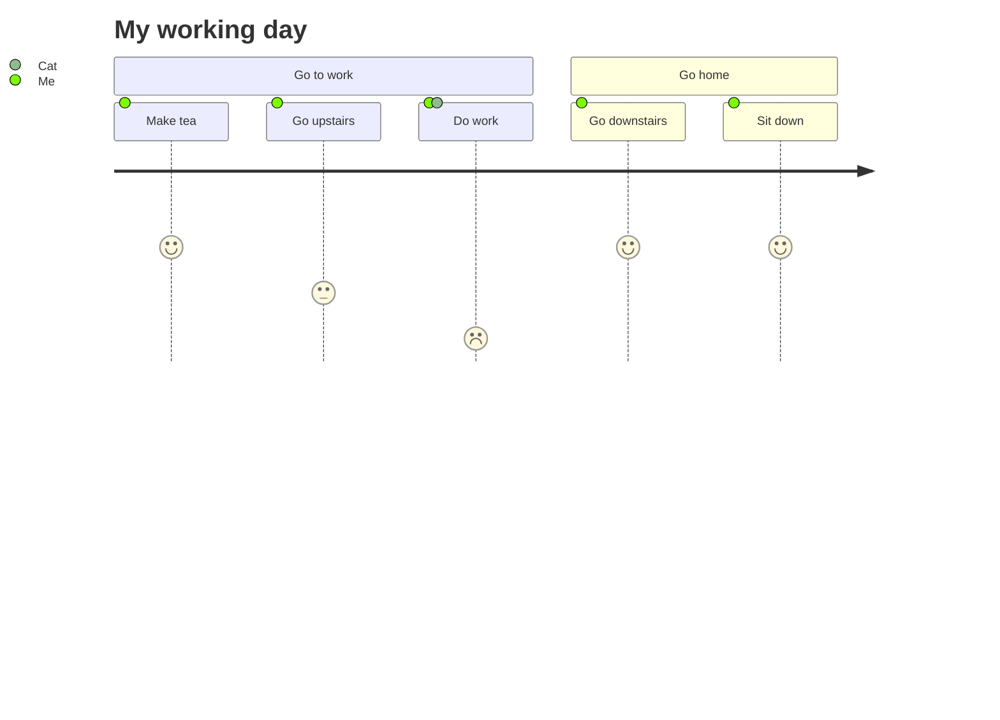
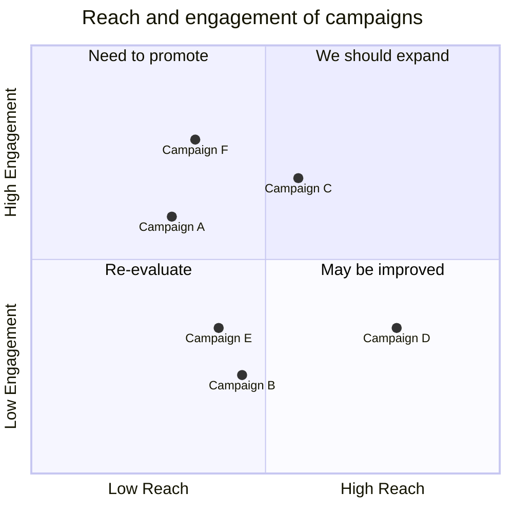

> 来自于：mermaid、D2、echarts、G2 antv、D3
# 柱状图

# 折线图

# 散点图

# 箱线图

# 小提琴图

# 弧长连接图

# 马赛克图

# 打包图

# 堆叠面积图

# 堆叠柱状图

# 分布曲线图

# 分组柱状图

# 绘图曲线图

# 茎叶图

# 矩形树图

# 平行坐标系

# 气泡图

# 色块图

# 韦恩图

# 旭日图

# 玉珏图

# 直方图

# 雷达图

# 双向柱状图

# 饼图

# 环图

# 热力图

# 分级统计地图

# 漏斗图

# K 线图

# 南丁格尔玫瑰图

# 等高线图

# 螺旋图

# 桑基图

# 子弹图

# 甘特图

# 卡吉图

# 和弦图

# 山峦图

# 蜂群图

# 累计分布图

# 时序图

# 时间线图

# Git graph

# 泳道图

# 甘特图

```mermaid
gantt
    title 泳道式任务分配（Git 提交流程）
    dateFormat HH:mm
    axisFormat %H:%M
    
    section 开发人员
    编写代码    :dev1, 09:00, 2h
    提交与推送  :dev2, after dev1, 1h

    section 测试人员
    拉取并测试  :tst1, after dev2, 3h
    报告问题    :tst2, after tst1, 30m

    section 运维人员
    部署生产    :ops1, after tst1, 1h
    服务监控    :ops2, after ops1, 2h
```

# 聚类图

# UMAP/t-SNE

# 3D 曲面

# 向量场图

# Voronoi 剖分

# KDE 密度估计

# 置信区间图

# 校准图

# Activation Map / Grad-CAM

# scaling law 图

# 帕累托前沿

# 消融矩阵

# 屋顶线图

# 吞吐量-延迟曲线

# 火焰图

# 调用图

# 内存层次

# 相图

# 系统框架图 / 块图

# 旅行图

# 象限图

# 事务图

# 鱼骨图

# 沃德利地图

# 径向树图

# 组边际图

