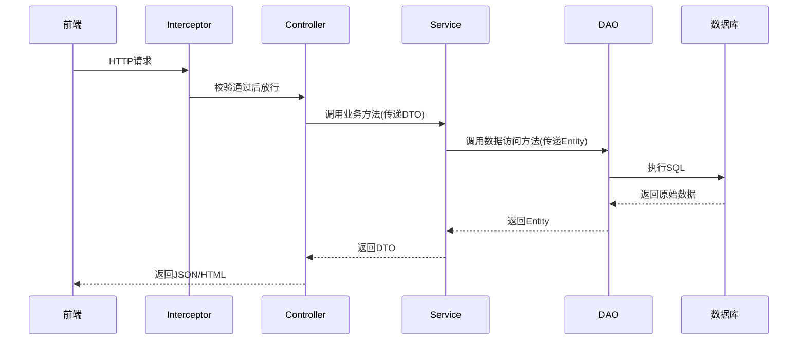
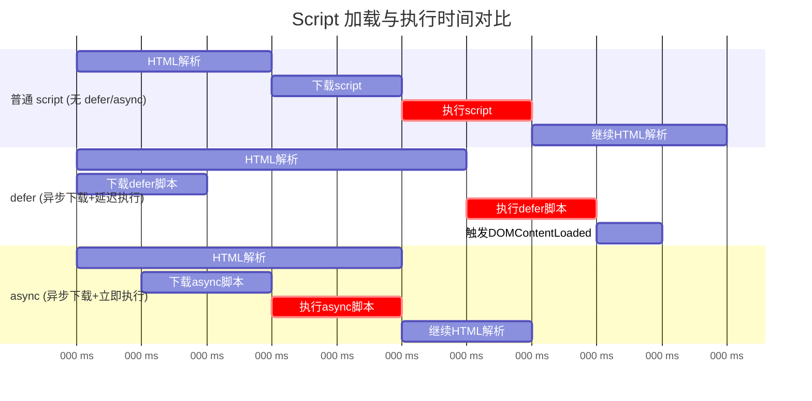
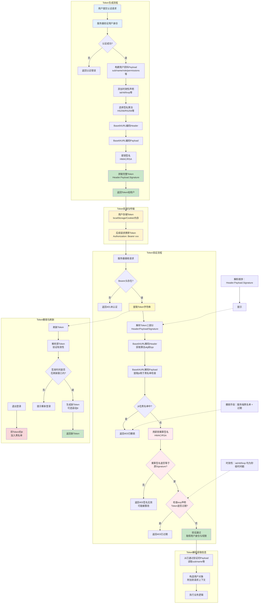

# javascript

## 单元测试

1. 标准目录

   ```
   my-app/
   ├── src/
   │   └── calculator.js
   ├── tests/                      # 与src平级
   │   └── calculator.test.js
   └── package.json
   ```

2. 安装

   ```bash
   npm install -D jest
   ```

3. 编写测试脚本
   假设业务代码`calculator.js`

   ```javascript
   // 函数式
   function add(a, b) {
       return a + b;
   }
   
   // 面向对象
   class Calculator {
       add(a, b) {
           return a + b;
       }
   }
   
   module.exports = { add, Calculator };
   ```

   测试代码`calculator.test.js`

   ```javascript
   const { add, Calculator } = require('../src/calculator');
   
   // 测试函数
   test('adds 1 + 2 to equal 3', () => {
       expect(add(1, 2)).toBe(3);
   });
   
   // 测试类方法
   describe('Calculator', () => {
       test('add method should work', () => {
           const calc = new Calculator();
           expect(calc.add(1, 2)).toBe(3);
       });
   });
   ```

4. 参数化测试

   ```javascript
   // 使用 test.each 进行参数化
   test.each([
       [1, 2, 3],
       [-1, 1, 0],
       [0, 0, 0],
       [100, 200, 300]
   ])('add(%i, %i) should return %i', (a, b, expected) => {
       expect(add(a, b)).toBe(expected);
   });
   
   // 或者使用表格形式
   describe.each([
       { a: 1, b: 2, expected: 3 },
       { a: -1, b: 1, expected: 0 },
   ])('add($a, $b)', ({ a, b, expected }) => {
       test(`returns ${expected}`, () => {
           expect(add(a, b)).toBe(expected);
       });
   });
   ```

5. 生命周期钩子

   ```javascript
   let database;
   
   beforeEach(() => {
       database = new Database();
       database.connect();
   });
   
   afterEach(() => {
       database.disconnect();
   });
   
   test('database query works', () => {
       expect(database.query('SELECT 1')).toBe(true);
   });
   ```

6. 运行测试

   ```bash
   # 运行所有测试
   npm test
   
   # 监听模式（自动重跑）
   npm test -- --watch
   ```

## 项目初始化
1. 创建项目文件夹，并进入其中。

2. 初始化，生成`package.json`

   ```bash
   npm init -y
   ```

   `-y`会使用默认配置快速生成。

3. 配置`package.json`

   ```json
   {
     "name": "<project name>",
     "version": "1.0.0",
     "description": "<project descript>",
     "main": "index.js",
     "scripts": {
       "start": "node index.js",
       "dev": "nodemon index.js",
       "test": "jest"
     },
     "keywords": [],
     "author": "",
     "license": "ISC",
     "type": "module"
   }
   ```

4. 安装基础依赖

   ```bash
   # 生产依赖
   npm install express dotenv
   # 开发依赖
   npm install -D nodemon eslint prettier jest
   ```

5. 创建项目结构

   ```
   my-project/
   ├── src/
   │   ├── controllers/    # 控制器
   │   ├── models/         # 数据模型
   │   ├── routes/         # 路由
   │   ├── services/       # 业务逻辑
   │   ├── utils/          # 工具函数
   │   └── index.js        # 入口文件
   ├── tests/              # 测试文件
   ├── .env                # 环境变量
   ├── .gitignore          # Git忽略文件
   ├── package.json
   └── README.md
   ```

6. 配置`.gitignore`

   ```
   node_modules/
   .env
   dist/
   coverage/
   .DS_Store
   *.log
   ```

7. 配置 ESLint

   ```bash
   npx eslint --init
   ```

8. 配置 Prettier，创建`.prettierrrc`

   ```json
   {
     "semi": true,
     "singleQuote": true,
     "tabWidth": 2,
     "trailingComma": "es5"
   }
   ```

9. 基础入口文件示例`src/index.js`

   ```javascript
   const express = require('express');
   const dotenv = require('dotenv');
   
   dotenv.config();
   
   const app = express();
   const PORT = process.env.PORT || 3000;
   
   app.use(express.json());
   
   app.get('/', (req, res) => {
     res.json({ message: 'Hello World' });
   });
   
   app.listen(PORT, () => {
     console.log(`Server running on port ${PORT}`);
   });
   ```

10. 常用命令

    ```bash
    # 启动项目
    npm start
    
    # 开发模式（自动重启）
    npm run dev
    
    # 运行测试
    npm test
    
    # 检查代码风格
    npm run lint
    ```
## 本地JS引用远程JS

本地JS引用语句要在远程JS之后

```javascript
<script src="https://gw.alipayobjects.com/os/antv/pkg/_antv.g6-3.1.1/build/g6.js"></script>
<script src="knowledgegraph.js"></script>
```

## 同步控制

```javascript
initData("company_name")
    .then(data => {
       console.log(data);
    })
    .catch(error => {
        console.error("Error:", error);
    });
```

## 获取数据

-通过网络获取数据，一定要写成同步或异步形式；

## 如何在浏览器端运行本地脚本

1. 新建JS脚本。

```javascript
javascript:(function(){
   // 放置你的脚本
});
```

2. 在浏览器中添加书签，名字随便填，URL填刚才的脚本。

3. 进入目标网页。

4. 在书签栏点击它。

## 模块化开发

导出一个函数

```js
export function myFunction(param) {
    console.log('This is my function with parameter:', param);
}
```

导出一个变量

```js
export const greeting = 'Welcome to our service!';
```

如何引用同级目录的JS文件

```js
import { myFunction, greeting } from './utils.js';
```

在html中引用

```html
<script type='module' src='./index.js'></script>
```

## 流式响应

服务器不是一次性返回完整的回答，而是将回答分成多个小块逐步发送给前端。

1. 分块生成
2. 立即传输
3. 减少感知延迟

### SSE (Sever-Sent Event)格式

服务器向客户端推送数据的技术，格式特点：

1. Content-Type：text/event-stream

2. 消息格式：

   ```
   data: {JSON数据}\n\n
   ```

3. 可以通过`event: `指定事件类型

4. 可以通过`id`指定消息id

5. 可以通过`retry`指定连接断开后的重试时间

### 前端渲染

通过`content += data`进行动态渲染

`'id': generate_agent_message_id(),`

### 配置流式输出

> 以 Python 为例

```python
import os
from flask import Flask, Response, request, jsonify
from openai import OpenAI

# 初始化 Flask 应用
app = Flask(__name__)

# 初始化 OpenAI 客户端
# 确保环境变量中设置了 OPENAI_API_KEY，或者直接在此填入
client = OpenAI(api_key=os.getenv("OPENAI_API_KEY", "你的_API_KEY"))

@app.route('/chat', methods=['POST'])
def chat_stream():
    # 获取前端发送的消息
    data = request.json
    user_message = data.get('message', '你好，请介绍一下自己。')

    def generate():
        try:
            # 调用 OpenAI 接口，stream=True 是开启流式输出的关键
            stream = client.chat.completions.create(
                model="gpt-3.5-turbo",  # 或 gpt-4
                messages=[
                    {"role": "system", "content": "你是一个乐于助人的助手。"},
                    {"role": "user", "content": user_message}
                ],
                stream=True,  # <--- 关键点：开启流式输出
                temperature=0.7,
            )

            # 遍历流式返回的数据块
            for chunk in stream:
                # 提取内容。注意：流式返回中，chunk.choices[0].delta.content 可能为 None
                if chunk.choices[0].delta.content is not None:
                    content = chunk.choices[0].delta.content
                    # print(content, end="", flush=True) # 如果在后台运行，可以取消注释查看打印
                    yield content  # 将内容通过 generator yield 出去，Flask 会自动分块发送
                    
        except Exception as e:
            print(f"Error: {e}")
            yield f"[Error] {str(e)}"

    # 返回 Response 对象，mimetype 设为 text/plain（如果做 SSE 则设为 text/event-stream）
    return Response(generate(), mimetype='text/plain; charset=utf-8')

if __name__ == '__main__':
    # 启动服务
    print("Starting Flask server...")
    app.run(port=5000, debug=True)
```

举例说明：发送的文本块：

```text
Send Chunk: [你]
Send Chunk: [好]
Send Chunk: [！我]
Send Chunk: [是]
Send Chunk: [一个]
Send Chunk: [人工智能]
Send Chunk: [ ]
Send Chunk: [助手]
Send Chunk: [。]
```

前端如何渲染：

html代码：

```html
<div id="chat-box" style="border:1px solid #ccc; height:300px; overflow-y:scroll; padding:10px;"></div>
<button onclick="streamChat()" id="btn">发送消息</button>
```

javascript 代码

```javascript
async function streamChat() {
    const chatBox = document.getElementById('chat-box');
    const btn = document.getElementById('btn');
    
    // 1. 初始化 UI
    btn.disabled = true;
    const msgDiv = document.createElement('div');
    msgDiv.textContent = "AI: ";
    msgDiv.className = "cursor"; // 可选：添加光标样式
    chatBox.appendChild(msgDiv);

    try {
        // 2. 发起请求
        const response = await fetch('http://localhost:5000/chat', {
            method: 'POST',
            headers: { 'Content-Type': 'application/json' },
            body: JSON.stringify({ message: '你好' })
        });

        // 3. 获取流读取器
        const reader = response.body.getReader();
        const decoder = new TextDecoder();

        // 4. 循环读取数据
        while (true) {
            const { done, value } = await reader.read();
            if (done) break;

            // 5. 解码并渲染
            const chunk = decoder.decode(value, { stream: true });
            msgDiv.textContent += chunk;
        }

    } catch (e) {
        console.error(e);
        msgDiv.textContent += " [Error]";
    } finally {
        btn.disabled = false;
        msgDiv.classList.remove('cursor'); // 移除光标
    }
}
```

流式渲染演示代码

```html
<!DOCTYPE html>
<html lang="zh">
<head>
    <meta charset="UTF-8">
    <meta name="viewport" content="width=device-width, initial-scale=1.0">
    <title>模拟流式渲染演示</title>
    <style>
        #display-area { 
            width: 100%; 
            height: 200px; 
            border: 1px solid #333; 
            padding: 10px; 
            font-size: 18px; 
            line-height: 1.5;
            background-color: #f0f0f0;
            margin-bottom: 10px;
            white-space: pre-wrap; /* 保留换行符 */
        }
        button { padding: 10px 20px; font-size: 16px; cursor: pointer; }
        .stopped { color: red; }
        .running { color: green; }
    </style>
</head>
<body>

    <h3>模拟流式数据渲染 (自动循环)</h3>
    <div id="display-area"></div>
    
    <button id="startBtn" onclick="startSimulation()">开始演示</button>
    <button id="stopBtn" onclick="stopSimulation()">结束演示</button>
    <p id="status">状态: 待机</p>

    <script>
        // 1. 模拟的长文本数据
        const fullText = `这里是一段模拟的流式输出文本。在真实的网络环境中，数据不是一次性到达的，而是像打字机一样一个字一个字蹦出来的。
这个演示通过前端定时器模拟后端发送数据片段的过程。
你可以看到文字在不断地追加，直到这段话显示完毕，然后它会自动清空并重新开始循环。
点击“结束演示”按钮可以随时停止这个过程。`;

        const displayArea = document.getElementById('display-area');
        const statusEl = document.getElementById('status');
        
        let currentIndex = 0;
        let intervalId = null;
        let isRunning = false;

        function startSimulation() {
            if (isRunning) return; // 防止重复点击
            isRunning = true;
            updateStatus('正在运行...', 'running');
            
            // 如果是从头开始（即不是暂停后继续），清空显示区
            if (currentIndex >= fullText.length) {
                currentIndex = 0;
                displayArea.textContent = "";
            }

            // 2. 使用 setInterval 模拟源源不断的数据流
            intervalId = setInterval(() => {
                // 检查是否文本已经全部输出完了
                if (currentIndex >= fullText.length) {
                    // --- 渲染完成，执行清除和循环逻辑 ---
                    displayArea.textContent = ""; // 清空屏幕
                    currentIndex = 0;             // 重置索引
                    return; // 下一轮循环开始
                }

                // --- 模拟发送数据块 ---
                // 随机决定这次发送 1 个字还是 3 个字，模拟网络的不均匀性
                const chunkSize = Math.random() > 0.7 ? 3 : 1;
                
                // 截取当前片段
                const chunk = fullText.substring(currentIndex, currentIndex + chunkSize);
                
                // 追加到页面 (模拟前端接收到 chunk)
                displayArea.textContent += chunk;
                
                // 更新索引
                currentIndex += chunkSize;
                
                // 自动滚动到底部
                displayArea.scrollTop = displayArea.scrollHeight;

            }, 50); // 每 50 毫秒发送一次数据块
        }

        function stopSimulation() {
            if (!isRunning) return;
            
            clearInterval(intervalId); // 清除定时器
            isRunning = false;
            updateStatus('已停止', 'stopped');
        }

        function updateStatus(text, className) {
            statusEl.textContent = `状态: ${text}`;
            statusEl.className = className;
        }
    </script>
</body>
</html>
```
# python

## 单元测试

1. 推荐的项目布局

   ```text
   your_project/
   ├── pyproject.toml      # 项目配置文件
   ├── src/                # 源码目录
   │   └── mypkg/
   │       ├── __init__.py
   │       ├── app.py      # 你的业务代码
   │       └── utils.py
   └── tests/              # 测试代码目录，与src平级
       ├── __init__.py
       ├── test_app.py
       └── test_utils.py
   ```

   这种结构的好处是：

   2. **强制安装模式测试**：测试会针对你通过 `pip install -e .` 命令安装的包版本进行，这模拟了真实用户的环境，能有效避免因错误的导入路径而“意外”测试了源码副本[-5](https://docs.pytest.org/en/stable/explanation/goodpractices.html?highlight=editable)。
   3. **防止命名冲突**：由于源码被包裹在 `src/` 目录下，项目的根目录（`your_project/`）不会成为一个隐式的 Python 包，避免了与全局模块的命名冲突[-5](https://docs.pytest.org/en/stable/explanation/goodpractices.html?highlight=editable)。
   4. **清晰分离**：一眼就能区分项目代码和测试代码，管理起来更方便。

5. 安装

   ```bash
   uv pip install pytest
   ```

6. 根据业务代码，编写测试文件。核心是利用Python原生的`assert`语句进行断言
   假设待测试的函数（例如，在 `src/mypkg/app.py` 中）：

   ```python
   # src/mypkg/app.py
   def add(a, b):
       return a + b
   ```

   **编写测试文件**（例如，在 `tests/test_app.py` 中）：
   `pytest` 要求测试文件和测试函数都以 `test_` 开头

   ```python
   # tests/test_app.py
   from mypkg.app import add  # 从安装的包中导入
   
   def test_add():
       assert add(1, 2) == 3
       assert add(-1, 1) == 0
       assert add(0, 0) == 0
   ```

7. 运行测试，在项目根目录下，只需执行`pytest` 命令，它就会自动发现并运行所有测试

   ```bash
   pytest
   ```
## 下载spacy的en_core_web_sm

```bash
python -m ensurepip --upgrade
python -m pip install --upgrade pip
python -m spacy download en_core_web_sm
```
## 多线程处理

```python
from concurrent.futures import ThreadPoolExecutor

def func1(para1):
	pass
	
para1_list = [p1, p2, p3, p4]

with ThreadPoolExecutor(max_workers=4)as executor:
	executor.map(func1, para1_list)
```

## py文件解析命令行参数

```
import argparse
parser = argarse.ArgumentParser(description="xxx")
parser.add_argument(
	"{argument_name}",
	action='store_true',# 指定参数时，被设置为true，否则默认为false
	default=None,
	type=str,
	nargs,				# 可以接受多个值，这些值被存储在一个列表中
	required=False,
	choices=[],			# 做输入参数检查
	help="{explanation}"
)
```

## 注册模式

Python的`regiestrable`库。

在编译阶段，将各种类注册到一个对象中，即可通过字符串调用各种类。

## 动态加载类

1. 获取类所在py文件的文件夹`folder_path`
2. 加入到环境变量中`sys.path.apppend`
3. 导入py文件模块
4. 获取其中变量名，根据变量判断类文件

```python
import sys
import importlib
import os

# 获取类所在py文件的文件夹路径
folder_path = os.path.dirname(os.path.abspath(__file__))

# 将文件夹路径加入到环境变量中
sys.path.append(folder_path)

# 导入py文件模块
module_name = 'your_module_name'  # 替换为实际的模块名
module = importlib.import_module(module_name)

# 获取模块中的变量名，并根据变量判断类文件
for name, obj in vars(module).items():
    if isinstance(obj, type):  # 判断是否为类
        print(f"Class found: {name}")
```

## ipynb 中多线程

使用`concurrent`库，而不是`multiprocessing`库，后者只在`py`文件中生效。

## 日志打印

```python
import logging

logging.basicConfig(
    level=logging.DEBUG,  # 设置日志级别
    format='%(asctime)s - %(name)s - %(levelname)s - %(message)s',
    filename='app.log',  # 日志文件
    filemode='a'  # 追加模式
)

logging.debug('这是一条debug信息')
logging.info('这是一条info信息')
logging.warning('这是一条warning信息')
logging.error('这是一条error信息')
logging.critical('这是一条critical信息')
```

## 异步编程

异步版本，由于异步编程有耗时，不耗时的任务不建议。
同时进行

```python
import asyncio
import time

async def task_one():
    print("Task One 开始")
    await asyncio.sleep(2)  # 模拟IO操作
    print("Task One 完成")
    return "Task One 结果"

async def task_two():
    print("Task Two 开始")
    await asyncio.sleep(3)  # 模拟IO操作
    print("Task Two 完成")
    return "Task Two 结果"

async def main_async():
    start_time = time.time()
    
    # 同时启动两个任务
    task1 = asyncio.create_task(task_one())
    task2 = asyncio.create_task(task_two())
    
    # 等待两个任务都完成
    results = await asyncio.gather(task1, task2)
    
    end_time = time.time()
    print(f"异步执行总耗时: {end_time - start_time:.2f}秒")
    print(f"收集到的结果: {results}")

# 运行异步主函数
asyncio.run(main_async())

```

无等待

```python
import asyncio
import time

async def async_task(name, duration):
    """模拟异步耗时任务"""
    print(f"任务 {name} 开始执行，将耗时 {duration}秒")
    await asyncio.sleep(duration)
    print(f"任务 {name} 完成")
    return f"{name}-结果"

async def async_execution():
    """异步执行任务（不等待完成）"""
    start_time = time.time()
    
    # 创建并启动所有任务（但不等待）
    asyncio.create_task(async_task("A", 2))
    asyncio.create_task(async_task("B", 3))
    asyncio.create_task(async_task("C", 1))
    
    # 立即计算耗时（不等待任务完成）
    end_time = time.time()
    print(f"\n异步启动总耗时: {end_time - start_time:.4f}秒")
    
    # 主程序可以继续执行其他操作
    print("主程序继续执行其他操作...")
    await asyncio.sleep(0.1)  # 稍微等待一下，让任务有机会开始

# 运行异步执行
asyncio.run(async_execution())

# 注意：由于没有等待任务完成，程序可能在所有任务完成前退出
# 可以添加一个足够长的等待时间来观察任务输出
# await asyncio.sleep(4)

```


# CSS

## 作用域

- 按组件

```css
h1 {
    
}

h1 span {   # 组件嵌套
    
}
```

- 按id

```css
#header {
    background-color: blue;
    color: white;
}
```

- 按类

```css
.box {
    background-color: yellow;
    border: 1px solid black;
}
```

## 选择器

```css
/* 为 h1、h2、h3 的 span 应用相同样式 */
h1 span,
h2 span,
h3 span {
    ...
}

```

# rust

## 项目架构

将不同架构分割为不同的crate
## http 请求

```rust
use reqwest::Client;

let url = "https://github.com/aria2/aria2/releases/download/release-1.37.0/aria2-1.37.0-win-64bit-build1.zip";

let client = Client::new();

let mut response = client.get(url).send().await.context("发送 HTTP 请求失败")?;
```

## 异步创建文件

```rust
use tokio::fs::File;

let file_name = "aria2-1.37.0-win-64bit-build1.zip";
let mut file = File::create(file_name).await.context("创建本地文件失败")?;
```

## 流式写入磁盘

```rust
// 为什么不用 response.bytes().await?
// 因为这会把整个文件加载到内存里，下载几 GB 的文件时会直接 OOM。
// chunk() 方法每次只读取一小块数据（通常是几 KB 到几十 KB）
while let Some(chunk) = response.chunk().await.context("读取数据块失败")? {
    // 将这一小块数据异步写入磁盘
    file.write_all(&chunk).await.context("写入磁盘失败")?;

}
```

## 刷新终端输出

```rust
// 简单打印一下进度（先做个简陋版的进度条）
print!("\r已下载: {} / {} bytes", downloaded, total_size);
use std::io::Write;
std::io::stdout().flush()?; // 强制刷新终端输出
```
## anyhow 错误处理

`anyhow`扮演了错误处理增强器的角色

1. 统一的错误类型`Result<T>`

   ```rust
   use anyhow::Result;
   
   // anyhow::Result<T> 是 Result<T, anyhow::Error> 的别名
   // 可以容纳任何类型的错误
   fn main() -> Result<()> {  // 无需指定具体错误类型
       // ...
   }
   ```

2. 添加上下文信息`.context()`

   ```rust
   let mut respone = client.get(url)
   	.send()
   	.await()
   	.context("发送 HTTP 请求错误")?;
   ```

   当请求失败时，会看到错误信息：

   ```text
   Error: 发送 HTTP 请求失败
   
   Caused by:
       connection timed out
   ```

   而不是原始的、难以理解的`reqwest::Error`。不使用`anyhow`：

   ```rust
   let response = client.get(url).send().await?;
   // 错误信息: "reqwest::Error: connection failed"
   // 难以定位是哪个步骤出错
   ```

3. 快速失败`anyhow::bail!()`

   ```rust
   if !response.status().is_success() {
       anyhow::bail!("下载失败，状态码: {}", response.status());
   }
   ```

   立即返回一个格式化的错误，相当于：

   ```rust
   return Err(anyhow::anyhow!("下载失败，状态码: {}", response.status()));
   ```

4. 简化错误传递`?`运算符

   没有 `anyhow` 时，需要：

   ```rust
   fn main() -> Result<(), Box<dyn std::error::Error>> {
       // 或者定义复杂的自定义错误类型
   }
   ```

   使用 `anyhow`后：

   ```rust
   fn main() -> anyhow::Result<()> {
       // 简洁明了
   }
   ```
## 搜索语法

通过官方API

```
https://docs.rs/releases/search?query=<xxx>
```
## 单元测试

内置测试框架，不用安装。**关键点**：`tests/` 目录下的文件只能测试**库（library）**，不能测试二进制程序（binary）。因此，`src/` 下必须有 `lib.rs`。

1. 标准目录结构

   ```
   my_project/
   ├── src/
   │   └── lib.rs              # 库代码
   └── tests/                  # 测试代码目录（与src平级）
       ├── test_calculator.rs  # 集成测试
       └── test_utils.rs
   ```

2. 编写测试。
   编写源码`src/lib.rs`，定义公共 API

   ```rust
   // src/lib.rs
   
   // 使用 pub 导出模块
   pub mod calculator {
       pub fn add(a: i32, b: i32) -> i32 {
           a + b
       }
       
       pub fn subtract(a: i32, b: i32) -> i32 {
           a - b
       }
   }
   
   // 或者直接导出函数
   pub fn multiply(a: i32, b: i32) -> i32 {
       a * b
   }
   
   // 私有函数无法被集成测试访问
   fn private_helper() {
       // 这个函数只能在 lib.rs 内部使用
   }
   ```

   编写测试代码`tests/test_calculator.rs`，导入

   ```rust
   // tests/test_calculator.rs
   // my_project与Cargo.toml中的包名一致。
   use my_project::calculator::add;
   use my_project::multiply;
   
   #[test]
   fn test_add() {
       assert_eq!(add(2, 3), 5);
   }
   
   #[test]
   fn test_multiply() {
       assert_eq!(multiply(2, 3), 6);
   }
   ```

3. 运行命令

   ```bash
   # 运行所有测试（包括单元测试和集成测试）
   cargo test
   
   # 只运行集成测试
   cargo test --test test_lib
   
   # 运行特定测试函数
   cargo test -- --exact exact_function_nam
   ```
## 初始化项目

1. 创建新项目

   ```bash
   # 创建二进制应用项目（可执行文件）
   cargo new my-project
   cd my-project
   
   # 或创建库项目（用于开发库）
   cargo new my-lib --lib
   ```

2. 项目结构

   ```text
   my-project/
   ├── src/
   │   └── main.rs          # 入口文件（库项目为 lib.rs）
   ├── tests/               # 集成测试目录（可选）
   ├── examples/            # 示例代码目录（可选）
   ├── benches/             # 性能测试目录（可选）
   ├── .gitignore           # 自动生成
   ├── Cargo.toml           # 项目配置文件
   └── Cargo.lock           # 依赖锁定文件（自动生成）
   ```

3. 配置Cargo.toml

   ```toml
   [package]
   name = "my-project"
   version = "0.1.0"
   edition = "2021"          # Rust 版本：2018, 2021, 2024
   authors = ["Your Name <email@example.com>"]
   description = "项目描述"
   license = "MIT"
   repository = "https://github.com/username/my-project"
   readme = "README.md"
   
   # 依赖配置
   [dependencies]
   # 生产依赖
   serde = { version = "1.0", features = ["derive"] }
   tokio = { version = "1.0", features = ["full"] }
   anyhow = "1.0"
   thiserror = "1.0"
   
   # 开发依赖
   [dev-dependencies]
   criterion = "0.5"
   rand = "0.8"
   
   # 特性配置
   [features]
   default = []
   json = ["serde_json"]
   
   # 优化配置
   [profile.release]
   opt-level = 3           # 优化级别
   lto = true              # 链接时优化
   codegen-units = 1       # 代码生成单元数
   ```

4. 入口文件示例`src/main.rs`

   ```rust
   use std::env;
   
   fn main() -> Result<(), Box<dyn std::error::Error>> {
       // 读取环境变量
       let port = env::var("PORT").unwrap_or_else(|_| "3000".to_string());
       
       println!("Server running on port {}", port);
       
       // 你的代码逻辑
       Ok(())
   }
   ```

5. 添加常用依赖

   ```bash
   # 异步运行时
   cargo add tokio --features full
   
   # 错误处理
   cargo add anyhow thiserror
   
   # 序列化/反序列化
   cargo add serde --features derive
   cargo add serde_json
   
   # HTTP 客户端
   cargo add reqwest --features json
   
   # 日志
   cargo add tracing tracing-subscriber
   
   # 命令行参数解析
   cargo add clap --features derive
   
   # 环境变量
   cargo add dotenvy
   
   # 配置文件
   cargo add config
   ```

6. 配置开发工具
   rustfmt - 代码格式化（`.rustfmt.toml`）

   ```toml
   edition = "2021"
   max_width = 100
   hard_tabs = false
   tab_spaces = 4
   ```

   clippy - 代码检查（无需配置，直接使用）：

   ```bash
   cargo clippy
   cargo clippy --fix  # 自动修复部分问题
   ```

7. 创建 `.env`文件

   ```text
   PORT=3000
   DATABASE_URL=postgresql://localhost/myapp
   RUST_LOG=info
   ```

8. 常用命令

   ```bash
   # 编译并运行
   cargo run
   
   # 仅编译
   cargo build
   
   # 发布构建（优化）
   cargo build --release
   
   # 运行测试
   cargo test
   
   # 检查代码（不编译）
   cargo check
   
   # 代码格式化
   cargo fmt
   
   # 代码检查
   cargo clippy
   
   # 生成文档
   cargo doc --open
   
   # 更新依赖
   cargo update
   
   # 添加依赖
   cargo add <package>
   
   # 移除依赖
   cargo remove <package>
   ```

9. 更复杂的项目结构

   ```
   my-project/
   ├── src/
   │   ├── bin/              # 多个二进制入口
   │   │   ├── server.rs
   │   │   └── client.rs
   │   ├── lib.rs            # 库入口
   │   ├── main.rs           # 默认二进制入口
   │   ├── config/
   │   │   └── mod.rs
   │   ├── models/
   │   │   └── mod.rs
   │   ├── services/
   │   │   └── mod.rs
   │   └── utils/
   │       └── mod.rs
   ├── tests/
   │   ├── integration_test.rs
   │   └── common/
   │       └── mod.rs
   ├── examples/
   │   └── basic.rs
   ├── Cargo.toml
   └── README.md
   ```

## 获取用户输入

1. 使用标准库

2. 程序获取

   ```
   use std::io::{self, Write};
   
   /// 读取用户输入，带提示符
   pub fn read_user_input() -> io::Result<String> {
       io::stdout().flush()?;
       let mut input = String::new();
       io::stdin().read_line(&mut input)?;
       Ok(input.trim().to_string())
   }
   ```

## 命令执行

1. 安装依赖

2. 程序

   ```rust
   use std::io::Read;
   use std::process::Command;
   use std::time::Duration;
   
   /// 命令执行结果
   #[derive(Debug, Clone)]
   pub struct CommandResult {
       pub stdout: String,
       pub stderr: String,
       pub status: i32,
   }
   
   impl std::fmt::Display for CommandResult {
       fn fmt(&self, f: &mut std::fmt::Formatter<'_>) -> std::fmt::Result {
           if !self.stdout.is_empty() {
               writeln!(f, "stdout:\n{}", self.stdout)?;
           }
           if !self.stderr.is_empty() {
               writeln!(f, "stderr:\n{}", self.stderr)?;
           }
           write!(f, "exit code: {}", self.status)
       }
   }
   
   /// 检查命令是否危险
   pub fn is_dangerous_command(command: &str) -> bool {
       let dangerous_patterns = [
           "rm -rf /",
           "sudo rm",
           "dd if=",
           ":(){ :|:& };:",
           "mkfs",
           "chmod 777 /",
           "chown root:root /",
           "> /dev/",
           "cat /dev/zero",
           "wget.*-O /",
           "curl.*-o /",
       ];
   
       dangerous_patterns.iter().any(|&pattern| {
           regex::Regex::new(pattern)
               .map(|re| re.is_match(command))
               .unwrap_or(false)
       })
   }
   
   /// 解析命令字符串为命令和参数
   fn parse_command(command: &str) -> Result<(String, Vec<String>), Box<dyn std::error::Error>> {
       let trimmed = command.trim();
       if trimmed.is_empty() {
           return Err("Empty command".into());
       }
   
       // 简单的空格分割（在实际应用中可能需要更复杂的shell解析）
       let parts: Vec<&str> = trimmed.split_whitespace().collect();
       if parts.is_empty() {
           return Err("Invalid command format".into());
       }
   
       let cmd = parts[0].to_string();
       let args = parts[1..].iter().map(|s| s.to_string()).collect();
   
       Ok((cmd, args))
   }
   
   /// 带超时等待命令执行完成
   fn wait_with_timeout(
       mut child: std::process::Child,
       timeout: Duration,
   ) -> Result<std::process::Output, Box<dyn std::error::Error>> {
       use std::thread;
   
       let start = std::time::Instant::now();
       loop {
           match child.try_wait()? {
               Some(status) => {
                   let output = std::process::Output {
                       status,
                       stdout: child.stdout.take().map_or_else(Vec::new, |mut reader| {
                           let mut buf = Vec::new();
                           reader.read_to_end(&mut buf).unwrap_or(0);
                           buf
                       }),
                       stderr: child.stderr.take().map_or_else(Vec::new, |mut reader| {
                           let mut buf = Vec::new();
                           reader.read_to_end(&mut buf).unwrap_or(0);
                           buf
                       }),
                   };
                   return Ok(output);
               }
               None => {
                   if start.elapsed() >= timeout {
                       child.kill()?;
                       return Err("Command execution timed out".into());
                   }
                   thread::sleep(Duration::from_millis(100));
               }
           }
       }
   }
   
   pub fn execute_command_safely(
       command: &str,
       timeout_seconds: u64,
   ) -> Result<CommandResult, Box<dyn std::error::Error>> {
       // 验证命令是否安全
       if is_dangerous_command(command) {
           return Err("Command contains dangerous patterns".into());
       }
   
       // 解析命令和参数
       let (cmd, args) = parse_command(command)?;
   
       // 执行命令
       let child = Command::new(&cmd)
           .args(&args)
           .stdout(std::process::Stdio::piped())
           .stderr(std::process::Stdio::piped())
           .spawn()?;
   
       // 等待命令完成或超时
       let output = wait_with_timeout(child, Duration::from_secs(timeout_seconds))?;
   
       Ok(CommandResult {
           stdout: String::from_utf8_lossy(&output.stdout).to_string(),
           stderr: String::from_utf8_lossy(&output.stderr).to_string(),
           status: output.status.code().unwrap_or(-1),
       })
   }
   ```

## llm请求

1. 添加依赖

   ```toml
   [dependencies]
   async-openai = "0.30"
   tokio = { version = "1", features = ["rt-multi-thread", "macros"] }
   ```

2. 编写代码

   ```rust
   use async_openai::types::{ChatCompletionRequestUserMessageArgs, CreateChatCompletionRequestArgs};
   use async_openai::{Client, config::OpenAIConfig};
   
   
   pub async fn generate_text(
       api_key: String,
       base_url: String,
       model: String,
       prompt: String,
   ) -> Result<String, Box<dyn std::error::Error>> {
       let config = OpenAIConfig::default()
           .with_api_key(api_key)
           .with_api_base(base_url);
   
       let client = Client::with_config(config);
   
       let request = CreateChatCompletionRequestArgs::default()
           .model(model)
           .messages(vec![
               ChatCompletionRequestUserMessageArgs::default()
                   .content(prompt)
                   .build()?
                   .into(),
           ])
           .build()?;
   
       let response = client.chat().create(request).await?;
   
       if let Some(choice) = response.choices.first() {
           Ok(choice.message.content.as_deref().unwrap_or("").to_string())
       } else {
           Ok(String::new())
       }
   }
   ```

3. 测试代码

   ```rust
   #[tokio::test]
   async fn test_generate_text_basic() {
       let config = match get_test_config() {
           Some(config) => config,
           None => {
               println!("Skipping LLM test: OPENAI_API_KEY, OPENAI_BASE_URL, or OPENAI_MODEL not set");
               return;
           }
       };
       let (api_key, base_url, model) = config;
       let prompt = "Hello, how are you?".to_string();
   
       let result = generate_text(api_key, base_url, model, prompt).await;
       assert!(result.is_ok(), "Function should succeed");
       let content = result.unwrap();
       assert!(!content.is_empty(), "Response should not be empty");
   }
   ```
## 自定义变量

举例说明

```ini
export RUSTUP_HOME=/workspace/dev/.rustup

export CARGO_HOME=/workspace/dev/.cargo

export PATH="$CARGO_HOME/bin":$PATH
```

## 注释

```rust
// 注释内容
```

## 方法体

```rust
fn function_name () {
    // 方法体
}
```

## 打印

```rust
println!("Hello world");
```

!表示这是一个宏，会在编译时展开。

## main函数

```rust
fn main() {
	// 跟c++一样必须有的函数
}
```

## 变量声明

```rust
let variable_name = value;
```

Rust中，变量默认是不可变的，一旦被赋值，就不能再修改。

## 可变变量声明

```rust
let mut variable_name = value;
```

## 变量屏蔽

即重新定义同名变量，新变量会“遮蔽”之前的变量，这与修改变量的值不通，因为遮蔽会创建一个全新的变量。

```rust
let x = 5;
let x = x + 1;
```

## 类型注解

```rust
let variable_name: type = value;
```

## 常量

必须显示指定类型

```rust
const constant_name: type = value;
```

- 常量与不可变变量的区别：
  - 常量在编译时被替换为具体的值，没有内存地址。
  - 常量可以在全局作用域中定义，而变量只能在函数或块作用域中定义。

## 声明与初始化

```rust
let x; // 声明
x = 5; // 初始化
```

## 模式匹配结构

```rust
let (x, y) = (1, 2); // 解构元组
```

## 变量作用域

```rust
{
    let x = 5;
    // x有效
}
// x无效
```

## 多行字符串

```rust
let s = "\
	line 1
	line 2
	line 3"
println!("{}", s);
```

输出

```
line 1
line 2
line 3
```

`\`表示忽略末尾的换行符。所以第一个换行符被忽略。

## 字面量

源diamagnetic中直接写出的值。

## 字符串函数

### 创建字符串

`String`：可变的、堆分配的字符串类型。

`&str`：不可变的字符串切片，通常用于引用字符串数据。

```rust
let s1 = String::new(); //空字符串
let s2 = String::from("hellow"); //从字符串字面量
```

## 允许不安全操作

在rs文件开头添加一行

```rust
#![allow(unsafe_op_in_unsafe_fn)]
```

## 导入模块

```rust
use pyo3::prelude::*;	// 导入 pyo3 库的预导入模块
```

## 项目命名

全小写，以`_`连接

## 引用同级目录下rs文件

tree文件树

```
src/
├── lib.rs      # 库入口文件
└── other.rs    # 同级文件（要引用的模块）
```

other.rs中

```rust
pub fn some_function() {
    println!("Hello from other.rs!");
}
```

lib.rs中

```rust
// 声明同级文件 `other.rs` 为一个模块
mod other;  // 这会让 Rust 自动查找 `other.rs` 或 `other/mod.rs`

// 使用other::some_function();
```

## Trait

在 Rust 中，**trait** 是一种定义共享行为的机制，类似于其他语言中的 **接口（interface）** 或 **抽象类（abstract class）**，但更灵活。它用于声明一组方法（行为），可以被不同的类型实现，从而实现多态和代码复用。

## 一键编译并运行

命令行输入`cargo run`

## &

`& Var`表示对Var的借用，即只有只读权限。

## Box

```rust
Box<dyn std::error::Error>
```

Box是Rust的智能指针，用于在堆（heap）上分配数据

## dyn

表示动态分发（运行时多态）

## ？

错误传播运算符。

```rust
let entry = entry?;
```

等价于

```rust
let entry = match entry {
    Ok(value) => value,      // 如果是 Ok/Some，取出值继续执行
    Err(e) => return Err(e), // 如果是 Err/None，立即返回错误
};
```

关键特性：自动错误转换

## Ok

Ok是Result枚举的变体，表示成功状态。

`Ok(())`等价于`void`

## 打印

```
println!("{}", content); // 注意添加了格式化字符串
```

## 读取文件

```rust
use std::path::Path;
use std::fs::File;
use std::io::Read;

let file_path = Path::new(r"xxx");
let mut file = File::open(path)?;
let mut contents = String::new();
file.read_to_string(&mut contents)?;
```

## !\[\]

空向量

## 多线程

```rust
use std::sync::{Arc, Mutex};
use rayon::prelude::*;
/// Arc：Atomic Reference Counted原子引用计数，适合跨线程共享只读数据
/// Mutex：互斥锁，确保同一时间只有一个线程可以修改数据，确保线程安全。
/// rayon: 线程池
let result = Arc::new(Mutex::new(String::new()));
    
    // 使用 rayon 线程池，限制并发数为 4
    rayon::ThreadPoolBuilder::new()
        .num_threads(4)  // 设置线程池大小为 4
        .build_global()?;

    // 并行处理文件
    lean_files.par_iter().for_each(|file_path| {
        match utils::read_file_utf8(file_path) {
            Ok(content) => {
                let mut result = result.lock().unwrap();
                result.push_str(&content);
                result.push_str("\n\n"); // 添加分隔符
            }
            Err(e) => eprintln!("Error reading file {:?}: {}", file_path, e),
        }
    });
```

## match

类似`switch`语句

```rust
match value {
    pattern1 => { };
    pattern2 => { };
}
```

## 创建文件

如果文件不存在，则创建，如果文件已经存在，则会覆盖。

```rust
use std::path::Path;
use std::fs::File;

let output_path = Path::new("mathlib.lean");
let mut output_file = File::create(output_path)?;
```

## 进度条

```rust
use indicatif::{ProgressBar, ProgressStyle};

let pb = ProgressBar::new(lean_files.len() as u64);
pb.set_style(ProgressStyle::default_bar()
    .template("{spinner:.green} [{elapsed_precise}] [{bar:40.cyan/blue}] {pos}/{len} ({eta}) {msg}")?
    .progress_chars("#>-"));
pb.set_message("Processing files...");

// 进度条前进
pb.inc(1);
```

## 调试

`RUST_BACKTRACE`表示显示错误栈信息

```bash
RUST_BACKTRACE=1 cargo run xxx
```

## 编写一个Python扩展

1. 命令行创建一个新的Rust项目`cargo new --lib rust_python_ext`

2. 配置`Cargo.toml`

```toml
[package]
name = "rust_python_ext"
version = "0.1.0"
edition = "2024"

[lib]
name = "rust_python_ext"
crate-type = ["cdylib"]

[dependencies]
pyo3 = { version = "0.20.0", features = ["extension-module", "macros"] }
```

3. 编辑`src/lib.rs`文件

```rust
#![allow(unsafe_op_in_unsafe_fn)]

use pyo3::prelude::*;

#[pyfunction]	// 定义一个Python可调用的函数
// i32: 32位整数
fn add(a: i32, b: i32) -> i32 {
   a + b
}
// 重点：函数名必须和 .pyd 文件名一致（这里是 `rust_python_ext`）
#[pymodule]		// 定义一个Python模块
// 模块初始化函数，接收Python解释器实例和模块对象，且名字必须与项目名一致
// _py：Python解释器实例(下划线表示未使用)
// m:表示初始化的模块对象
// &表示不可变引用
// PyResult<()> 表示一个可能返回Python异常或成功的操作结果
fn rust_python_ext(_py: Python, m: &PyModule) -> PyResult<()> {
   m.add_function(wrap_pyfunction!(add, m)?)?;
   // ?用于错误处理
   Ok(())	// 返回成功结果，表示模块初始化成功
}
```

4. 命令行测试Python安装成功，`python --version`，pyo3 0.20.0支持的python版本为`3.7-3.11`

5. 命令行构建`cargo build --release`

6. 在`target/release`找到`rust_python_ext.dll`，复制到Python项目中，将后缀改为`.pyd`

7. 保证`rust_python_ext.pyd`和调用的py文件在同一目录下，在其中调用

```python
import rust_python_ext
print(rust_python_ext.add(1,2))
```

## 模块化编程

1. 新建一个rust项目
2. 在`main.rs`同级目录下新建`util.rs`
3. 在`main.rs`中使用`mod`引用同级目录下的代码，并编写测试

## 错误处理

Rust中，错误处理是显式的，如果一个函数返回`Result`类型，调用它的父函数必须处理可能的错误。

## 查看包的可安装版本

```bash
cargo search <package_name>
```

## 交叉编译

>linux 编译 windows 应用为例

前提：[[环境配置#rust 安装]]

1. 安装依赖

```bash
apt install -y nsis lld llvm clang
```

2. 安装目标工具链

```bash
rustup target add x86_64-pc-windows-gnu
```

4. 安装库 `cargo-xwin`

```bash
cargo install --locked cargo-xwin
```

4. 安装 交叉编译器

```bash
apt install mingw-w64
```

3. 省略程序，开始编译

```bash
cargo butild --target x86_64-pc-windows-gnu
```

# sh

## 文件中变量使用

使用双引号包裹变量而不是单引号

```bash
"$var"	# 正确
'$var'	# 错误
```

# spring boot

## 项目目录

项目目录

```
project-name/
├── src/
│   ├── main/
│   │   ├── java/                          # 主要Java源代码目录
│   │   │   └── com/
│   │   │       └── example/
│   │   │           └── projectname/
│   │   │               ├── config/        # 配置类
│   │   │               ├── controller/    # MVC控制器层
│   │   │               │   └── interceptor# 拦截器组件
│   │   │               ├── dao/           # 数据访问层
│   │   │               │   └── provider   # SQL动态生成类
│   │   │               ├── domain/    	   # 核心领域模型
│   │   │               │   ├── entity     # 数据库实体类
│   │   │               │   └── model      # 业务模型/数据传输对象
│   │   │               ├── service/       # 业务逻辑层
│   │   │               │   ├── impl/      # 服务实现类
│   │   │               │   └── ...        # 服务接口
│   │   │               ├── util/          # 工具类
│   │   │               └── Application.java # 主启动类
│   │   ├── resources/         # 资源文件目录
│   │   │   ├── static/        # 静态资源(js/css/images等)
│   │   │   ├── templates/     # 模板文件(Thymeleaf, FreeMarker等)
│   │   │   ├── application.properties # 主配置文件
│   │   │   └── application.yml       # 可选YAML配置文件
│   │   └── webapp/            # Web应用资源(可选，传统WAR项目)
│   └── test/                  # 测试代码目录
│       └── ....              # 测试类，与main文件目录对称
├── target/					  # 程序构建结果
├── pom.xml                   # Maven构建文件
└── README.md                 # 项目说明文件
```

1. 启动入口文件：`src/main/java/com/example/xxxx/Application.java`，带有`main()`。
2. 数据库或服务配置文件：`src/main/java/resources/appliaction.yml`
3. 数据库交互部分：`src/main/java/com/example/xxxx/dao/`：存放MyBatis Mapper接口或JPA Repository接口。
4. 与前端交互部分：`src/main/java/com/example/xxxx/controller`，负责接收HTTP请求，处理参数，返回响应。

## 组件交互



# typescript

## Vite+TypeScript项目结构

- index.html：项目的入口HTML文件，Vite会从这里开始构建应用。通常包含一个 `<div id="root">` 或其他根元素，用于挂载前端框架（如 React、Vue 等）的组件。
- package.json：项目的配置文件，定义了项目的元信息、依赖包、脚本命令等。
  - `dependencies`：生产环境依赖（如 React、Vue、Axios 等）。
  - `devDependencies`：开发环境依赖（如 Vite、TypeScript、ESLint 等）。
  - `scripts`：可运行的命令（如 `dev` 启动开发服务器，`build` 打包项目）。
- package-lock.json: 锁定依赖包的版本，确保在不同环境中安装完全相同的依赖。由 npm 自动生成，不需要手动修改。
- tsconfig.json：TypeScript 的配置文件，定义了编译选项、文件包含规则等。例如指定目标版本（ES6）、模块系统（ESModule）、严格模式等。
- vite.config.ts：Vite 构建工具的配置文件，用于自定义构建行为。可以配置代理服务器、插件（如 React/Vue 插件）、别名（alias）等。
- public/：存放静态资源（如图标、字体、HTML 模板等），这些文件不会被 Vite 处理，直接复制到输出目录。`favicon.ico`：网站图标。`robots.txt`：搜索引擎爬虫规则。
- src/：源代码目录，包含项目的主要逻辑和组件

## TypeScript+React项目结构

- api/：存放与后端API交互的代码。定义 API 请求的函数（如 `fetchData`、`postData`）。可能使用 `axios`、`fetch` 或其他 HTTP 客户端库。也可能包含 API 接口的类型定义（TypeScript）。
- assets/: 存放静态资源文件。可能包含图片、字体文件等资源。
- components/：存放可复用的 React 组件。通常按功能或模块组织。
- pages/: 存放页面级组件（每个文件通常对应一个路由）。
- utils/: 存放工具函数和辅助代码。
- index.css：全局样式文件。
- index.tsx：React 应用的入口文件。通常包含`ReactDOM.createRoot` 渲染根组件（如 `<App />`）。可能导入全局样式（`index.css`）。
- vite-env.d.ts：Vite 环境的 TypeScript 类型定义文件。用于声明 Vite 特有的模块（如 `import.meta.env`）的类型，以支持 TypeScript 类型检查。

## 导入导出

默认导出

```typescript
const default yourFunctionObject;

# 或者

const mad = { /* ... */ };
export default mad;
```

默认导入

```typescript
import mad from '/src/lib/apis/mad/index.ts';
```

命名导出

```typescript
// 使用命名导出
export const someFunction = () => { /* ... */ };
export const anotherFunction = () => { /* ... */ };
```

命名导入

```typescript
import { specificExport } from '/src/lib/apis/mad/index.ts';
```

# svelte

## 反应式变量

反应式声明用于定义一个响应式的变量或逻辑，当其依赖的变量或条件发生变化时，会自动重新执行相关代码。这使得应用程序能够动态地响应数据的变化，并及时更新 UI。

通过`$:`符号声明，比如

```svelte
$: doubled = count * 2;
```

## 动态更新

```svelte
await tick();
```

1. 确保 DOM 更新完成：在某些情况下，你可能会在代码中更新了一些状态，然后立即进行与 DOM 相关的操作或检查。
2. 同步状态更改：当你修改了响应式状态（如 store 或组件的内部状态）时，Svelte 会在接下来的 microtask 中统一更新 DOM。
3. 处理异步更新：在处理异步操作（如 API 调用、定时器等）后，你可能需要确保 DOM 已经反映了最新的状态。

# Agent Skills 学习

> 来自https://zhuanlan.zhihu.com/p/1999979760458167377

## Skills 是什么

一个给Agent的文件夹，类似于软件开发中的第三方包，包含：工具、使用说明。只需要在使用某个工具时查看使用说明，再拿出来使用。

具体包含：

1. 指令（SKILL.md）：告诉AI怎么干活的 SOP 。
   2. 元数据：名称和描述
   3. 核心目标
   4. 执行流程
   5. 执行约束
6. 参考（reference)：更详细的参考文档（可选）。
7. 脚本（scripts)：比如 Python 代码，让 Skill 也能调用外部能力（可选）。
8. 资源（assets）：图片、模板等可能使用到的资源（可选）。

## 核心机制

按需加载，减少冗余上下文：

1.  先看目录（元数据 Metadata）
    1. 加载时机
    2. 加载那些资源。
    3. 作用
2.  翻开手册（指令 Instructions）
    1. 用户提出需求时加载
    2. 读取SKILL.md文件
    3. 加载详细信息。
3.  动手干活（运行时资源 Runtime Resources）
    1. 按需调用


## 如何使用

> 以 opencode 为例

1. 从社区下载 skill 压缩包
2. 解压到 .opencode/skills文件夹
3. 然后开始使用

## OpenCode Agent SKILL 开发完整规范

### 1. SKILL 系统概述

OpenCode SKILL 系统是一种结构化知识封装机制，允许开发者创建可重用的工作流指南，供AI助手在特定场景下自动触发和执行。

#### 核心设计理念

- **渐进式加载**: 元数据 → SKILL.md主体 → 捆绑资源
- **按需触发**: 基于描述匹配度自动选择技能
- **结构化指导**: 提供清晰的工作流和最佳实践

### 2. SKILL 生命周期

#### 2.1 创建阶段

- **识别需求**: 确定需要封装的专业化工作流
- **编写规范**: 按照SKILL.md格式创建技能文件
- **测试验证**: 使用真实场景测试技能触发和执行

#### 2.2 部署阶段

- **路径放置**: 将技能放置在支持的目录中
- **权限配置**: 通过opencode.json设置访问权限
- **重启验证**: 重启OpenCode以重新加载技能

#### 2.3 维护阶段

- **性能监控**: 检查技能触发率和执行效果
- **内容更新**: 根据反馈优化技能内容
- **版本管理**: 跟踪技能版本和兼容性

#### 2.4 淘汰阶段

- **废弃标记**: 对不再使用的技能进行标记
- **迁移指导**: 提供替代方案或升级路径
- **清理处理**: 从系统中移除废弃技能

### 3. SKILL 文件结构规范

#### 3.1 目录结构

```
skill-name/
├── SKILL.md (必需)
│   ├── YAML frontmatter 元数据 (必需)
│   └── Markdown 指令内容 (必需)
└── 捆绑资源 (可选)
    ├── scripts/          - 可执行代码
    ├── references/       - 参考文档
    └── assets/           - 输出文件使用的资源
```

#### 3.2 YAML Frontmatter 规范

**必需字段**:

```yaml
---
name: skill-name
description: 具体描述技能的功能和使用场景
---
```

**可选字段**:

```yaml
---
name: git-release
description: 创建一致的发布和变更日志
license: MIT
compatibility: opencode
metadata:
  audience: maintainers
  workflow: github
---
```

#### 3.3 命名规范

- **名称格式**: `^[a-z0-9]+(-[a-z0-9]+)*$`
- **长度限制**: 1-64字符
- **分隔符**: 仅允许单个连字符
- **示例**: `git-release`, `frontend-testing`, `perl-testing`

#### 3.4 描述编写指南

- **长度**: 1-1024字符
- **内容**: 必须包含技能功能和具体使用场景
- **风格**: 稍显"强势"以对抗触发不足问题
- **示例**: "创建一致的发布和变更日志。在准备标记发布时使用此技能，从合并的PR中起草发布说明，建议版本提升，或创建可复制的gh release命令。"

### 4. 技能放置和发现

#### 4.1 支持的路径位置

**项目本地路径**:

- `.opencode/skills/<name>/SKILL.md`
- `.claude/skills/<name>/SKILL.md` 
- `.agents/skills/<name>/SKILL.md`

**全局路径**:

- `~/.config/opencode/skills/<name>/SKILL.md`
- `~/.claude/skills/<name>/SKILL.md`
- `~/.agents/skills/<name>/SKILL.md`

#### 4.2 发现机制

- 对于项目本地路径，OpenCode从当前工作目录向上遍历直到git工作树
- 全局定义从用户主目录位置加载
- 技能通过原生`skill`工具按需加载

### 5. 技能加载和触发机制

#### 5.1 加载方式

```javascript
// 通过skill工具加载
skill({ name: "git-release" })
```

#### 5.2 触发逻辑

- **主要机制**: `description`字段是技能触发的主要机制
- **决策过程**: Claude基于名称+描述决定是否咨询技能
- **触发条件**: 仅针对复杂的、多步骤的或专业化的查询
- **简单查询**: 即使描述完美匹配，单步查询也可能不触发技能

#### 5.3 权限和访问控制

通过`opencode.json`中的模式权限控制技能访问：

```json
{
  "permission": {
    "skill": {
      "*": "allow",
      "pr-review": "allow", 
      "internal-*": "deny",
      "experimental-*": "ask"
    }
  }
}
```

**权限行为**:

- `allow`: 技能立即加载
- `deny`: 技能对代理隐藏，访问被拒绝
- `ask`: 加载前提示用户批准

### 6. 技能内容编写规范

#### 6.1 主体内容结构

```markdown
## 我能做什么
- 详细的功能说明
- 具体的操作步骤
- 预期的输出结果

## 何时使用我
- 具体的触发场景
- 使用前提条件
- 适用的问题类型

## 工作流程
1. 第一步：描述具体操作
2. 第二步：继续详细说明
3. 第三步：完成操作

## 注意事项
- 重要的约束条件
- 常见错误避免
- 最佳实践建议
```

#### 6.2 内容编写最佳实践

**格式要求**:

- **使用祈使语气**: "创建X"而非"应该创建X"
- **解释原因**: 说明要求背后的原因，而非使用严格的MUST/NEVER语句
- **包含示例**: 清晰的输入/输出格式示例
- **文件引用**: 明确何时读取文件并提供指导

**内容限制**:

- **SKILL.md行数**: 理想情况下少于500行
- **层级结构**: 为大型技能添加层次结构和指针
- **渐进披露**: 将重复代码/脚本移至`scripts/`目录

#### 6.3 多领域组织

对于支持多个域/框架的技能：

```
cloud-deploy/
├── SKILL.md (工作流 + 选择)
└── references/
    ├── aws.md
    ├── gcp.md  
    └── azure.md
```

### 7. 捆绑资源规范

#### 7.1 资源类型

**scripts/目录**:

- 包含可执行代码（Python/Bash等）
- 在需要时执行，无需加载到上下文中
- 用于自动化重复任务

**references/目录**:

- 包含按需加载到上下文中的文档
- 用于提供详细的参考信息
- 避免主技能文件过长

**assets/目录**:

- 包含输出中使用的文件
- 模板、图标、字体等资源
- 用于标准化输出格式

#### 7.2 资源使用模式

```markdown
## 工作流程
1. 从`references/checklist.md`读取部署检查清单
2. 使用`scripts/validate.sh`执行部署前验证
3. 运行`scripts/deploy.sh`进行部署
4. 验证部署状态
5. 如果出现问题，使用`scripts/rollback.sh`
```

### 8. 开发工作流程

#### 8.1 核心开发循环

基于内置的`skill-creator`技能，推荐的工作流程是：

1. **捕获意图**: 理解技能应该做什么以及何时触发
2. **编写草稿**: 按照格式指南创建初始SKILL.md
3. **创建测试用例**: 开发2-3个用户实际会说的真实测试提示
4. **运行测试**: 使用和不使用技能执行测试用例
5. **评估结果**: 使用定性审查和定量基准
6. **迭代改进**: 基于反馈改进技能并重复

#### 8.2 测试设置

**测试用例结构** (`evals/evals.json`):

```json
{
  "skill_name": "example-skill",
  "evals": [
    {
      "id": 1,
      "prompt": "用户的实际任务提示",
      "expected_output": "预期结果描述",
      "files": []
    }
  ]
}
```

#### 8.3 本地测试命令

- **重启OpenCode**: 添加/修改技能后重启以重新加载
- **验证发现**: 检查控制台消息确认技能加载
- **测试触发**: 使用真实的复杂提示（而非简单命令）

#### 8.4 高级测试功能

`skill-creator`系统包含复杂的测试能力：

- **并行测试执行**: 使用子代理
- **基线比较**: 使用技能与不使用技能的对比
- **定量基准测试**: 通过率、时间、令牌使用量
- **交互式审查界面**: 用于人工评估
- **描述优化**: 提高触发准确性

### 9. 技能示例

#### 9.1 简单技能示例

```markdown
---
name: git-release
description: 创建一致的发布和变更日志。在准备标记发布时使用此技能，从合并的PR中起草发布说明，建议版本提升，或创建可复制的gh release命令。
license: MIT
---

## 我能做什么
- 从合并的PR中起草发布说明
- 建议版本提升
- 提供可复制的`gh release create`命令

## 何时使用我
在准备标记发布时使用此技能。
如果目标版本方案不明确，请询问澄清问题。
```

#### 9.2 复杂技能示例

```markdown
---
name: deployment-helper
description: 使用验证检查和回滚程序自动化部署工作流
license: MIT
allowed-tools:
  - read
  - write  
  - bash
metadata:
  version: "1.0"
  author: "DevOps团队"
---
# 部署助手

使用安全检查自动化部署过程。

## 工作流程
1. 从`references/checklist.md`读取部署检查清单
2. 使用`scripts/validate.sh`执行部署前验证
3. 运行`scripts/deploy.sh`进行部署
4. 验证部署状态
5. 如果出现问题，使用`scripts/rollback.sh`
```

### 10. 故障排除

#### 10.1 常见问题

**技能不显示**:

1. 验证`SKILL.md`是否全部大写
2. 检查frontmatter是否包含`name`和`description`
3. 确保技能名称在所有位置都是唯一的
4. 检查权限 - 带有`deny`的技能对代理隐藏
5. 添加新技能后重启OpenCode

**技能不触发**:

1. 优化描述使其更具体和"强势"
2. 使用复杂、多步骤的提示进行测试
3. 检查技能是否针对正确的任务类型

#### 10.2 调试技巧

- 使用`skill-creator`技能进行诊断
- 检查OpenCode控制台日志中的技能加载消息
- 使用真实用户场景而非抽象请求进行测试

### 11. 最佳实践总结

1. **从简单开始**: 从基本的SKILL.md结构开始并迭代
2. **专注于复杂任务**: 技能最适合多步骤、专业化的工作流
3. **真实测试**: 使用实际用户提示，而非抽象请求
4. **优化描述**: 描述字段对于正确触发至关重要
5. **使用捆绑资源**: 将重复代码/脚本移至`scripts/`目录
6. **遵循命名规则**: 技能名称必须与目录名称完全匹配并遵循正则表达式模式
7. **利用生态系统**: 研究OpenCode生态系统中的现有技能以获取模式

这份完整的SKILL开发规范为创建有效的OpenCode Agent技能提供了全面的指导，涵盖了从基础结构到高级开发工作流程的所有方面。
# HTML

## DOM树

DOM（Document Object Model，文档对象模型）是浏览器将 HTML/XML 文档解析后生成的**树形结构**，每个标签、文本、注释等都会成为树中的一个节点对象，并可通过 Javascript 访问和修改。

在 DOM 树中

- 根节点：通常是`<html>`元素，其父节点是`<document>`对象。
- 元素节点（Element Node）表示 HTML 标签，可包含其他元素或文本节点。
- 文本节点（Text Node）保存标签内的文本内容，是叶子节点节点。
- 注释节点（Comment Node）保存 HTML 注释内容。
- 还有`DocumentType`、`Attr`等其他节点类型。

示例：HTML 转 DOM 树

```html
<!DOCTYPE html>
<html>
 <head>
   <title>About elk</title>
 </head>
 <body>
   The truth about elk
 </body>
</html>
```

解析后 DOM 树结构：

```
#document
├── <!DOCTYPE html>
└── <html>
     ├── <head>
     │ └── <title>
     │ └── #text: "About elk"
     └── <body>
           └── #text: "The truth about elk."
```

每个节点都可通过 JS 访问，例如：

```
document.body.style.background = 'red';
setTimeout(() => document.body.style.background = '', 3000);
```

此代码将 `<body>` 背景变红 3 秒。

浏览器自动修正

- 缺失的`<html>`、`<body>`会自动补全。
- 表格会自动插入`<tbody>`。
- 标签间的空格和换行会自动生成文本节点，但开发者工具通常隐藏空白节点。

常用节点导航属性：

- 父子关系：`parentNode`、`childNodes`、`firstChild`、`lastChild`
- 兄弟关系：`previousSibling`、`nextSibiling`
- 仅元素节点：`children`、`firstElementChild`、`nextElementSibling`
- 节点信息：`nodeType`、`nodeName`、`textContent`

开发者工具调试技巧：

- 在 Elements 面板选中元素后，可用`$0`在 Console 中直接引用
- 使用`inspect(Node)`在 Elements 面板定位某个 DOM 节点。
- 可实时编辑样式（Styles）、查看计算样式（Computed）、事件监听器（Event Listeners）。

DOM 的操作功能

通过 Javascript，开发者可以对 DOM 进行多种操作，实现动态内容更新、结构调整和用户交互处理。

- 获取节点：
  - `getElementById('id')`：通过 ID 获取元素。
  - `getElementByClassName('class')`：通过类名获取元素
  - `querySelector('.class')`：通过 **CSS 选择选择器**获取单个元素。
  - `querySelectorAll('.class')`：通过 CSS 选择器获取所有匹配的元素。
- 修改内容和样式：
  - `innerHTML`：修改元素的 HTML 内容。
  - `textContent`：修改元素的文本内容。
  - `setAttribute('attribute', 'value')：修改元素的属性`
- 创建和删除节点：
  - `createElement('tagName')`：创建一个新的元素节点
  - `appendChild(newNode)`：将新节点添加到父元素。
  - `removeChild(childNode)`：删除指定的子节点。
- 事件处理：
  - `addEventListener('event', function)`：为元素添加事件监听器。

## CSSOM

CSSOM 是浏览器用来表示 CSS 样式的对象模型。与 DOM 类似，CSSOM 将 CSS 样式表表示为一棵树，其中的每个节点代表一个样式规则、选择器或者属性。浏览器通过解析 CSS 文件，构建出一个 CSSOM 树，并与 DOM 结合来决定如何渲染网页。

基本概念

- 树状结构：CSSOM 将 CSS 样式表表示为树状结构，每个节点表示为一个 CSS 规则。
- 样式规则：每个规则节点包括选择器和声明（如颜色、字体、布局等）。
- 与 DOM 的结合：当浏览器渲染页面时，它会将 DOM 树与 CSSOM 树结合，生成渲染树（Render Tree），并根据渲染树来布局和绘制页面。


操作功能

通过 Javascript，你可以操作和修改页面的 CSS 样式，进而影响元素的外观。

- 修改元素样式：通过`element.style`修改元素的行内样式。
- 动态修改类：通过`classList`添加、删除或切换 CS 类。

操作示例

```
// 通过 JavaScript 动态修改元素的样式
document.getElementById('demo').style.color = 'red';

// 动态添加或删除类
document.getElementById('demo').classList.add('new-class');
document.getElementById('demo').classList.remove('old-class');

```
## defer 的作用

`defer` 是 `<script>` 标签的一个布尔属性，用于控制脚本的加载和执行时机。

使用示例：

```html
<script src="script.js" defer></script>
```

带有`defer`的脚本会异步加载，不会阻塞 HTML 文档的解析。

脚本会在 HTML 解析完成后、`DOMContentLoaded` 事件触发之前执行。

执行顺序

无 defer 或 async

```
解析 HTML → 遇到 script → 停止解析 → 下载执行 → 继续解析
```

有 defer （按顺序执行）

```
解析 HTML（同时下载 defer 脚本）→ HTML 解析完成 → 按 defer 脚本顺序执行 → DOMContentLoaded
```

有 async （不保证顺序）

```
解析 HTML（同时下载 async 脚本）→ 下载完成后立即执行（不保证顺序）
```

对比表

| 特性               | defer          | async          | 无属性         |
| ------------------ | -------------- | -------------- | -------------- |
| 是否阻塞 HTML 解析 | 否             | 否             | 是             |
| 执行时机           | DOM 解析完成后 | 下载完成后立即 | 立即执行       |
| 执行顺序           | 按页面中的顺序 | 不保证顺序     | 按页面中的顺序 |
| DOMContentLoaded   | 之前执行       | 可能之前或之后 | 之后执行       |

可视化对比


## 前端的基本原理

### 渲染的核心任务

将代码（HTML/CSS/JavaScript）转换为用户可见的页面内容。

### 渲染的基本流程

```
HTML → DOM树
CSS → CSSOM树
DOM + CSSOM → 渲染树 → 布局 → 绘制 → 合成
```

详细步骤：

1 构建**DOM树**

- 浏览器解析HTML文档
- 将HTML标记转换为节点对象
- 构建出DOM（Document Object Model）树

2 构建**CSSOM树**

- 解析CSS样式（包括外部CSS、内联样式、浏览器默认样式）
- 构建CSSOM（CSS Object Model）树

3 构建渲染树

- 将DOM和CSSOM合并
- 渲染树只包含可见的节点（不可见节点如`display: none`会被排除）

4 布局（Layout/Reflow）

- 计算每个节点在屏幕上的具体位置和大小
- 确定元素的几何属性（宽度、高度、位置等）

5 绘制（Paint）

- 将渲染树的各个节点绘制到屏幕上
- 填充颜色、文字内容、边框、阴影等

6 合成（Composite）

- 将不同的**图层**合成最终页面
- 优化渲染性能


### 渲染模式

传统浏览器渲染

- 基于 DOM 的渲染
- 单线程 Javascript 执行

现代框架渲染

- 服务端渲染（SSR）：服务器生成完整 HTML 发送给客户端。
- 客户端渲染（CSR）：浏览器执行 JS 生成 DOM。
- 同构渲染：结合 SSR 和 CSR 的优势。

### 性能优化

减少重排和重绘

- 重排（Reflow）：元素位置、大小改变
- 重绘（Repaint）：元素外观改变但位置不变

优化策略：

- 批量更新 DOM：每次修改 DOM 时，浏览器都会重新计算布局并触发渲染，这会导致页面性能下降。这会导致页面性能不必要的下降。所以合并后批量更新来提高性能。
- 使用 transform 和 opacity 代替定位变化：传统定位变化会触发完整的重排（所有元素重新计算），而使用 transform 和 opacity只触发合成，不触发完整的重排。浏览器会将页面分成多个图层（Layer），transform 和 opacity 的变化只在合成层（Composite Layer）上操作，不需要重新计算布局和绘制整个页面。
- 避免频繁读取布局属性：每次读取布局属性都会强制浏览器立即计算布局。

强制同步布局问题：

```javascript
// 触发强制同步布局
function badPerformance() {
  // 1. 写入样式
  element.style.height = element.clientHeight + 10 + 'px';
  //    ↑ 读取布局属性（clientHeight）强制浏览器立即计算布局
  //    ↑ 然后又写入，触发新一轮布局
  
  // 2. 循环中连续读写
  for(let i = 0; i < 10; i++) {
    element.style.width = element.offsetWidth + 1 + 'px';
    // 每次循环都触发一次完整的布局计算！
  }
}
```

浏览器的优化策略：

正常情况（异步布局）：

```javascript
// 批量处理布局和绘制
element.style.width = '100px';  // 标记需要重新布局
element.style.height = '50px';   // 标记需要重新布局
element.style.margin = '10px';   // 标记需要重新布局
// 浏览器会在合适的时机统一计算布局

// 读取布局属性
const width = element.offsetWidth;  // 强制立即计算布局
```

布局抖动

```javascript
// 读写交替导致布局抖动
function layoutThrashing() {
  // Write
  element.style.width = '100px';
  
  // Read - 触发布局计算
  const height = element.clientHeight;
  
  // Write - 又触发布局标记
  element.style.height = height + 'px';
  
  // Read - 再次触发布局计算
  const width = element.clientWidth;
}
```

优化方案：

方案1：分离读写操作

```js
function optimizedPerformance() {
  // 所有写操作先完成
  element.style.width = '100px';
  element.style.height = '50px';
  
  // 所有读操作后进行
  const width = element.offsetLeft;
  const height = element.offsetTop;
  
  // 统一处理结果
  element.style.transform = `translate(${width}px, ${height}px)`;
}
```

方案2：使用 requestAnimationFrame

```js
function withRAF() {
  let width, height;
  
  // 读取操作
  width = element.offsetWidth;
  height = element.offsetHeight;
  
  // 在下一帧统一写入
  requestAnimationFrame(() => {
    element.style.transform = `translate(${width}px, ${height}px)`;
  });
}
```

方案3：缓存布局信息

```javascript
class LayoutCache {
  constructor(element) {
    this.element = element;
    this.cache = {};
    this.dirty = false;
  }
  
  get(key) {
    if (this.dirty) {
      this.updateCache();
    }
    return this.cache[key];
  }
  
  updateCache() {
    this.cache = {
      width: this.element.offsetWidth,
      height: this.element.offsetHeight,
      clientWidth: this.element.clientWidth,
      clientHeight: this.element.clientHeight
    };
    this.dirty = false;
  }
  
  markDirty() {
    this.dirty = true;
  }
}

// 使用
const cache = new LayoutCache(element);
element.style.width = '100px';
cache.markDirty();

const width = cache.get('width');  // 统一更新一次缓存
const height = cache.get('height');
```

- 虚拟 DOM (React/Vue) ：传统 DOM 操作的性能问题

直接 DOM 操作的代价：

```javascript
// 传统方式 - 低效
function updateList(items) {
  const list = document.getElementById('list');
  list.innerHTML = '';  // 清空整个列表
  
  items.forEach(item => {
    const li = document.createElement('li');
    li.textContent = item.name;
    list.appendChild(li);  // 每次都触发DOM操作
  });
  // 结果：多次DOM操作 + 多次重排 + 多次重绘
}
```

虚拟 DOM 的优势

通过 Diff 算法最小化 DOM 变化

```javascript
// 虚拟DOM - 高效
function updateListWithVirtualDOM(items) {
  // 1. 在内存中创建虚拟DOM树
  const newVDOM = {
    tag: 'ul',
    props: { id: 'list' },
    children: items.map(item => ({
      tag: 'li',
      props: { key: item.id },
      children: [item.name]
    }))
  };
  
  // 2. Diff算法对比新旧虚拟DOM
  const patches = diff(currentVDOM, newVDOM);
  
  // 3. 批量应用差异到真实DOM
  applyPatches(realDOM, patches);
  
  // 结果：最少量的DOM操作（只更新变化的部分）
}

function diff(oldVDOM, newVDOM) {
  const patches = [];
  
  if (oldVDOM.tag !== newVDOM.tag) {
    // 完全不同的节点，需要替换
    patches.push({ type: 'REPLACE', vdom: newVDOM });
  } else if (oldVDOM.children && newVDOM.children) {
    // 比较子节点
    diffChildren(oldVDOM.children, newVDOM.children);
  } else if (oldVDOM.props !== newVDOM.props) {
    // 比较属性变化
    diffProps(oldVDOM.props, newVDOM.props);
  }
  
  return patches;
}

function diffChildren(oldChildren, newChildren) {
  let oldIndex = 0, newIndex = 0;
  
  while (oldIndex < oldChildren.length && 
         newIndex < newChildren.length) {
    const oldChild = oldChildren[oldIndex];
    const newChild = newChildren[newIndex];
    
    if (canReuse(oldChild, newChild)) {
      // 可以复用节点，递归比较
      diff(oldChild, newChild);
      oldIndex++;
      newIndex++;
    } else {
      // 节点已变化，需要重新处理
      handleChangedNode(oldChild, newChild);
    }
  }
  
  // 处理剩余的节点
  handleRemainingNodes(oldChildren.slice(oldIndex), 
                      newChildren.slice(newIndex));
}
```

批量更新：

```
// React的批量更新机制
class Component {
  setState(newState) {
    // 1. 将状态更新放入队列
    this.updateQueue.push(newState);
    
    // 2. 标记需要更新
    if (!this.isScheduled) {
      this.isScheduled = true;
      
      // 3. 异步批量处理所有更新
      requestAnimationFrame(() => {
        this.processUpdates();
      });
    }
  }
  
  processUpdates() {
    const finalState = this.updateQueue.reduce(
      (state, update) => ({...state, ...update}),
      this.state
    );
    
    // 只触发一次重新渲染
    this.state = finalState;
    this.render();
    this.isScheduled = false;
  }
}
```

使用 key 精准匹配所有节点，最小化 DOM 操作

```javascript
// 不好的做法 - 没有key
{items.map(item => (
  <li>{item.name}</li>
))}

// 好的做法 - 使用稳定的key
{items.map(item => (
  <li key={item.id}>{item.name}</li>
))}

// 为什么key重要？
// 没有key：React无法识别节点的移动和变化，可能造成不必要的DOM操作
// 有key：React通过key精确匹配节点，最小化DOM操作
```

资源优化：

- CSS 压缩和合并：压缩能减小文件大小，合并CSS文件能减少HTTP请求，减少网络传输损耗。
- Javascript 懒加载

传统加载方式：

```html
<!-- 传统加载方式 -->
<script src="main.js"></script>
<script src="analytics.js"></script>
<script src="chat-widget.js"></script>
<script src="video-player.js"></script>

<!-- 浏览器行为：
     1. 阻塞HTML解析
     2. 串行下载JS文件
     3. 执行JS代码
     4. 继续解析HTML
     结果：首屏渲染延迟严重
-->
```

懒加载方式：

```html
<!-- 核心JS立即加载 -->
<script src="bundle.js" defer></script>

<!-- 非核心JS懒加载 -->
<script>
// 方案1：动态import
async function loadChatWidget() {
  const chatModule = await import('./chat-widget.js');
  chatModule.init();
}

// 方案2：动态创建script标签
function loadAnalytics() {
  const script = document.createElement('script');
  script.src = 'analytics.js';
  script.async = true;
  document.head.appendChild(script);
}

// 方案3：Intersection Observer监听
const observer = new IntersectionObserver((entries) => {
  entries.forEach(entry => {
    if (entry.isIntersecting) {
      loadVideoPlayer();
      observer.unobserve(entry.target);
    }
  });
});

observer.observe(document.getElementById('video-section'));
</script>
```

内存占用优势，不用加载所有 JS 代码到内存中，按需加载。

代码分割优势，降低耦合。

- 图片优化：压缩图片大小；采用响应式加载，避免从头到尾加载大文件；加快解码和显示。

### 关键渲染路径优化

1. 优化 HTML 结构，减少 DOM 深度：平衡宽度和深度，树构建和解析理论；每个 DOM 节点都有内存开销。
2. 减少 CSS 选择器复杂度

选择器匹配都是从右向左的：

```css
/* 低效 - 需要遍历每个 div，每个 a，每个 .link */
body div ul li a .link { ... }

/* 高效 - 只需要匹配所有 .link */
.link { ... }

/* 如果需要限定范围，只用一层 */
.card .link { ... }
```

浏览器匹配过程：

1. 找到所有`.link`元素
2. 向上遍历 DOM树，检查是否匹配链中每个选择器。
3. 选择器链越长，向上遍历的次数越多。

---

1. 将关键 CSS 内联

```html
<!-- ❌ 外部 CSS 会阻塞渲染 -->
<head>
  <link rel="stylesheet" href="style.css">
</head>
<body>
  内容 - 需要等待 stylesheet 下载和解析完成才能显示
</body>

<!-- ✅ 内联关键 CSS -->
<head>
  <style>
    /* 首屏可见内容的关键样式 */
    .header { ... }
    .hero { ... }
  </style>
  <link rel="stylesheet" href="style.css" media="print" onload="this.media='all'">
</head>
<body>
  内容 - 立即可见
</body>
```

工作原理：

1. 外部 CSS 文件需要网络请求（RTT + 下载时间）
2. 浏览器下载和解析CSS期间，页面内容不会渲染。
3. 内联关键 CSS 可以让首屏内容立即渲染

最佳实践：

只内联首屏可见内容的CSS，其余 CSS 异步加载。

---

1. 减少 Javascript 阻塞渲染

HTML 解析器是单线程的

```
解析 HTML 遇到 <script>
    ↓
HTML 解析暂停 (阻塞)
    ↓
下载 JS 文件
    ↓
解析和执行 JS
    ↓
HTML 解析继续
```

阻塞带来的问题：

- 用户长时间看到白屏。
- 首次内容绘制（FCP）延迟
- 最大内容绘制（LCP）变慢

1. 使用 `defer` 和 `async` 加载脚本。

### 浏览器渲染架构

现代浏览器采用多进程架构：

- **浏览器进程**：负责用户界面、 存储、网络
- **渲染进程**：负责页面渲染
- **GPU 进程**：负责图形渲染，比如3D 图形、动画、视频渲染
- **插件进程**：负责插件运行

## RESTful API

### 关键特点

- **无状态**：每个请求包含处理所需的所有信息
- **统一接口**：使用标准 HTTP 方法进行操作
- **资源导向**：所有内容都被抽象为资源
- **可缓存**：响应应明确是否可缓存

### 核心原则

1. 资源与URI：在REST中，所有事物都被抽象为资源，每个资源有唯一的标识符（URI）。
   URI设计规范：

   2. 使用名词而非动词表示资源
   3. 使用复数形式命名集合
   4. 使用小写字母和连字符(-)
   5. 避免文件扩展名

   示例：

```http
/users          # 用户集合
/users/123      # ID为123的用户
/users/123/orders  # 用户123的订单集合
```

6. HTTP 方法的使用：RESTful API 充分利用 HTTP 方法的语义：

| HTTP方法 | 描述         | 幂等性 | 安全性 |
| :------- | :----------- | :----- | :----- |
| GET      | 获取资源     | 是     | 是     |
| POST     | 创建资源     | 否     | 否     |
| PUT      | 完整更新资源 | 是     | 否     |
| PATCH    | 部分更新资源 | 否     | 否     |
| DELETE   | 删除资源     | 是     | 否     |

7. 无状态性：每个请求必须包含处理所需的所有信息，服务器不保存客户端状态。这使得API易于扩展和负载均衡

8. 表述形式：资源可以有多种表述形式（如JSON、XML），客户端通过Accept头指定需要的格式。

## 使用 Token 认证与授权

传统方案：Session + Cookie

```
服务器存储会话数据 → 返回Session ID → 客户端存储Cookie
```

问题：

- 有状态性：服务器必须存储所有会话数据
- 服务器间同步：分布式环境下需要Session同步
- 依赖服务器内存：用户量大时成为性能瓶颈

Token 方案（JWT等）

```
服务器验证用户 → 签发Token → 客户端存储Token → Token包含所有必要信息
```

优势：

1. 无状态性：每个 Token 中包含所有必要信息，服务器不需要存储会话状态，任何服务器都能验证 Token。
2. 跨域友好性：传统 Session 受同源策略限制，Token 通过 Authorization 头传递，无跨域限制。
3. 移动端支持：
4. 微服务架构适配：微服务无需共享 Session 存储。
5. 细粒度授权颗粒：Token中可以包含：用户身份、权限列表、访问范围、有效期限制。

代价：

| Token优势    | Token劣势               |
| ------------ | ----------------------- |
| 无状态       | Token一旦签发难以撤销   |
| 易于横向扩展 | Token体积比Session ID大 |
| 跨语言跨平台 | 需要处理Token过期刷新   |
| 适合微服务   | 安全实现更复杂          |

实际流程：

```
服务器收集信息 → 签名 → Token → 返回用户
用户存储Token → 发回服务器 → 服务器验证签名 → 获取信息
```



### Token 生成过程

JWT结构

```
JWT = Header.Payload.Signature
```

每部分都用 Base64URL 编码，用`.`连接

- Header：加密算法，类型（JWT）
- Payload：用户信息和元数据
- Signature：先加密`Header.Payload`，然后进行  Base64URL 编码

### Token 验证过程

1. 按`.`分割，获取 Header、Payload、Signature。
2. 按 Base64URL 进行解码
3. 然后根据 Header 中的算法，对 Header 和 Payload进行加密，对比Signature，如果不同，说明Token被修改了。
4. 检查 Token 有效期。
5. 如果通过，则利用 Payload 信息，进行下一步

## 后端的基本原理

现代后端架构建立在以下核心原则之上：

### 客户端-服务端模型

```
客户端 (前端) <───HTTP/HTTPS───> 后端服务器
                       ↓
                  数据库服务
                       ↓
                  其他微服务
```

### RESTful API 设计

- 使用 HTTP 动词（GET/POST/PUT/DELETE）表示操作类型
- 资源导向的 URL 设计（如`/api/users/123`）
- 无状态设计，每个请求包含完整信息

### 关注点分离

- 数据层：负责数据持久化
- 业务逻辑层：负责核心业务规则
- API层：对外提供服务接口

### 为什么前后端分离

传统模式的问题：

```
传统Web应用 (MVC)：
[浏览器] ←→ [服务器渲染的HTML]

问题：
✗ 开发效率低（前后端耦合）
✗ 难以维护（模板混杂业务逻辑）
✗ 无法跨端复用（移动端需要重新开发）
✗ 用户体验差（每次交互都要刷新页面）
```

分离模式的优势

```
前后端分离：
[前端应用] ←─JSON─→ [后端API]

优势：
✓ 职责清晰：前端专注 UI/UX，后端专注业务逻辑
✓ 技术选型灵活：前端可用 React/Vue/Angular，后端可用 Java/Python/Node.js
✓ 团队协作高效：可并行开发，互不阻塞
✓ 跨端复用：一套后端 API 服务多种客户端（Web/移动端/小程序）
✓ 更好的用户体验：SPA 单页应用，无刷新交互
```

典型架构对比

| 特性   | 传统模式    | 前后端分离    |
| ---- | ------- | -------- |
| 页面渲染 | 服务器端    | 客户端      |
| 数据交互 | HTML 表单 | JSON API |
| 团队协作 | 混合开发    | 独立开发     |
| 扩展性  | 低       | 高        |

### 后端负责的内容

1. 数据管理：数据验证、数据持久化、数据查询、数据查询、数据更新、数据删除。

2. 业务逻辑处理：

   ```
   核心职责：
   ├── 认证与授权 (Authentication & Authorization)
   │   ├── 用户登录/注册
   │   ├── Token 管理 (JWT/Session)
   │   └── 权限控制 (RBAC)
   │
   ├── 数据处理与转换
   │   ├── 数据格式化
   │   ├── 数据校验
   │   └── 数据关联与聚合
   │
   ├── 核心业务规则
   │   ├── 订单流程
   │   ├── 支付处理
   │   ├── 库存管理
   │   └── 通知推送
   │
   └── 工作流编排
       ├── 任务调度
       ├── 事务管理
       └── 异步处理
   ```

3. API 服务提供

   ```
   API 层职责：
   ├── 路由定义
   ├── 请求参数解析
   ├── 响应格式统一
   ├── 错误处理
   ├── API 版本控制
   └── 接口文档生成
   ```

4. 系统安全：

   ```
   安全措施：
   ├── HTTPS 加密传输
   ├── SQL 注入防护
   ├── XSS/CSRF 防护
   ├── 请求频率限制
   ├── 敏感数据加密存储
   └── 审计日志
   ```

5. 性能与可扩展性：

   ```
   后端优化：
   ├── 缓存策略 (Redis/Memcached)
   ├── 数据库连接池
   ├── 异步处理 (消息队列)
   ├── 水平扩展 (负载均衡)
   ├── CDNs 静态资源分发
   └── 数据库索引优化
   ```

# zig

## 单元测试

内置于编译器，而非依赖于外部框架

1. 标准项目目录

   ```zig
   my_project/
   ├── src/
   │   ├── main.zig
   │   └── operations/
   │       ├── add.zig
   │       ├── multiply.zig
   │       └── subtract.zig
   ├── tests/                    # 可选：独立测试目录
   │   └── integration_test.zig
   └── build.zig
   ```

   **关键点**：Zig 不会自动发现所有测试文件。你需要通过以下方式之一显式告诉编译器哪些测试需要运行：

   2. 在 `build.zig` 中为每个文件添加测试步骤
   3. 在根文件中用 `@import()` 引用所有需要测试的模块
   4. 使用 `std.testing.refAllDeclsRecursive(@This())` 递归引用

5. 编写测试
   编写源码`src/operations/add.zig`

   ```zig
   // src/operations/adder.zig
   const std = @import("std");
   
   // 导出公共函数
   pub fn add(a: i32, b: i32) i32 {
       return a + b;
   }
   
   // 支持浮点数加法
   pub fn addFloat(a: f64, b: f64) f64 {
       return a + b;
   }
   
   // 支持多个数字相加
   pub fn sum(numbers: []const i32) i32 {
       var total: i32 = 0;
       for (numbers) |n| {
           total += n;
       }
       return total;
   }
   
   // 可选：在源文件中添加单元测试
   test "adder unit test" {
       try std.testing.expect(add(2, 3) == 5);
       try std.testing.expectEqual(@as(i32, 0), add(-1, 1));
   }
   ```

   编写测试代码`tests/test_add.zig`

   ```zig
   // tests/test_adder.zig
   const std = @import("std");
   
   // 导入被测试的模块（使用相对路径）
   // 注意：@import 相对于当前文件所在目录
   const adder = @import("../src/operations/add.zig");
   
   // 测试基本加法
   test "add positive numbers" {
       try std.testing.expect(adder.add(2, 3) == 5);
       try std.testing.expect(adder.add(100, 200) == 300);
   }
   
   test "add negative numbers" {
       try std.testing.expect(adder.add(-1, -2) == -3);
       try std.testing.expect(adder.add(-5, 5) == 0);
   }
   
   // 测试浮点数加法
   test "add float numbers" {
       try std.testing.expectApproxEqAbs(5.5, adder.addFloat(2.3, 3.2), 0.001);
   }
   
   // 测试多个数字求和
   test "sum multiple numbers" {
       const nums = [_]i32{1, 2, 3, 4, 5};
       try std.testing.expect(adder.sum(&nums) == 15);
   }
   
   // 测试空切片
   test "sum empty slice" {
       const empty = [_]i32{};
       try std.testing.expect(adder.sum(&empty) == 0);
   }
   ```

6. 配置`build.zig`，需要为每个测试文件创建独立的测试步骤

   ```zig
   // build.zig
   const std = @import("std");
   
   pub fn build(b: *std.Build) void {
       const target = b.standardTargetOptions(.{});
       const optimize = b.standardOptimizeOption(.{});
       
       // 收集 tests/ 目录下所有 .zig 文件
       const test_files = [_][]const u8{
           "tests/test_adder.zig",
           "tests/test_multiplier.zig",
           "tests/test_utils.zig",
       };
       
       const test_step = b.step("test", "Run all tests");
       
       for (test_files) |test_file| {
           const test_exe = b.addTest(.{
               .root_source_file = b.path(test_file),
               .target = target,
               .optimize = optimize,
           });
           
           const run_test = b.addRunArtifact(test_exe);
           test_step.dependOn(&run_test.step);
       }
   }
   ```

7. 运行测试

   ```bash
   # 运行所有测试
   zig build test
   
   # 运行特定的测试集
   zig build test-add
   
   # 直接测试特定文件（最简单的方式）
   zig test tests/test_adder.zig
   
   # 带输出（显示测试结果详情）
   zig test tests/test_adder.zig -- --show-all
   
   # 只运行名称包含特定模式的测试
   zig test tests/test_adder.zig --test-filter "positive"
   
   # 先构建测试
   zig build test-adder
   
   # 如果需要更详细的输出
   zig build test-adder -- --verbose
   ```

## 项目初始化

1. 创建项目目录，并进入

2. 运行命令`zig init`

3. 项目结构

   ```
   my-project/
   ├── build.zig           # 构建脚本：定义如何编译、测试和打包项目
   ├── build.zig.zon       # 项目清单文件：声明项目元数据和依赖项
   ├── src/
   │   ├── main.zig        # 程序主入口（可执行文件）
   │   └── root.zig        # 库的根文件（静态库）
   ├── .gitignore          # 自动生成
   └── README.md           # 项目说明
   ```

4. `build.zig` 基础配置

   ```zig
   const std = @import("std");
   
   pub fn build(b: *std.Build) void {
       // 标准目标选项（允许用户指定编译目标）
       const target = b.standardTargetOptions(.{});
       
       // 标准优化选项（Debug, ReleaseSafe, ReleaseFast, ReleaseSmall）
       const optimize = b.standardOptimizeOption(.{});
   
       // 创建可执行文件
       const exe = b.addExecutable(.{
           .name = "my-project",
           .root_source_file = b.path("src/main.zig"),
           .target = target,
           .optimize = optimize,
       });
   
       // 安装可执行文件
       b.installArtifact(exe);
   
       // 添加 "run" 步骤：zig build run
       const run_cmd = b.addRunArtifact(exe);
       run_cmd.step.dependOn(b.getInstallStep());
       const run_step = b.step("run", "Run the app");
       run_step.dependOn(&run_cmd.step);
   
       // 添加 "test" 步骤：zig build test
       const exe_tests = b.addTest(.{
           .root_source_file = b.path("src/main.zig"),
           .target = target,
           .optimize = optimize,
       });
       const run_tests = b.addRunArtifact(exe_tests);
       const test_step = b.step("test", "Run unit tests");
       test_step.dependOn(&run_tests.step);
   }
   ```

5. `build.zig.zon`依赖管理

   ```zig
   .{
       .name = "my-project",
       .version = "0.1.0",
       .dependencies = .{
           // 依赖项将在此声明
       },
       .paths = .{
           "build.zig",
           "build.zig.zon",
           "src",
           "README.md",
       },
   }
   ```

6. 添加依赖项

   ```bash
   # 获取依赖并保存到 build.zig.zon
   zig fetch --save git+https://github.com/MasterQ32/xev.git
   ```

   然后在`build.zig`中使用

   ```zig
   const xev_dep = b.dependency("xev", .{
       .target = target,
       .optimize = optimize,
   });
   exe.root_module.addImport("xev", xev_dep.module("xev"));
   ```

7. 入口文件：`src/main.zig`

   ```zig
   const std = @import("std");
   
   pub fn main() !void {
       // 获取标准输出
       const stdout = std.io.getStdOut().writer();
       
       // 读取环境变量
       const port = std.process.getEnvVarOwned(
           std.heap.page_allocator,
           "PORT",
       ) catch "3000";
       defer std.heap.page_allocator.free(port);
       
       try stdout.print("Server running on port {s}\n", .{port});
   }
   ```

8. 常用命令

9. | 命令                    | 说明                              |
   | :---------------------- | :-------------------------------- |
   | `zig build`             | 构建项目（默认执行 install 步骤） |
   | `zig build run`         | 构建并运行项目                    |
   | `zig build test`        | 运行单元测试                      |
   | `zig build --help`      | 查看可用构建选项                  |
   | `zig fmt src/`          | 格式化源代码                      |
   | `zig run src/main.zig`  | 直接编译并运行单个文件            |
   | `zig test src/main.zig` | 运行文件中的测试                  |

10. 构建选项

    ```bash
    # 指定编译目标（交叉编译）
    zig build -Dtarget=x86_64-windows
    
    # 指定优化级别
    zig build -Doptimize=ReleaseSmall
    
    # 自定义安装路径
    zig build --prefix /usr/local
    ```

11. 项目建议

    ```
    my-project/
    ├── build.zig
    ├── build.zig.zon
    ├── src/
    │   ├── main.zig           # 程序入口
    │   ├── lib.zig            # 库入口
    │   ├── server.zig         # 服务器模块
    │   ├── router.zig         # 路由模块
    │   ├── handlers/          # 请求处理器
    │   │   ├── mod.zig
    │   │   ├── users.zig
    │   │   └── products.zig
    │   └── models/            # 数据模型
    │       ├── mod.zig
    │       └── user.zig
    ├── tests/                 # 集成测试
    │   └── integration.zig
    └── README.md
    ```

12. 配置`.gitignore`

    ```
    .zig-cache/
    zig-cache/
    zig-out/
    *.o
    *.exe
    ```

## 基本命令

| 命令              | 作用                    |
| --------------- | --------------------- |
| **项目与包管理**      |                       |
| `build`         | 根据 `build.zig` 构建项目   |
| `fetch`         | 将包复制到全局缓存并打印其哈希值      |
| `init`          | 在当前目录初始化一个 Zig 包      |
| **编译与运行**       |                       |
| `build-exe`     | 从源代码或目标文件创建可执行文件      |
| `build-lib`     | 从源代码或目标文件创建库文件        |
| `build-obj`     | 从源代码或目标文件创建目标文件       |
| `test`          | 执行单元测试                |
| `test-obj`      | 为单元测试创建目标文件           |
| `run`           | 创建可执行文件并立即运行          |
| **代码处理**        |                       |
| `ast-check`     | 在任意文件中查找简单的编译错误       |
| `fmt`           | 将 Zig 源代码重新格式化为规范形式   |
| `reduce`        | 最小化 bug 报告            |
| `translate-c`   | 将 C 代码转换为 Zig 代码      |
| **工具链兼容（替代工具）** |                       |
| `ar`            | 作为归档器（ar）的替代          |
| `cc`            | 作为 C 编译器的替代           |
| `c++`           | 作为 C++ 编译器的替代         |
| `dlltool`       | 作为 dlltool.exe 的替代    |
| `lib`           | 作为 lib.exe 的替代        |
| `ranlib`        | 作为 ranlib 的替代         |
| `objcopy`       | 作为 objcopy 的替代        |
| `rc`            | 作为 rc.exe 的替代         |
| **信息与辅助**       |                       |
| `env`           | 打印库路径、标准库路径、缓存目录和版本信息 |
| `help`          | 打印帮助信息并退出             |
| `std`           | 在浏览器中查看标准库文档          |
| `libc`          | 显示本机 libc 路径文件或验证其有效性 |
| `targets`       | 列出可用的编译目标             |
| `version`       | 打印版本号并退出              |
| `zen`           | 打印 Zig 之禅并退出          |
## 项目初始化

创建项目

```bash
mkdir my-project
cd my-project
zig init
```

这会生成以下文件：

- `build.zig` - 构建配置
- `build.zig.zon` - 包依赖清单
- `src/main.zig` - 主入口文件
- `src/root.zig` - 根模块

## Hello World 运行

`src/main.zig`

```zig
const std = @import("std");

pub fn main() void {
    std.debug.print("Hello, World!\n", .{});
}
```

构建和运行

```bash
zig build run
```

## 注释

```zig
/// 单行注释
```

## 模块导出

导出函数和变量

```zig
// lib/math.zig
// 导出函数 - 使用 pub 关键字
pub fn add(a: i32, b: i32) i32 {
    return a + b;
}

// 导出常量
pub const PI = 3.14159;

// 导出结构体
pub const Calculator = struct {
    value: i32,
    
    pub fn new(initial: i32) Calculator {
        return Calculator{ .value = initial };
    }
    
    pub fn add(self: *Calculator, x: i32) void {
        self.value += x;
    }
};

// 私有函数 - 不使用 pub，仅在模块内可见
fn privateHelper() void {
    // 只能在当前文件内使用
}
```

导出整个文件作为模块

```zig
// lib/utils.zig
const std = @import("std");

// 导出的公共 API
pub fn format(text: []const u8) void {
    // ...
}

pub const Config = struct {
    verbose: bool = false,
};

// 模块初始化代码（在导入时执行）
pub fn init() void {
    // 初始化逻辑
}
```

## 模块导入

导入标准库

```zig
const std = @import("std");
const math = @import("std").math;  // 导入子模块
const ArrayList = std.ArrayList;    // 导入特定类型
```

导入自定义文件

```zig
// main.zig
const math_utils = @import("lib/math.zig");
const utils = @import("lib/utils.zig");

pub fn main() !void {
    // 使用导入的函数
    const result = math_utils.add(5, 3);
    std.debug.print("5 + 3 = {}\n", .{result});
    
    // 使用导入的常量
    std.debug.print("PI = {d}\n", .{math_utils.PI});
    
    // 使用导入的结构体
    var calc = math_utils.Calculator.new(10);
    calc.add(5);
}
```

相对路径导入

```zig
// 同一目录下的文件
const sibling = @import("sibling.zig");

// 子目录
const sub_module = @import("sub/module.zig");

// 父目录（使用 ..）
const parent = @import("../parent.zig");

// 多层嵌套
const deep = @import("deep/nested/module.zig");
```

## 函数

### 基本函数定义

```zig
// 最简形式
fn add(a: i32, b: i32) i32 {
    return a + b;
}

// 带 pub 可见性
pub fn publicFunction() void {
    // 可在其他模块调用
}

// 私有函数（默认）
fn privateFunction() void {
    // 仅当前模块可见
}
```

### 函数签名要素

**可见性修饰符**

- `pub` - 公开访问
- `pub(crate)` - 仅包内可见
- 无修饰符 - 私有（仅当前文件）

**调用约定**

```zig
// 指定调用约定
export fn cFunction() callconv(.C) void {
    // 导出给 C 语言调用
}

fn fastFunction() callconv(.Fast) void {
    // 使用快速调用约定
}

// 默认调用约定是 .Auto
```

### 参数定义

**基本参数**

```zig
// 值参数
fn byValue(x: i32, y: i32) i32 {
    return x + y;
}

// 指针参数
fn byPointer(x: *i32) void {
    x.* += 1;
}

// 常量指针
fn constPointer(x: *const i32) void {
    // 不能修改 x.*
}

// 可选参数（使用 null 作为默认）
fn withOptional(x: ?i32) void {
    if (x) |val| {
        // 处理有值的情况
    }
}
```

**多种参数类型**

```zig
// 切片参数
fn processSlice(data: []const u8) void {
    for (data) |byte| {
        // 处理每个字节
    }
}

// 数组参数
fn processArray(data: [4]u8) void {
    // 固定大小数组
}

// 多重指针
fn doublePointer(ptr: **i32) void {
    // 指针的指针
}

// 函数指针参数
fn callCallback(callback: fn(i32) i32, value: i32) i32 {
    return callback(value);
}
```

### 返回类型

**基本返回类型**

```zig
// 简单类型
fn getValue() i32 {
    return 42;
}

// 无返回值
fn doNothing() void {
    // 没有 return 或 return;
}

// 多个返回值（通过元组）
fn getMultiple() struct { i32, bool } {
    return .{ 42, true };
}

// 使用方式
const result = getMultiple();
const num = result[0];
const flag = result[1];
```

**错误联合类型**

```zig
// 可能返回错误
fn mayFail() !i32 {
    if (some_condition) {
        return error.Failed;
    }
    return 42;
}

// 错误联合 + 可选
fn mayFailOrNull() !?i32 {
    return null;  // 或 error，或 i32
}
```

### 特殊函数类型

**内联函数**

```zig
// 强制内联
inline fn inlineFunction(x: i32) i32 {
    return x * 2;
}

// 编译时执行
fn comptimeFunction(comptime x: i32) i32 {
    return x * 2;
}
```

**泛型函数**

```zig
// 编译时类型参数
fn max(comptime T: type, a: T, b: T) T {
    return if (a > b) a else b;
}

// 使用
const result = max(i32, 10, 20);
```

**可变参数函数**

```zig
// 编译时可变参数
fn sum(comptime nums: ...) i32 {
    var total: i32 = 0;
    inline for (nums) |n| {
        total += n;
    }
    return total;
}
```

### 函数属性修饰符

```zig
// noalias - 指针不会别名
fn process(noalias ptr: *u8) void {
    // 确保 ptr 不与其他指针重叠
}

// noreturn - 永不返回
fn panic() noreturn {
    @panic("something wrong");
}

// align - 指定对齐
fn alignedParam(ptr: [*]align(16) u8) void {
    // ptr 按 16 字节对齐
}
```

### 函数体特性

**表达式函数体**

```zig
// 单表达式函数（隐式返回）
fn add(a: i32, b: i32) i32 = a + b;

// 等效于
fn add2(a: i32, b: i32) i32 {
    return a + b;
}
```

**defer 和 errdefer**

```zig
fn withCleanup() !void {
    const file = try openFile("test.txt");
    defer file.close();  // 函数返回时执行
    
    errdefer std.debug.print("Error occurred!\n", .{});  // 仅错误时执行
    
    // 函数体
    try doSomething();
}
```

### 命令参数和默认值

```zig
// Zig 不支持命名参数和默认值，但可以通过结构体模拟
const Options = struct {
    verbose: bool = false,
    timeout: u32 = 3000,
    retries: u8 = 3,
};

fn configure(opts: Options) void {
    // 使用 opts.verbose, opts.timeout 等
}

// 调用
configure(.{});
configure(.{ .verbose = true });
configure(.{ .timeout = 5000, .retries = 5 });
```

### 方法定义

```zig
const Counter = struct {
    value: i32,
    
    // 方法：第一个参数是 self（可以是值或指针）
    pub fn increment(self: *Counter) void {
        self.value += 1;
    }
    
    // 静态方法
    pub fn new(initial: i32) Counter {
        return Counter{ .value = initial };
    }
    
    // 常量方法
    pub fn getValue(self: *const Counter) i32 {
        return self.value;
    }
};

// 使用
var counter = Counter.new(10);
counter.increment();
_ = counter.getValue();
```

### 测试函数

```zig
// 测试函数（特殊属性）
test "function test" {
    try std.testing.expectEqual(@as(i32, 5), add(2, 3));
}

// 内嵌测试
fn testedFunction() void {
    // 实现
}

test testedFunction {
    // 测试 testedFunction
}
```

## 版本MCP

1. 克隆项目，并编译

   ```bash
   git clone https://github.com/Global-Astro-Labs/zig-docs-mcp
   cd zig-docs-mcp
   
   cargo build --release
   ```

2. 配置`~/.config/opencode/opencode.json`

   ```json
   {
     "$schema": "https://opencode.ai/config.json",
     "mcp": {
       "my-local-mcp-server": {
         "type": "local",
         "command": ["/path/to/zig-docs-mcp/target/release/zig-docs-mcp"],
         "enabled": true,
         "environment": {},
       },
     },
   }
   ```

## 编译项目

```bash
zig build -Doptimize=ReleaseSmall
```

# c/c++

## c/cc/h 文件去除注释

```bash
gcc -fpreprocessed -dD -E -P source.c -o source_no_comments.c
```

对一个项目进行批量去除

# Model Context Protocol (MCP) 完整规范指南

> 参考https://modelcontextprotocol.io/

## 1. 协议概述

MCP是一个开放协议，用于在LLM应用程序和外部数据源/工具之间建立无缝集成。它基于JSON-RPC 2.0，提供标准化的方式来连接LLM与所需的上下文信息。

### 核心架构

- **Host（主机）**: LLM应用程序，创建和管理多个客户端实例
- **Client（客户端）**: 主机内的连接器，每个客户端维护一个服务器连接
- **Server（服务器）**: 提供上下文和功能的服务

### 设计原则

1. **服务器易于构建** - 主机处理复杂协调，服务器专注特定功能
2. **高度可组合** - 每个服务器提供独立功能，可无缝组合
3. **安全隔离** - 服务器无法读取完整对话或"窥探"其他服务器
4. **渐进式扩展** - 功能可逐步添加到服务器和客户端

## 2. 基础协议

### 消息格式（JSON-RPC 2.0）

所有MCP消息必须遵循JSON-RPC 2.0规范：

**请求（Request）**:

```json
{
  "jsonrpc": "2.0",
  "id": "string-or-number",
  "method": "string",
  "params": { /* optional */ }
}
```

**成功响应（Result Response）**:

```json
{
  "jsonrpc": "2.0", 
  "id": "same-as-request",
  "result": { /* operation result */ }
}
```

**错误响应（Error Response）**:

```json
{
  "jsonrpc": "2.0",
  "id": "same-as-request",
  "error": {
    "code": -32602,
    "message": "Error description",
    "data": { /* optional details */ }
  }
}
```

**通知（Notification）**:

```json
{
  "jsonrpc": "2.0",
  "method": "notification-name",
  "params": { /* optional */ }
}
```

### 生命周期管理

#### 初始化阶段

1. 客户端发送 `initialize` 请求
2. 服务器响应其能力和信息
3. 客户端发送 `initialized` 通知

**初始化请求示例**:

```json
{
  "jsonrpc": "2.0",
  "id": 1,
  "method": "initialize",
  "params": {
    "protocolVersion": "2025-11-25",
    "capabilities": {
      "sampling": {},
      "roots": { "listChanged": true }
    },
    "clientInfo": {
      "name": "ExampleClient",
      "version": "1.0.0"
    }
  }
}
```

**初始化响应示例**:

```json
{
  "jsonrpc": "2.0",
  "id": 1,
  "result": {
    "protocolVersion": "2025-11-25",
    "capabilities": {
      "tools": { "listChanged": true },
      "resources": { "subscribe": true, "listChanged": true },
      "prompts": { "listChanged": true }
    },
    "serverInfo": {
      "name": "ExampleServer",
      "version": "1.0.0"
    }
  }
}
```

## 3. 服务器功能（Server Features）

### 3.1 Tools（工具）- 模型控制模式

Tools允许服务器暴露可被LLM调用的函数。

**核心能力声明**:

```json
{
  "capabilities": {
    "tools": {
      "listChanged": true
    }
  }
}
```

**工具发现** (`tools/list`):

```json
// 请求
{
  "jsonrpc": "2.0",
  "id": 1,
  "method": "tools/list"
}

// 响应
{
  "jsonrpc": "2.0",
  "id": 1,
  "result": {
    "tools": [
      {
        "name": "get_weather",
        "title": "天气信息提供者",
        "description": "获取指定位置的当前天气信息",
        "inputSchema": {
          "type": "object",
          "properties": {
            "location": { "type": "string" }
          },
          "required": ["location"]
        }
      }
    ]
  }
}
```

**工具调用** (`tools/call`):

```json
// 请求
{
  "jsonrpc": "2.0",
  "id": 2,
  "method": "tools/call",
  "params": {
    "name": "get_weather",
    "arguments": { "location": "北京" }
  }
}

// 响应
{
  "jsonrpc": "2.0",
  "id": 2,
  "result": {
    "content": [{
      "type": "text",
      "text": "北京当前天气：晴，25°C"
    }],
    "isError": false
  }
}
```

### 3.2 Prompts（提示模板）- 用户控制模式

Prompts提供结构化的消息模板供用户使用。

**核心能力声明**:

```json
{
  "capabilities": {
    "prompts": {
      "listChanged": true
    }
  }
}
```

**提示发现** (`prompts/list`):

```json
// 请求
{
  "jsonrpc": "2.0",
  "id": 1,
  "method": "prompts/list"
}

// 响应
{
  "jsonrpc": "2.0", 
  "id": 1,
  "result": {
    "prompts": [
      {
        "name": "code_review",
        "title": "代码审查",
        "description": "让LLM分析代码质量",
        "arguments": [{
          "name": "code",
          "description": "要审查的代码",
          "required": true
        }]
      }
    ]
  }
}
```

**获取提示内容** (`prompts/get`):

```json
// 请求
{
  "jsonrpc": "2.0",
  "id": 2,
  "method": "prompts/get",
  "params": {
    "name": "code_review",
    "arguments": {
      "code": "def hello():\n    print('world')"
    }
  }
}

// 响应
{
  "jsonrpc": "2.0",
  "id": 2,
  "result": {
    "messages": [{
      "role": "user",
      "content": {
        "type": "text",
        "text": "请审查这段Python代码..."
      }
    }]
  }
}
```

### 3.3 Resources（资源）- 应用驱动模式

Resources提供上下文数据，如文件、数据库模式等。

**核心能力声明**:

```json
{
  "capabilities": {
    "resources": {
      "subscribe": true,
      "listChanged": true
    }
  }
}
```

**资源发现** (`resources/list`):

```json
// 请求
{
  "jsonrpc": "2.0",
  "id": 1,
  "method": "resources/list"
}

// 响应
{
  "jsonrpc": "2.0",
  "id": 1,
  "result": {
    "resources": [
      {
        "uri": "file:///project/src/main.py",
        "name": "main.py",
        "description": "主应用程序入口",
        "mimeType": "text/x-python"
      }
    ]
  }
}
```

**读取资源** (`resources/read`):

```json
// 请求
{
  "jsonrpc": "2.0",
  "id": 2,
  "method": "resources/read",
  "params": {
    "uri": "file:///project/src/main.py"
  }
}

// 响应
{
  "jsonrpc": "2.0",
  "id": 2,
  "result": {
    "contents": [{
      "uri": "file:///project/src/main.py",
      "mimeType": "text/x-python",
      "text": "def main():\n    print('Hello World')"
    }]
  }
}
```

## 4. 客户端功能（Client Features）

### 4.1 Sampling（采样）

允许服务器请求LLM执行采样操作。

**能力声明**:

```json
{
  "capabilities": {
    "sampling": {}
  }
}
```

### 4.2 Roots（根目录）

允许服务器查询客户端的文件系统边界。

**能力声明**:

```json
{
  "capabilities": {
    "roots": {
      "listChanged": true
    }
  }
}
```

## 5. 传输方式（Transports）

### 5.1 Stdio（标准输入输出）

- 用于本地子进程通信
- 适用于CLI工具和本地服务器

### 5.2 Streamable HTTP（流式HTTP）

- 现代HTTP传输方式
- 使用Server-Sent Events进行流式响应
- 支持会话管理和更好的安全性

**HTTP头部要求**:

- 所有请求必须包含 `MCP-Protocol-Version: 2025-11-25` 头部

## 6. 安全和信任考虑

### 关键安全原则

1. **用户同意和控制**
   - 用户必须明确同意所有数据访问和操作
   - 用户保留对共享数据和执行操作的控制权

2. **数据隐私**
   - 主机必须在暴露用户数据前获得明确同意
   - 不得在未经用户同意的情况下传输资源数据

3. **工具安全**
   - 工具代表任意代码执行，必须谨慎对待
   - 主机必须在调用任何工具前获得用户同意

4. **LLM采样控制**
   - 用户必须明确批准任何LLM采样请求
   - 用户应控制采样是否发生、实际提示内容和服务器可见的结果

## 7. 实用工具（Utilities）

### 7.1 分页（Pagination）

支持大型列表的分页处理：

```json
{
  "cursor": "optional-cursor-value",
  "nextCursor": "next-page-cursor"
}
```

### 7.2 进度跟踪（Progress）

支持长时间操作的进度通知：

```json
{
  "jsonrpc": "2.0",
  "method": "notifications/progress",
  "params": {
    "progressToken": "operation-id",
    "message": "Processing...",
    "percentage": 50
  }
}
```

### 7.3 取消（Cancellation）

支持取消长时间运行的操作：

```json
{
  "jsonrpc": "2.0",
  "method": "notifications/cancelled",
  "params": {
    "requestId": "original-request-id"
  }
}
```

### 7.4 日志（Logging）

支持结构化日志记录：

```json
{
  "jsonrpc": "2.0",
  "method": "notifications/logging/message",
  "params": {
    "level": "info",
    "message": "Operation completed successfully"
  }
}
```

## 8. 错误处理

### 标准错误代码

- `-32602`: 无效参数（Invalid params）
- `-32603`: 内部错误（Internal error）
- `-32002`: 资源未找到（Resource not found）

### 工具执行错误 vs 协议错误

- **工具执行错误**: 在工具结果中返回 `isError: true`，包含可操作的反馈
- **协议错误**: 标准JSON-RPC错误，表示请求结构问题

## 9. JSON Schema使用

### 默认方言

- 无 `$schema` 字段时，默认使用 **JSON Schema 2020-12**
- 支持显式指定其他方言

### 工具输入Schema示例

```json
{
  "type": "object",
  "properties": {
    "location": {
      "type": "string",
      "description": "城市名称"
    },
    "units": {
      "type": "string",
      "enum": ["metric", "imperial"],
      "default": "metric"
    }
  },
  "required": ["location"]
}
```

## 10. 版本协商

### 协议版本格式

- 使用 `YYYY-MM-DD` 格式（如 `2025-11-25`）
- 向后兼容的更改不会增加版本号

### 版本协商流程

1. 客户端发送支持的协议版本
2. 服务器响应支持的版本（相同或不同）
3. 双方就单一版本达成一致

这份完整的MCP规范指南涵盖了协议的所有核心方面，为学习和实现MCP服务器提供了全面的参考。建议从基础协议和生命周期管理开始，然后逐步深入到具体的服务器功能实现。

# java

## 多态性

针对一消息，不同的对象可以以适合自身的方式加以响应。
## 字符串的编译时与运行时

```java
string s1 = "coder";
string s2 = "coder" + s1; // 运行时确定
string s3 = "coder" + "coder"; //编译时确定
```
## 多维数组

必须先指定前面维度的大小，不能空缺前面的维度，而指定后面维度的大小。
## 静态方法

静态方法不具备多态性，子类只是隐藏而不是重写。根据声明类型确定静态方法的实现而不是运行时实例的方法绑定。
## Servlte

Servlte 本身并不是线程安全的，并没有实现同步机制，需要程序员自己在代码中添加同步机制。
## 重写/重载

重载为编译期（静态）绑定，重写为运行期（动态）绑定
## 重写

重写要求方法名与参数列表相同，返回值类型可协变（子类类型即可），且不能降低可见性、受检异常不能更宽。
## switch的“穿透”

在 Java 中，一旦匹配到某个 `case`，程序会从那个 `case` 开始**顺序执行后面的所有代码**（包括后续的 `case` 和 `default`），直到遇到：

- `break` 语句
- `return` 语句
- 或者 switch 块结束

```java
`public` `class` `SwitchTest{``//1`

    `public` `static` `void` `main(String[] args) {``//2`

        `System.out.println(``"value="``+switchit(``4``));``//3`

    `}``//4`

    `public` `static` `int` `switchit(``int` `x) {`

        `int` `j=``1``;`

        `switch` `(x) {`

        `case` `1``:j++;`

        `case` `2``:j++;`

        `case` `3``:j++;`

        `case` `4``:j++;`

        `case` `5``:j++;`

        `default``:j++;`

        `}`

        `return` `j+x;`

    `}`

`}`
```

最后值是8。
## 跨平台特性

Java的跨平台特性指的是Java程序编译后的字节码(.class文件)可以在不同的操作系统平台上运行,而不是源代码可以直接在多个平台运行。

1. Java程序的执行过程是:  
- 源代码(.java文件)首先被编译成字节码(.class文件)  
- 字节码文件在不同平台的JVM(Java虚拟机)上运行  
- JVM负责将字节码转换成对应平台的机器码  
  
2. Java实现跨平台的关键在于:  
- 统一的字节码格式  
- 不同平台都有对应的JVM实现  
- JVM屏蔽了底层操作系统的差异
## 枚举

- 枚举可以包含实例方法和实例变量
- 枚举隐式继承自java.lang.Enum类，且Java不支持多继承，因此枚举不能被其他类继承，也不能继承其他类。
- 枚举是Java中的一种特殊数据类型，用于定义一组固定常量。
- 枚举可以包含构造函数，但必须为私有（默认隐式私有）。
## 垃圾回收

GC不仅管理堆内存，还涉及方法区（元空间）。

Java GC是可以手动触发的，比如通过System.gc()方法，尽管这只是建议JVM进行垃圾回收，但并不保证一定会执行。JVM确实可以自主决定何时触发GC。

### gc 算法

- 标记-清除(Mark-Sweep)：标记存活对象，清除垃圾对象  
- 标记-压缩(Mark-Compact)：标记存活对象，并将它们压缩到内存的一端  
- 复制移动(Copying)：将存活对象复制到另一块内存区域  
- 分代收集(Generational)：根据对象存活时间将内存分为新生代、老年代等，采用不同的回收策略
## 数组

在java 中，声明一个数组时，不能直接限定数组长度，只有在创建实例化对象时，才能对给定数组长度.。
## switch

switch语句的判断条件可以接受byte、short、int、char这几种整型数据类型
## Object类

Object类是Class类的超类，而不是相反。在Java中，Object类是所有类的根类，包括Class类在内的所有类都直接或间接继承自Object类。
## Class 类

Class类具有装载其他类的功能，它提供了许多方法来获取类的信息和进行类的动态加载，比如Class.forName()等方法可以用来加载类。
## String 类

String类确实是一个final类，这意味着String类不能被继承，这是Java设计者为了保证String对象的不可变性和安全性而做出的设计决定。
## 分区段加锁

分区段加锁是提高容器类数据结构并发访问性能的最佳方案。这种方法通过将数据结构分成多个区段,每个区段使用独立的锁,可以显著提高并发性能,因为不同线程可以同时访问不同的区段。
## char 类型

- c++：chr是char类型变量，-128~127
- java：char是无符号16位整数，取值范围是0~65535。
## 基本类型

Java有8种基本数据类型(primitive type),包括byte、short、int、long、float、double、boolean和char。

String是字符串类。
## 构造方法

子类的构造方法会隐式去调用父类无参的构造方法（不会在代码中显示）。如果父类没有无参的构造方法，就必须在子类构造方法第一行显示调用父类的有参构造方法，否则编译失败。
## 线程实现

### 实例方法

| 方法                                   | 说明                               |
| ------------------------------------ | -------------------------------- |
| `start()`                            | 启动一个新线程，并执行 `run()` 方法中的代码       |
| `run()`                              | 线程实际执行的任务代码，通常需要重写               |
| `join()` / `join(long millis)`       | 等待该线程终止（或等待指定毫秒）                 |
| `sleep(long millis)`                 | **此为静态方法**，让当前正在执行的线程休眠指定时间      |
| `interrupt()`                        | 中断目标线程（设置中断标志）                   |
| `isInterrupted()`                    | 测试目标线程是否被中断（不清除中断标志）             |
| `interrupted()`                      | **静态方法**，测试当前线程是否被中断，并**清除**中断状态 |
| `isAlive()`                          | 判断线程是否处于活动状态（已启动且尚未终止）           |
| `setPriority(int)` / `getPriority()` | 设置 / 获取线程优先级（1-10）               |
| `setName(String)` / `getName()`      | 设置 / 获取线程名称                      |
| `setDaemon(boolean)` / `isDaemon()`  | 设置 / 判断是否为守护线程                   |
| `getId()`                            | 返回该线程的唯一标识符                      |
| `getState()`                         | 返回线程状态（NEW、RUNNABLE、BLOCKED 等）   |
| `suspend()` / `resume()`             | **已废弃**（易导致死锁），不建议使用             |
| `stop()`                             | **已废弃**（不安全），不建议使用               |

### 静态方法

| 方法                          | 说明                        |
| --------------------------- | ------------------------- |
| `Thread.currentThread()`    | 获取当前正在执行的线程对象             |
| `Thread.sleep(long millis)` | 让当前线程暂停执行一段时间             |
| `Thread.yield()`            | 暗示调度器可让当前线程让出 CPU（不保证被采纳） |
| `Thread.interrupted()`      | 测试当前线程是否中断，并清除中断状态        |
### 注意

- **`sleep()` 和 `yield()`** 都作用于**当前线程**，不会释放任何锁。
- **`join()`** 底层依赖 `wait()`，会释放当前线程持有的锁。
- **中断响应**：`sleep()`、`join()` 等方法会响应中断并抛出 `InterruptedException`。
- 推荐使用 **`TimeUnit` 类**（如 `TimeUnit.SECONDS.sleep(5)`）替代 `Thread.sleep()`，提高可读性。
## CPU密集型与I/O密集型

| 维度         | CPU密集型       | I/O密集型               |
| ---------- | ------------ | -------------------- |
| **任务特点**   | 大量计算，CPU一直忙碌 | 频繁等待外部I/O（磁盘、网络、数据库） |
| **CPU占用率** | 接近100%       | 通常很低（等待时释放CPU）       |
| **瓶颈**     | CPU核心数       | I/O响应速度              |
| **线程等待**   | 基本不等待        | 大量时间在阻塞等待            |
### 线程设置公式

- CPU 密集型：最佳线程数 = CPU核心数 + 1。+1是为了应对偶尔的页缺失或其他中断，保证CPU始终有任务可执行。
- I/O 密集型：最佳线程数 = CPU核心数 × (1 + 平均等待时间 / 平均计算时间)
### 快速策略

| 任务类型   | 推荐线程数 | 队列类型   | 拒绝策略         |
| ---------- | ---------- | ---------- | ---------------- |
| 纯计算     | N+1        | 有界小队列 | AbortPolicy      |
| 网络请求   | 2N ~ 4N    | 有界大队列 | CallerRunsPolicy |
| 数据库操作 | 2N ~ 6N    | 有界大队列 | CallerRunsPolicy |
| 文件读写   | 1.5N ~ 2N  | 有界中队   | DiscardPolicy    |
| 混合型     | 按比例估算 | 自定义     | 根据业务定       |

> **N = CPU核心数**
## private static 变量

1. static变量是属于类的,而不是对象实例的  
2. 无论通过类名还是实例名访问static变量,操作的都是同一个变量  
3. private修饰符在类的内部不会限制访问
## 构造方法

在Java中，当子类构造方法中使用super()显式调用父类构造方法时，必须将其放在构造方法的第一行。这是因为子类实例化时必须先完成父类的初始化。

super()和this()都必须出现在构造方法的第一行，这是Java语法的强制要求。如果不遵守这个规则，编译器会报错。

this()和super()只能在构造方法中使用，不能在static环境中使用。这是因为static成员属于类本身，而不是实例，而this和super都是与实例相关的引用。
## jvm 参数

### 一、核心规律：参数命名遵循“前两名”法则

绝大多数JVM参数的格式是：`-XX:<分类><属性>=值`

-   **`+/-`**：开启或关闭（如 `+UseG1GC` 表示开启G1）。
-   **`:`**：带冒号的多是辅助参数（如 `HeapDumpPath`）。
-   **数字单位**：`m`=兆，`k`=千，`g`=吉，`s`=秒，`ms`=毫秒。

### 二、高频参数按“英文全称”记忆（最实用）

| 缩写参数                     | 英文全称（记这个）                  | 中文含义            | 联想记忆点                       |
| :----------------------- | :------------------------- | :-------------- | :-------------------------- |
| **Xms**                  | **X** **m**emory **s**tart | 初始堆内存           | X是堆（Heap）的代号，ms=最小值         |
| **Xmx**                  | **X** memory **m**a**x**   | 最大堆内存           | mx = max                    |
| **Xss**                  | **X** **s**tack **s**ize   | 线程栈大小           | s = stack，第二个s = size       |
| **MetaspaceSize**        | **Meta**space **Size**     | 元空间初始值          | 几乎没有缩写，反而好记                 |
| **MaxMetaspaceSize**     | **Max Meta**space **Size** | 元空间最大值          | 同上                          |
| **SurvivorRatio**        | **Survivor Ratio**         | Eden/Survivor比例 | 完全按单词拼写，就是比/sɜːrˈvaɪvər/    |
| **NewRatio**             | **New Ratio**              | 老年代/新生代比例       | New = 年轻代                   |
| **MaxTenuringThreshold** | **Max Tenuring Threshold** | 晋升老年代年龄阈值       | tenuring = tenure（任期） + ing |

### 三、垃圾回收器及其参数（按“动作”记忆）

| 参数                   | 动作          | 记忆点                                         |
| :------------------- | :---------- | :------------------------------------------ |
| `UseSerialGC`        | 使用串行GC      | Serial = 串行、顺序                              |
| `UseParallelGC`      | 使用并行GC（年轻代） | Parallel = 并行，多线程回收                         |
| `UseParallelOldGC`   | 使用并行GC（老年代） | Old = 老年代版本                                 |
| `UseConcMarkSweepGC` | 使用CMS       | Conc = Concurrent （并发）<br>Mark Sweep = 标记清除 |
| `UseG1GC`            | 使用G1        | G1 = Garbage First                          |
| `ParallelGCThreads`  | 并行GC线程数     | 直译：并行GC线程                                   |
| `ConcGCThreads`      | 并发GC线程数     | Conc = Concurrent                           |

### 四、排查参数（按“目的”记忆）

| 参数                           | 用途          | 记忆点                  |
| :--------------------------- | :---------- | :------------------- |
| `HeapDumpOnOutOfMemoryError` | OOM时自动dump堆 | OOM时Heap Dump        |
| `HeapDumpPath`               | dump文件保存路径  | 堆Dump路径              |
| `OnOutOfMemoryError`         | OOM时执行脚本    | On (触发) OOM Error    |
| `PrintGCDetails`             | 打印GC详情      | Print GC Details     |
| `PrintGCDateStamps`          | 打印GC日期时间    | Print GC Date Stamps |
| `LogFile`                    | GC日志输出文件    | Log File             |

### 五、特殊缩写：三个最让人头疼的

1.  **TLAB**：`ThreadLocalAllocationBuffer`
    -   *记忆*：**T**hread **L**ocal **A**llocation **B**uffer（线程本地分配缓冲区）
    -   相关参数：`UseTLAB`（开启），`TLABSize`（大小）
2.  **PLAB**：`PromotionLocalAllocationBuffer`
    -   *记忆*：**P**romotion **L**ocal **A**llocation **B**uffer（晋升本地分配缓冲区）—— 理解成TLAB的老年代版即可
3.  **CMSScavengeBeforeRemark**：
    -   *记忆*：**C**MS **S**ca**v**enge **Before** **Remark**（CMS重新标记前先执行年轻代回收）

### 六、终极简化记忆口诀（前10常用参数）

> **Xms/Xmx 定堆大小，Xss 管栈深。  
> Meta 区单独设，SurvivorRatio 分伊甸。  
> UseG1 选收集，ParallelGCThreads 定线程。  
> HeapDumpOnOOM 保现场，PrintGCDetails 看停顿。**
## Integer 对象

在Java中,Integer类型在-128到127之间的数值会被缓存。当我们创建这个范围内的Integer对象时,实际上是从缓存池中取出对象,所以这些对象是同一个实例。而超出这个范围的数值则会创建新的对象。
## hashmap

1. HashMap的键必须是唯一的,但值可以重复  
2. HashMap的实现基于哈希表,查找效率为O(1)  
3. HashMap不是线程安全的,多线程环境下应使用ConcurrentHashMap  
4. 如果需要保证元素顺序,可以使用LinkedHashMap替代HashMap
## yield 和 sleep

yield 方法调用后，CPU 调度器有可能忽略该提示指令，如果这样的话，此时当前线程继续占用CPU时间片，否则当前线程会让出CPU时间片，导致线程上线文切换，执行yield方法由运行状态变为就绪状态，让OS再次选择线程。因此yield 方法无法确定调用后线程的状态。
## 两类一场

### 1. 受检查异常（Checked Exception）

- **定义**：在编译时就会被检查的异常。如果一个方法可能抛出受检查异常，那么该方法必须要么用 `try-catch` 捕获并处理，要么在方法签名中用 `throws` 声明抛出。
- **父类**：`Exception` 的直接或间接子类，但不是 `RuntimeException` 的子类。
- **常见例子**：
  - `IOException`
  - `SQLException`
  - `ClassNotFoundException`
  - `FileNotFoundException`
- **设计目的**：用于表示**可恢复的、外部因素导致**的异常，调用者应当合理处理。
- **处理要求**：必须显式处理（捕获或声明抛出）。

```java
// 示例：Checked Exception
public void readFile(String path) throws IOException {  // 必须声明
    FileInputStream fis = new FileInputStream(path);
    // ...
}
```

---

### 2. 非受检查异常（Unchecked Exception）

- **定义**：编译时不强制要求处理，运行时才会出现。
- **父类**：`RuntimeException` 及其子类（也间接继承自 `Exception`）。
- **常见例子**：
  - `NullPointerException`
  - `ArrayIndexOutOfBoundsException`
  - `IllegalArgumentException`
  - `ArithmeticException`
- **设计目的**：用于表示**编程错误**（逻辑错误、API 使用不当等），通常无法在运行时恢复，应通过修复代码来避免。
- **处理要求**：不强制显式处理（可以选择捕获，但通常不推荐，因为应该避免出现）。

```java
// 示例：Unchecked Exception
public void divide(int a, int b) {
    int result = a / b;  // 可能抛出 ArithmeticException，无需声明
}
```

---

### 对比总结

| 特性         | 受检查异常                           | 非受检查异常                 |
| ------------ | ------------------------------------ | ---------------------------- |
| 编译检查     | 需要处理或声明                       | 不要求处理                   |
| 父类         | `Exception`（非 `RuntimeException`） | `RuntimeException`           |
| 典型原因     | 外部环境问题（文件不存在、网络中断） | 程序逻辑错误（空指针、越界） |
| 是否必须处理 | 是                                   | 否                           |
| 常见场景     | IO、数据库、网络操作                 | 参数校验、数组访问、类型转换 |
| 是否应该恢复 | 有可能恢复                           | 通常无法恢复，应修复代码     |

---

### 特殊说明：Error

严格来说，Java 异常体系的最顶层是 `Throwable`，它有两个主要子类：

- **Exception**（又分为 Checked 和 Unchecked）
- **Error**（表示系统级严重问题，如 `OutOfMemoryError`、`StackOverflowError`，通常不捕获、不处理）

所以 **非受检查异常**（Unchecked Exception）包括 `RuntimeException` 及其子类，但不包括 `Error`。

---

### 最佳实践建议

1. **Checked Exception 用于可预期、可恢复的错误**，例如用户输入的文件不存在，提示重试。
2. **Unchecked Exception 用于编程错误**，应尽早发现（如单元测试、参数校验）。
3. 不要在业务代码中滥用 Checked Exception（如自定义大量受检查异常），会导致代码冗长。
4. 在框架设计或大型项目中，Spring 等倾向于使用 **非受检查异常**，减少不必要的 `throws` 声明。

## 命名

Java源文件中,一个源文件只能有一个public类,且该public类的类名必须与文件名相同。
## null 

`null`可以赋值给任何引用类型，可以指向任何引用类型。
## fail-fast 机制

最常见的例子是 **Java 集合类中的迭代器**（如 `ArrayList`、`HashMap` 等）。

- **行为**：当多个线程或单线程中通过迭代器遍历集合时，如果集合的结构被修改（如添加、删除元素，而不是通过迭代器自身的 `remove` 方法），迭代器会立即抛出 `ConcurrentModificationException`。
- **原因**：集合内部维护一个 `modCount` 变量（修改次数）。迭代器在创建时记录 `expectedModCount`，每次操作前检查两者是否相等；若不相等，说明集合已被意外修改，立即失败。
## Object 类

- `getClass`：返回对象的运行时类
- `hashCode`：返回对象的哈希码值
- `equals`：判断其他对象是否与此对象“相等”
- `clone`：创建并返回对象的副本
- `toString`：返回对象的字符串表示形式
- `notify`：唤醒正在此对象监视器上等待的**单个线程**- 唤醒正在此对象监视器上等待的**单个线程**
- `notifyAll`：唤醒正在此对象监视器上等待的**所有线程**
- `wait`：使当前线程等待，直到被唤醒或等待时间超时（单位：毫秒）
- `finalize`：**Java 9 起已废弃**，后续版本已移除

## 数组初始化

```java
int arr[] = new int[3];
int[] arr = new int[]{1, 2, 3};
int[] arr = {1, 2, 3};
```
## 接口

虽然传统上接口中的方法都是抽象的，但从Java 8开始，接口中可以包含默认方法（使用default关键字）和静态方法。这些方法可以有方法体，打破了接口只能包含抽象方法的传统限制。
## 访问修饰符

- public：可以被任何类访问  
- protected：可以被同包的类和不同包的子类访问  
- default（不写修饰符）：只能被同包的类访问  
- private：不能作为抽象方法的修饰符，因为抽象方法必须被子类实现
## ForkJoinPool的工作窃取机制

### 1. 基本数据结构：双端队列 (Deque)

- **每个工作线程** 拥有一个 **双端队列**。
- **任务提交**：外部线程或工作线程向队列 **头部** 添加新任务（`push`）。
- **任务执行**：工作线程自己执行任务时，从 **头部** 取出任务（`pop`）。
- **任务窃取**：其他空闲线程来窃取任务时，从 **尾部** 取出任务（`poll`）。

这种设计避免了多个线程争夺同一端的锁，减少了竞争。

### 2. 工作窃取的触发条件

- 当某工作线程的本地队列 **为空** 时，它不会立即阻塞或退出。
- 它会随机选择另一个工作线程（或轮询），尝试从其队列的 **尾部** 窃取一个任务。
- 如果窃取成功，则执行该任务；如果失败，则继续尝试窃取别的线程。
- 如果所有队列都为空（整个池空闲），线程会进入阻塞等待状态（可通过 `awaitTermination` 或配置参数控制）。

### 3. 为什么要从尾部窃取？

这是关键设计：

- 工作线程自己总是处理 **头部** 任务（最近提交的，LIFO 顺序）。
- 窃取线程处理 **尾部** 任务（最旧的，FIFO 顺序）。
- 这样做的原因是，**大的、递归分治的任务通常先被分解成小任务放在队列头部**，工作线程优先处理新分解的子任务（深度优先），而窃取线程拿走的往往是分治树中的“根任务”或更大的任务（广度优先），从而减少竞争并提升并行度。

### 4. 典型应用场景：递归分治任务

例如 `RecursiveTask` 或 `RecursiveAction` 任务：

- 主任务将问题递归拆分成一系列子任务，并不断放回队列头部。
- 工作线程从头部拿到新子任务继续拆分或执行。
- 如果某个线程空闲，它会从其他线程的队列尾部窃取一个“大块任务”来帮忙处理。
- 最终所有小任务被并行执行完毕。

### 5. 优点

- **减少线程竞争**：只有窃取时才访问其他队列的尾部，且尾部访问频率相对较低。
- **动态负载均衡**：无需中央调度器，利用空闲线程自动平衡负载。
- **高吞吐量**：避免因某个线程任务过多而成为瓶颈。

### 6. 与其他线程池的对比

|特性|ForkJoinPool|普通 ThreadPoolExecutor|
|---|---|---|
|任务队列|每个线程一个双端队列|所有线程共享一个阻塞队列|
|任务分配|工作窃取|向队列提交，线程取任务|
|空闲线程处理|窃取他人任务|可能阻塞等待|
|适用场景|递归、分治、大量短任务|通用任务、IO密集或长任务混合|
|任务顺序|不保证顺序 (LIFO + 窃取FIFO)|可配置 FIFO/LIFO 或优先级|

### 7. 注意事项

- **任务分解粒度**：任务不能太小，否则窃取开销可能超过计算收益；也不能太大，否则并行度不足。
- **非分治任务**：对于没有拆分的大任务，工作窃取效果有限。
- **阻塞任务**：如果任务执行了阻塞 IO 或锁等待，工作线程可能被阻塞，导致其他线程无法窃取其队列尾部（因为该线程未空闲）。可使用 `ManagedBlocker` 辅助处理。
# protected 关键字

可以被类自身、同包中的其他类、其他包中的子类访问。
## HttpServletRequest vs HttpServletResponse 的核心区别

| 维度         | HttpServletRequest                                           | HttpServletResponse                                        |
| ------------ | ------------------------------------------------------------ | ---------------------------------------------------------- |
| **方向**     | **请求**（客户端 → 服务器）                                  | **响应**（服务器 → 客户端）                                |
| **主要作用** | 封装客户端发来的 HTTP 请求数据                               | 封装服务器要返回给客户端的 HTTP 响应数据                   |
| **获取数据** | 获取请求参数、头部、Cookie、请求体等                         | 设置响应状态码、头部、Cookie、响应体等                     |
| **典型方法** | `getParameter()`、`getHeader()`、`getSession()`、`getReader()` | `setStatus()`、`setHeader()`、`addCookie()`、`getWriter()` |
| **数据流向** | 读（Read）为主                                               | 写（Write）为主                                            |

### HttpServletRequest（请求对象）
**代表客户端发送给服务器的 HTTP 请求。** 用于读取请求信息。

**常用功能：**
- **获取请求参数**：`request.getParameter("username")`
- **获取请求头**：`request.getHeader("User-Agent")`
- **获取请求方法**：`request.getMethod()`（GET、POST 等）
- **获取客户端信息**：`request.getRemoteAddr()`（IP 地址）
- **获取会话**：`request.getSession()`
- **读取请求体**（POST 请求）：`request.getReader()` 或 `request.getInputStream()`
- **获取请求路径**：`request.getRequestURL()`

### HttpServletResponse（响应对象）
**代表服务器返回给客户端的 HTTP 响应。** 用于构造响应内容。

**常用功能：**
- **设置响应状态码**：`response.setStatus(HttpServletResponse.SC_OK)`
- **设置响应头**：`response.setHeader("Content-Type", "text/html")`
- **设置内容类型**：`response.setContentType("application/json")`
- **添加 Cookie**：`response.addCookie(new Cookie("key", "value"))`
- **写入响应体**：`response.getWriter().print("Hello World")` 或 `response.getOutputStream()`
- **重定向**：`response.sendRedirect("/login")`


## Iterator 接口

在 Java 中，`Iterator` 接口是 **Java 集合框架** 中的一员，位于 `java.util` 包中。它提供了一种 **统一** 的方式来遍历（迭代）集合中的元素，而无需暴露集合内部的实现细节。

### 核心特点

- 支持遍历时安全地删除元素
- 是“Fail-Fast”（快速失败）机制的典型代表
- 所有 `Collection` 子类都提供了 `iterator()` 方法

### 主要方法

| 方法        | 返回类型  | 描述                       |
| ----------- | --------- | -------------------------- |
| `hasNext()` | `boolean` | 判断是否还有下一个元素     |
| `next()`    | `E`       | 返回下一个元素，并移动游标 |
| `remove()`  | `void`    | 删除当前元素（可选操作）   |

> 注：Java 8 还增加了 `forEachRemaining(Consumer<? super E> action)` 方法。

## PECS 原则

PECS原则：Producer（生产者）使用extends，只能读（get）不能写（add）；Consumer（消费者）使用super，只能写（add）不能读（get返回Object）。
## 线程的 run 和 start

| 对比项         | `start()` 方法        | `run()` 方法                              |
| ----------- | ------------------- | --------------------------------------- |
| **调用方式**    | `thread.start()`    | `thread.run()` 或直接 `new Thread().run()` |
| **是否启动新线程** | ✅ 是，会创建新线程执行        | ❌ 否，在当前线程中执行                            |
| **可多次调用**   | ❌ 只能调用一次，否则抛异常      | ✅ 可以多次调用                                |
| **本质**      | 线程执行入口，通知 JVM 启动新线程 | 只是一个普通实例方法                              |
`run()` 方法

- 是 `Runnable` 接口中定义的方法，`Thread` 类实现了该方法。
- **直接调用 `run()`**：不启动新线程，只是当前线程执行该方法，类似普通函数调用。

`start()` 方法

- 真正启动线程的方法，会经历 **新建 → 就绪** 状态，等待 CPU 调度执行 `run()`。
- 调用 `start()` 后，JVM 会创建新线程，该线程再自动调用 `run()`。
## volatile 关键字

`volatile`是Java虚拟机提供的**轻量级同步机制**，用于修饰变量，确保多线程环境下对该变量的特殊处理。

### 可见性

- 当一个线程修改了`volatile`变量，新值会**立即写回主内存**
- 其他线程读取时会**从主内存重新获取**，而不是使用工作内存中的副本

```java
public class VisibilityDemo {
    volatile boolean running = true;
    
    void test() {
        new Thread(() -> {
            while (running) {
                // 循环
            }
            System.out.println("线程结束");
        }).start();
        
        try {
            Thread.sleep(1000);
        } catch (InterruptedException e) {}
        running = false; // 修改后，另一个线程能立即看到
    }
}
```

### 禁止指令重排序
- 编译器、CPU可能会为了优化性能对指令重新排序
- `volatile`通过**内存屏障**禁止特定类型的重排序

```java
public class ReorderDemo {
    int a = 0;
    volatile boolean flag = false;
    
    void writer() {
        a = 1;          // 普通写
        flag = true;    // volatile写，之前的a=1不会被重排序到后面
    }
    
    void reader() {
        if (flag) {     // volatile读
            // 保证a=1已经发生
            System.out.println(a); // 一定输出1
        }
    }
}
```

### 内存模型

```
┌─────────────┐         ┌─────────────┐
│   线程1      │         │   线程2      │
│ ┌─────────┐ │         │ ┌─────────┐ │
│ │工作内存  │ │         │ │工作内存  │ │
│ │(缓存)   │ │         │ │(缓存)   │ │
│ └────┬────┘ │         │ └────┬────┘ │
└──────┼──────┘         └──────┼──────┘
       │      ┌─────────┐      │
       └─────▶│ 主内存   │◀─────┘
              └─────────┘
```


### 普通变量读写流程

1. 从主内存拷贝到工作内存
2. 在工作内存中修改
3. 写回主内存（时机不确定）

### volatile 变量读写流程

- **写操作**：修改后立即写回主内存
- **读操作**：直接从主内存读取

### vs synchronized

| 特性    | volatile | synchronized |
| ----- | -------- | ------------ |
| 可见性   | ✅ 保证     | ✅ 保证         |
| 原子性   | ❌ 不保证    | ✅ 保证         |
| 禁止重排序 | ✅ 部分保证   | ✅ 完全保证       |
| 性能    | 轻量级，开销小  | 重量级，开销大      |
| 使用场景  | 单次读写操作   | 复合操作或代码块     |
### 内存屏障

`volatile`通过插入内存屏障实现禁止重排序：

- **StoreStore屏障**：volatile写之前
- **StoreLoad屏障**：volatile写之后（最严格）
- **LoadLoad屏障**：volatile读之后
- **LoadStore屏障**：volatile读之后

### 性能考虑

- **读操作**：与普通变量几乎无差异
- **写操作**：因为需要刷新主内存，比普通变量慢
- **总体**：比`synchronized`快一个数量级

### 适用场景

- 状态标志
- 双重检查锁单例
- 读多写少
## 类初始化

Java类的初始化流程是由Java虚拟机（JVM）在类加载过程中的**链接（Linking）** 阶段之后的**初始化（Initialization）** 阶段完成的。它是一个按特定顺序执行静态变量赋值和静态代码块的过程。

下面详细分解这个流程。

### 一、触发初始化的条件（何时初始化？）

JVM规范规定，以下情况会触发类的初始化（即执行`<clinit>`方法）：

1.  **使用 `new` 关键字创建实例**
2.  **访问或赋值静态变量**（非常量，即非 `final` 或 `final` 但值在编译期未知）
3.  **调用静态方法**
4.  **对类进行反射调用** （如 `Class.forName("...")`）
5.  **初始化子类时，父类未初始化，则先初始化父类**
6.  **启动类**（包含 `main` 方法的类）

> **注意**：访问 `final` 的、编译期确定的静态常量（如 `static final int A = 15;`）不会触发初始化，因为这个值已经放入常量池。

### 二、类初始化执行的核心：`<clinit>()` 方法

编译器会自动收集**类的所有静态变量的赋值语句**和**静态代码块**，按它们在源代码中出现的顺序组合成一个特殊的**类构造器**，称为 `<clinit>()` 方法。

-   这个方法**没有**参数、**没有**返回值、**不是**由程序员直接编写。
-   它**只执行一次**，由JVM在首次需要该类时，且线程安全地执行（加锁同步）。
-   如果有父类，父类的 `<clinit>()` 会**先被调用**（Object类最先）。

### 三、详细初始化流程（按顺序）

假设有一个 `Child` 类继承自 `Parent`，执行 `new Child()` 时，流程如下：

#### 步骤1：触发并检查父类是否已加载链接初始化

-   JVM看到需要 `Child` 类。
-   **递归地**检查其父类 `Parent` → 再向上到 `Object`。

#### 步骤2：初始化父类（从Object开始向下）

**对于 `Parent` 类（假设）**：

1.  静态变量分配默认值（准备阶段：0, false, null等）
2.  按顺序执行静态变量赋值和静态代码块（初始化阶段）：
    ```java
    static int a = 10;        // 赋值语句
    static {
        a = 20;               // 静态代码块覆盖上面值
        System.out.println("Parent 静态块");
    }
    ```
3.  父类初始化完成。

#### 步骤3：初始化子类

**对于 `Child` 类**：

1.  **静态变量默认赋零值**（已在准备阶段完成，初始化阶段真正赋自定义值）
2.  **按代码顺序执行静态变量赋值和静态代码块**：
    ```java
    static int b = 30;
    static {
        b = 40;
        System.out.println("Child 静态块");
    }
    ```

**至此，`<clinit>()` 执行完毕。**

> **注意**：以上只执行静态部分，**不涉及实例变量和实例代码块**（那是`<init>`构造器的工作）。

### 四、实例化时的实例初始化（`<init>`）

当执行 `new Child()` 时，在类已初始化后，会执行实例初始化（每次 `new` 都执行）。

1.  **先调用父类的构造器**（如果没有显式`super(...)`，则调用无参父类构造器）
2.  在父类构造器中：
    -   父类的**实例变量赋值**
    -   父类的**实例代码块**（按顺序）
    -   父类构造器剩余代码
3.  **然后回到子类**：
    -   子类的**实例变量赋值**
    -   子类的**实例代码块**
    -   子类构造器剩余代码

### 五、重要规则与细节

| 特点 | 说明 |
|------|------|
| **线程安全** | JVM保证 `<clinit>()` 方法被同步锁保护，多线程同时触发初始化时只有一个执行，其他阻塞。 |
| **只执行一次** | 无论多少个实例，类只初始化一次。 |
| **静态代码块顺序** | 后出现的静态代码块可以修改前一个静态变量的赋值结果。 |
| **异常处理** | 如果静态代码块或静态变量赋值抛出异常，则类初始化失败，后续任何使用都会抛出 `ExceptionInInitializerError`。 |
| **接口初始化** | 接口也有 `<clinit>`，但只有当使用非常量静态字段时才触发，且不要求父接口先初始化（除非用到）。 |
| **数组创建不触发** | `Child[] arr = new Child[5];` 不会初始化 `Child` 类（只是分配数组空间）。 |

### 六、典型示例演示完整流程

```java
class Parent {
    static int a = 10;
    static {
        System.out.println("Parent 静态块, a=" + a);
        a = 20;
    }
    {
        System.out.println("Parent 实例块");
    }
    Parent() {
        System.out.println("Parent 构造器");
    }
}

class Child extends Parent {
    static int b = 30;
    static {
        System.out.println("Child 静态块, b=" + b);
        b = 40;
    }
    {
        System.out.println("Child 实例块");
    }
    Child() {
        System.out.println("Child 构造器");
    }
}

public class Test {
    public static void main(String[] args) {
        System.out.println("第一次 new Child()");
        new Child();
        System.out.println("第二次 new Child()");
        new Child();
    }
}
```

**输出：**

```
第一次 new Child()
Parent 静态块, a=10
Child 静态块, b=30
Parent 实例块
Parent 构造器
Child 实例块
Child 构造器
第二次 new Child()
Parent 实例块
Parent 构造器
Child 实例块
Child 构造器
```

可以看到静态部分只执行一次，且先父后子；实例部分每次 `new` 都执行。

### 总结

- **类初始化** = 执行 `<clinit>` = 静态变量按顺序赋值 + 静态代码块（一次）
- **实例初始化** = 执行 `<init>` = 实例变量 + 实例代码块 + 构造器（多次）
- **顺序**： 父类静态 → 子类静态 → 父类实例 → 父类构造器 → 子类实例 → 子类构造器

掌握这个流程有助于理解内存布局、单例模式、类加载问题以及为何某些静态初始化顺序会导致奇怪的结果。
## 项目初始化

1. 创建项目目录，并进入

2. 运行命令，需要安装 maven 并添加到环境变量中

   ```
   mvn archetype:generate \
     -DgroupId=com.example \
     -DartifactId=my-project \
     -DarchetypeArtifactId=maven-archetype-quickstart \
     -DinteractiveMode=false
   ```

   关键参数说明：

   - **groupId**: 项目的包名（通常是域名的反写，如 `com.company.project`）。
   - **artifactId**: 项目名称（生成的文件夹名）。
   - **archetypeArtifactId**: 项目模板类型。`maven-archetype-quickstart` 是标准的 Java 项目模板。

## 单元测试

1. 标准 Maven 目录结构

   ```
   my-app/
   ├── src/
   │   ├── main/                     # 源码目录
   │   │   └── java/com/example/
   │   │       └── Calculator.java
   │   └── test/                     # 测试代码目录（与main平级）
   │       └── java/com/example/
   │           └── CalculatorTest.java
   └── pom.xml                       # Maven 配置文件
   ```

   **Gradle 结构类似：** `src/main/java` 和 `src/test/java`

2. 安装，打开项目中的`pom.xml`，在`<dependencies>`

   ```xml
   <dependency>
       <groupId>org.junit.jupiter</groupId>
       <artifactId>junit-jupiter-api</artifactId>
       <version>5.10.2</version>
       <scope>test</scope>
   </dependency>
   ```

   | **标签**       | **说明**                                                     |
   | -------------- | ------------------------------------------------------------ |
   | **groupId**    | 库的组织标识。                                               |
   | **artifactId** | 库的具体项目名称。                                           |
   | **version**    | 版本号。建议去 [Maven Central](https://mvnrepository.com/) 查询最新稳定版。 |
   | **scope**      | **重要！** 设置为 `test` 表示该库仅在运行测试时生效，不会被打包进最终的生产环境中。 |

3. 编写测试代码。
   假设业务代码`Calculator.java`：

   ```java
   package com.example;
   
   public class Calculator {
       public int add(int a, int b) {
           return a + b;
       }
   }
   ```

   测试代码`CalculatorTest.java`

   ```java
   package com.example;
   
   import org.junit.jupiter.api.Test;
   import static org.junit.jupiter.api.Assertions.assertEquals;
   
   class CalculatorTest {
       
       @Test
       void testAdd() {
           Calculator calc = new Calculator();
           assertEquals(3, calc.add(1, 2));
           assertEquals(0, calc.add(-1, 1));
           assertEquals(0, calc.add(0, 0));
       }
   }
   ```

4. 生命周期管理：常用于数据库测试中

   ```java
   import org.junit.jupiter.api.*;
   
   class DatabaseTest {
       
       private DatabaseConnection connection;
       
       @BeforeEach
       void setUp() {
           connection = new DatabaseConnection();
           connection.connect();
       }
       
       @AfterEach
       void tearDown() {
           connection.disconnect();
       }
       
       @Test
       void testQuery() {
           assertTrue(connection.query("SELECT 1"));
       }
   }
   ```

5. 运行测试

   ```bash
   mvn test
   ```
# UI 与 UX 区别

这是一个很经典的问题。简单来说：**UI 关注产品“长什么样”，UX 关注产品“怎么用”**。

下面从定义、核心区别、工作流程和常用工具几个方面展开。

## 核心定义

-   **UI (User Interface，用户界面)**：指产品的视觉表现层，包括颜色、字体、图标、按钮形状、间距、动效等。UI 设计师负责把产品“画好看”，确保界面美观、统一、有品牌感。
-   **UX (User Experience，用户体验)**：指用户在使用产品过程中的整体感受，包括操作是否流畅、任务是否高效、情感是否愉悦。UX 设计师负责研究用户行为、规划信息架构、设计交互流程，确保产品“好用”。

## 主要区别

| 维度         | UI (用户界面)                          | UX (用户体验)                                  |
| ------------ | -------------------------------------- | ---------------------------------------------- |
| **关注点**   | 视觉呈现、美学、一致性                 | 整体感受、效率、满意度                         |
| **目标**     | 让界面吸引人、易识别                   | 让产品易用、有用、想用                         |
| **思考顺序** | 偏后期（在结构确定后美化）             | 偏前期（从需求分析到交互框架）                 |
| **产出物**   | 高保真界面、图标、配色规范、动效       | 用户画像、竞品分析、流程图、线框图、可点击原型 |
| **典型问题** | 这个按钮颜色够醒目吗？圆角大小合适吗？ | 用户能找到这个功能吗？结账流程需要几步？       |
| **衡量指标** | 视觉一致性评分、点击热图、设计还原度   | 任务完成率、操作时长、错误率、NPS（净推荐值）  |

**一个经典的比喻：**

> 一款产品如同一家餐厅。
> **UX** 是餐厅的选址、排队流程、座位舒适度、服务员响应速度、结账便利性 —— 决定你愿不愿意再来。
> **UI** 是菜单的字体、桌布的图案、灯光的色调、摆盘的样式 —— 决定你用餐时的愉悦感和拍照分享的欲望。

## 实际工作中的协作关系

UI 和 UX 并非完全独立，而是**高度重叠、迭代进行**的：

1.  UX 设计师先做用户调研 → 画**线框图**（只有黑白灰和框线，不涉及美观）。
2.  UI 设计师在线框图基础上进行**视觉设计**（上色、选字体、加图标、做动效）。
3.  两者会反复沟通：UX 说“这里按钮太大，打断阅读流”，UI 说“我可以缩小但需保持点击区域符合规范”。

中小团队中可能由同一个人兼任；大厂则分设岗位，但互相需要理解对方的工作。

## 常用开发与设计工具

| 类别                | 工具名称           | 主要用途                                   | 偏向         |
| ------------------- | ------------------ | ------------------------------------------ | ------------ |
| **设计 & 原型**     | Figma              | 界面设计、交互原型、团队协作（目前最主流） | UI + UX      |
|                     | Sketch             | 仅 macOS，老牌 UI 设计工具                 | UI           |
|                     | Adobe XD           | 设计、原型、语音交互                       | UI + UX      |
|                     | Axure RP           | 复杂交互逻辑、条件判断、动态面板           | 强 UX        |
|                     | Framer             | 高保真交互 + 代码组件                      | UI + 高级 UX |
| **用户流程 & 架构** | Whimsical          | 快速画流程图、线框图                       | UX           |
|                     | Miro               | 白板协作，用户旅程图、亲和图               | UX           |
|                     | FlowMapp           | 站点地图、用户流程                         | UX           |
| **原型演示/交付**   | Zeplin / Avocode   | 设计稿标注给开发                           | UI           |
|                     | ProtoPie           | 高精度移动端交互（如滑动、震动）           | UX           |
| **用户测试/分析**   | Maze / UserTesting | 远程可用性测试                             | UX           |
| **开发侧工具**      | Storybook          | UI 组件库开发环境                          | UI           |
|                     | Chrome DevTools    | 检查样式、调试布局                         | UI + 前端    |

**补充说明**：近年来工具边界模糊，例如 Figma 既可以画漂亮界面，也可以通过插件做用户流程和可用性测试。建议先从 **Figma + Miro** 组合入手，覆盖 80% 的 UI/UX 工作。

## 总结

> **UI 是皮肤和妆容，UX 是骨架和肌肉。**  
> 没有好的 UX，UI 再美也只是“金玉其外”；没有好的 UI，优秀的 UX 也可能因为“看起来太难用”而被用户放弃。真正优秀的产品，两者缺一不可。

# CUDA

