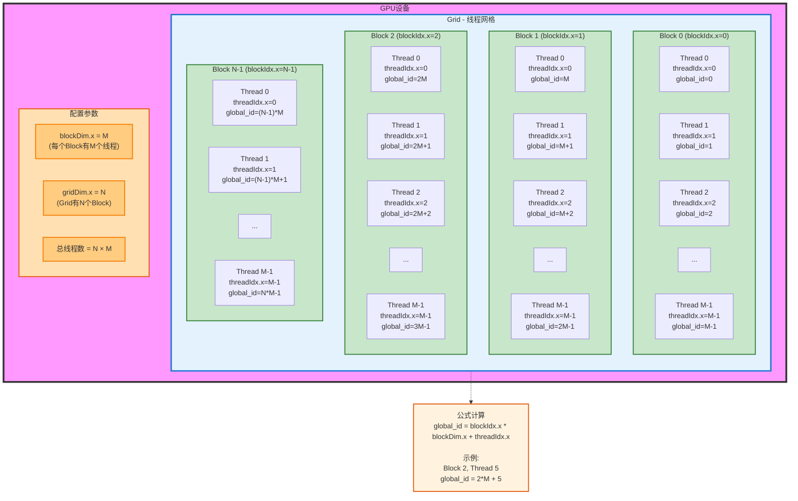
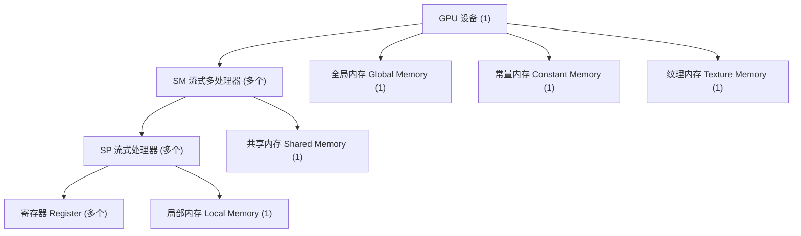
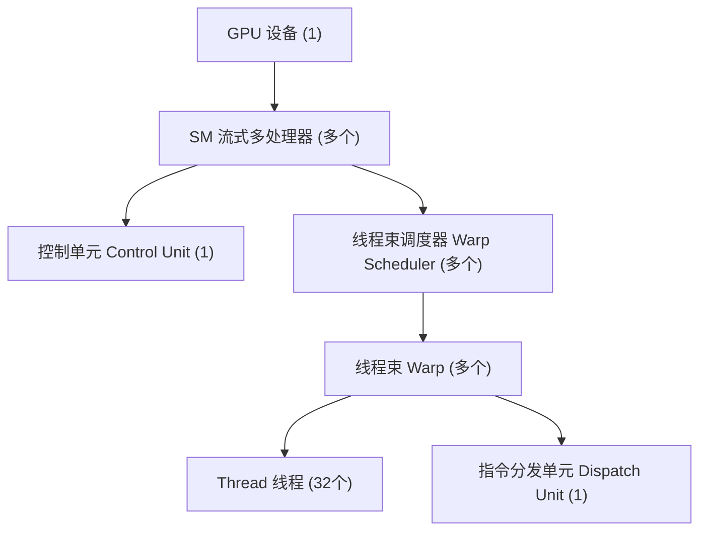
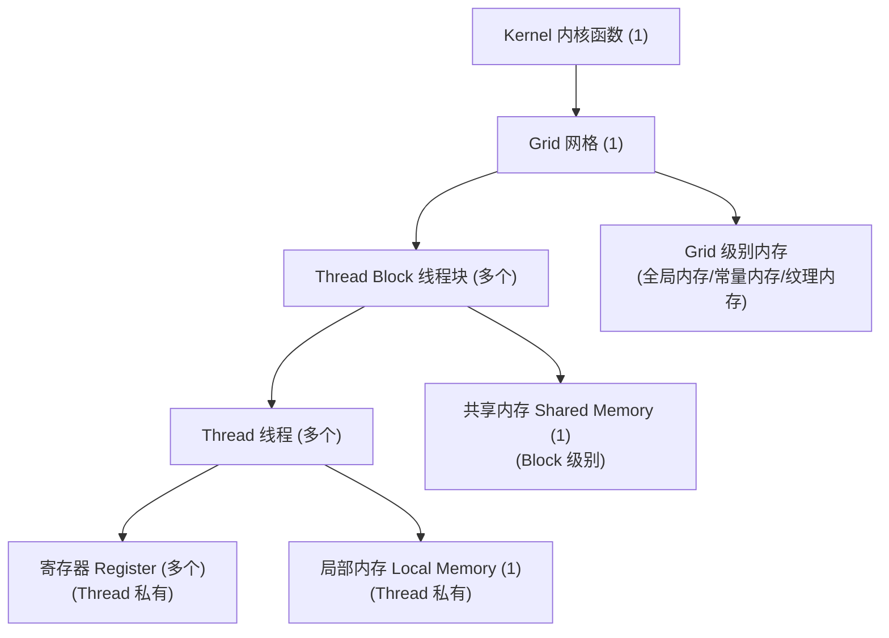
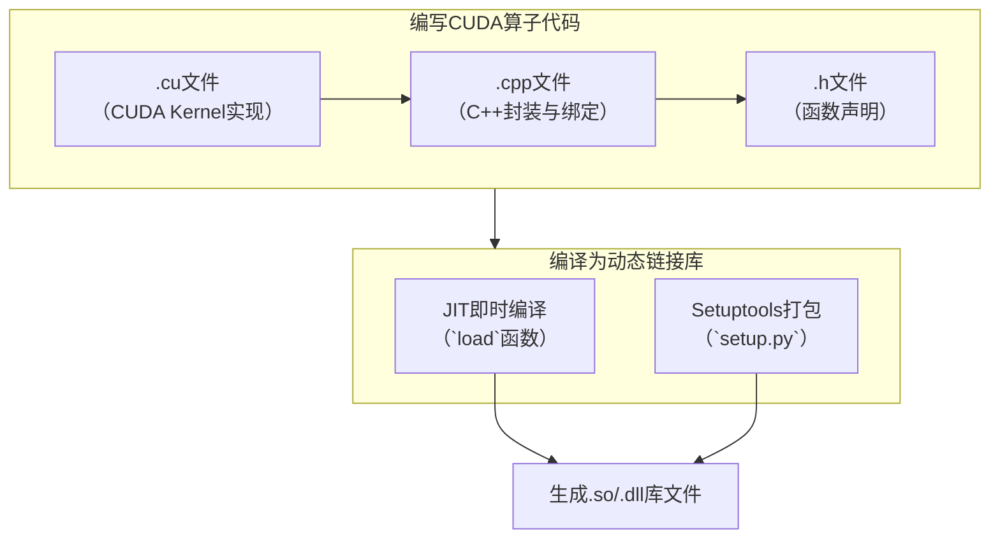
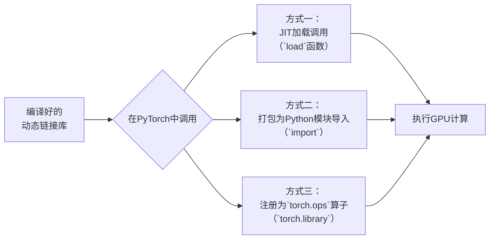

# CUDA Attention Benchmark — native vs flash attention

在 CUDA 上实现两种 attention 并做全流程性能评测：

- **原生 attention**（`native_scores` → `native_softmax` → `native_output`）：把 N×N 的 score 矩阵 S 和 softmax 结果 P 完整物化到全局内存，空间复杂度 O(N²)。
- **flash attention**（`flash_attn`）：FA 2 风格，分块 + 共享内存 K/V tile + 在线 softmax，O 行驻留寄存器，从不物化 N×N 中间矩阵，额外内存 O(N)。

评测工具链：程序内置 cudaEvent 计时 + `cudaMemGetInfo` 显存峰值测量；`nsys` 采 GPU kernel 时长与时间线；`ncu` 采吞吐率/占用率/寄存器等微观指标（需管理员权限）。

## 文件

| 文件                                  | 用途                           |
| ----------------------------------- | ---------------------------- |
| `attention.cu`                      | 全部 kernel + 基准测试主程序          |
| `build.ps1`                         | 编译脚本（自动加载 MSVC 环境）           |
| `ncu-profile.ps1`                   | 自提权运行 ncu 的脚本（UAC 弹窗一次）      |
| `bench.exe`                         | 编译产物                         |
| `report.nsys-rep` / `report.sqlite` | nsys 报告（可复用 `nsys stats` 重查） |
| `ncu_report.txt`                    | 最近一次 ncu 输出                  |

## 环境

- NVIDIA GPU，计算能力 ≥ 8.0（本机：RTX 3080 Laptop，sm_86）
- CUDA Toolkit（`nvcc` 在 PATH；本机 13.3）
- MSVC Build Tools（nvcc 在 Windows 需要 cl.exe；本机 VS 18 BuildTools 14.x）
- Nsight Systems（`nsys`）+ Nsight Compute（`ncu`）+ Compute Sanitizer（随 CUDA Toolkit 安装）

## 编译脚本

```powershell
# Build the CUDA attention benchmark (native vs flash attention).
# Requires: NVIDIA CUDA Toolkit (nvcc on PATH), MSVC Build Tools.
# Usage:  powershell -ExecutionPolicy Bypass -File build.ps1
$ErrorActionPreference = "Stop"
. C:\Projects\cmds\VsDevCmd.ps1 -NoLogo | Out-Null
nvcc -O3 -arch=sm_86 -std=c++17 attention.cu -o bench.exe
if ($LASTEXITCODE -ne 0) { exit $LASTEXITCODE }
Write-Host "OK: bench.exe built. Try: .\bench.exe 0 64 20"

```

脚本内做了两件事：source `C:\Projects\cmds\VsDevCmd.ps1` 把 MSVC 环境（cl.exe 等）加进 PATH，然后执行编译脚本。

- `-arch=sm_86` 按本机 GPU 设置；换卡改成对应架构（如 `sm_89` / `sm_90`）。
- 编译期 C 4819 警告（代码页 936 字符告警）是 CUDA 头文件的已知噪音，可忽略。

## 测试脚本

```c++
// attention.cu — native attention vs flash attention, CUDA kernels + benchmark harness.
// Native: materializes NxN scores (S) and NxN softmax (P) in global memory.
// Flash: FA2-style online softmax, tiled, O(N) extra memory.
//
// Usage: bench.exe [N] [d] [iters]     N=0 -> sweep {512,1024,2048,4096,8192} x d
// Correctness check (N=256) always runs first.
//
// Build:  nvcc -O3 -arch=sm_86 -std=c++17 attention.cu -o bench.exe

#include <cstdio>
#include <cstdlib>
#include <cmath>
#include <vector>
#include <string>
#include <cuda_runtime.h>

#define CK(x) do { cudaError_t e = (x); \
  if (e != cudaSuccess) { fprintf(stderr, "CUDA error %s at %s:%d\n", cudaGetErrorString(e), __FILE__, __LINE__); exit(1); } } while (0)

// ---------------------------------------------------------------- native ---
// S[i][j] = scale * sum_k Q[i][k] * K[j][k]        (NxN materialized)
__global__ void native_scores(const float* __restrict__ Q, const float* __restrict__ K,
                              float* __restrict__ S, float scale, int N, int d) {
    // Q,K \in \R^{N \times d}, S \in \R^{N \times N}
    // scale = 1 / \sqrt{d}
    int idx = blockIdx.x * blockDim.x + threadIdx.x;
    if (idx >= N * N) return;
    int i = idx / N, j = idx % N;
    const float* q = Q + (size_t)i * d;
    const float* k = K + (size_t)j * d;
    float acc = 0.f;
    for (int t = 0; t < d; ++t) acc += q[t] * k[t];
    S[idx] = acc * scale;
}

// Row-wise softmax over global S (max -> sum -> normalize, 3 passes over row).
// 逐行归一化
__global__ void native_softmax(const float* __restrict__ S, float* __restrict__ P, int N) {
    int i = blockIdx.x * blockDim.x + threadIdx.x;
    if (i >= N) return;
    const float* s = S + (size_t)i * N; // 输入矩阵第i行
    float* p = P + (size_t)i * N;		// 输出矩阵第i行
    float mx = -INFINITY;
    for (int j = 0; j < N; ++j) mx = fmaxf(mx, s[j]); // 求第i行最大值
    float sum = 0.f;
    for (int j = 0; j < N; ++j) sum += __expf(s[j] - mx); // 求softmax分母
    float inv = 1.f / sum;
    for (int j = 0; j < N; ++j) p[j] = __expf(s[j] - mx) * inv; // 逐元素归一化
}

// O[i][j] = sum_k P[i][k] * V[k][j]
// 本质矩阵乘法
__global__ void native_output(const float* __restrict__ P, const float* __restrict__ V,
                              float* __restrict__ O, int N, int d) {
    int idx = blockIdx.x * blockDim.x + threadIdx.x;
    if (idx >= N * d) return;
    int i = idx / d, j = idx % d;
    const float* p = P + (size_t)i * N;
    float acc = 0.f;
    for (int k = 0; k < N; ++k) acc += p[k] * V[(size_t)k * d + j];
    O[(size_t)i * d + j] = acc;
}

// One kernel loop per phase, timed independently; total = all three combined.
void native_attention(const float* Q, const float* K, const float* V, float* O,
                      float* S, float* P, float scale, int N, int d, int iters,
                      float* per_kernel_ms, cudaStream_t st) {
    int threads = 256;
    // 只用了dim3.x，所以是隐式1维
    // + threads - 1是为了向上取整，/默认向下取整。
    dim3 gS((N * N + threads - 1) / threads); 	// S 矩阵：⌈ N×N÷threads ⌉
    dim3 gP((N + threads - 1) / threads);		// P 矩阵：⌈ N÷threads ⌉
    dim3 gO((N * d + threads - 1) / threads);	// O 矩阵：⌈ N×d÷threads ⌉
    cudaEvent_t e0, e1, e2, e3;					// 声明四个时间变量
    cudaEventCreate(&e0); 						// 创建/初始化事件
    cudaEventCreate(&e1); 						// 创建/初始化事件
    cudaEventCreate(&e2); 						// 创建/初始化事件
    cudaEventCreate(&e3);						// 创建/初始化事件
    // warmup，预热，消除首次运行的额外开销
    native_scores<<<gS, threads, 0, st>>>(Q, K, S, scale, N, d);
    // kernel_name<<<网格维度, 块维度, 共享内存大小, CUDA 流>>>(args)
    native_softmax<<<gP, threads, 0, st>>>(S, P, N);
    native_output<<<gO, threads, 0, st>>>(P, V, O, N, d);
    // 正式计时，求平均提高精度。
    cudaEventRecord(e0, st);
    for (int it = 0; it < iters; ++it) native_scores<<<gS, threads, 0, st>>>(Q, K, S, scale, N, d);
    cudaEventRecord(e1, st);
    for (int it = 0; it < iters; ++it) native_softmax<<<gP, threads, 0, st>>>(S, P, N);
    cudaEventRecord(e2, st);
    for (int it = 0; it < iters; ++it) native_output<<<gO, threads, 0, st>>>(P, V, O, N, d);
    cudaEventRecord(e3, st);
    cudaEventSynchronize(e3);
    float t = 0;
    cudaEventElapsedTime(&t, e0, e1); per_kernel_ms[0] = t / iters;
    cudaEventElapsedTime(&t, e1, e2); per_kernel_ms[1] = t / iters;
    cudaEventElapsedTime(&t, e2, e3); per_kernel_ms[2] = t / iters;
    cudaEventElapsedTime(&t, e0, e3); per_kernel_ms[3] = t / iters;
    // 销毁事件，释放内存
    cudaEventDestroy(e0); cudaEventDestroy(e1); cudaEventDestroy(e2); cudaEventDestroy(e3);
}

// ---------------------------------------------------------------- flash ----
// One thread per row. Br rows/block, Bc columns per tile, K/V tiles in shared.
// Online softmax keeps O(row) in registers — no NxN intermediate ever exists.
template <int Br, int Bc, int D>
__global__ void flash_attn(const float* __restrict__ Q, const float* __restrict__ K,
                           const float* __restrict__ V, float* __restrict__ O,
                           float scale, int N) {
	// 1. 共享内存声明（缓存K和V的分块）
    __shared__ float Ks[Bc][D];		// 缓存K的一个分块 (Bc行 × D列)
    __shared__ float Vs[Bc][D];		// 缓存K的一个分块 (Bc行 × D列)
	// i: 当前线程处理的Q行索引
	// 每个线程处理一行，每个Block处理 Br 行
    int i = blockIdx.x * Br + threadIdx.x;
    if (i >= N) return;
    // q: 指向Q的第i行（当前线程负责的行）
    const float* q = Q + (size_t)i * D;
    float acc[D];	// 累加器：存储当前行的加权和（在寄存器中）
#pragma unroll	// 循环展开命令
    for (int k = 0; k < D; ++k) acc[k] = 0.f;
    float m = -INFINITY, l = 0.f;
    // 4. 计算需要多少个分块（向上取整）
    int ncols = (N + Bc - 1) / Bc;
    for (int cb = 0; cb < ncols; ++cb) {
    	// 当前分块的起始行索引
        int j0 = cb * Bc;
        // 5.1 加载K和V的分块到共享内存
        for (int idx = threadIdx.x; idx < Bc * D; idx += Br) {
            int jj = j0 + idx / D, kk = idx % D;
            // 从全局内存加载到共享内存（边界检查）
            Ks[idx / D][kk] = (jj < N) ? K[(size_t)jj * D + kk] : 0.f;
            Vs[idx / D][kk] = (jj < N) ? V[(size_t)jj * D + kk] : 0.f;
        }
        // 同步：确保所有线程都完成加载，共享内存数据完整
        __syncthreads();
#pragma unroll
        for (int j = 0; j < Bc; ++j) {
            if (j0 + j >= N) break;
            // 5.2.1 计算注意力分数 s = Q[i] · K[j]
            float s = 0.f;
#pragma unroll
            for (int k = 0; k < D; ++k) s += q[k] * Ks[j][k];
            s *= scale;
            
            // 5.2.2 在线Softmax更新（Flash Attention的核心算法）
            float m_new = fmaxf(m, s);
            float alpha = __expf(m - m_new);      // rescale previous accumulator
            float p = __expf(s - m_new);
            l = l * alpha + p;
#pragma unroll
            for (int k = 0; k < D; ++k) acc[k] = acc[k] * alpha + p * Vs[j][k];
            m = m_new;
        }
        // 6. 归一化并写入输出
        // 同步：确保所有线程完成当前分块的计算
        __syncthreads();
    }
    float inv = 1.f / l;
#pragma unroll
    for (int k = 0; k < D; ++k) O[(size_t)i * D + k] = acc[k] * inv;
}

template <int Br, int Bc, int D>
void flash_launch(const float* Q, const float* K, const float* V, float* O,
                  float scale, int N, int iters, float* ms, cudaStream_t st) {
    int threads = Br;
    dim3 grid((N + Br - 1) / Br);
    cudaEvent_t e0, e1;
    cudaEventCreate(&e0); cudaEventCreate(&e1);
    flash_attn<Br, Bc, D><<<grid, threads, 0, st>>>(Q, K, V, O, scale, N);  // warmup
    cudaEventRecord(e0, st);
    for (int it = 0; it < iters; ++it)
        flash_attn<Br, Bc, D><<<grid, threads, 0, st>>>(Q, K, V, O, scale, N);
    cudaEventRecord(e1, st);
    cudaEventSynchronize(e1);
    float t = 0;
    cudaEventElapsedTime(&t, e0, e1);
    *ms = t / iters;
    cudaEventDestroy(e0); cudaEventDestroy(e1);
}

void flash_attention(const float* Q, const float* K, const float* V, float* O,
                     float scale, int N, int d, int iters, float* ms, cudaStream_t st) {
    if (d == 64)       flash_launch<128, 32, 64 >(Q, K, V, O, scale, N, iters, ms, st);
    else if (d == 128) flash_launch<128, 32, 128>(Q, K, V, O, scale, N, iters, ms, st);
    else { fprintf(stderr, "flash: d must be 64 or 128 (got %d)\n", d); exit(1); }
}

// ---------------------------------------------------------------- reference
static void ref_attention(const float* Q, const float* K, const float* V, float* O,
                          float scale, int N, int d) {
    std::vector<double> S((size_t)N * N), P((size_t)N * N);
    for (int i = 0; i < N; ++i)
        for (int j = 0; j < N; ++j) {
            double s = 0;
            for (int k = 0; k < d; ++k) s += (double)Q[(size_t)i * d + k] * K[(size_t)j * d + k];
            S[(size_t)i * N + j] = s * scale;
        }
    for (int i = 0; i < N; ++i) {
        double mx = -1e300, sum = 0;
        for (int j = 0; j < N; ++j) mx = fmax(mx, S[(size_t)i * N + j]);
        for (int j = 0; j < N; ++j) { double e = exp(S[(size_t)i * N + j] - mx); P[(size_t)i * N + j] = e; sum += e; }
        for (int j = 0; j < N; ++j) P[(size_t)i * N + j] /= sum;
    }
    for (int i = 0; i < N; ++i)
        for (int j = 0; j < d; ++j) {
            double o = 0;
            for (int k = 0; k < N; ++k) o += P[(size_t)i * N + k] * V[(size_t)k * d + j];
            O[(size_t)i * d + j] = (float)o;
        }
}

static float max_abs_err(const float* A, const float* B, size_t n) {
    float e = 0.f;
    for (size_t k = 0; k < n; ++k) e = fmaxf(e, fabsf(A[k] - B[k]));
    return e;
}

// ---------------------------------------------------------------- harness --
static void fill_rand(float* x, size_t n, unsigned seed) {
    srand(seed);
    for (size_t k = 0; k < n; ++k) x[k] = (float)((rand() / (double)RAND_MAX) * 2.0 - 1.0);
}

static int correctness(int d) {
    int N = 256;
    size_t nq = (size_t)N * d, nsq = (size_t)N * N;
    float scale = 1.f / sqrtf((float)d);
    std::vector<float> hQ(nq), hK(nq), hV(nq), hO_native(nq), hO_flash(nq), hO_ref(nq);
    fill_rand(hQ.data(), nq, 1); fill_rand(hK.data(), nq, 2); fill_rand(hV.data(), nq, 3);
    float *Q, *K, *V, *O, *S, *P;
    CK(cudaMalloc(&Q, nq * 4)); CK(cudaMalloc(&K, nq * 4)); CK(cudaMalloc(&V, nq * 4));
    CK(cudaMalloc(&O, nq * 4)); CK(cudaMalloc(&S, nsq * 4)); CK(cudaMalloc(&P, nsq * 4));
    CK(cudaMemcpy(Q, hQ.data(), nq * 4, cudaMemcpyHostToDevice));
    CK(cudaMemcpy(K, hK.data(), nq * 4, cudaMemcpyHostToDevice));
    CK(cudaMemcpy(V, hV.data(), nq * 4, cudaMemcpyHostToDevice));
    float ms[4];
    native_attention(Q, K, V, O, S, P, scale, N, d, 1, ms, 0);
    CK(cudaMemcpy(hO_native.data(), O, nq * 4, cudaMemcpyDeviceToHost));
    flash_attention(Q, K, V, O, scale, N, d, 1, &ms[0], 0);
    CK(cudaMemcpy(hO_flash.data(), O, nq * 4, cudaMemcpyDeviceToHost));
    ref_attention(hQ.data(), hK.data(), hV.data(), hO_ref.data(), scale, N, d);
    float e_native = max_abs_err(hO_native.data(), hO_ref.data(), nq);
    float e_flash  = max_abs_err(hO_flash.data(),  hO_ref.data(), nq);
    printf("  correctness N=%d d=%d: native max_err=%.3e (%s), flash max_err=%.3e (%s)\n",
           N, d, e_native, e_native < 1e-3f ? "PASS" : "FAIL",
           e_flash, e_flash < 1e-3f ? "PASS" : "FAIL");
    CK(cudaFree(Q)); CK(cudaFree(K)); CK(cudaFree(V)); CK(cudaFree(O)); CK(cudaFree(S)); CK(cudaFree(P));
    return (e_native < 1e-3f && e_flash < 1e-3f) ? 0 : 1;
}

static void bench_config(int N, int d, int iters) {
    size_t nq = (size_t)N * d, nsq = (size_t)N * N;
    float scale = 1.f / sqrtf((float)d);
    float *Q, *K, *V, *O, *S, *P;
    size_t free0, free1, free2;
    CK(cudaMemGetInfo(&free0, NULL));
    CK(cudaMalloc(&Q, nq * 4)); CK(cudaMalloc(&K, nq * 4)); CK(cudaMalloc(&V, nq * 4)); CK(cudaMalloc(&O, nq * 4));
    CK(cudaMemGetInfo(&free1, NULL));
    CK(cudaMalloc(&S, nsq * 4)); CK(cudaMalloc(&P, nsq * 4));
    CK(cudaMemGetInfo(&free2, NULL));
    std::vector<float> hQ(nq), hK(nq), hV(nq);
    fill_rand(hQ.data(), nq, 1); fill_rand(hK.data(), nq, 2); fill_rand(hV.data(), nq, 3);
    CK(cudaMemcpy(Q, hQ.data(), nq * 4, cudaMemcpyHostToDevice));
    CK(cudaMemcpy(K, hK.data(), nq * 4, cudaMemcpyHostToDevice));
    CK(cudaMemcpy(V, hV.data(), nq * 4, cudaMemcpyHostToDevice));

    float t_native[4], t_flash;
    native_attention(Q, K, V, O, S, P, scale, N, d, iters, t_native, 0);
    CK(cudaGetLastError());
    flash_attention(Q, K, V, O, scale, N, d, iters, &t_flash, 0);
    CK(cudaGetLastError());

    double flops = 4.0 * N * N * d;
    double tn = t_native[3], tf = t_flash;
    printf("%6d %4d | %9.3f ms  %8.2f TFLOPS | %9.3f ms  %8.2f TFLOPS | %6.2fx | %9.1f MB %8.1f MB\n",
           N, d, tn, flops / tn / 1e9, tf, flops / tf / 1e9, tn / tf,
           (double)(free0 - free2) / 1048576.0, (double)(free0 - free1) / 1048576.0);
    printf("         native breakdown: scores %.3f ms, softmax %.3f ms, output %.3f ms (total %.3f)\n",
           t_native[0], t_native[1], t_native[2], t_native[3]);
    CK(cudaFree(Q)); CK(cudaFree(K)); CK(cudaFree(V)); CK(cudaFree(O)); CK(cudaFree(S)); CK(cudaFree(P));
}

int main(int argc, char** argv) {
    int N = 4096, d = 64, iters = 20;
    if (argc > 1) N = atoi(argv[1]);
    if (argc > 2) d = atoi(argv[2]);
    if (argc > 3) iters = atoi(argv[3]);

    cudaDeviceProp prop;
    CK(cudaGetDeviceProperties(&prop, 0));
    size_t tot, free0;
    CK(cudaMemGetInfo(&free0, &tot));
    printf("GPU: %s  sm_%d%d  total mem %.0f MB, free %.0f MB\n",
           prop.name, prop.major, prop.minor, tot / 1048576.0, free0 / 1048576.0);
    printf("Kernels: native_scores, native_softmax, native_output  vs  flash_attn (FA2-style, d<=128)\n\n");

    int rc = 0;
    rc |= correctness(64);
    if (d != 64) rc |= correctness(d);

    printf("\n%6s %4s | %-20s | %-20s | %6s | %-20s\n",
           "N", "d", "native total", "flash", "speedup", "peak mem native/flash");
    printf("%s\n", std::string(100, '-').c_str());
    if (N == 0) {
        for (int n : {512, 1024, 2048, 4096, 8192}) bench_config(n, d, iters);
    } else {
        bench_config(N, d, iters);
    }
    printf("\nDone. rc=%d\n", rc);
    return rc;
}

```


编译命令：

```powershell
nvcc -O3 -arch=sm_86 -std=c++17 attention.cu -o bench.exe
```

- 使用 nvcc 编译
- 目标架构为 sm_86（适用于 RTX 30 系列显卡）

导入必要的头文件：

```cpp
#include <cstdio>			// 标准I/O
#include <cstdlib>			// 标准库
#include <cmath>			// 数学函数
#include <vector>			// STL 容器
#include <string>			// 字符串处理
#include <cuda_runtime.h>	// CUDA 运行时API
```

`cudaError_t` 是 CUDA 运行时 API 定义的一个**枚举类型**，用于表示 CUDA 函数调用的返回状态。

fprintf 函数原型

```cpp
int fprintf(FILE *stream, const char *format, ...);
```

- stderr：标准错误输出流，用于输出错误信息
- format：格式字符串

`__FILE__`：预定义宏，在编译时被自动替换，当前源文件的名称（字符串字面量）

`__LINE__`：当前源代码行号。

`do {...} while (0)`：确保宏在任何上下文中都能正常工作。
- 块作用域：确保宏内变量不会泄露
- 语句完整性：宏总是表现为一个完整的语句
- 分号安全：宏的分号是安全的。

`__global__`：在 CUDA 中的定义为：

```cpp
// 在CUDA头文件中（简化版本）
#define __global__ __attribute__((global))
```

告诉编译器，这是一个设备端启动的核函数，从 CPU 启动，在 GPU 执行。

`__restrict__`：用于表示指针是访问其所指向数据块的唯一方式。为什么需要?假如没有它，编译器需要保守处理

```cpp
void add_arrays(float* a, float* b, float* c, int n) {
    for (int i = 0; i < n; i++) {
        c[i] = a[i] + b[i];
    }
}
```

问题：编译器无法确定 a、b、c 是否指向同一块内存区域

有了 `__restrict__`：编译器就可以放心加载，激进优化。GPU 对内存访问非常敏感，常常多个线程同时访问内存，编译器可以更好利用 GPU 缓存

blockDim：每个 block 的大小（线程数）

dim 3：CUDA 定义的一个结构体类型，用于表示三维尺寸

```cpp
// 在CUDA头文件中的定义（简化）
struct dim3 {
    unsigned int x;  // X维度
    unsigned int y;  // Y维度
    unsigned int z;  // Z维度
    
    // 构造函数
    dim3(unsigned int vx = 1, unsigned int vy = 1, unsigned int vz = 1) 
        : x(vx), y(vy), z(vz) {}
};
```

- 包含三个 `unsigned int` 成员：`x`, `y`, `z`
- 默认值是 `(1, 1, 1)`
- 用于表示三维空间的大小

为什么需要 dim 3？GPU 的线程是三维组织的：

```cpp
// 一维：处理向量
dim3 threads(256, 1, 1);    // 256个线程，一维排列

// 二维：处理图像/矩阵
dim3 threads(16, 16, 1);    // 16×16=256个线程，二维网格

// 三维：处理3D数据
dim3 threads(8, 8, 8);      // 8×8×8=512个线程，三维立方体
```

cudaEvent_t 是 CUDA 之中定义的一个事件句柄类型，用于在 GPU 执行流中标记特定时间点。

```cpp
cudaEvent_t e0;  // 声明一个事件变量（类似指针）
```

**本质**：它是一个不透明的指针类型，指向 GPU 内部的一个事件对象。
## 运行

```powershell
bench.exe [N] [d] [iters]
```

| 参数 | 默认 | 说明 |
|---|---|---|
| `N` | 4096 | 序列长度；`0` = 全尺寸扫描 512/1024/2048/4096/8192 |
| `d` | 64 | head 维度；flash 仅支持 **64 或 128**（模板实例化），其它值报错退出 |
| `iters` | 20 | 每 kernel 计时轮数（取事件区间平均） |

流程固定：先跑正确性检查（N=256，与 CPU 双精度参考对比，阈值 1 e-3，PASS/FAIL），再跑基准。

示例：

```powershell
.\bench.exe 4096 64 20     # 单配置：正确性 + N=4096 基准
.\bench.exe 0 64 20        # 全尺寸扫描
.\bench.exe 8192 128 10    # 大序列 + d=128
```

输出解读：

```
     N    d | native total         | flash                | speedup | peak mem native/flash
  4096   64 |    18.906 ms  0.23 TFLOPS |     2.708 ms  1.59 TFLOPS |   6.98x |     132.0 MB      4.0 MB
         native breakdown: scores 14.211 ms, softmax 2.812 ms, output 1.884 ms (total 18.906)
```

- TFLOPS 按 4·N²·d FLOP 计算（QKᵀ + PV）。
- 两列显存均为**本方法独占的额外峰值**（`cudaMemGetInfo` 前后差）：native 含 S+P 两块 N×N；flash 只有 Q/K/V/O。`free0 - free1` 与 `free0 - free2` 是单调峰值差，含驱动分配器余量，理论值见 `2·N²·4B`。
- native breakdown 的三段时间来自三次独立的 kernel 循环计时，加起来略小于 total（total 含全部启动间隙）。

程序退出码：正确性失败返回非 0（`rc=1`）。

## 性能分析

### nsys（无需提权）——时间线 + GPU 端纯 kernel 时长

```powershell
nsys profile --stats=true -o report .\bench.exe 4096 64 10
```

- 产出 `report.nsys-rep` + `report.sqlite`，`--stats=true` 结束时自动打印汇总。
- 重查任意统计：

```powershell
nsys stats --force-export=true --report cuda_gpu_kern_sum report.nsys-rep   # 每 kernel 平均/最大/最小时长
nsys stats --report cuda_api_sum report.nsys-rep                            # CUDA API 调用开销
```

- 图形界面看时间线与内存曲线：`nsys-ui report.nsys-rep`。
- 注意：kernel 汇总里的 Duration 是纯 GPU 执行时长，比程序内置的 cudaEvent 数字略小（后者含启动间隙），二者互相印证。
- 本机非管理员运行 nsys 会提示禁用 CPU context switch / CPU sampling（需要提权），不影响 GPU 数据。

### ncu（需管理员）——吞吐率/占用率/寄存器

Windows WDDM 下 GPU 性能计数器需要管理员。直接跑：

```powershell
powershell -ExecutionPolicy Bypass -File ncu-profile.ps1 4096 64 2
```

脚本自提权（桌面弹一次 UAC），跑完自动打印 `ncu_report.txt`。等价的手工提权命令：

```powershell
ncu --set basic -c 24 --log-file ncu_report.txt .\bench.exe 4096 64 2
```

关键指标（每 kernel）：`Compute (SM) Throughput`（算力利用率）、`Memory Throughput` / `L1/TEX Cache Throughput`（访存利用率，判断是否 memory-bound）、`Registers Per Thread`、`Theoretical/Achieved Occupancy`、`Waves Per SM`（网格是否填满 GPU，<1 即空转）。ncu 会用 `OPT` 行直接给出瓶颈与建议。

## 调试

内置两层校验，改 kernel 后先跑一遍确认没改坏：

1. **数值正确性**：程序启动即执行（N=256 对比 CPU 双精度参考），输出 `max_err` 与 PASS/FAIL。新增 kernel 逻辑后这是第一道门。
2. **CUDA 错误**：所有 `cuda*` 调用包在 `CK()` 宏里，出错即打印 `CUDA error <name> at attention.cu:<line>` 并退出；每次 kernel launch 后跟 `cudaGetLastError()`（见 `bench_config`）。

内存/越界类问题（kernel 崩溃、随机 NaN 但 CK 不报错时）：

```powershell
compute-sanitizer .\bench.exe 256 64 1     # memcheck：越界、未初始化、race
```

性能调试用 nsys/ncu 的瓶颈分类：memory-bound（native_scores，L 1 ~97%）→ 考虑共享内存复用；网格过小（native_softmax，0.06 waves）→ 提高并行粒度；占用率被寄存器/共享内存压死（flash_attn，167 regs，25% 理论占用）→ 降寄存器/调 tile 尺寸。

# GPU 架构



# GPU 编程的考虑因素

- 计算资源：
	- 线程层次 Grid/Block/Thread
	- 寄存器数量
	- Warp 调度与占用率
	- 指令级并行 ILP
- 内存资源：
	- 全局内存 慢/大
	- 共享内存 快/小
	- 寄存器 最快/私有
	- 常量内存 只读缓存
	- 纹理内存 特殊缓存
- 通信资源：
	- 合并访问 Coalesced
	- Bank Conflict 共享内存冲突
	- 同步 __syncthreads
	- Peer-to-Peer 多卡通信
- 时间资源：
	- 流 Stream 异步
	- 事件 Events 计时
	- 并发 Kernel 执行
	- 数据传输与计算 Overlap
- 精度资源：
	- 数值稳定性 防止溢出
	- 浮点结合律 累加顺序
	- NaN / Inf 处理
- 编译资源：
	- PTX 中间语言
	- 静态编译 vs 动态编译
	- JIT 即时编译
	- 特定架构优化 sm_XX
- 调试资源：
	- cuda-gdb 调试器
	- computer-sanitizer 内存检查
	- 断言 Assert
	- 异常处理
- 物理资源
	- 功耗墙 TDP
	- 温度管理 降频
	- 显存带宽 瓶颈
	- PCIe 带宽 传输带宽

# GPU 的内存结构




# GPU 的控制结构



# CUDA 映射的软件结构



# CUDA 软硬件映射表

| 软件抽象                   | 硬件实体               | 数量关系                | 内存可见范围                    |
| :------------------------- | :--------------------- | :---------------------- | :------------------------------ |
| **Kernel（内核函数）**     | **GPU 设备**           | 1个Kernel启动在1个GPU上 | —                               |
| **Grid（网格）**           | **GPU 设备**           | 1个Grid对应1个GPU       | 全部内存（全局/常量/纹理）      |
| **Thread Block（线程块）** | **SM（流式多处理器）** | 多个Block分配到多个SM   | 共享内存（Block内线程可见）     |
| **Thread（线程）**         | **SP（流式处理器）**   | 多个Thread映射到多个SP  | 寄存器 + 局部内存（Thread私有） |

wrap 是 SIMT 的实现载体

# CUDA 算子编写与编译流程

这个流程的核心是，用 CUDA C++编写 GPU 核心计算代码，并通过编译生成 Python 可以调用的动态链接库（`.so` 或 `.dll` 文件）。



*   **第一步：编写 CUDA 核心代码（`.cu` 文件）**
    *   在此文件中，你需要使用 CUDA C++编写 ** `__global__` 函数（即 Kernel）**，这是将在 GPU 上大规模并行执行的函数。
    *   同时，需要编写一个 C++风格的**主机端（Host）启动函数**，它通过 `<<<grid, block>>>` 语法来配置和启动 Kernel。

*   **第二步：编写 C++封装与绑定代码（`.cpp` 文件）**
    *   这个文件是连接 CUDA 世界和 Python 世界的桥梁。
    *   它主要做两件事：一是将上一步的 CUDA 启动函数封装成一个接收 `torch::Tensor` 类型参数的 C++函数；二是使用 ** `pybind11` ** 库将这个 C++函数绑定为 Python 模块。

*   **第三步：选择编译方式**
    *   **JIT 编译（Just-In-Time）**：最方便快捷，适合开发和调试。使用 PyTorch 提供的 `torch.utils.cpp_extension.load()` 函数，在 Python 代码中直接指定源文件路径，程序运行时就会自动调用 `nvcc` 和 `c++` 编译器进行编译。
    *   **Setuptools 打包**：适合项目发布和集成。编写一个 `setup.py` 文件，利用 `torch.utils.cpp_extension.CUDAExtension` 来构建一个 Python 包，之后可以通过 `pip install -e .` 安装并导入。

# Pytorch 调用 CUDA 算子

当编译好的动态库准备好后，PyTorch 端就可以通过几种方式来调用它了。


*   **方式一：JIT 加载调用**
    *   如果在编译阶段使用了 `load()` 函数，它会返回一个 Python 模块对象。你可以直接调用这个模块里的函数。

*   **方式二：作为 Python 模块导入**
    *   如果使用 Setuptools 将算子安装为包，就可以像导入其他 Python 库一样，直接 `import` 然后使用。

*   **方式三：注册为 `torch.ops` 算子（更高级的集成）**
    *   这是 PyTorch 官方更推荐的方式，能让你的算子成为 PyTorch 生态的一等公民。
    *   在 C++端，使用 `TORCH_LIBRARY` 宏将算子定义（如 `m.def("my_op(...) -> Tensor")`）和实现（`m.impl(...)`）注册到 `torch.ops` 命名空间下。
    *   在 Python 端，就可以通过 `torch.ops.my_extension.my_op()` 来调用它了。这种方式为算子带来了自动微分（Autograd）等更强大的框架能力。

# GPU 程序的启动

GPU 是 CPU 的**协处理器**，自身无法主动执行任务。整个流程是这样的：

1.  **CPU 发起**：CPU 执行主程序，当运行到调用 CUDA Kernel 的代码时，CPU 会向 GPU 的调度器发送一个**启动命令**。
2.  **CPU 配置**：CPU 通过 `<<<grid, block>>>` 语法，明确告诉 GPU“开多少个线程、启动哪个函数”。
3.  **CPU 继续运行**：下发命令后，CPU 会立即继续执行后面的代码（默认是异步的），而 GPU 则开始忙活计算。
4.  **数据同步**：如果需要把计算结果传回内存，CPU 会执行 `cudaMemcpy` 这样的同步操作，此时 CPU 会阻塞等待，直到 GPU 计算完成。

---

## 🧪 示例：纯 CUDA C++实现

这个例子完全使用 CUDA 运行时 API，能清晰展示“CPU 启动 GPU”的完整过程。

**1. 编写源码（`add.cu`）**

```cpp
// add.cu
#include <cuda_runtime.h>
#include <stdio.h>

// 1. 定义GPU Kernel (由GPU执行)
__global__ void addKernel(float *a, float *b, float *c, int N) {
    int idx = threadIdx.x + blockIdx.x * blockDim.x;
    if (idx < N) {
        c[idx] = a[idx] + b[idx];
    }
}

// 2. 主机端(CPU)启动函数
void launchAdd(float *a, float *b, float *c, int N) {
    // 配置线程块: 假设每个块256个线程
    int threadsPerBlock = 256;
    int blocksPerGrid = (N + threadsPerBlock - 1) / threadsPerBlock;
    
    // 3. CPU执行启动命令!
    addKernel<<<blocksPerGrid, threadsPerBlock>>>(a, b, c, N);
    
    // 同步GPU设备，确保Kernel执行完毕 (CPU阻塞等待)
    cudaDeviceSynchronize();
}

int main() {
    int N = 100000;
    size_t bytes = N * sizeof(float);
    
    // 分配主机(CPU)内存
    float *h_a = (float*)malloc(bytes);
    float *h_b = (float*)malloc(bytes);
    float *h_c = (float*)malloc(bytes);
    for (int i = 0; i < N; i++) { h_a[i] = 1.0f; h_b[i] = 2.0f; }

    // 分配设备(GPU)内存
    float *d_a, *d_b, *d_c;
    cudaMalloc(&d_a, bytes);
    cudaMalloc(&d_b, bytes);
    cudaMalloc(&d_c, bytes);

    // CPU将数据复制到GPU (同步操作)
    cudaMemcpy(d_a, h_a, bytes, cudaMemcpyHostToDevice);
    cudaMemcpy(d_b, h_b, bytes, cudaMemcpyHostToDevice);

    // ！！！关键点：这里由CPU发起，启动GPU Kernel ！！！
    launchAdd(d_a, d_b, d_c, N);

    // CPU将结果从GPU复制回来 (同步操作)
    cudaMemcpy(h_c, d_c, bytes, cudaMemcpyDeviceToHost);

    // 验证结果 (应全为3.0f)
    printf("Result[0] = %f\n", h_c[0]);

    // 释放资源
    cudaFree(d_a); cudaFree(d_b); cudaFree(d_c);
    free(h_a); free(h_b); free(h_c);
    return 0;
}
```

**编译与运行命令：**

```bash
nvcc add.cu -o add
./add
```

# Pytorch 调用 CUDA 示例

这个例子演示了如何在 PyTorch 框架中，通过我们编译的 C++扩展来调用 CUDA 加法。

**步骤 1：编写 CUDA 源文件（`add_kernel.cu`）**

```cpp
// add_kernel.cu
#include <torch/extension.h>

// GPU Kernel定义
__global__ void add_kernel(const float* a, const float* b, float* out, int N) {
    int idx = blockIdx.x * blockDim.x + threadIdx.x;
    if (idx < N) out[idx] = a[idx] + b[idx];
}

// CPU端的启动函数，接收torch::Tensor
torch::Tensor torch_add(torch::Tensor a, torch::Tensor b) {
    int N = a.numel();
    auto out = torch::zeros_like(a);
    
    int threads = 256;
    int blocks = (N + threads - 1) / threads;
    
    // CPU启动GPU Kernel (PyTorch会自动管理流和同步)
    add_kernel<<<blocks, threads>>>(
        a.data_ptr<float>(),
        b.data_ptr<float>(),
        out.data_ptr<float>(),
        N
    );
    
    return out;
}

// 使用pybind11绑定
PYBIND11_MODULE(TORCH_EXTENSION_NAME, m) {
    m.def("torch_add", &torch_add, "A CUDA add function");
}
```

**步骤 2：Python 端即时编译并调用**

```python
# test.py
import torch
from torch.utils.cpp_extension import load

# 在当前目录下即时编译，返回一个Python模块
add_module = load(
    name="add_extension",
    sources=["add_kernel.cu"],
    extra_cuda_cflags=["-O2"],
    verbose=True
)

# 创建两个在GPU上的随机向量
a = torch.randn(100000, device='cuda')
b = torch.randn(100000, device='cuda')

# 调用算子（内部由CPU触发GPU执行）
c = add_module.torch_add(a, b)

# 验证
print((c - (a + b)).abs().max())  # 应接近0
```

运行这个 Python 脚本，你会看到 `load` 函数在首次运行时自动调用 `nvcc` 编译，并成功执行加法。

# GEMM 

通用矩阵乘法 (General Matrix Multiplication，GEMM) 是各种模型和计算中的核心部分，同时也是评估计算硬件性能 (FLOPS) 的标准技术。本文将通过对 GEMM 的实现和优化，来试图理解高性能计算和软硬件系统。

## GEMM 计算过程及复杂

GEMM 的定义为

$$
C\leftarrow \alpha AB+\beta C
$$

假设 $A\in \mathbb{R}^{M\times K}, B\in \mathbb{R}^{K\times N}$

AB 的第 i 行第 j 列元素，需要 K 次乘法和 K-1 次加法

$$
a_{i,1}b_{1, j}+\cdots + a_{i,K}b_{K,j}
$$

计算 AB 需要执行 $(2K-1)MN$ 次浮点运算

使用 CUDA 实现最简单的矩阵乘法，使用 M * N 个线程完成整个矩阵乘法。每个线程负责矩阵中一个元素的计算，需要 K 次累乘。矩阵 A，B，C 均存放于全局内存中（由修饰符 `__global__` 确定），完整代码见如下：

```cuda
__global__ void naiveSgemm(
    float * __restrict__ a, float * __restrict__ b, float * __restrict__ c,
    const int M, const int N, const int K) {

    int n = blockIdx.x * blockDim.x + threadIdx.x;
    int m = blockIdx.y * blockDim.y + threadIdx.y;
    if (m < M && n < N) {
        float psum = 0.0;
        #pragma unroll
        for (int k = 0; k < K; k++) {
            psum += a[OFFSET(m, k, K)] * b[OFFSET(k, n, N)];
        }
        c[OFFSET(m, n, N)] = psum;
    }
}

const int BM = 32, BN = 32;
const int M = 512, N = 512, K = 512;
dim3 blockDim(BN, BM);
dim3 gridDim((N + BN - 1) / BN, (M + BM - 1) / BM);
```

## Shared Memory 优化

### 整体目标

我们要计算 **C = A × B**。

- A 的大小：**M × K**
- B 的大小：**K × N**
- C 的大小：**M × N**

在 naive 版本中，每个线程负责 C 的 **1 个元素**，每次都要从 Global Memory 读 A 的一行和 B 的一列，访存开销巨大。

**优化思路**：用 Shared Memory 做**数据复用**，减少 Global Memory 访问。

### 分块策略

把矩阵划分成 **Block Tile**：

- 每个 **Block** 负责计算 C 中一个 **BM × BN** 的分块
- 这个 Block 内有多个线程，每个线程负责计算其中 **TM × TN** 个小块

参数选择：
- BM = BN = 128
- BK = 8（K 维每次只加载 8 个元素）
- TM = TN = 8（每个线程算 8×8=64 个 C 元素）

所以：
- 每个 Block 负责 **128×128** 的 C
- 每个 Block 有 `(BM/TM) × (BN/TN) = 16 × 16 = 256` 个线程
- 每个线程负责 **8×8=64** 个 C 元素

### Shared Memory 的加载方式

在每次 K 维循环中：

- 从 Global Memory 加载 **A 的一个 128×8 分块** 到 Shared Memory `s_a`
- 从 Global Memory 加载 **B 的一个 8×128 分块** 到 Shared Memory `s_b`
- 然后 256 个线程用 `s_a` 和 `s_b` 计算各自的 8×8 结果

计算量：$BM\times BN\times N\times 2$
访存量：$(BM+BN)\times K\times 4$

计算访存比：${BM\cdot BN\over 2(BM+BN)}$

由上式可知 BM 和 BN 越大，计算访存比越高，性能就会越好。但是由于 Shared Memory 容量的限制(V 100 1 个 SM 仅 96 KB)，而一个 Block 需要占用 BK * (BM + BN) * 4 Bytes 大小。

### 线程计算策略

Naive 版本：每个线程负责 1 个 C 元素

优化版：每个线程负责 TM × TN 个 C 元素

一个线程可以做多次乘累加，不限于只算 1 个元素。

**核心原因**：一个线程可以做多次乘累加，不限于只算 1 个元素。

在 CUDA 中，线程是**图灵完备**的，它可以：

1. 从 Shared Memory 读取数据
2. 在**寄存器**中保存多个累加值
3. 执行多层循环，计算多个 C 元素

为什么要让每个线程算多个元素？（TM>1, TN>1）
1. 提高计算访存比
- 每个线程从 Shared Memory 读取一次数据
- 用这些数据算 **64 个** C 元素
- 数据复用率更高 → 计算访存比更高

1. 减少线程数量
- naive 版本需要 M×N 个线程
- 优化版本只需要 `(M/TM) × (N/TN)` 个线程
- 线程数减少，调度开销降低

1. 隐藏访存延迟
- 每个线程有更多计算要做
- 计算可以掩盖等待 Global Memory 的延迟

1. 充分利用寄存器
- V 100 每个线程最多 255 个寄存器
- `r_c[8][8]` 需要 64 个寄存器（如果优化得好，可以用更少）
- 还有剩余寄存器做其他优化

TM和TN的取值也受到两方面限制，一方面是线程数的限制，一个Block中有BM / TM * BN / TN个线程，这个数字不能超过1024，且不能太高防止影响SM内Block间的并行；另一方面是寄存器数目的限制，一个线程至少需要TM * TN个寄存器用于存放矩阵的部分和，再加上一些其它的寄存器，所有的寄存器数目不能超过256，且不能太高防止影响SM内同时并行的线程数目。

# Bank Conflict

## 什么是 Bank

Shared Memory 被分成 **32 个 Bank**，每个 Bank 的宽度是 **4 字节**（正好一个 float）。

可以想象成 **32 列并排的仓库**：

```
Bank 0  Bank 1  Bank 2  ...  Bank 30  Bank 31
┌─────┐ ┌─────┐ ┌─────┐      ┌─────┐  ┌─────┐
│     │ │     │ │     │      │     │  │     │
└─────┘ └─────┘ └─────┘      └─────┘  └─────┘
```

  
每个 Bank 可以在**一个时钟周期**内响应一次数据请求。

## 什么是 Bank Conflict？

当一个 warp（32 个线程）同时访问 Shared Memory 时，如果 **多个线程访问了同一个 Bank 的不同地址**，就会发生 **Bank Conflict**，这些访问需要**串行化**，从而降低性能。

### 无 Conflict 的例子（理想情况）

32 个线程访问的地址是：

 线程 0 → 地址 0   (Bank 0)  
 线程 1 → 地址 4   (Bank 1)  
 线程 2 → 地址 8   (Bank 2)  
 ...  
 线程 31 → 地址 124 (Bank 31)

每个线程访问的 Bank **各不相同**，一个时钟周期内全部完成，**没有冲突**。

### 有 Conflict 的例子

32 个线程访问的地址是：

 线程 0 → 地址 0   (Bank 0)  
 线程 1 → 地址 8   (Bank 2)  
 线程 2 → 地址 16  (Bank 4)  
 ...  
 线程 16 → 地址 128 (Bank 0) ← 和线程 0 冲突！  
 线程 17 → 地址 136 (Bank 2) ← 和线程 1 冲突！  
 ...

因为 **地址 0 和地址 128 在同一个 Bank**（128 是 4×32，正好跨过一个完整的 Bank 循环），所以 Bank 0 需要服务两个线程，必须**排队**。

这就导致需要 **2 个时钟周期** 才能完成这次访问。

### 冲突程度

|冲突程度|需要的时钟周期|性能影响|
|---|---|---|
|无冲突（1 个线程/Bank）|1 拍|最快|
|2 个线程访问同一 Bank|2 拍|慢 2 倍|
|3 个线程访问同一 Bank|3 拍|慢 3 倍|
|...|...|...|
|32 个线程访问同一 Bank|32 拍|慢 32 倍（最坏情况）|

V2 解决

#### 解决方案 1：把 A 转置存储

将 Shared Memory 的声明改为：
```cpp
__shared__ float s_a[BK][BM];  // A 按列存储（BK 是列数，BM 是行数）
```

这样 A 在 Shared Memory 中实际上是**列优先**存储的。

在读取时：
```cpp
s_a[tk][ty * TM / 2]  // tk 固定，行索引变化
```

因为 `s_a[0][0]` 和 `s_a[0][1]` 的地址相差 4 字节（同一个 Bank 的连续位置），所以：
- 线程 0 → `s_a[0][0]` (Bank 0)
- 线程 1 → `s_a[0][1]` (Bank 1)
- 线程 2 → `s_a[0][2]` (Bank 2)
- ...

**每个线程访问不同的 Bank → 无冲突！**

---

#### 解决方案 2：把 8×8 分成两块 4×8

原来的设计：
- 每个线程负责 8×8 = 64 个元素
- 计算时需要读取 8 个 A 元素和 8 个 B 元素

优化后：
```cpp
// 把 8×8 分成上下两块 4×8
FLOAT4(r_comp_a[0]) = FLOAT4(s_a[tk][ty * TM / 2         ]);  // 上半块
FLOAT4(r_comp_a[4]) = FLOAT4(s_a[tk][ty * TM / 2 + BM / 2]);  // 下半块
```

为什么这样能减少冲突？

- `FLOAT4` 一次性读取 4 个 float（16 字节）
- 这些 4 个 float 在同一个 Bank 的不同位置，但属于同一次事务
- 把 8 行拆成 4+4，使每次 `FLOAT4` 访问的地址对齐更好
- 两个 `FLOAT4` 访问可以**并行**进行，因为它们访问不同的 Bank 区域

# 双缓冲优化

在 V1 版和 V2 版，每次 K 维循环的执行顺序是：

1. 从 Global Memory 加载数据到 Shared Memory  ← 慢（几百个时钟周期）
2. __syncthreads() 同步等待所有线程加载完成
3. 从 Shared Memory 读取数据，进行计算        ← 快
4. __syncthreads() 同步
5. 回到步骤 1，加载下一批数据

问题：在步骤 1 加载数据时，**计算单元（CUDA Core）是空闲的**，在等数据从 Global Memory 过来。

```
时间轴：
[===== 加载数据 =====] [== 计算 ==] [===== 加载数据 =====] [== 计算 ==] ...
                      ↑ 空闲等待          ↑ 空闲等待
```

## 核心思想

> **用两份 Shared Memory 空间，让"加载下一批数据"和"计算当前这批数据"同时进行。**

```
Buffer 0: [===== 加载数据 =====] [== 计算 ==] [===== 加载数据 =====] ...
Buffer 1:                     [===== 加载数据 =====] [== 计算 ==] ...
```

两份 Buffer 交替使用：
- 当前在**计算 Buffer 0** 中的数据
- 同时**加载下一批数据到 Buffer 1**
- 下一轮：计算 Buffer 1，同时加载数据到 Buffer 0
- 如此往复

**效果**：加载数据的延迟被"隐藏"了，计算单元不再空闲等待。

# 通用矩阵乘法

## 1. SGEMM（Single-precision GEMM）

**定义**：计算 `C = α*A*B + β*C`，其中所有矩阵元素的数据类型为 **32 位浮点数（FP 32）**。

- **核心特点**：精度较高，动态范围广，不容易出现数值溢出。在早期的深度学习训练和传统科学计算（如物理模拟、气象预报）中是绝对主力。
    
- **应用场景**：CPU（如 Intel MKL 库）和 GPU（如 NVIDIA cuBLAS 库）上的标准稠密矩阵乘法。虽然在 AI 训练中部分被混合精度取代，但在需要高数值稳定性的传统 HPC 领域依然大量使用。

## 2. HGEMM（Half-precision GEMM）

**定义**：计算 `C = α*A*B + β*C`，其中矩阵元素数据类型为 **16 位浮点数（FP 16）** 或 **BFloat 16**。

- **核心特点**：数据占用的显存带宽只有 SGEMM 的一半，计算速度（尤其在 NVIDIA Tensor Core 上）远超 SGEMM。但缺点是精度低，且 FP 16 的数值范围极小（容易溢出变为 `inf`）。
    
- **应用场景**：**深度学习训练和推理的绝对核心**。现代大模型（如 GPT、LLaMA）的前向和反向传播中大量的矩阵乘法都是用 HGEMM（或混合精度）实现的。为了弥补精度缺陷，通常配合“损失缩放（Loss Scaling）”技术使用。
    

---

## 3. GEMV（General Matrix-Vector Multiplication）

**定义**：计算 `y = α*A*x + β*y`，其中 **A 是矩阵，x 和 y 是向量**。

- **核心特点**：它是 GEMM 当“第二个矩阵（B）”的列数 `n` 等于 **1** 时的特殊降级情况。
    
- **计算强度极低**：计算量（O(m_k)）远小于数据读取量（O(m_k)），因此**性能瓶颈通常不在计算核心，而在显存/内存带宽（Memory-Bound）**。
    
- **应用场景**：**神经网络的全连接层（FC）推理**、**循环神经网络（RNN/LSTM）**、以及 Transformer 架构中的 **Layer Norm** 和 **位置编码** 部分的线性变换。在 LLM 推理的“解码（Decode）”阶段（每次只生成一个 token 时），大量的运算就是 GEMV。

| 维度       | **SGEMM**         | **HGEMM**         | **GEMV**               |
| -------- | ----------------- | ----------------- | ---------------------- |
| **数据类型** | FP32（单精度）         | FP16 / BF16（半精度）  | 视精度而定（FP32/FP16均有）     |
| **矩阵维度** | M x K 乘以 K x N    | M x K 乘以 K x N    | M x K 乘以 K x 1（向量）     |
| **计算强度** | 极高（Compute-Bound） | 极高（Compute-Bound） | 极低（Memory-Bound）       |
| **主要瓶颈** | 算力（FLOPS）         | 算力（FLOPS） / 张量核心  | **显存带宽（Bandwidth）**    |
| **使用领域** | 传统科学计算、基准测试       | **大模型训练/推理**（主力）  | **LLM自回归生成**（Decode阶段） |

# NVIDIA CUDA-X 库

## 🧮 核心数学与科学计算库

这些库专注于解决基础的数学问题，是大多数科学计算和工程仿真的基础。

| 库名称             | 主要功能               | 典型应用场景              |
| --------------- | ------------------ | ------------------- |
| **cuFFT**       | 快速傅里叶变换（FFT）       | 信号处理、图像处理、通信系统仿真    |
| **cuSPARSE**    | 稀疏矩阵的线性代数运算        | 图计算、网络分析、部分物理仿真     |
| **cuSOLVER**    | 矩阵分解、稠密与稀疏线性方程组求解器 | 科学计算、计算力学、最优化问题     |
| **cuRAND**      | 高性能伪随机数和准随机数生成     | 蒙特卡洛模拟、密码学、随机算法     |
| **cuTENSOR**    | 张量缩并、归约和张量元素级运算    | 量子化学、凝聚态物理、张量网络计算   |
| **cuDSS (预览版)** | 稀疏矩阵的直接法求解器        | 需要高精度求解大型稀疏方程组的问题   |
| **AmgX**        | 代数多重网格法求解器         | 基于偏微分方程的仿真（如计算流体力学） |
## 🧠 深度学习与 AI 专用库

这些库是为训练和部署神经网络模型量身打造的，直接服务于当前最热门的 AI 应用。

| 库名称                    | 主要功能                                 | 典型应用场景                                 |
| :--------------------- | :----------------------------------- | :------------------------------------- |
| **cuDNN**              | 深度学习的基础算子库（如卷积、池化、激活函数等）             | 几乎所有主流深度学习框架（PyTorch, TensorFlow）的底层基础 |
| **TensorRT**           | 高性能深度学习推理优化器和运行时                     | 将训练好的模型优化并部署到生产环境，以获得最低延迟和最高吞吐量        |
| **Transformer Engine** | 专为 Transformer 架构设计的库，支持 FP 8 等低精度计算 | 大语言模型（LLM）的训练和推理                       |
| **FlashInfer**         | GPU 加速的推理内核库，提供优化的注意力、MoE 等操作        | LLM 的高效推理                              |

## 🖥️ 并行编程与算法开发库

这些库为开发者提供了更底层的工具，用来编写和优化自定义的 GPU 内核。

| 库名称               | 主要功能                           | 典型应用场景                       |
| :---------------- | :----------------------------- | :--------------------------- |
| **Thrust**        | 基于 C++ STL 风格的并行算法库（如排序、扫描、归约） | 以高级方式快速实现 GPU 上的数据并行算法       |
| **CUB**           | 提供更底层的 block、warp 级并行原语        | 供高级开发者构建自己的高性能内核，Thrust 也依赖它 |
| **cuCollections** | GPU 上的并发数据结构（如哈希表）             | 在图计算、数据库等需要大量查找和插入的场景中使用     |

## 💬 多卡通信库

当你的程序需要运行在多张 GPU 卡上时，高效的通信是关键。

| 库名称      | 主要功能                                       | 典型应用场景                                       |
| :------- | :----------------------------------------- | :------------------------------------------- |
| **NCCL** | 多 GPU 和多节点间的集合通信库（如 All-Reduce, Broadcast） | **分布式深度学习训练**（如 PyTorch DDP, Megatron-LM）的基石 |

## 📁 数据处理与 I/O 库

这些库旨在加速数据加载、处理和存储，减少 I/O 瓶颈。

| 库名称              | 主要功能                            | 典型应用场景               |
| :--------------- | :------------------------------ | :------------------- |
| **nvJPEG / NPP** | GPU 加速的 JPEG 编码/解码和 2D 图像/信号处理  | 数据预处理、计算机视觉管道        |
| **nvCOMP**       | GPU 加速的无损数据压缩/解压缩（如 LZ 4, zstd） | 节省存储和传输带宽，加速大数据处理    |
| **DALI**         | 用于深度学习的数据加载和预处理库                | 在数据读取和预处理阶段减轻 CPU 负担 |

---

## 🧩 其他专用库

*   **cuQuantum**: 用于加速量子电路模拟的库集。
*   **OptiX**: 利用 RT Core 进行光线追踪加速的库。
*   **RAPIDS**: 一个 GPU 加速的数据科学和机器学习库集合（如 cuDF, cuML）。

# triton

**Triton 的编程粒度是 Block**（每个 Block 只会被调度到一个 SM 上），而不是 Thread。我们只需要考虑每个 Block 需要做什么，至于 Thread/Warp 的分布和调度，Triton 自动给我们处理了。

传统的基于 CUDA 进行 GPU 编程难度较大，在优化 CUDA 代码时，必须考虑到数据流在 DRAM、SRAM 和 ALU 之间的 Load/Store 的问题，还需要仔细考虑到 Grid、Block、Thread 和 Warp 等不同级别的调度优化问题。这些问题包括但不限于：

> 1. 从 DRAM 的内存传输必须合并成大型事务，以利用现代内存接口的大总线宽度（内存合并访问）。  
> 2. 数据必须在重复使用前手动存储到 SRAM 中，并进行管理来最小化 bank conflict。  
> 3. 计算必须仔细地进行划分和调度，不仅是在流式多处理器（SMs）之间，还包括在其内部，以促进指令/线程级并行性，并利用专用的 ALU（例如，Tensor Cores）。

因此，哪怕是 CUDA 熟练工，也得花费不少的精力，才能写出一个性能接近理论峰值的 Kernel。Triton 的出现，降低了 CUDA Kernel 编写的难度，它将一些需要精心设计的优化策略进行自动化，比如内存事务合并、SRAM 分配和管理、流水线优化等，从而使得编程人员可以将更多的精力放在算法本身。


# 调试/分析工具集

好的，以下是 CUDA 现代调试与性能分析工具的清晰列表总结：

---

| 工具名称 | 类型 | 主要用途 | 运行方式 |
|---------|------|---------|---------|
| **Nsight Systems (nsys)** | 性能分析（时间线） | 全局视角分析 CPU+GPU 整体时间线、追踪 API 调用、识别宏观瓶颈（如数据传输、内核启动开销） | 命令行 + GUI |
| **Nsight Compute (ncu)** | 性能分析（内核细节） | 深入分析单个 CUDA 内核的微观性能指标（如计算吞吐、内存带宽、Warp 调度效率） | 命令行 + GUI |
| **Nsight VSE** (Visual Studio) | 图形化调试器 | 在 Visual Studio IDE 中设置断点、查看变量/内存/Warp 状态，调试 CUDA 代码逻辑 | GUI (IDE 集成) |
| **Nsight VSCE** (VS Code) | 图形化调试器 | 在 VS Code IDE 中调试 CUDA 代码，支持断点、单步执行、变量查看等 | GUI (IDE 集成) |
| **CUDA-GDB** | 命令行调试器 | 命令行环境下调试 CUDA 程序，支持远程调试和脚本化控制 | 命令行 |
| **Compute Sanitizer** | 正确性检查器 | 检测内存越界、未初始化内存、共享内存 Bank Conflict、同步错误等 | 命令行 |
| **CUPTI** | 底层 API 接口 | 供开发者自定义性能分析工具，是 Nsight 系列工具的底层基础 | 编程接口 (C/C++/Python) |
| **nvprof** (已弃用) | 传统性能分析 | CUDA 10.0 之前的主流性能分析工具，已被 nsys 和 ncu 取代 | 命令行 + GUI |
| **Visual Profiler (nvvp)** (已弃用) | 传统性能分析 | CUDA 10.0 之前的图形化性能分析工具，已被 nsys 和 ncu 取代 | GUI |

---

## 使用场景速查

| 你的问题 | 推荐工具 |
|---------|---------|
| 程序运行结果错误 | **Compute Sanitizer** + **Nsight VSE/VSCE/CUDA-GDB** |
| 程序速度整体慢，想找宏观瓶颈 | **Nsight Systems (nsys)** |
| 已定位到某个内核，想优化内部细节 | **Nsight Compute (ncu)** |
| 想开发自己的定制分析工具 | **CUPTI** |
| 维护旧的 CUDA 10.0 以下项目 | **nvprof / nvvp** |

# vLLM 算子开发流程

1. Pytorch 实现：作为基准，方便后边和 CUDA、Triton 算子对数值精度。
2. Triton 基础算子实现
3. Triton 算子分析：
	1. 基本分析
	2. Gen code(PTX)分析：分析生成的中间 IR 文件，可以用上 ncu 和 nsys。
4. CUDA 算子优化
5. NCU Profile 分析

- 编译选项

```python
lib = load(
    name='merge_attn_states_cuda', 
    sources=['cuda_merge_attn_states.cu'], 
    extra_cuda_cflags=[
        "-O3",
        "-U__CUDA_NO_HALF_OPERATORS__",
        "-U__CUDA_NO_HALF_CONVERSIONS__",
        "-U__CUDA_NO_HALF2_OPERATORS__",
        "-U__CUDA_NO_BFLOAT16_CONVERSIONS__",
        "--expt-relaxed-constexpr",
        "--expt-extended-lambda",
        "--generate-line-info -g", # for NCU debugging
        # "--use_fast_math"
    ], 
    extra_cflags=['-std=c++17'],
    verbose=True
)
```
- ncu profile

```bash
ncu -o merge_attn_states.prof -f pytest -s test_merge_attn_states.py
```

6. Dispatch 逻辑：CUDA开发完，我们还要考虑对于不同数据类型的支持，比如至少要支持float32、half和bfloat16这三种基本的数据类型。
7. PyTorch binding：为了能够在PyTorch中使用，我们需要把kernel进行binding，首先，需要在vllm/csrc/ops.h头文件中增加函数定义，并且要考虑支持的硬件限制。
8. custom ops：pybind搞定后，我们需要在vllm/\_custom\_ops.py中将kernel封装成统一的python的api，
9. fallback 逻辑：由于我们写的kernel，只支持部分数据类型，不支持FP8等；并且，强行使用了向量化，导致对headsize有要求，必须要pack_size的整倍数（大部分情况下都会满足这个要求）。
10. 单元测试：写算子，单测肯定是必不可少的，我们需要确保自定义的CUDA算子，性能比Triton好，并且数值精度一致，才有意义。
11. 性能评估：跑完测试脚本自动生成一个包含性能对比的markdown表格。使用 CUDA kernel而非 Triton，可以最大程度减少 CPU 开销并提升kernel性能。
12. 精度评估：除了算子级别的精度评估，我们还可以用evalscope来跑一跑端到端的精度回归，比如CEval benchmark。

# Cuda Graph

CUDA Graph 可以把它理解成：

> **把一串原本需要 CPU 一条条提交给 GPU 的 CUDA 操作，预先录制成一张“执行图”，之后只需要一次提交，就让 GPU 按照整张图执行。**

它主要解决的不是 GPU **算得慢**，而是 **CPU 不断 launch GPU kernel 带来的调度开销**。这在现代 LLM 推理里非常重要。

## 普通 CUDA 执行理解

假设一次神经网络推理要执行：

```
CPU
 │
 ├─ launch kernel A ──────► GPU: MatMul
 ├─ launch kernel B ──────► GPU: RMSNorm
 ├─ launch kernel C ──────► GPU: RoPE
 ├─ launch kernel D ──────► GPU: Attention
 ├─ launch kernel E ──────► GPU: MatMul
 │
 ...
```

每个 CUDA kernel 都需要 CPU 发起一次 kernel launch。

问题在于：

```
GPU计算时间：      ███
CPU launch开销：   ▏

单次看起来很小
```

但现代模型一次 forward 可能有大量 kernel：

```
Kernel 1
Kernel 2
Kernel 3
...
Kernel 500
Kernel 501
...
```

尤其是 **LLM decode 阶段**，batch 较小、每次只生成一个 token 时，很多 kernel 本身运行时间非常短。

这时候就可能出现：

```
CPU launch
    ↓
GPU ███
        CPU launch
            ↓
        GPU ██
               CPU launch
                   ↓
               GPU ███
```

GPU 中间会出现很多小气泡。

也就是说 GPU 很快，但 CPU **喂不饱 GPU**。

## CUDA Graph 的运行过程

CUDA Graph 第一次运行时，可以把操作序列 **capture** 下来：

```
MatMul
   ↓
RMSNorm
   ↓
RoPE
   ↓
Attention
   ↓
MatMul
   ↓
...
```

形成：

```
CUDA Graph
┌─────────────────────────┐
│ Kernel A                │
│    ↓                    │
│ Kernel B                │
│    ↓                    │
│ Kernel C                │
│    ↓                    │
│ Kernel D                │
└─────────────────────────┘
```

之后 CPU 不再逐个：

```
launch A
launch B
launch C
launch D
```

而变成近似：

```
cudaGraphLaunch(graph)
```

一次把整张图交给 GPU。

所以执行模型从：

```
CPU → A
CPU → B
CPU → C
CPU → D
CPU → E
```

变成：

```
CPU → [ A → B → C → D → E ]
```

这就是 CUDA Graph 最核心的价值。

## 为什么需要 CUDA GRAPH

关键在于要区分 **Prefill** 和 **Decode**。

假设你输入：

> "Please explain CUDA Graph"

Prefill 一次处理很多 input token：

```
[Please][explain][CUDA][Graph]
          ↓
      Transformer
```

这里矩阵通常比较大：

```
GPU kernel:

██████████████████████████
```

一个 kernel 本身可能就执行比较久，所以几十微秒的 launch overhead 相对不明显。

但 decode 是：

```
生成 token 1
      ↓
生成 token 2
      ↓
生成 token 3
      ↓
...
```

每一步只增加一个 token。

尤其 batch 很小时，kernel 可能变成：

```
compute
██

launch overhead
█
```

launch overhead 占比一下就高起来了。

因此：

```
LLM Decode
     │
     ├── 很多小 kernel
     │
     ├── 每个 token 重复类似计算
     │
     └── CPU launch overhead 显著
              ↓
        CUDA Graph 很适合
```

这也是为什么你研究 LLM inference system 时，会频繁看到 CUDA Graph。

## CUDA Graph 的局限

你可能马上会想到：

> Transformer 每次输入长度、batch size 都可能变化，怎么提前录制？

这正是 CUDA Graph 在 LLM inference 中最麻烦的地方。

CUDA Graph 喜欢：

```
固定 shape
固定 memory address
固定 execution pattern
```

例如 capture：

```
batch_size = 8
hidden_size = 4096
```

之后 replay 时最好还是对应这个执行结构。

但是 LLM serving 是动态的：

```
t=1:
batch = 37

t=2:
batch = 35

t=3:
batch = 41
```

请求不断进入、退出。

因此推理框架通常不会天真地 capture 一张万能 graph，而会采用诸如：

```
Graph for batch 1
Graph for batch 2
Graph for batch 4
Graph for batch 8
Graph for batch 16
Graph for batch 32
Graph for batch 64
...
```

这样的 **graph pool / graph cache**。

实际 batch = 27 时，可以 padding/bucketing 到：

```
27
 ↓
32
 ↓
CUDA Graph(batch=32)
```

于是出现了一个很重要的系统权衡：

$$ \text{减少 launch overhead} \quad\leftrightarrow\quad \text{padding 带来的额外计算} $$

## LLM 优化技术的位置


你可以把 CUDA Graph 的位置理解成：

```
LLM inference optimization
│
├── 算得更少
│   ├── Quantization
│   ├── Speculative Decoding
│   └── Pruning
│
├── 算得更快
│   ├── FlashAttention
│   ├── Kernel Fusion
│   └── Tensor Core
│
├── 内存管理
│   ├── PagedAttention
│   └── KV Cache
│
└── 调度/Launch 更高效
    ├── Continuous Batching
    └── CUDA Graph  ← 在这里
```

# 算子融合

Kernel Fusion

## 建立统一的性能模型

现代 CPU/GPU 上执行一个算子，大致付出三种成本：

$$ T \approx T_{\text{compute}} + T_{\text{memory}} + T_{\text{launch/sync}} $$

也就是：

**算 → 搬 → 调度/同步**

例如：

```
Y = ReLU(A @ B + bias)
```

逻辑上有三个算子：

```
MatMul
   ↓
BiasAdd
   ↓
ReLU
```

最朴素的 GPU 实现可能是：

```
Kernel 1: MatMul
A,B → GPU Core → tmp1 → HBM

Kernel 2: BiasAdd
tmp1 ← HBM → GPU Core → tmp2 → HBM

Kernel 3: ReLU
tmp2 ← HBM → GPU Core → Y → HBM
```

注意 `tmp1` 和 `tmp2`。

它们其实只是**中间结果**，但因为 kernel 结束了，往往不得不：

```
寄存器 / Shared Memory
        ↓
       HBM
        ↓
寄存器 / Shared Memory
```

这就是大量浪费。

融合以后：

```
Kernel:
    x = MatMul(...)
    x += bias
    x = ReLU(x)
    write Y
```

数据路径变成：

```
A,B
 ↓
GPU Core
 ↓
MatMul
 ↓
register
 ↓
+ bias
 ↓
register
 ↓
ReLU
 ↓
HBM
```

**中间结果根本不落 HBM。**

这才是深度学习编译器里谈到 fusion 时，最常见、最重要的含义。

## 第一类：减少 Memory Traffic

> 计存分离，将高频邻近操作合并，减少内存来回搬运。

这是最核心的。

考虑：

$$ Y=\operatorname{ReLU}(X+b) $$

假设 X 是一个 1 GB tensor。

不融合：

```
X       HBM → GPU     1 GB read
bias
   ↓
Add
   ↓
tmp     GPU → HBM     1 GB write

tmp     HBM → GPU     1 GB read
   ↓
ReLU
   ↓
Y       GPU → HBM     1 GB write
```

大约：

$$ 4\text{ GB} $$

的数据流量。

融合：

```
X → GPU
    Add
     ↓
 register
     ↓
    ReLU
     ↓
     Y
```

大约只需要：

$$ 2\text{ GB} $$

于是内存流量直接接近减半。

而现代 GPU 很多 element-wise 操作：

```
add
mul
ReLU
SiLU
GELU
LayerNorm 的部分阶段
mask
scale
```

根本不是算力不够，而是 **memory-bound**。

例如一次 ReLU：

```
y[i] = max(x[i], 0)
```

每个元素可能只做一次比较，却至少要：

```
load x[i]
store y[i]
```

GPU 的 Tensor Core/ALU 几乎没干多少活，主要时间都花在搬数据。

所以 fusion 对这类操作收益尤其明显。

## 提高计算局部性

> **让中间数据停留在更靠近计算单元的存储层次。**
> 或者叫近存计算

GPU 的存储大致是：

```
             快、小
               ↑

          Register
              ↓
        Shared Memory
              ↓
           L1 Cache
              ↓
           L2 Cache
              ↓
         HBM / VRAM

               ↓
             慢、大
```

算子融合的目标往往是：

```
不要：

register
   ↓
HBM
   ↓
register
```

而变成：

```
register
   ↓
下一个计算
```

或者：

```
shared memory
   ↓
下一个计算
```

所以一个更准确的术语是：

**Producer-consumer locality（生产者-消费者局部性）**

如果：

```
A → Operator 1 → X → Operator 2 → Y
```

Operator 1 是 producer，Operator 2 是 consumer。

融合就是尽可能让：

```
X
```

不成为真正意义上的“内存 tensor”，而只是：

```
register value
shared-memory tile
compiler temporary
```

## 第二类：减少 Kernel Launch

GPU kernel 并不是调用普通函数：

```
foo();
```

那么简单。

CPU 需要向 GPU 提交工作：

```
CPU
 │
 │ launch kernel A
 ▼
GPU
 │
 │ execute
 ▼

CPU
 │
 │ launch kernel B
 ▼
GPU
```

每一次 kernel launch 都有固定成本。

所以：

```
A
B
C
D
E
```

5 个小 kernel，即使每个只执行几微秒，launch overhead 也可能非常明显。

融合以后：

```
A+B+C+D+E
```

只 launch 一次。

因此：

$$ 5T_{\text{launch}} \rightarrow T_{\text{launch}} $$

这也是为什么：

> **小算子特别值得融合。**

LLM 中经常存在这种情况：

```
scale
 ↓
mask
 ↓
softmax
 ↓
dropout
 ↓
multiply
```

单个操作计算量很小。

如果每个都是独立 kernel，GPU 就会不断：

```
launch → 做一点事情
launch → 做一点事情
launch → 做一点事情
```

效率很差。

## 第三类：减少 synchronization

这点容易被忽略。

两个独立 kernel：

```
Kernel A
   ↓
Kernel B
```

B 必须看到 A 的正确结果。

因此这个边界隐含了一定程度的：

**producer-consumer synchronization**

而融合以后：

```
kernel() {
    x = A(...);
    y = B(x);
}
```

编译器可以明确知道：

```
A 的这个线程产生 x
       ↓
直接被后续指令使用
```

很多同步/调度边界因此消失。

所以 fusion 往往同时实现：

```
Memory traffic ↓
Kernel launch ↓
Synchronization ↓
```

## 第四类：中间 Tensor 不需要 materialize

这是编译器里非常重要的概念：

**materialization（物化）**。

例如：

$$ C=A+B $$

数学上 C 是一个矩阵。

但计算机是否真的需要在显存里创建一个完整的 C？

不一定。

如果：

$$ D=\operatorname{ReLU}(A+B) $$

融合以后：

```
float c = a[i] + b[i];
float d = max(c, 0);
```

这里数学上存在：

$$ C $$

但物理上：

```
C tensor
```

根本不存在。

只存在一个：

```
register c
```

于是省掉：

```
allocate C
write C
read C
free C
```

这叫做：

> **eliminate intermediate materialization**

很多编译器优化，本质上都可以从这个角度理解。

## 算子融合的局限性

这是理解工程实践非常关键的一步。

你可能会自然想到：

> 那干脆把整个 Transformer Layer 写成一个 kernel？

问题是 fusion 会产生新的代价。

比如：

```
Kernel A
使用 32 registers/thread

Kernel B
使用 40 registers/thread
```

融合后可能需要：

```
70 registers/thread
```

register pressure 上升。

GPU 一个 SM 的寄存器总量有限，于是同时 resident 的 warp 数下降：

$$ \text{occupancy}\downarrow $$

甚至寄存器不够发生：

**register spilling**

数据又被 spill 到 local memory。

这时候本来：

```
为了减少 memory traffic 而 fusion
```

结果：

```
fusion
 ↓
register pressure ↑
 ↓
spill
 ↓
memory traffic ↑
```

反而变慢。

此外还有：

```
fusion 太大
 ↓
instruction cache pressure ↑

fusion 太大
 ↓
parallelism ↓

fusion 太复杂
 ↓
编译时间 ↑

不同算子的最佳 tiling 不同
 ↓
强行 fusion
 ↓
某一个算子的 tile 变差
```

因此真正的编译器问题不是：

> **能不能 fusion？**

而是：

> **在哪里切 kernel boundary，才能让 Compute / Memory / Register / Shared Memory / Occupancy / Launch overhead 达到最佳平衡？**

这就开始进入 Triton、XLA、TorchInductor、TVM 这些编译器真正有意思的地方了。

# 代数优化

> 运算顺序不同减少运算量，比如矩阵乘法顺序。

例如：

$$ (AB)C $$

和：

$$ A(BC) $$

结果相同，但 FLOPs 可能差很多。

假设：

$$ A\in\mathbb R^{1000\times10} $$$$ B\in\mathbb R^{10\times1000} $$$$ C\in\mathbb R^{1000\times10} $$

如果：

$$ (AB)C $$

先产生：

$$ 1000\times1000 $$

的大矩阵。

而：

$$ A(BC) $$

中：

$$ BC: 10\times1000 \times 1000\times10 $$

只产生：

$$ 10\times10 $$

的小矩阵。

两者 FLOPs 可以相差几个数量级。

这当然是非常重要的加速技术，但严格来说通常分类为：

> **Algebraic Optimization / Graph Rewrite / Operator Reordering**


# 硬件融合

例如 CPU 有：

$$ a\times b+c $$

普通方式：

```
MUL
ADD
```

而现代 CPU/GPU 有：

**FMA — Fused Multiply Add**

```
FMA a,b,c
```

直接：

$$ a b+c $$

甚至 FMA 不仅性能好，而且只进行一次 rounding，因此数值性质也不同。

GPU Tensor Core 更是极端：

$$ D=A B+C $$

不是拆成大量：

```
scalar mul
scalar add
```

而是硬件原生支持 matrix multiply-accumulate。

这属于：

> **Instruction-level fusion / specialized hardware**

和编译器的 kernel fusion 又是不同层次。

# GEMM Epilogue Fusion 优化实例

神经网络里经常：

$$ Y=\operatorname{GELU}(XW+b) $$

如果 naive：

```
Kernel 1:
X @ W
 ↓
HBM

Kernel 2:
+bias
 ↓
HBM

Kernel 3:
GELU
 ↓
HBM
```

但 GEMM 内部本来就是 tile-based：

```
HBM
 ↓
shared memory
 ↓
register
 ↓
Tensor Core
 ↓
accumulator registers
```

关键来了：

矩阵乘法结果此时**已经在 accumulator register 中**。

为什么要：

```
accumulator
    ↓
   HBM
    ↓
  register
    ↓
   bias
```

？

完全没必要。

因此高性能 GEMM kernel 经常做：

```
Tensor Core
    ↓
Accumulator
    ↓
 + bias
    ↓
  GELU
    ↓
  HBM
```

也就是：

$$ \boxed{ \text{GEMM} + \text{Bias} + \text{Activation} } $$

一次完成。

这种融合通常称为：

**epilogue fusion**。

它是深度学习推理中极其常见的一类优化。


# 计算图优化

```
计算图优化
│
├── Algebraic Optimization
│     ├── reassociation
│     ├── constant folding
│     ├── strength reduction
│     └── common subexpression elimination
│
├── Operator / Kernel Fusion
│     ├── elementwise fusion
│     ├── producer-consumer fusion
│     └── epilogue fusion
│
└── Hardware-aware Optimization
      ├── Tensor Core
      ├── SIMD
      ├── specialized instructions
      └── memory hierarchy optimization
```

它们可以组合使用，但机制不同。

| 层次                       | 示例               | 主要省什么                 |
| -------------------------- | ------------------ | -------------------------- |
| 指令融合                   | FMA                | 指令、流水线               |
| SIMD / Tensor Core         | MMA                | 提高计算吞吐               |
| Elementwise Fusion         | Add + ReLU         | HBM traffic + launch       |
| Epilogue Fusion            | GEMM + Bias + GELU | HBM traffic                |
| Producer-consumer Fusion   | A → B              | 中间 tensor                |
| Reduction Fusion           | LayerNorm/RMSNorm  | memory traffic + reduction |
| Attention Fusion           | FlashAttention     | 巨量中间 tensor I/O        |
| Graph Algebra Optimization | `(AB)C → A(BC)`    | FLOPs                      |
| Kernel batching            | 多个小任务一起执行 | launch / utilization       |
总结

```
                    程序加速
                       │
       ┌───────────────┼────────────────┐
       ↓               ↓                ↓
   算法层            编译器层           硬件层
       │               │                │
减少 FLOPs        Kernel Fusion       FMA
改变计算顺序       Tiling             SIMD
代数化简           Layout             Tensor Core
算法重构           Scheduling         专用指令
       │               │
       │        ┌──────┼───────┐
       │        ↓      ↓       ↓
       │      少搬运  少launch  少同步
       │        │
       │    数据留在片上
       │    Register/SRAM
       ↓        ↓
  Compute ↓   Memory Traffic ↓
       └────────┬────────┘
                ↓
             时间 ↓
```
