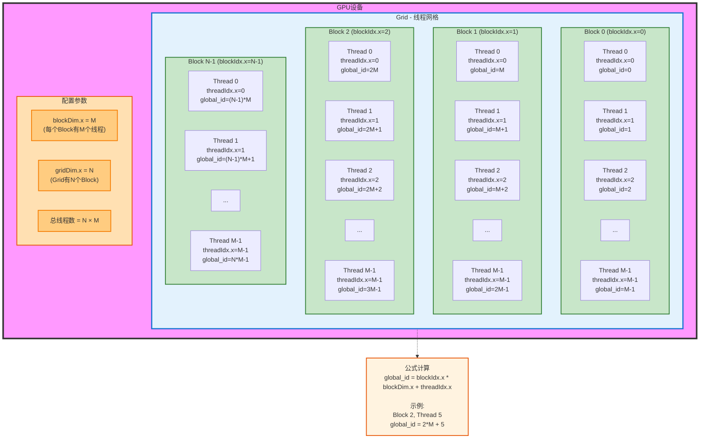

# CUDA Attention Benchmark — native vs flash attention

在 CUDA 上实现两种 attention 并做全流程性能评测：

- **原生 attention**（`native_scores` → `native_softmax` → `native_output`）：把 N×N 的 score 矩阵 S 和 softmax 结果 P 完整物化到全局内存，空间复杂度 O(N²)。
- **flash attention**（`flash_attn`）：FA 2 风格，分块 + 共享内存 K/V tile + 在线 softmax，O 行驻留寄存器，从不物化 N×N 中间矩阵，额外内存 O(N)。

评测工具链：程序内置 cudaEvent 计时 + `cudaMemGetInfo` 显存峰值测量；`nsys` 采 GPU kernel 时长与时间线；`ncu` 采吞吐率/占用率/寄存器等微观指标（需管理员权限）。

## 文件

| 文件                                  | 用途                           |
| ----------------------------------- | ---------------------------- |
| `attention.cu`                      | 全部 kernel + 基准测试主程序          |
| `build.ps1`                         | 编译脚本（自动加载 MSVC 环境）           |
| `ncu-profile.ps1`                   | 自提权运行 ncu 的脚本（UAC 弹窗一次）      |
| `bench.exe`                         | 编译产物                         |
| `report.nsys-rep` / `report.sqlite` | nsys 报告（可复用 `nsys stats` 重查） |
| `ncu_report.txt`                    | 最近一次 ncu 输出                  |

## 环境

- NVIDIA GPU，计算能力 ≥ 8.0（本机：RTX 3080 Laptop，sm_86）
- CUDA Toolkit（`nvcc` 在 PATH；本机 13.3）
- MSVC Build Tools（nvcc 在 Windows 需要 cl.exe；本机 VS 18 BuildTools 14.x）
- Nsight Systems（`nsys`）+ Nsight Compute（`ncu`）+ Compute Sanitizer（随 CUDA Toolkit 安装）

## 编译脚本

```powershell
# Build the CUDA attention benchmark (native vs flash attention).
# Requires: NVIDIA CUDA Toolkit (nvcc on PATH), MSVC Build Tools.
# Usage:  powershell -ExecutionPolicy Bypass -File build.ps1
$ErrorActionPreference = "Stop"
. C:\Projects\cmds\VsDevCmd.ps1 -NoLogo | Out-Null
nvcc -O3 -arch=sm_86 -std=c++17 attention.cu -o bench.exe
if ($LASTEXITCODE -ne 0) { exit $LASTEXITCODE }
Write-Host "OK: bench.exe built. Try: .\bench.exe 0 64 20"

```

脚本内做了两件事：source `C:\Projects\cmds\VsDevCmd.ps1` 把 MSVC 环境（cl.exe 等）加进 PATH，然后执行编译脚本。

- `-arch=sm_86` 按本机 GPU 设置；换卡改成对应架构（如 `sm_89` / `sm_90`）。
- 编译期 C 4819 警告（代码页 936 字符告警）是 CUDA 头文件的已知噪音，可忽略。

## 测试脚本

```c++
// attention.cu — native attention vs flash attention, CUDA kernels + benchmark harness.
// Native: materializes NxN scores (S) and NxN softmax (P) in global memory.
// Flash: FA2-style online softmax, tiled, O(N) extra memory.
//
// Usage: bench.exe [N] [d] [iters]     N=0 -> sweep {512,1024,2048,4096,8192} x d
// Correctness check (N=256) always runs first.
//
// Build:  nvcc -O3 -arch=sm_86 -std=c++17 attention.cu -o bench.exe

#include <cstdio>
#include <cstdlib>
#include <cmath>
#include <vector>
#include <string>
#include <cuda_runtime.h>

#define CK(x) do { cudaError_t e = (x); \
  if (e != cudaSuccess) { fprintf(stderr, "CUDA error %s at %s:%d\n", cudaGetErrorString(e), __FILE__, __LINE__); exit(1); } } while (0)

// ---------------------------------------------------------------- native ---
// S[i][j] = scale * sum_k Q[i][k] * K[j][k]        (NxN materialized)
__global__ void native_scores(const float* __restrict__ Q, const float* __restrict__ K,
                              float* __restrict__ S, float scale, int N, int d) {
    // Q,K \in \R^{N \times d}, S \in \R^{N \times N}
    // scale = 1 / \sqrt{d}
    int idx = blockIdx.x * blockDim.x + threadIdx.x;
    if (idx >= N * N) return;
    int i = idx / N, j = idx % N;
    const float* q = Q + (size_t)i * d;
    const float* k = K + (size_t)j * d;
    float acc = 0.f;
    for (int t = 0; t < d; ++t) acc += q[t] * k[t];
    S[idx] = acc * scale;
}

// Row-wise softmax over global S (max -> sum -> normalize, 3 passes over row).
// 逐行归一化
__global__ void native_softmax(const float* __restrict__ S, float* __restrict__ P, int N) {
    int i = blockIdx.x * blockDim.x + threadIdx.x;
    if (i >= N) return;
    const float* s = S + (size_t)i * N; // 输入矩阵第i行
    float* p = P + (size_t)i * N;		// 输出矩阵第i行
    float mx = -INFINITY;
    for (int j = 0; j < N; ++j) mx = fmaxf(mx, s[j]); // 求第i行最大值
    float sum = 0.f;
    for (int j = 0; j < N; ++j) sum += __expf(s[j] - mx); // 求softmax分母
    float inv = 1.f / sum;
    for (int j = 0; j < N; ++j) p[j] = __expf(s[j] - mx) * inv; // 逐元素归一化
}

// O[i][j] = sum_k P[i][k] * V[k][j]
// 本质矩阵乘法
__global__ void native_output(const float* __restrict__ P, const float* __restrict__ V,
                              float* __restrict__ O, int N, int d) {
    int idx = blockIdx.x * blockDim.x + threadIdx.x;
    if (idx >= N * d) return;
    int i = idx / d, j = idx % d;
    const float* p = P + (size_t)i * N;
    float acc = 0.f;
    for (int k = 0; k < N; ++k) acc += p[k] * V[(size_t)k * d + j];
    O[(size_t)i * d + j] = acc;
}

// One kernel loop per phase, timed independently; total = all three combined.
void native_attention(const float* Q, const float* K, const float* V, float* O,
                      float* S, float* P, float scale, int N, int d, int iters,
                      float* per_kernel_ms, cudaStream_t st) {
    int threads = 256;
    // 只用了dim3.x，所以是隐式1维
    dim3 gS((N * N + threads - 1) / threads);
    dim3 gP((N + threads - 1) / threads);
    dim3 gO((N * d + threads - 1) / threads);
    cudaEvent_t e0, e1, e2, e3;
    cudaEventCreate(&e0); cudaEventCreate(&e1); cudaEventCreate(&e2); cudaEventCreate(&e3);
    // warmup
    native_scores<<<gS, threads, 0, st>>>(Q, K, S, scale, N, d);
    native_softmax<<<gP, threads, 0, st>>>(S, P, N);
    native_output<<<gO, threads, 0, st>>>(P, V, O, N, d);
    cudaEventRecord(e0, st);
    for (int it = 0; it < iters; ++it) native_scores<<<gS, threads, 0, st>>>(Q, K, S, scale, N, d);
    cudaEventRecord(e1, st);
    for (int it = 0; it < iters; ++it) native_softmax<<<gP, threads, 0, st>>>(S, P, N);
    cudaEventRecord(e2, st);
    for (int it = 0; it < iters; ++it) native_output<<<gO, threads, 0, st>>>(P, V, O, N, d);
    cudaEventRecord(e3, st);
    cudaEventSynchronize(e3);
    float t = 0;
    cudaEventElapsedTime(&t, e0, e1); per_kernel_ms[0] = t / iters;
    cudaEventElapsedTime(&t, e1, e2); per_kernel_ms[1] = t / iters;
    cudaEventElapsedTime(&t, e2, e3); per_kernel_ms[2] = t / iters;
    cudaEventElapsedTime(&t, e0, e3); per_kernel_ms[3] = t / iters;
    cudaEventDestroy(e0); cudaEventDestroy(e1); cudaEventDestroy(e2); cudaEventDestroy(e3);
}

// ---------------------------------------------------------------- flash ----
// One thread per row. Br rows/block, Bc columns per tile, K/V tiles in shared.
// Online softmax keeps O(row) in registers — no NxN intermediate ever exists.
template <int Br, int Bc, int D>
__global__ void flash_attn(const float* __restrict__ Q, const float* __restrict__ K,
                           const float* __restrict__ V, float* __restrict__ O,
                           float scale, int N) {
    __shared__ float Ks[Bc][D];
    __shared__ float Vs[Bc][D];
    int i = blockIdx.x * Br + threadIdx.x;
    if (i >= N) return;
    const float* q = Q + (size_t)i * D;
    float acc[D];
#pragma unroll
    for (int k = 0; k < D; ++k) acc[k] = 0.f;
    float m = -INFINITY, l = 0.f;

    int ncols = (N + Bc - 1) / Bc;
    for (int cb = 0; cb < ncols; ++cb) {
        int j0 = cb * Bc;
        for (int idx = threadIdx.x; idx < Bc * D; idx += Br) {
            int jj = j0 + idx / D, kk = idx % D;
            Ks[idx / D][kk] = (jj < N) ? K[(size_t)jj * D + kk] : 0.f;
            Vs[idx / D][kk] = (jj < N) ? V[(size_t)jj * D + kk] : 0.f;
        }
        __syncthreads();
#pragma unroll
        for (int j = 0; j < Bc; ++j) {
            if (j0 + j >= N) break;
            float s = 0.f;
#pragma unroll
            for (int k = 0; k < D; ++k) s += q[k] * Ks[j][k];
            s *= scale;
            float m_new = fmaxf(m, s);
            float alpha = __expf(m - m_new);      // rescale previous accumulator
            float p = __expf(s - m_new);
            l = l * alpha + p;
#pragma unroll
            for (int k = 0; k < D; ++k) acc[k] = acc[k] * alpha + p * Vs[j][k];
            m = m_new;
        }
        __syncthreads();
    }
    float inv = 1.f / l;
#pragma unroll
    for (int k = 0; k < D; ++k) O[(size_t)i * D + k] = acc[k] * inv;
}

template <int Br, int Bc, int D>
void flash_launch(const float* Q, const float* K, const float* V, float* O,
                  float scale, int N, int iters, float* ms, cudaStream_t st) {
    int threads = Br;
    dim3 grid((N + Br - 1) / Br);
    cudaEvent_t e0, e1;
    cudaEventCreate(&e0); cudaEventCreate(&e1);
    flash_attn<Br, Bc, D><<<grid, threads, 0, st>>>(Q, K, V, O, scale, N);  // warmup
    cudaEventRecord(e0, st);
    for (int it = 0; it < iters; ++it)
        flash_attn<Br, Bc, D><<<grid, threads, 0, st>>>(Q, K, V, O, scale, N);
    cudaEventRecord(e1, st);
    cudaEventSynchronize(e1);
    float t = 0;
    cudaEventElapsedTime(&t, e0, e1);
    *ms = t / iters;
    cudaEventDestroy(e0); cudaEventDestroy(e1);
}

void flash_attention(const float* Q, const float* K, const float* V, float* O,
                     float scale, int N, int d, int iters, float* ms, cudaStream_t st) {
    if (d == 64)       flash_launch<128, 32, 64 >(Q, K, V, O, scale, N, iters, ms, st);
    else if (d == 128) flash_launch<128, 32, 128>(Q, K, V, O, scale, N, iters, ms, st);
    else { fprintf(stderr, "flash: d must be 64 or 128 (got %d)\n", d); exit(1); }
}

// ---------------------------------------------------------------- reference
static void ref_attention(const float* Q, const float* K, const float* V, float* O,
                          float scale, int N, int d) {
    std::vector<double> S((size_t)N * N), P((size_t)N * N);
    for (int i = 0; i < N; ++i)
        for (int j = 0; j < N; ++j) {
            double s = 0;
            for (int k = 0; k < d; ++k) s += (double)Q[(size_t)i * d + k] * K[(size_t)j * d + k];
            S[(size_t)i * N + j] = s * scale;
        }
    for (int i = 0; i < N; ++i) {
        double mx = -1e300, sum = 0;
        for (int j = 0; j < N; ++j) mx = fmax(mx, S[(size_t)i * N + j]);
        for (int j = 0; j < N; ++j) { double e = exp(S[(size_t)i * N + j] - mx); P[(size_t)i * N + j] = e; sum += e; }
        for (int j = 0; j < N; ++j) P[(size_t)i * N + j] /= sum;
    }
    for (int i = 0; i < N; ++i)
        for (int j = 0; j < d; ++j) {
            double o = 0;
            for (int k = 0; k < N; ++k) o += P[(size_t)i * N + k] * V[(size_t)k * d + j];
            O[(size_t)i * d + j] = (float)o;
        }
}

static float max_abs_err(const float* A, const float* B, size_t n) {
    float e = 0.f;
    for (size_t k = 0; k < n; ++k) e = fmaxf(e, fabsf(A[k] - B[k]));
    return e;
}

// ---------------------------------------------------------------- harness --
static void fill_rand(float* x, size_t n, unsigned seed) {
    srand(seed);
    for (size_t k = 0; k < n; ++k) x[k] = (float)((rand() / (double)RAND_MAX) * 2.0 - 1.0);
}

static int correctness(int d) {
    int N = 256;
    size_t nq = (size_t)N * d, nsq = (size_t)N * N;
    float scale = 1.f / sqrtf((float)d);
    std::vector<float> hQ(nq), hK(nq), hV(nq), hO_native(nq), hO_flash(nq), hO_ref(nq);
    fill_rand(hQ.data(), nq, 1); fill_rand(hK.data(), nq, 2); fill_rand(hV.data(), nq, 3);
    float *Q, *K, *V, *O, *S, *P;
    CK(cudaMalloc(&Q, nq * 4)); CK(cudaMalloc(&K, nq * 4)); CK(cudaMalloc(&V, nq * 4));
    CK(cudaMalloc(&O, nq * 4)); CK(cudaMalloc(&S, nsq * 4)); CK(cudaMalloc(&P, nsq * 4));
    CK(cudaMemcpy(Q, hQ.data(), nq * 4, cudaMemcpyHostToDevice));
    CK(cudaMemcpy(K, hK.data(), nq * 4, cudaMemcpyHostToDevice));
    CK(cudaMemcpy(V, hV.data(), nq * 4, cudaMemcpyHostToDevice));
    float ms[4];
    native_attention(Q, K, V, O, S, P, scale, N, d, 1, ms, 0);
    CK(cudaMemcpy(hO_native.data(), O, nq * 4, cudaMemcpyDeviceToHost));
    flash_attention(Q, K, V, O, scale, N, d, 1, &ms[0], 0);
    CK(cudaMemcpy(hO_flash.data(), O, nq * 4, cudaMemcpyDeviceToHost));
    ref_attention(hQ.data(), hK.data(), hV.data(), hO_ref.data(), scale, N, d);
    float e_native = max_abs_err(hO_native.data(), hO_ref.data(), nq);
    float e_flash  = max_abs_err(hO_flash.data(),  hO_ref.data(), nq);
    printf("  correctness N=%d d=%d: native max_err=%.3e (%s), flash max_err=%.3e (%s)\n",
           N, d, e_native, e_native < 1e-3f ? "PASS" : "FAIL",
           e_flash, e_flash < 1e-3f ? "PASS" : "FAIL");
    CK(cudaFree(Q)); CK(cudaFree(K)); CK(cudaFree(V)); CK(cudaFree(O)); CK(cudaFree(S)); CK(cudaFree(P));
    return (e_native < 1e-3f && e_flash < 1e-3f) ? 0 : 1;
}

static void bench_config(int N, int d, int iters) {
    size_t nq = (size_t)N * d, nsq = (size_t)N * N;
    float scale = 1.f / sqrtf((float)d);
    float *Q, *K, *V, *O, *S, *P;
    size_t free0, free1, free2;
    CK(cudaMemGetInfo(&free0, NULL));
    CK(cudaMalloc(&Q, nq * 4)); CK(cudaMalloc(&K, nq * 4)); CK(cudaMalloc(&V, nq * 4)); CK(cudaMalloc(&O, nq * 4));
    CK(cudaMemGetInfo(&free1, NULL));
    CK(cudaMalloc(&S, nsq * 4)); CK(cudaMalloc(&P, nsq * 4));
    CK(cudaMemGetInfo(&free2, NULL));
    std::vector<float> hQ(nq), hK(nq), hV(nq);
    fill_rand(hQ.data(), nq, 1); fill_rand(hK.data(), nq, 2); fill_rand(hV.data(), nq, 3);
    CK(cudaMemcpy(Q, hQ.data(), nq * 4, cudaMemcpyHostToDevice));
    CK(cudaMemcpy(K, hK.data(), nq * 4, cudaMemcpyHostToDevice));
    CK(cudaMemcpy(V, hV.data(), nq * 4, cudaMemcpyHostToDevice));

    float t_native[4], t_flash;
    native_attention(Q, K, V, O, S, P, scale, N, d, iters, t_native, 0);
    CK(cudaGetLastError());
    flash_attention(Q, K, V, O, scale, N, d, iters, &t_flash, 0);
    CK(cudaGetLastError());

    double flops = 4.0 * N * N * d;
    double tn = t_native[3], tf = t_flash;
    printf("%6d %4d | %9.3f ms  %8.2f TFLOPS | %9.3f ms  %8.2f TFLOPS | %6.2fx | %9.1f MB %8.1f MB\n",
           N, d, tn, flops / tn / 1e9, tf, flops / tf / 1e9, tn / tf,
           (double)(free0 - free2) / 1048576.0, (double)(free0 - free1) / 1048576.0);
    printf("         native breakdown: scores %.3f ms, softmax %.3f ms, output %.3f ms (total %.3f)\n",
           t_native[0], t_native[1], t_native[2], t_native[3]);
    CK(cudaFree(Q)); CK(cudaFree(K)); CK(cudaFree(V)); CK(cudaFree(O)); CK(cudaFree(S)); CK(cudaFree(P));
}

int main(int argc, char** argv) {
    int N = 4096, d = 64, iters = 20;
    if (argc > 1) N = atoi(argv[1]);
    if (argc > 2) d = atoi(argv[2]);
    if (argc > 3) iters = atoi(argv[3]);

    cudaDeviceProp prop;
    CK(cudaGetDeviceProperties(&prop, 0));
    size_t tot, free0;
    CK(cudaMemGetInfo(&free0, &tot));
    printf("GPU: %s  sm_%d%d  total mem %.0f MB, free %.0f MB\n",
           prop.name, prop.major, prop.minor, tot / 1048576.0, free0 / 1048576.0);
    printf("Kernels: native_scores, native_softmax, native_output  vs  flash_attn (FA2-style, d<=128)\n\n");

    int rc = 0;
    rc |= correctness(64);
    if (d != 64) rc |= correctness(d);

    printf("\n%6s %4s | %-20s | %-20s | %6s | %-20s\n",
           "N", "d", "native total", "flash", "speedup", "peak mem native/flash");
    printf("%s\n", std::string(100, '-').c_str());
    if (N == 0) {
        for (int n : {512, 1024, 2048, 4096, 8192}) bench_config(n, d, iters);
    } else {
        bench_config(N, d, iters);
    }
    printf("\nDone. rc=%d\n", rc);
    return rc;
}

```


编译命令：

```powershell
nvcc -O3 -arch=sm_86 -std=c++17 attention.cu -o bench.exe
```

- 使用 nvcc 编译
- 目标架构为 sm_86（适用于 RTX 30 系列显卡）

导入必要的头文件：

```cpp
#include <cstdio>			// 标准I/O
#include <cstdlib>			// 标准库
#include <cmath>			// 数学函数
#include <vector>			// STL 容器
#include <string>			// 字符串处理
#include <cuda_runtime.h>	// CUDA 运行时API
```

`cudaError_t` 是 CUDA 运行时 API 定义的一个**枚举类型**，用于表示 CUDA 函数调用的返回状态。

fprintf 函数原型

```cpp
int fprintf(FILE *stream, const char *format, ...);
```

- stderr：标准错误输出流，用于输出错误信息
- format：格式字符串

`__FILE__`：预定义宏，在编译时被自动替换，当前源文件的名称（字符串字面量）

`__LINE__`：当前源代码行号。

`do {...} while (0)`：确保宏在任何上下文中都能正常工作。
- 块作用域：确保宏内变量不会泄露
- 语句完整性：宏总是表现为一个完整的语句
- 分号安全：宏的分号是安全的。

`__global__`：在 CUDA 中的定义为：

```cpp
// 在CUDA头文件中（简化版本）
#define __global__ __attribute__((global))
```

告诉编译器，这是一个设备端启动的核函数，从 CPU 启动，在 GPU 执行。

`__restrict__`：用于表示指针是访问其所指向数据块的唯一方式。为什么需要?假如没有它，编译器需要保守处理

```cpp
void add_arrays(float* a, float* b, float* c, int n) {
    for (int i = 0; i < n; i++) {
        c[i] = a[i] + b[i];
    }
}
```

问题：编译器无法确定 a、b、c 是否指向同一块内存区域

有了 `__restrict__`：编译器就可以放心加载，激进优化。GPU 对内存访问非常敏感，常常多个线程同时访问内存，编译器可以更好利用 GPU 缓存

blockDim：每个 block 的大小（线程数）
## 运行

```powershell
bench.exe [N] [d] [iters]
```

| 参数 | 默认 | 说明 |
|---|---|---|
| `N` | 4096 | 序列长度；`0` = 全尺寸扫描 512/1024/2048/4096/8192 |
| `d` | 64 | head 维度；flash 仅支持 **64 或 128**（模板实例化），其它值报错退出 |
| `iters` | 20 | 每 kernel 计时轮数（取事件区间平均） |

流程固定：先跑正确性检查（N=256，与 CPU 双精度参考对比，阈值 1 e-3，PASS/FAIL），再跑基准。

示例：

```powershell
.\bench.exe 4096 64 20     # 单配置：正确性 + N=4096 基准
.\bench.exe 0 64 20        # 全尺寸扫描
.\bench.exe 8192 128 10    # 大序列 + d=128
```

输出解读：

```
     N    d | native total         | flash                | speedup | peak mem native/flash
  4096   64 |    18.906 ms  0.23 TFLOPS |     2.708 ms  1.59 TFLOPS |   6.98x |     132.0 MB      4.0 MB
         native breakdown: scores 14.211 ms, softmax 2.812 ms, output 1.884 ms (total 18.906)
```

- TFLOPS 按 4·N²·d FLOP 计算（QKᵀ + PV）。
- 两列显存均为**本方法独占的额外峰值**（`cudaMemGetInfo` 前后差）：native 含 S+P 两块 N×N；flash 只有 Q/K/V/O。`free0 - free1` 与 `free0 - free2` 是单调峰值差，含驱动分配器余量，理论值见 `2·N²·4B`。
- native breakdown 的三段时间来自三次独立的 kernel 循环计时，加起来略小于 total（total 含全部启动间隙）。

程序退出码：正确性失败返回非 0（`rc=1`）。

## 性能分析

### nsys（无需提权）——时间线 + GPU 端纯 kernel 时长

```powershell
nsys profile --stats=true -o report .\bench.exe 4096 64 10
```

- 产出 `report.nsys-rep` + `report.sqlite`，`--stats=true` 结束时自动打印汇总。
- 重查任意统计：

```powershell
nsys stats --force-export=true --report cuda_gpu_kern_sum report.nsys-rep   # 每 kernel 平均/最大/最小时长
nsys stats --report cuda_api_sum report.nsys-rep                            # CUDA API 调用开销
```

- 图形界面看时间线与内存曲线：`nsys-ui report.nsys-rep`。
- 注意：kernel 汇总里的 Duration 是纯 GPU 执行时长，比程序内置的 cudaEvent 数字略小（后者含启动间隙），二者互相印证。
- 本机非管理员运行 nsys 会提示禁用 CPU context switch / CPU sampling（需要提权），不影响 GPU 数据。

### ncu（需管理员）——吞吐率/占用率/寄存器

Windows WDDM 下 GPU 性能计数器需要管理员。直接跑：

```powershell
powershell -ExecutionPolicy Bypass -File ncu-profile.ps1 4096 64 2
```

脚本自提权（桌面弹一次 UAC），跑完自动打印 `ncu_report.txt`。等价的手工提权命令：

```powershell
ncu --set basic -c 24 --log-file ncu_report.txt .\bench.exe 4096 64 2
```

关键指标（每 kernel）：`Compute (SM) Throughput`（算力利用率）、`Memory Throughput` / `L1/TEX Cache Throughput`（访存利用率，判断是否 memory-bound）、`Registers Per Thread`、`Theoretical/Achieved Occupancy`、`Waves Per SM`（网格是否填满 GPU，<1 即空转）。ncu 会用 `OPT` 行直接给出瓶颈与建议。

## 调试

内置两层校验，改 kernel 后先跑一遍确认没改坏：

1. **数值正确性**：程序启动即执行（N=256 对比 CPU 双精度参考），输出 `max_err` 与 PASS/FAIL。新增 kernel 逻辑后这是第一道门。
2. **CUDA 错误**：所有 `cuda*` 调用包在 `CK()` 宏里，出错即打印 `CUDA error <name> at attention.cu:<line>` 并退出；每次 kernel launch 后跟 `cudaGetLastError()`（见 `bench_config`）。

内存/越界类问题（kernel 崩溃、随机 NaN 但 CK 不报错时）：

```powershell
compute-sanitizer .\bench.exe 256 64 1     # memcheck：越界、未初始化、race
```

性能调试用 nsys/ncu 的瓶颈分类：memory-bound（native_scores，L 1 ~97%）→ 考虑共享内存复用；网格过小（native_softmax，0.06 waves）→ 提高并行粒度；占用率被寄存器/共享内存压死（flash_attn，167 regs，25% 理论占用）→ 降寄存器/调 tile 尺寸。

# GPU 架构


